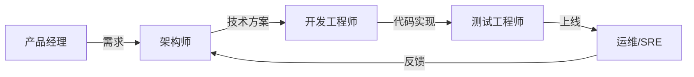

# ProjectWiki 功能索引

## 目录

- [核心能力](#核心能力)
- [文档体系](#文档体系)
- [脚本工具](#脚本工具)
- [角色视图](#角色视图)
- [框架支持](#框架支持)
- [快速开始](#快速开始)

---

## 核心能力

### 1. 智能问答 🧠

**功能描述**：支持自然语言查询，结合上下文提供精准答案

**能力**：
- 自然语言查询：询问文档规范、结构、示例
- 上下文感知：结合项目信息提供精准答案
- 意图识别：自动识别用户意图并路由到相应处理

**使用方式**：
```bash
python3 scripts/query_knowledge.py --query "如何编写 API 文档？"
```

**相关文档**：
- [core/agent-guide.md](references/core/agent-guide.md) - Agent 交互指南
- [core/intent-rules.md](references/core/intent-rules.md) - 意图识别规则

---

### 2. 自动文档生成 📚

**功能描述**：基于预定义模板生成合规文档

**能力**：
- 基于模板：使用预定义模板生成合规文档
- 代码上下文：从代码中提取信息填充文档
- 多类型支持：API 文档、模块文档、服务文档、设计文档

**支持类型**：
- API 文档（api-template.md）
- 模块文档（module-template.md）
- 服务文档（service-template.md）
- 设计文档（design-doc-template.md）
- 架构设计文档（architecture-template.md）
- ADR（adr-template.md）
- 模块设计文档（module-design-template.md）
- 测试计划（test-plan-template.md）
- 运维手册（ops-runbook-template.md）
- 用户旅程图（user-flow-template.md）

**使用方式**：
```bash
python3 scripts/generate_doc.py --type api --name "用户登录接口"
```

**相关文档**：
- [templates/](references/templates/) - 文档模板目录

---

### 3. 知识图谱 🔗

**功能描述**：可视化模块/API/配置的关系网络

**能力**：
- 模块关系：可视化模块/API/配置的关系网络
- 隐性知识挖掘：提取设计决策和最佳实践
- Mermaid 可视化：自动生成流程图、架构图、ER 图、时序图

**使用方式**：
```bash
python3 scripts/knowledge_graph.py --path ./your-project --format mermaid
```

**相关文档**：
- [visualization/mermaid-syntax.md](references/visualization/mermaid-syntax.md) - Mermaid 语法指南

---

### 4. 文档管理 📋

**功能描述**：自动识别项目所需的文档类型

**能力**：
- 自动识别：识别项目所需的文档类型
- 版本控制：支持 CHANGELOG 和 ROADMAP
- CI/CD 集成：生成 CI/CD 配置和文档

**使用方式**：
```bash
# 生成 CHANGELOG
python3 scripts/generate_changelog.py init

# 生成 ROADMAP
python3 scripts/generate_roadmap.py --path ./your-project

# 生成 CI/CD
python3 scripts/generate_cicd.py --type github-actions
```

**相关文档**：
- [document-guides/changelog-guide.md](references/document-guides/changelog-guide.md)
- [document-guides/roadmap-guide.md](references/document-guides/roadmap-guide.md)
- [document-guides/cicd-guide.md](references/document-guides/cicd-guide.md)

---

### 5. 角色视图 👥

**功能描述**：为 5 种角色提供专门的文档和模板

**角色**：
- 架构师（Architect）：架构设计、技术决策（ADR）、非功能性需求
- 开发工程师（Developer）：模块设计、API 契约、数据结构
- 测试工程师（Tester）：测试计划、边界条件、异常场景
- 运维/SRE（Ops）：部署架构、资源清单、监控告警
- 产品经理（Product）：用户旅程、业务规则、用户体验

**使用方式**：
```bash
# 列出所有角色
python3 scripts/role_view.py list-roles

# 查看角色文档
python3 scripts/role_view.py docs --role architect

# 生成角色专属文档
python3 scripts/role_view.py generate --role architect --type architecture --name "用户系统"
```

**相关文档**：
- [roles/README.md](references/roles/README.md) - 角色视图总览
- [roles/role-mapping.md](references/roles/role-mapping.md) - 角色与文档映射

---

## 文档体系

### 核心指南（core/）

| 文档 | 说明 |
|------|------|
| [agent-guide.md](references/core/agent-guide.md) | Agent 交互指南 |
| [intent-rules.md](references/core/intent-rules.md) | 意图识别规则 |
| [wiki-structure-guide.md](references/core/wiki-structure-guide.md) | Wiki 结构指南 |
| [knowledge-base-guide.md](references/core/knowledge-base-guide.md) | 知识库指南 |
| [knowledge-structure.md](references/core/knowledge-structure.md) | 知识结构说明 |

---

### 文档规范（document-guides/）

| 文档 | 说明 |
|------|------|
| [api-doc-guide.md](references/document-guides/api-doc-guide.md) | API 文档指南（重点：数据流动、数据模型） |
| [architecture-guide.md](references/document-guides/architecture-guide.md) | 架构文档指南 |
| [design-doc-guide.md](references/document-guides/design-doc-guide.md) | 设计文档指南（重点：ER 图、时序图） |
| [changelog-guide.md](references/document-guides/changelog-guide.md) | CHANGELOG 指南 |
| [roadmap-guide.md](references/document-guides/roadmap-guide.md) | ROADMAP 指南 |
| [cicd-guide.md](references/document-guides/cicd-guide.md) | CI/CD 指南 |
| [readme-template.md](references/document-guides/readme-template.md) | README 模板 |

---

### 角色视图（roles/）

| 角色 | 指南 | 模板 |
|------|------|------|
| 架构师 | [architect-guide.md](references/roles/architect/architect-guide.md) | [architecture-template.md](references/roles/architect/architecture-template.md), [adr-template.md](references/roles/architect/adr-template.md) |
| 开发工程师 | [developer-guide.md](references/roles/developer/developer-guide.md) | [module-design-template.md](references/roles/developer/module-design-template.md) |
| 测试工程师 | [tester-guide.md](references/roles/tester/tester-guide.md) | [test-plan-template.md](references/roles/tester/test-plan-template.md) |
| 运维/SRE | [ops-guide.md](references/roles/ops/ops-guide.md) | [ops-runbook-template.md](references/roles/ops/ops-runbook-template.md) |
| 产品经理 | [product-guide.md](references/roles/product/product-guide.md) | [user-flow-template.md](references/roles/product/user-flow-template.md) |

---

### 可视化（visualization/）

| 文档 | 说明 |
|------|------|
| [mermaid-syntax.md](references/visualization/mermaid-syntax.md) | Mermaid 语法指南 |

---

### 框架指引（frameworks/）

| 框架 | 说明 |
|------|------|
| [django-guide.md](references/frameworks/django-guide.md) | Django 框架指引 |
| [flask-guide.md](references/frameworks/flask-guide.md) | Flask 框架指引 |
| [fastapi-guide.md](references/frameworks/fastapi-guide.md) | FastAPI 框架指引 |
| [spring-boot-guide.md](references/frameworks/spring-boot-guide.md) | Spring Boot 框架指引 |
| [gin-guide.md](references/frameworks/gin-guide.md) | Gin 框架指引 |
| [react-guide.md](references/frameworks/react-guide.md) | React 框架指引 |
| [vue-guide.md](references/frameworks/vue-guide.md) | Vue 框架指引 |
| [svelte-guide.md](references/frameworks/svelte-guide.md) | Svelte 框架指引 |
| [solidjs-guide.md](references/frameworks/solidjs-guide.md) | SolidJS 框架指引 |
| [flutter-guide.md](references/frameworks/flutter-guide.md) | Flutter 框架指引 |
| [electron-guide.md](references/frameworks/electron-guide.md) | Electron 框架指引 |
| [tauri-guide.md](references/frameworks/tauri-guide.md) | Tauri 框架指引 |
| [wails-guide.md](references/frameworks/wails-guide.md) | Wails 框架指引 |

---

### 文档模板（templates/）

| 模板 | 说明 |
|------|------|
| [api-template.md](references/templates/api-template.md) | API 文档模板 |
| [module-template.md](references/templates/module-template.md) | 模块文档模板 |
| [service-template.md](references/templates/service-template.md) | 服务文档模板 |
| [design-doc-template.md](references/templates/design-doc-template.md) | 设计文档模板 |

---

## 脚本工具

### 核心脚本

| 脚本 | 功能 | 输出 |
|------|------|------|
| [analyze_project.py](scripts/analyze_project.py) | 项目分析 | `project-analysis.json` |
| [knowledge_graph.py](scripts/knowledge_graph.py) | 知识图谱 | `knowledge-graph.json/.mmd` |
| [knowledge_extractor.py](scripts/knowledge_extractor.py) | 隐性知识提取 | `implicit-knowledge.json` |
| [evaluate_complexity.py](scripts/evaluate_complexity.py) | 复杂度评估 | `complexity-report.json` |
| [create_wiki_structure.py](scripts/create_wiki_structure.py) | Wiki 结构创建 | Wiki 目录结构 |
| [generate_doc.py](scripts/generate_doc.py) | 智能文档生成 | 完整文档 |
| [query_knowledge.py](scripts/query_knowledge.py) | 知识查询 | 查询结果 |
| [role_view.py](scripts/role_view.py) | 角色视图查询 | 角色文档 |

---

### 文档生成脚本

| 脚本 | 功能 |
|------|------|
| [generate_changelog.py](scripts/generate_changelog.py) | CHANGELOG 生成 |
| [generate_roadmap.py](scripts/generate_roadmap.py) | ROADMAP 生成 |
| [generate_cicd.py](scripts/generate_cicd.py) | CI/CD 生成 |

---

## 角色视图

### 5 种角色

| 角色 | 英文名 | 关注重点 | 核心文档 |
|------|--------|----------|----------|
| 架构师 | Architect | 整体架构、技术选型、可扩展性 | 架构设计文档、ADR |
| 开发工程师 | Developer | 模块接口、数据结构、状态流转 | 模块设计文档、API 文档 |
| 测试工程师 | Tester | 边界条件、异常场景、数据一致性 | 测试计划 |
| 运维/SRE | Ops/SRE | 部署拓扑、资源需求、监控告警 | 运维手册 |
| 产品经理 | Product Manager | 功能覆盖、用户路径、体验风险 | 用户旅程图、业务规则 |

---

### 角色协作流程



---

## 框架支持

### 支持的框架

| 分类 | 框架 | 文档 |
|------|------|------|
| 后端 | Django | [django-guide.md](references/frameworks/django-guide.md) |
| 后端 | Flask | [flask-guide.md](references/frameworks/flask-guide.md) |
| 后端 | FastAPI | [fastapi-guide.md](references/frameworks/fastapi-guide.md) |
| 后端 | Spring Boot | [spring-boot-guide.md](references/frameworks/spring-boot-guide.md) |
| 后端 | Gin | [gin-guide.md](references/frameworks/gin-guide.md) |
| 前端 | React | [react-guide.md](references/frameworks/react-guide.md) |
| 前端 | Vue | [vue-guide.md](references/frameworks/vue-guide.md) |
| 前端 | Svelte | [svelte-guide.md](references/frameworks/svelte-guide.md) |
| 前端 | SolidJS | [solidjs-guide.md](references/frameworks/solidjs-guide.md) |
| 跨平台 | Flutter | [flutter-guide.md](references/frameworks/flutter-guide.md) |
| 桌面 | Electron | [electron-guide.md](references/frameworks/electron-guide.md) |
| 桌面 | Tauri | [tauri-guide.md](references/frameworks/tauri-guide.md) |
| 桌面 | Wails | [wails-guide.md](references/frameworks/wails-guide.md) |

**总计**：13+ 主流框架

---

## 快速开始

### 最简使用（1 分钟）

```bash
# 1. 分析项目
python3 scripts/analyze_project.py --path ./your-project

# 2. 查询知识
python3 scripts/query_knowledge.py --query "如何编写 API 文档？"
```

---

### 完整流程（5 分钟）

```bash
# 1. 项目分析
python3 scripts/analyze_project.py --path ./your-project

# 2. 构建知识图谱
python3 scripts/knowledge_graph.py --path ./your-project --format mermaid

# 3. 提取隐性知识
python3 scripts/knowledge_extractor.py --path ./your-project --language python

# 4. 评估复杂度
python3 scripts/evaluate_complexity.py --path ./your-project

# 5. 创建 Wiki 结构
python3 scripts/create_wiki_structure.py --path ./your-project

# 6. 生成文档
python3 scripts/generate_changelog.py init
python3 scripts/generate_roadmap.py --path ./your-project
python3 scripts/generate_cicd.py --type github-actions
```

---

### 角色视图使用

```bash
# 列出所有角色
python3 scripts/role_view.py list-roles

# 查看特定角色的文档
python3 scripts/role_view.py docs --role architect

# 生成角色专属文档
python3 scripts/role_view.py generate --role architect --type architecture --name "用户系统"
```

---

## 完整功能总结

### 5 大核心能力
1. 🧠 智能问答
2. 📚 自动文档生成
3. 🔗 知识图谱
4. 📋 文档管理
5. 👥 角色视图

### 45+ 参考文档
- 核心：5 个
- 文档规范：7 个
- 角色视图：11 个
- 可视化：1 个
- 框架指引：13 个
- 模板：4 个

### 11 个脚本工具
- 核心脚本：8 个
- 文档生成脚本：3 个

### 13+ 框架支持
- 后端：5 个
- 前端：4 个
- 跨平台：1 个
- 桌面：3 个

---

**最后更新**：2024-02-19
**版本**：v2.0
