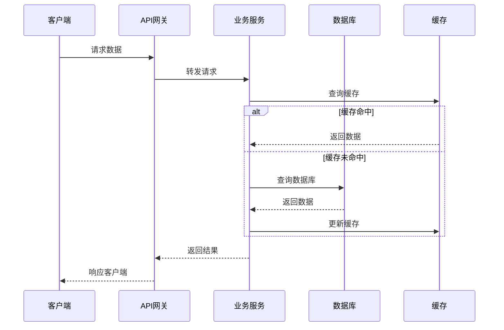
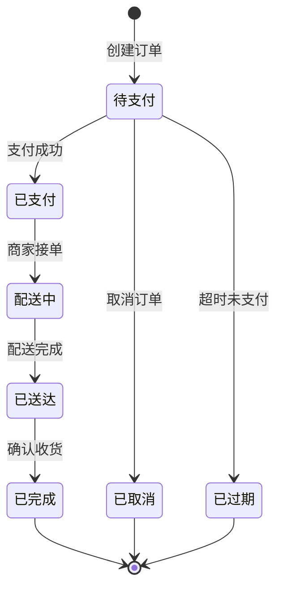

# ProjectWiki - 智能项目知识助手

ProjectWiki 是一个智能项目知识助手，从静态文档管理升级为动态智能交互系统。通过自然语言问答、意图识别、上下文感知，结合项目信息提供精准答案。支持基于模板的自动文档生成，强调数据流动和状态管理。支持5种角色视图，提供专门的指南和模板。

## 核心能力

### 1. 项目分析

自动分析项目结构，识别项目类型、技术栈和复杂度。

- **项目识别**：自动识别项目类型（Django、Flask、FastAPI、React、Vue等13+框架）
- **结构分析**：分析项目目录结构和模块依赖关系
- **知识提取**：从代码中提取隐性知识和业务逻辑
- **复杂度评估**：评估项目复杂度，自适应生成 Wiki 结构

### 2. 文档生成

基于模板自动生成各类文档，支持渐进式文档体系。

- **渐进式文档系统**：功能文档 → 需求文档 → 架构文档
- **数据流动设计**：强调 API 文档中的数据流转，使用时序图展示
- **状态管理**：提供完整的状态机设计模板和实现指南
- **角色视图**：为5种角色提供专门的文档和模板

### 3. 智能交互

通过自然语言查询项目知识，支持意图识别和上下文感知。

- **知识查询**：查询文档规范、框架指引、最佳实践
- **意图识别**：识别用户意图，提供精准答案
- **上下文感知**：结合项目上下文提供个性化建议
- **智能推荐**：根据查询内容推荐相关文档

---

## 快速开始

### 基础使用（2分钟）

```bash
# 1. 分析项目
python3 scripts/analyze_project.py --path ./your-project

# 2. 查询知识
python3 scripts/query_knowledge.py --query "如何编写 API 文档？"
```

### 完整流程（5分钟）

```bash
# 1. 项目分析
python3 scripts/analyze_project.py --path ./your-project

# 2. 创建 Wiki 结构
python3 scripts/create_wiki_structure.py --path ./your-project

# 3. 生成文档
python3 scripts/generate_doc.py --type api --name "用户登录接口"
python3 scripts/generate_doc.py --type requirement --name "订单系统"
python3 scripts/generate_doc.py --type architecture --name "支付系统"

# 4. 查询知识
python3 scripts/query_knowledge.py --query "数据流动设计"
```

---

## 核心特性

### 渐进式文档系统

从功能描述到架构设计的完整文档链，支持自动推断和数据一致性设计。

```
功能文档（功能描述）
    ↓ 自动推断
需求文档（数据模型、数据流动、状态管理）
    ↓ 设计决策
架构文档（多角色视图、多维度设计）
```

**三层文档体系**：
- **功能文档**：描述功能需求、用户场景、验收标准
- **需求文档**：定义数据模型、数据流动、状态管理、接口设计
- **架构文档**：多角色视图、多维度设计、技术选型

**智能推断**：
- 从功能文档自动推断需求文档
- 从需求文档自动推断架构文档
- 支持文档链生成和完整性检查

**相关文档**：
- [功能文档指南](references/document-guides/functional-doc-guide.md)
- [需求文档指南](references/document-guides/requirement-doc-guide.md)
- [架构文档指南](references/document-guides/architecture-doc-guide.md)

---

### 数据流动设计

强调数据在系统中的流动路径，使用时序图和流程图可视化。

**核心原则**：
1. **单向流动**：数据应该单向流动，避免循环依赖
2. **明确源头**：每个数据变更都应该有明确的源头
3. **可追踪性**：数据流动路径应该清晰可追踪
4. **幂等性**：相同操作应该产生相同结果
5. **一致性**：确保数据在整个流动过程中保持一致

**数据流示例**：


**数据流模式**：
- **Cache Aside**：先操作数据库，再操作缓存
- **Read Through**：缓存代理负责读取和加载
- **Write Through**：同步写入缓存和数据库
- **Write Behind**：异步写入缓存和数据库
- **Refresh Ahead**：主动刷新缓存

**相关文档**：
- [数据流动设计指南](references/document-guides/data-flow-guide.md)

---

### 状态管理

提供完整的状态机设计框架，强调状态一致性和状态持久化。

**核心概念**：
- **状态（State）**：系统在特定时间点的条件
- **事件（Event）**：触发状态转换的条件
- **转换（Transition）**：从一个状态到另一个状态
- **动作（Action）**：状态转换时执行的操作

**状态机示例**：


**状态一致性保证**：
- **乐观锁**：使用版本号检测冲突
- **事件溯源**：通过事件重建状态
- **CQRS**：读写分离，最终一致

**状态持久化**：
- **数据库持久化**：将状态保存到数据库
- **缓存持久化**：将状态保存到缓存
- **事件存储**：保存状态变更事件
- **快照策略**：定期保存状态快照

**相关文档**：
- [状态管理指南](references/document-guides/state-management-guide.md)
- [状态机模板](references/templates/state-machine-template.md)

---

### 角色视图

为5种角色提供专门的文档和模板，确保每个人都能快速找到需要的内容。

| 角色 | 关注重点 | 核心文档 | 指南 | 模板 |
|------|----------|----------|------|------|
| **架构师** | 整体架构、技术选型、可扩展性 | 架构设计、ADR | [architect-guide.md](references/roles/architect/architect-guide.md) | [architecture-template.md](references/roles/architect/architecture-template.md) |
| **开发工程师** | 模块接口、数据结构、状态流转 | 模块设计、API | [developer-guide.md](references/roles/developer/developer-guide.md) | [module-design-template.md](references/roles/developer/module-design-template.md) |
| **测试工程师** | 边界条件、异常场景、数据一致性 | 测试计划 | [tester-guide.md](references/roles/tester/tester-guide.md) | [test-plan-template.md](references/roles/tester/test-plan-template.md) |
| **运维/SRE** | 部署拓扑、资源需求、监控告警 | 运维手册 | [ops-guide.md](references/roles/ops/ops-guide.md) | [ops-runbook-template.md](references/roles/ops/ops-runbook-template.md) |
| **产品经理** | 功能覆盖、用户路径、体验风险 | 用户旅程、业务规则 | [product-guide.md](references/roles/product/product-guide.md) | [user-flow-template.md](references/roles/product/user-flow-template.md) |

**使用脚本**：
```bash
# 查看特定角色的文档
python3 scripts/role_view.py docs --role architect

# 生成角色专属文档
python3 scripts/role_view.py generate --role architect --type architecture
```

**相关文档**：
- [角色视图总览](references/roles/README.md)
- [角色映射表](references/roles/role-mapping.md)

---

## 文档结构

```
project-wiki/
├── SKILL.md                      # 技能入口
├── references/                   # 参考文档
│   ├── core/                     # 核心指南
│   │   ├── agent-guide.md        # Agent 交互指南
│   │   ├── intent-rules.md       # 意图识别规则
│   │   ├── wiki-structure-guide.md
│   │   ├── knowledge-base-guide.md
│   │   └── knowledge-structure.md
│   ├── document-guides/          # 文档规范
│   │   ├── api-doc-guide.md
│   │   ├── changelog-guide.md
│   │   ├── cicd-guide.md
│   │   ├── design-doc-guide.md
│   │   ├── data-flow-guide.md    # 数据流动设计指南
│   │   ├── state-management-guide.md  # 状态管理指南
│   │   ├── functional-doc-guide.md    # 功能文档指南
│   │   ├── requirement-doc-guide.md    # 需求文档指南
│   │   └── architecture-doc-guide.md   # 架构文档指南
│   ├── roles/                    # 角色视图
│   │   ├── README.md             # 角色视图总览
│   │   ├── role-mapping.md       # 角色与文档映射
│   │   ├── architect/            # 架构师
│   │   ├── developer/            # 开发工程师
│   │   ├── tester/               # 测试工程师
│   │   ├── ops/                  # 运维/SRE
│   │   └── product/              # 产品经理
│   ├── visualization/            # 可视化
│   │   └── mermaid-syntax.md
│   ├── frameworks/               # 框架指引（13+框架）
│   └── templates/                # 文档模板
│       ├── api-template.md
│       ├── module-template.md
│       ├── service-template.md
│       ├── design-doc-template.md
│       ├── functional-doc-template.md
│       ├── requirement-doc-template.md
│       ├── architecture-doc-template.md
│       └── state-machine-template.md
├── scripts/                      # 执行脚本
│   ├── analyze_project.py        # 项目分析
│   ├── knowledge_graph.py        # 知识图谱
│   ├── knowledge_extractor.py    # 隐性知识提取
│   ├── evaluate_complexity.py    # 复杂度评估
│   ├── create_wiki_structure.py  # Wiki 结构创建
│   ├── generate_doc.py           # 智能文档生成
│   ├── query_knowledge.py        # 知识查询
│   └── role_view.py              # 角色视图查询
└── assets/                       # 资产文件
    └── wiki-templates/
```

---

## 资源索引

### 核心脚本

| 脚本 | 功能 | 输出 |
|------|------|------|
| [analyze_project.py](scripts/analyze_project.py) | 项目分析 | project-analysis.json |
| [knowledge_graph.py](scripts/knowledge_graph.py) | 知识图谱 | knowledge-graph.json/.mmd |
| [generate_doc.py](scripts/generate_doc.py) | 智能文档生成 | 完整文档 |
| [query_knowledge.py](scripts/query_knowledge.py) | 知识查询 | 查询结果 |
| [role_view.py](scripts/role_view.py) | 角色视图查询 | 按角色查询/生成文档 |

### 参考文档

| 目录 | 内容 | 重点 |
|------|------|------|
| [core/](references/core/) | 核心指南 | Agent 使用规范 |
| [document-guides/](references/document-guides/) | 文档规范 | 数据流动、数据模型、状态管理 |
| [roles/](references/roles/) | 角色视图 | 按角色提供专门的文档和模板 |
| [visualization/](references/visualization/) | 可视化指南 | Mermaid 语法 |
| [frameworks/](references/frameworks/) | 框架指引 | 13+ 主流框架特定规范 |
| [templates/](references/templates/) | 文档模板 | 完整的文档模板 |

---

## 使用示例

### 示例 1：查询数据流动规范

**用户**：
```
"API 文档如何描述数据流动？"
```

**Agent 响应**：
```
根据 [data-flow-guide.md](references/document-guides/data-flow-guide.md)，API 文档的数据流动描述应包含：

1. 数据流概述：描述数据在 API 请求-响应过程中的完整路径
2. 数据流图：使用 Mermaid 时序图展示数据流转
3. 数据流转路径：详细列出每个节点的操作和耗时
4. 缓存策略：说明使用的缓存模式（Cache Aside、Write Through等）

数据流应遵循5大原则：
- 单向流动：避免循环依赖
- 明确源头：每个数据变更都有明确源头
- 可追踪性：数据流动路径清晰可追踪
- 幂等性：相同操作产生相同结果
- 一致性：确保数据在整个流动过程中保持一致

详细规范请参考 [data-flow-guide.md](references/document-guides/data-flow-guide.md)
```

### 示例 2：生成状态机文档

**用户**：
```
"为订单系统生成状态机文档"
```

**Agent 响应**：
```
正在生成订单系统状态机文档...

已生成到: wiki/状态机/订单系统状态机.md

文档包含:
- 状态定义（待支付、已支付、配送中、已送达、已完成等）
- 事件定义（创建订单、支付成功、商家接单等）
- 状态转换图（Mermaid stateDiagram）
- 状态转换表
- 动作定义
- 状态持久化方案
- 状态一致性保证
- 代码实现示例
```

### 示例 3：生成渐进式文档

**用户**：
```
"为用户注册功能生成渐进式文档"
```

**Agent 响应**：
```
正在生成用户注册功能的渐进式文档...

已生成文档链:
1. wiki/功能文档/用户注册功能.md
2. wiki/需求文档/用户注册功能-需求.md
3. wiki/架构文档/用户注册功能-架构.md

功能文档: 描述用户注册的功能需求、用户场景、验收标准
需求文档: 定义数据模型、数据流动、状态管理、接口设计
架构文档: 多角色视图、多维度设计、技术选型

文档链已自动推断并保持一致性。
```

---

## 技术支持

### 常见问题

**Q: 如何添加新的文档模板？**
A: 在 `references/templates/` 目录下创建新的模板文件，并在 SKILL.md 中更新引用。

**Q: 如何自定义角色视图？**
A: 在 `references/roles/` 目录下创建新的角色文件夹，添加指南和模板，并在 `role-mapping.md` 中更新映射。

**Q: 如何添加新的框架支持？**
A: 在 `references/frameworks/` 目录下创建新的框架指南，参考 TEMPLATE.md 的格式。

**Q: 数据流动和状态管理有什么关系？**
A: 数据流动关注数据在系统中的流动路径，状态管理关注系统状态的转换。两者共同确保系统的正确性和一致性。

---

## 更新日志

### v2.0.0（当前版本）
- ✨ 新增渐进式文档系统（功能文档 → 需求文档 → 架构文档）
- ✨ 新增数据流动设计指南和模板
- ✨ 新增状态管理指南和状态机模板
- ✨ 新增5种角色视图支持
- ✨ 强化智能交互和意图识别
- 🗑️ 删除冗余的 architecture-guide.md
- ♻️ 精简 SKILL.md，强化核心思想

### v1.0.0
- 🎉 初始版本发布
- ✨ 支持项目分析和文档生成
- ✨ 支持13+主流框架
