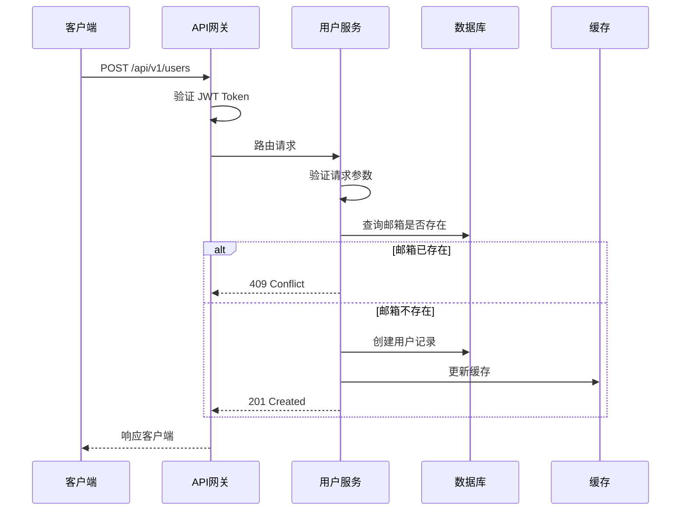
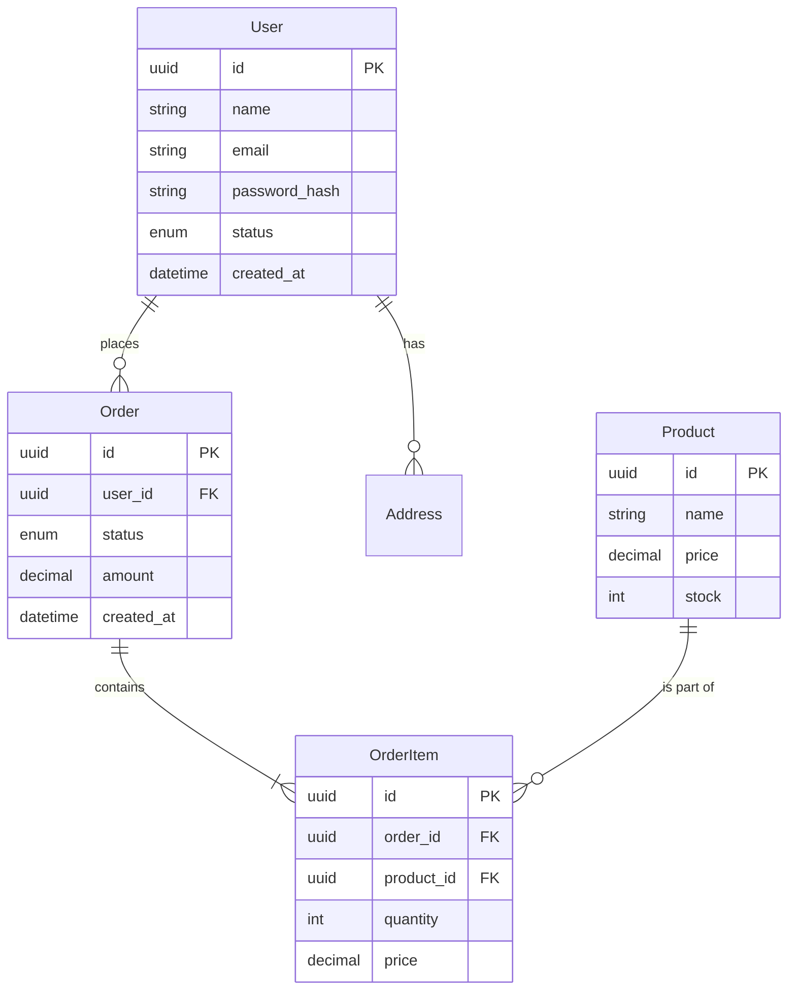

# Project Wiki - 智能项目知识助手

> 🎯 **完整功能索引**：查看 [FEATURE_INDEX.md](FEATURE_INDEX.md) 了解所有功能

## 核心能力

### 🧠 智能问答
- **自然语言查询**：询问文档规范、结构、示例
- **上下文感知**：结合项目信息提供精准答案
- **意图识别**：自动识别用户意图并路由到相应处理

### 📚 自动文档生成
- **基于模板**：使用预定义模板生成合规文档
- **代码上下文**：从代码中提取信息填充文档
- **多类型支持**：API 文档、模块文档、服务文档、设计文档
- **角色视图**：按角色生成专属文档（架构师、开发者、测试、运维、产品）

### 🔗 知识图谱
- **模块关系**：可视化模块/API/配置的关系网络
- **隐性知识挖掘**：提取设计决策和最佳实践
- **Mermaid 可视化**：自动生成流程图、架构图、ER 图、时序图

### 👥 角色视图
- **架构师**：架构设计、技术决策（ADR）、非功能性需求
- **开发者**：模块设计、API 契约、数据结构
- **测试工程师**：测试计划、边界条件、异常场景
- **运维/SRE**：部署架构、资源清单、监控告警
- **产品经理**：用户旅程、业务规则、用户体验

### 📋 文档管理
- **自动识别**：识别项目所需的文档类型
- **版本控制**：支持 CHANGELOG 和 ROADMAP
- **CI/CD 集成**：生成 CI/CD 配置和文档

---

## 快速导航

| 功能 | 描述 | 脚本 | 文档 |
|------|------|------|------|
| 项目分析 | 分析项目结构 | `analyze_project.py` | [详细](scripts/README.md#1-analyze_projectpy) |
| 知识图谱 | 可视化模块关系 | `knowledge_graph.py` | [详细](scripts/README.md#2-knowledge_graphpy) |
| 文档生成 | 生成各类文档 | `generate_doc.py` | [详细](scripts/README.md#6-generate_docpy) |
| 角色视图 | 按角色生成文档 | `role_view.py` | [详细](scripts/README.md#8-role_viewpy) |
| 知识查询 | 查询文档知识 | `query_knowledge.py` | [详细](scripts/README.md#7-query_knowledgepy) |

---

## 快速开始

### 最简使用（1 分钟）

```bash
# 1. 分析项目
python3 scripts/analyze_project.py --path ./your-project

# 2. 查询知识
python3 scripts/query_knowledge.py --query "如何编写 API 文档？"
```

### 完整流程（5 分钟）

```bash
# 1. 项目分析
python3 scripts/analyze_project.py --path ./your-project

# 2. 构建知识图谱
python3 scripts/knowledge_graph.py --path ./your-project --format mermaid

# 3. 提取隐性知识
python3 scripts/knowledge_extractor.py --path ./your-project --language python

# 4. 评估复杂度
python3 scripts/evaluate_complexity.py --path ./your-project

# 5. 创建 Wiki 结构
python3 scripts/create_wiki_structure.py --path ./your-project

# 6. 生成文档
python3 scripts/generate_changelog.py init --path ./your-project
python3 scripts/generate_roadmap.py --path ./your-project
python3 scripts/generate_cicd.py --path ./your-project
```

---

## 智能交互

### 自然语言问答

**查询文档规范**：
```
"如何编写 API 文档？"
→ 返回 api-doc-guide.md 的内容
```

**查询 Wiki 结构**：
```
"我们的 Wiki 结构是什么样的？"
→ 返回 wiki-structure-guide.md 的内容
```

**查询框架指引**：
```
"Django 的最佳实践是什么？"
→ 返回 django-guide.md 的内容
```

### 自动文档生成

**生成 API 文档**：
```bash
python3 scripts/generate_doc.py \
  --type api \
  --name "用户登录接口" \
  --output wiki/03-API文档/用户登录接口.md
```

**生成模块文档**：
```bash
python3 scripts/generate_doc.py \
  --type module \
  --name "认证模块" \
  --output wiki/04-模块文档/认证模块/模块介绍.md
```

**生成服务文档**：
```bash
python3 scripts/generate_doc.py \
  --type service \
  --name "用户服务" \
  --output wiki/04-模块文档/用户服务/服务文档.md
```

### 知识查询

**交互式查询**：
```bash
python3 scripts/query_knowledge.py
```

**单次查询**：
```bash
python3 scripts/query_knowledge.py --query "CHANGELOG 规范"
```

**列出所有知识**：
```bash
python3 scripts/query_knowledge.py --list
```

---

## 项目结构

```
project-wiki/
├── SKILL.md                      # 技能入口
├── references/                   # 参考文档
│   ├── core/                     # 核心指南
│   │   ├── agent-guide.md        # Agent 交互指南
│   │   ├── intent-rules.md       # 意图识别规则
│   │   ├── wiki-structure-guide.md
│   │   ├── knowledge-base-guide.md
│   │   └── knowledge-structure.md
│   ├── document-guides/          # 文档规范
│   │   ├── api-doc-guide.md
│   │   ├── architecture-guide.md
│   │   ├── design-doc-guide.md
│   │   ├── changelog-guide.md
│   │   ├── roadmap-guide.md
│   │   ├── cicd-guide.md
│   │   └── readme-template.md
│   ├── roles/                    # 角色视图 ⭐ 新增
│   │   ├── README.md             # 角色视图总览
│   │   ├── role-mapping.md       # 角色与文档映射
│   │   ├── architect/            # 架构师
│   │   │   ├── architect-guide.md
│   │   │   ├── adr-template.md
│   │   │   └── architecture-template.md
│   │   ├── developer/            # 开发工程师
│   │   │   ├── developer-guide.md
│   │   │   └── module-design-template.md
│   │   ├── tester/               # 测试工程师
│   │   │   ├── tester-guide.md
│   │   │   └── test-plan-template.md
│   │   ├── ops/                  # 运维/SRE
│   │   │   ├── ops-guide.md
│   │   │   └── ops-runbook-template.md
│   │   └── product/              # 产品经理
│   │       ├── product-guide.md
│   │       └── user-flow-template.md
│   ├── visualization/            # 可视化
│   │   └── mermaid-syntax.md
│   ├── frameworks/               # 框架指引
│   │   └── [13+ 框架文档]
│   └── templates/                # 文档模板
│       ├── api-template.md
│       ├── module-template.md
│       ├── service-template.md
│       └── design-doc-template.md
├── scripts/                      # 执行脚本
│   ├── analyze_project.py        # 项目分析
│   ├── knowledge_graph.py        # 知识图谱
│   ├── knowledge_extractor.py    # 隐性知识提取
│   ├── evaluate_complexity.py    # 复杂度评估
│   ├── create_wiki_structure.py  # Wiki 结构创建
│   ├── generate_changelog.py     # CHANGELOG 生成
│   ├── generate_roadmap.py       # ROADMAP 生成
│   ├── generate_cicd.py          # CI/CD 生成
│   ├── generate_doc.py           # 智能文档生成
│   ├── query_knowledge.py        # 知识查询
│   └── role_view.py              # 角色视图查询 ⭐ 新增
└── assets/                       # 资产文件
    ├── wiki-templates/
    └── changelog-templates/
```

---

## 资源索引

### 核心脚本

| 脚本 | 功能 | 输出 |
|------|------|------|
| [scripts/analyze_project.py](scripts/analyze_project.py) | 项目分析 | `project-analysis.json` |
| [scripts/knowledge_graph.py](scripts/knowledge_graph.py) | 知识图谱 | `knowledge-graph.json/.mmd` |
| [scripts/knowledge_extractor.py](scripts/knowledge_extractor.py) | 隐性知识提取 | `implicit-knowledge.json` |
| [scripts/generate_doc.py](scripts/generate_doc.py) | 智能文档生成 | 完整文档 |
| [scripts/query_knowledge.py](scripts/query_knowledge.py) | 知识查询 | 查询结果 |
| [scripts/role_view.py](scripts/role_view.py) | **角色视图查询** | ⭐ 按角色查询/生成文档 |

### 参考文档

| 目录 | 内容 | 重点 |
|------|------|------|
| [core/](references/core/) | 核心指南（Agent 交互、意图识别、Wiki 结构） | Agent 使用规范 |
| [document-guides/](references/document-guides/) | 文档规范（API、架构、Changelog、设计文档） | **数据流动**、**数据模型**、类型系统、ER 图、时序图 |
| [roles/](references/roles/) | **角色视图**（架构师、开发者、测试、运维、产品） | ⭐ 按角色提供专门的文档和模板 |
| [visualization/](references/visualization/) | 可视化指南（Mermaid 语法） | 时序图、流程图、类图、ER 图 |
| [frameworks/](references/frameworks/) | 框架指引（13+ 主流框架） | 框架特定规范 |
| [templates/](references/templates/) | 文档模板（API、模块、服务、设计文档） | **包含完整的数据流动和模型定义**、ER 图、时序图 |

---

## 角色视图

### 为什么需要角色视图？

不同角色对文档的需求不同，角色视图为每种角色提供专门的文档和模板，确保每个人都能快速找到需要的内容。

### 角色列表

| 角色 | 关注重点 | 核心文档 | 指南 | 模板 |
|------|----------|----------|------|------|
| **架构师** | 整体架构、技术选型、可扩展性 | 架构设计、ADR | [architect-guide.md](references/roles/architect/architect-guide.md) | [architecture-template.md](references/roles/architect/architecture-template.md) |
| **开发工程师** | 模块接口、数据结构、状态流转 | 模块设计、API | [developer-guide.md](references/roles/developer/developer-guide.md) | [module-design-template.md](references/roles/developer/module-design-template.md) |
| **测试工程师** | 边界条件、异常场景、数据一致性 | 测试计划 | [tester-guide.md](references/roles/tester/tester-guide.md) | [test-plan-template.md](references/roles/tester/test-plan-template.md) |
| **运维/SRE** | 部署拓扑、资源需求、监控告警 | 运维手册 | [ops-guide.md](references/roles/ops/ops-guide.md) | [ops-runbook-template.md](references/roles/ops/ops-runbook-template.md) |
| **产品经理** | 功能覆盖、用户路径、体验风险 | 用户旅程、业务规则 | [product-guide.md](references/roles/product/product-guide.md) | [user-flow-template.md](references/roles/product/user-flow-template.md) |

### 使用脚本

```bash
# 列出所有角色
python3 scripts/role_view.py list-roles

# 查看特定角色的文档
python3 scripts/role_view.py docs --role architect

# 生成角色专属文档
python3 scripts/role_view.py generate --role architect --type architecture --name "用户系统"

# 查看角色映射
python3 scripts/role_view.py mapping
```

### 角色与文档映射

详细的角色与文档映射关系，请查看 [role-mapping.md](references/roles/role-mapping.md)。

### 角色视图总览

查看 [README.md](references/roles/README.md) 了解角色视图的完整说明。

---

## 重点强调：数据流动与数据模型

### 为什么重要？

**数据流动**和**数据模型**是 API 文档的核心，它们直接关系到：
- 开发者能否正确使用 API
- 前后端数据对接是否顺畅
- 错误排查是否高效
- 团队协作是否顺畅

### 数据流动（Data Flow）

**定义**：描述数据在 API 请求-响应过程中的完整路径

**应包含**：
```
客户端 → API 网关 → 业务服务 → 数据库 → 缓存 → 业务服务 → API 网关 → 客户端
```

**可视化方式**：使用 Mermaid 时序图展示数据流转

**详细步骤**：
1. 客户端发送请求
2. API 网关认证与授权
3. 业务服务处理逻辑
4. 数据持久化（数据库 + 缓存）
5. 响应构建与返回

**数据转换**：说明每个阶段的数据类型变化
- 输入：JSON Request Body
- 验证：Validation DTO
- 存储：Database Model
- 缓存：Cache Object
- 输出：Response DTO

### 数据模型（Data Model）

**定义**：定义 API 中使用的数据结构

**应包含**：
| 字段名 | 类型 | 必填 | 默认值 | 说明 | 示例 |
|--------|------|------|--------|------|------|
| id | string | 是 | - | 用户ID（UUID） | "550e8400-e29b-41d4-a716-446655440000" |

**类型系统**：
- **基础类型**：string, number, boolean, null
- **复杂类型**：array, object, enum, datetime, uuid, email, url
- **类型组合**：可选（?）、联合（|）、数组（[]）、嵌套对象

**表示方式**：
1. **表格形式**：简单模型
2. **类图形式**：复杂模型（使用 Mermaid classDiagram）
3. **Schema 形式**：技术文档（使用 TypeScript 接口）

**类型定义示例**：
```typescript
interface User {
  id: UUID;              // UUID 格式
  name: string;          // 用户名
  email: Email;          // 邮箱格式
  status: UserStatus;    // 枚举类型
  createdAt: ISO8601DateTime;  // ISO 8601 日期时间
}
```

### 相关文档

- **API 文档详细规范**：[document-guides/api-doc-guide.md](references/document-guides/api-doc-guide.md)
- **设计文档详细规范**：[document-guides/design-doc-guide.md](references/document-guides/design-doc-guide.md)
- **API 文档模板**：[templates/api-template.md](references/templates/api-template.md)
- **设计文档模板**：[templates/design-doc-template.md](references/templates/design-doc-template.md)
- **可视化语法**：[visualization/mermaid-syntax.md](references/visualization/mermaid-syntax.md)

---

## 使用示例

### 示例 1：查询文档规范

**用户**：
```
"如何编写 API 文档？"
```

**Agent 响应**：
```
根据 [api-doc-guide.md](references/document-guides/api-doc-guide.md)，API 文档应包含：

1. 接口概述（名称、功能、版本）
2. 数据模型（字段、类型、约束、示例）
3. 数据流动（请求流程、数据转换）
4. 请求参数（路径、查询、请求体）
5. 响应格式（成功、错误）
6. 业务规则

重点：
✅ 必须包含完整的数据流动时序图
✅ 必须定义所有数据模型的类型
✅ 必须提供字段示例和约束说明

详细规范请参考 [api-doc-guide.md](references/document-guides/api-doc-guide.md)
```

---

### 示例 2：生成 API 文档

**用户**：
```
"为用户登录接口生成 API 文档"
```

**Agent 响应**：
```
正在生成用户登录接口文档...

已生成到: wiki/03-API文档/用户登录接口.md

文档包含:
- 接口概述
- 数据模型（User 模型定义）
- 数据流动（登录流程时序图）
- 请求参数
- 响应格式
- 错误码
- 使用示例
```

---

### 示例 3：查询数据流动

**用户**：
```
"用户注册的数据流动是怎样的？"
```

**Agent 响应**：
```
根据 [api-doc-guide.md](references/document-guides/api-doc-guide.md)，用户注册的数据流动如下：



数据转换：
- 输入：{name, email, password}
- 存储：{id, name, email, password_hash, status, ...}
- 输出：{id, name, email, status, ...}（不含密码）
```

---

### 示例 4：查询数据模型

**用户**：
```
"User 模型有哪些字段？"
```

**Agent 响应**：
```
根据 User 模型定义，字段如下：

| 字段名 | 类型 | 必填 | 说明 | 示例 |
|--------|------|------|------|------|
| id | string | 是 | 用户ID（UUID） | "550e8400-..." |
| name | string | 是 | 用户名（2-50字符） | "张三" |
| email | string | 是 | 邮箱（唯一） | "user@example.com" |
| password | string | 是 | 密码（至少8位） | "********" |
| status | enum | 是 | 状态 | "active" |
| createdAt | datetime | 是 | 创建时间 | "2024-02-19T12:00:00Z" |

类型定义：
```typescript
interface User {
  id: UUID;              // UUID 格式
  name: string;          // 2-50 字符
  email: Email;          // 符合 RFC 5322
  password: string;      // 至少 8 位
  status: UserStatus;    // active | inactive | suspended
  createdAt: ISO8601DateTime;  // ISO 8601
}
```
```

---

### 示例 5：生成设计文档

**用户**：
```
"为手机号注册功能生成设计文档"
```

**Agent 响应**：
```
正在生成手机号注册功能设计文档...

已生成到: wiki/05-设计文档/手机号注册功能.md

文档包含:
- 概要（背景、目标、方案、备选方案）
- 表结构设计（ER 图、表结构、索引设计）
- 业务流程（流程图、流程说明）
- 程序流程（时序图、核心算法）
- 接口约定（API 列表、详细接口文档）
- 其他（类图、性能分析、安全考虑、边界情况）
- 附注（参考资料、相关文档）
- 评审情况（评审记录、评审结论）

重点内容：
✅ 完整的 ER 图展示表关系
✅ 业务流程图描述用户操作流程
✅ 程序时序图描述代码执行流程
✅ 核心算法伪代码和实现
✅ 性能分析和安全考虑
✅ 边界情况处理
✅ 评审记录

详细规范请参考 [design-doc-guide.md](references/document-guides/design-doc-guide.md)
```

---

### 示例 6：查询 ER 图

**用户**：
```
"用户模块的表关系是怎样的？"
```

**Agent 响应**：
```
根据数据库设计，用户模块的表关系如下：



表关系说明：
- User 与 Order：一对多（一个用户可以有多个订单）
- User 与 Address：一对多（一个用户可以有多个地址）
- Order 与 OrderItem：一对多（一个订单包含多个商品项）
- Product 与 OrderItem：一对多（一个商品可以在多个订单中）
```

---

### 示例 7：查询角色文档

**用户**：
```
"架构师需要关注哪些文档？"
```

**Agent 响应**：
```
作为架构师，你需要关注以下文档：

📋 必备文档：
1. 架构设计文档（architecture-template.md）
   - C4 模型架构图
   - 技术选型说明
   - 非功能性需求
   - 演进路线

2. ADR（adr-template.md）
   - 技术决策记录
   - 决策背景和后果
   - 替代方案

📚 相关指南：
- [architect-guide.md](references/roles/architect/architect-guide.md) - 架构师完整指南

🔧 使用脚本：
```bash
# 查看架构师相关文档
python3 scripts/role_view.py docs --role architect

# 生成架构设计文档
python3 scripts/role_view.py generate --role architect --type architecture --name "用户系统"
```
```

---

### 示例 8：生成角色专属文档

**用户**：
```
"生成一个测试计划"
```

**Agent 响应**：
```
正在生成测试计划...

已生成到: wiki/05-测试文档/功能-test-plan.md

文档包含:
- 测试范围（功能测试、非功能测试）
- 测试策略（方法、工具、环境）
- 边界条件（输入边界、输出边界）
- 异常场景（网络异常、服务异常、数据异常）
- 数据一致性（并发操作、事务回滚、数据同步）
- 测试用例（功能、异常、边界）
- 性能测试（指标、压力测试场景）
- 安全测试（安全测试项、权限测试）

详细规范请参考 [tester-guide.md](references/roles/tester/tester-guide.md)
```

---

## 意图识别

### 意图分类

| 意图类型 | 关键词 | 处理方式 |
|----------|--------|----------|
| 文档查询 | "如何"、"规范"、"格式" | 返回对应指南 |
| 文档生成 | "生成"、"创建" | 调用 generate_doc.py |
| 代码查询 | "接口"、"函数"、"类" | 调用 extract_docs.py |
| 图表生成 | "流程图"、"架构图"、"ER 图"、"时序图" | 生成 Mermaid 代码 |
| 结构查询 | "结构"、"目录" | 返回 Wiki 结构 |
| 框架查询 | "框架"、"技术栈" | 返回框架指引 |
| 数据流动查询 | "数据流动"、"数据流转"、"数据流程" | 返回时序图 |
| 数据模型查询 | "数据模型"、"字段"、"类型" | 返回数据模型定义 |
| **角色视图** | "角色"、"架构师"、"开发者"、"测试"、"运维"、"产品" | **调用 role_view.py 或返回角色指南** |

### 详细规则

详见 [references/core/intent-rules.md](references/core/intent-rules.md)

---

## 最佳实践

### ✅ 推荐做法

1. **使用自然语言**：直接描述需求，如"如何编写 API 文档"
2. **明确上下文**：提供具体的服务名、模块名
3. **利用模板**：使用 generate_doc.py 生成合规文档
4. **检查规范**：生成文档后对照 guide 检查
5. **保持更新**：代码变更后重新分析项目

### ❌ 避免做法

1. **不要手动复制**：使用脚本自动生成文档
2. **不要忽略规范**：严格遵循 document-guides 中的规范
3. **不要跳过步骤**：按流程执行分析 → 生成 → 检查

---

## 常见问题

### Q1: 如何查询特定文档？

使用 query_knowledge.py：
```bash
python3 scripts/query_knowledge.py --query "API 文档规范"
```

### Q2: 支持哪些文档类型？

- API 文档（api-template.md）
- 模块文档（module-template.md）
- 服务文档（service-template.md）
- 设计文档（design-doc-template.md）
- 架构设计文档（architecture-template.md）
- ADR（adr-template.md）
- 模块设计文档（module-design-template.md）
- 测试计划（test-plan-template.md）
- 运维手册（ops-runbook-template.md）
- 用户旅程图（user-flow-template.md）
- README、架构文档、CHANGELOG 等

### Q3: 如何添加新模板？

在 `references/templates/` 目录下添加新的 `.md` 模板文件，然后在 generate_doc.py 中注册。

### Q4: 如何扩展意图识别？

编辑 `references/core/intent-rules.md`，添加新的意图类型和关键词规则。

### Q5: 如何使用角色视图？

使用 role_view.py：
```bash
# 列出所有角色
python3 scripts/role_view.py list-roles

# 查看特定角色的文档
python3 scripts/role_view.py docs --role architect

# 生成角色专属文档
python3 scripts/role_view.py generate --role architect --type architecture --name "用户系统"
```

### Q6: 角色视图有哪些角色？

- 架构师（architect）：关注整体架构、技术选型
- 开发工程师（developer）：关注模块接口、数据结构
- 测试工程师（tester）：关注边界条件、异常场景
- 运维/SRE（ops）：关注部署拓扑、监控告警
- 产品经理（product）：关注用户旅程、业务规则

---

**最后更新**：2024-02-19
