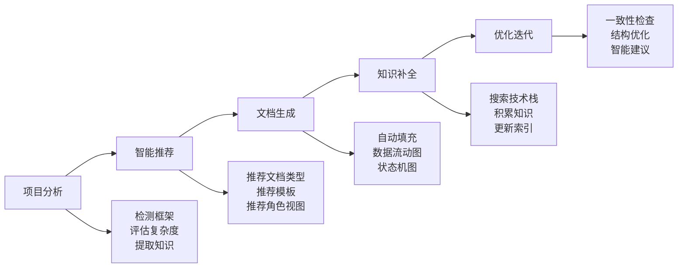

# ProjectWiki - 智能项目知识助手

ProjectWiki 是一个智能项目知识助手，从静态文档管理升级为动态智能交互系统。通过自然语言问答、意图识别、上下文感知，结合项目信息提供精准答案。**支持智能自动分析、渐进式文档生成、角色视图推荐、知识自动补充**。

---

## 核心价值

> **让文档生成自动化、智能化、个性化**

- **自动分析**：智能识别项目类型、技术栈和复杂度
- **智能推荐**：自动推荐文档类型、模板和角色视图
- **渐进生成**：从功能到架构的完整文档链
- **知识补全**：自动搜索并补充技术栈知识
- **角色适配**：为不同角色提供专门的文档和视图

---

## 智能工作流程



### 三种工作模式

**1. 分析模式**（推荐起点）
```bash
python3 scripts/analysis/smart_analyzer.py --path ./your-project
```
- 自动检测项目框架
- 评估项目复杂度
- 推荐文档类型和角色
- 生成优化建议

**2. 生成模式**（智能文档）
```bash
python3 scripts/generation/generate_doc.py --auto
```
- 基于分析结果自动生成
- 自动选择模板和内容
- 自动补充知识
- 自动生成图表

**3. 优化模式**（持续改进）
```bash
python3 scripts/utils/consistency_checker.py --fix
```
- 检查文档一致性
- 优化目录结构
- 生成改进建议

---

## 关键特性

### 1. 渐进式文档系统

从功能描述到架构设计的完整文档链，支持自动推断和数据一致性设计。

```
功能文档（功能描述、用户场景）
    ↓ 自动推断
需求文档（数据模型、数据流动、状态管理）
    ↓ 设计决策
架构文档（多角色视图、多维度设计）
```

**核心重点**：
- **数据流动**：使用 Mermaid 时序图展示数据流转
- **状态管理**：提供完整的状态机设计模板
- **渐进式推断**：从功能文档自动推断需求文档

### 2. 智能推荐引擎

基于项目分析结果，自动推荐最合适的文档类型和模板。

**推荐维度**：
- **项目类型**：Django、React、Flutter 等
- **复杂度**：简单、中等、复杂
- **角色视图**：架构师、开发者、测试、运维、产品

### 3. 渐进式知识搜索

项目级能力，自动搜索并积累不熟悉的技术栈知识。

**知识类型**：
- 库：Python/JavaScript/Go 等语言库
- 架构：微服务、事件驱动、CQRS
- 设计模式：单例、工厂、观察者等
- 原理：CAP 定理、ACID、BASE
- 数学公式：算法、统计公式

### 4. 数据流动设计

强调数据在系统中的流动路径，使用时序图和流程图可视化。

**数据流模式**：
- Cache Aside
- Read Through
- Write Through
- Write Behind
- Refresh Ahead

### 5. 状态管理

提供完整的状态机设计框架，强调状态一致性和状态持久化。

**状态管理要素**：
- 状态（State）
- 事件（Event）
- 转换（Transition）
- 动作（Action）

---

## 快速开始

### 一键启动（推荐）

```bash
# 1. 智能分析
python3 scripts/analysis/smart_analyzer.py --path ./your-project

# 2. 自动生成（根据分析结果）
python3 scripts/generation/generate_doc.py --auto

# 3. 查询知识
python3 scripts/query/query_knowledge.py --query "数据流动设计"
```

### 手动模式

```bash
# 1. 项目分析
python3 scripts/analysis/analyze_project.py --path ./your-project

# 2. 创建 Wiki 结构
python3 scripts/generation/create_wiki_structure.py --path ./your-project

# 3. 生成文档
python3 scripts/generation/generate_doc.py --type api --name "用户登录接口"
python3 scripts/generation/generate_doc.py --type requirement --name "订单系统"
python3 scripts/generation/generate_doc.py --type architecture --name "支付系统"
```

### 知识搜索

```bash
# 搜索特定技术栈
python3 scripts/knowledge/search_knowledge.py Redis --type library

# 管理知识库
python3 scripts/knowledge/knowledge_manager.py list
python3 scripts/knowledge/knowledge_manager.py get Redis
python3 scripts/knowledge/knowledge_manager.py stats
```

---

## 智能自主性

### 自动决策能力

ProjectWiki 具备以下智能决策能力：

**1. 项目类型识别**
- 自动检测 13+ 种框架（Django、Flask、FastAPI、React、Vue、Flutter 等）
- 自动识别项目类型（后端、前端、跨平台）
- 自动分析项目结构和模块依赖

**2. 文档类型推荐**
- 根据项目类型推荐文档类型（API、模块、架构等）
- 根据复杂度推荐文档深度
- 根据业务场景推荐角色视图

**3. 模板自动选择**
- 根据文档类型自动选择模板
- 根据框架自动调整模板内容
- 根据角色自动优化模板结构

**4. 知识自动补充**
- 检测未知技术栈并自动搜索
- 自动填充知识模板
- 自动维护知识索引

### 智能优化建议

ProjectWiki 会根据项目情况提供个性化建议：

- 文档结构优化建议
- 数据流动设计建议
- 状态管理建议
- 角色视图建议
- 技术栈补充建议

---

## 命令速查

### 分析类

| 命令 | 功能 |
|------|------|
| `smart_analyzer.py` | 智能分析（推荐） |
| `analyze_project.py` | 项目分析 |
| `complexity_analyzer.py` | 复杂度分析 |

### 生成类

| 命令 | 功能 |
|------|------|
| `generate_doc.py --auto` | 智能生成（推荐） |
| `generate_doc.py` | 手动生成 |
| `create_wiki_structure.py` | 创建 Wiki 结构 |

### 查询类

| 命令 | 功能 |
|------|------|
| `query_knowledge.py` | 知识查询 |
| `role_view.py` | 角色视图 |
| `multi_hop_qa.py` | 多跳问答 |

### 知识类

| 命令 | 功能 |
|------|------|
| `search_knowledge.py` | 知识搜索 |
| `knowledge_manager.py` | 知识管理 |

---

## 目录结构

```
project-wiki/
├── SKILL.md                      # 本文件
├── references/                   # 参考文档
│   ├── core/                     # 核心指南
│   ├── templates/                # 所有模板
│   ├── guides/                   # 指南文档
│   │   ├── document/             # 文档指南
│   │   ├── framework/            # 框架指南
│   │   └── role/                 # 角色指南
│   ├── knowledge/                # 知识库
│   │   ├── patterns/             # 设计模式
│   │   └── principles/           # 设计原则
│   └── utils/                    # 工具和可视化
├── scripts/                      # 执行脚本
│   ├── analysis/                 # 分析类
│   ├── generation/               # 生成类
│   ├── query/                    # 查询类
│   ├── knowledge/                # 知识类
│   ├── structure/                # 结构类
│   └── utils/                    # 工具类
└── FEATURE_INDEX.md              # 功能索引
```

---

## 资源索引

### 核心脚本

| 脚本 | 功能 | 输出 |
|------|------|------|
| [analysis/smart_analyzer.py](scripts/analysis/smart_analyzer.py) | ⭐ 智能分析 | 分析报告 |
| [generation/generate_doc.py](scripts/generation/generate_doc.py) | 智能文档生成 | 完整文档 |
| [query/query_knowledge.py](scripts/query/query_knowledge.py) | 知识查询 | 查询结果 |
| [knowledge/search_knowledge.py](scripts/knowledge/search_knowledge.py) | ⭐ 知识搜索 | 知识文件 |
| [knowledge/knowledge_manager.py](scripts/knowledge/knowledge_manager.py) | ⭐ 知识管理器 | 知识索引 |

### 参考文档

| 目录 | 内容 | 重点 |
|------|------|------|
| [core/](references/core/) | 核心指南 | Agent 使用规范 |
| [templates/](references/templates/) | ⭐ 所有模板 | 文档模板（统一位置） |
| [guides/document/](references/guides/document/) | 文档指南 | 数据流动、数据模型、状态管理 |
| [guides/framework/](references/guides/framework/) | 框架指南 | 13+ 框架最佳实践 |
| [guides/role/](references/guides/role/) | 角色指南 | 5 种角色视图 |
| [knowledge/patterns/](references/knowledge/patterns/) | 设计模式 | 23 种设计模式 |
| [knowledge/principles/](references/knowledge/principles/) | 设计原则 | SOLID 六大原则 |
| [utils/](references/utils/) | 工具和可视化 | Mermaid 语法 |

---

## 使用技巧

### 1. 从智能分析开始

使用 `smart_analyzer.py` 获取项目分析报告和推荐建议。

### 2. 利用自动生成功能

使用 `--auto` 参数让系统自动选择模板和内容。

### 3. 关注数据流动和状态管理

在架构文档和 API 文档中重点展示数据流动和状态管理。

### 4. 使用角色视图

根据用户角色生成专门的文档视图。

### 5. 积累知识库

使用知识搜索功能补充技术栈知识，建立项目专属知识库。

---

## 技术支持

### 常见问题

**Q: 如何开始使用？**
A: 运行 `python3 scripts/analysis/smart_analyzer.py --path ./your-project` 获取分析报告和推荐。

**Q: 如何生成文档？**
A: 推荐使用 `python3 scripts/generation/generate_doc.py --auto` 自动生成。

**Q: 如何搜索技术栈知识？**
A: 使用 `python3 scripts/knowledge/search_knowledge.py <tech-stack>` 搜索。

**Q: 模板在哪里？**
A: 所有模板统一在 `references/templates/` 目录。

**Q: 如何查看设计模式？**
A: 查看 `references/knowledge/patterns/` 目录。

---

## 更新日志

**v2.0 - 智能自主性增强**
- 新增智能分析器
- 新增自动推荐功能
- 重组目录结构（统一模板到 templates/）
- 新增设计原则文档
- 精简 SKILL.md，突出重点

**v1.0 - 基础版本**
- 项目分析
- 文档生成
- 知识查询
- 角色视图
