# ProjectWiki - 智能项目知识助手

ProjectWiki 是一个智能项目知识助手，从静态文档管理升级为动态智能交互系统。**支持基础文档生成（README/ROADMAP/CHANGELOG/ARCHITECTURE）、文档流程管理（生成/更新/修改/完善）、文档一致性保障、版本控制**。

---

## 核心价值

> **让文档生成自动化、规范化、一致性**

- **基础文档**：每个项目必备的核心文档清单
- **流程管理**：完整的文档生成/更新/修改/完善流程
- **一致性保障**：数据一致性、术语一致性、功能名称一致性
- **版本控制**：完整的 CHANGELOG 管理
- **按需扩展**：根据项目类型和复杂度按需生成其他文档

---

## 智能工作流程

```mermaid
flowchart LR
    A[项目分析] --> B[智能推荐]
    B --> C[文档生成]
    C --> D[知识补全]
    D --> E[优化迭代]
```



### 三种工作模式

**1. 分析模式**
```bash
python3 scripts/analysis/smart_analyzer.py --path ./your-project
```

**2. 生成模式**
```bash
python3 scripts/generation/generate_doc.py --auto
```

**3. 优化模式**
```bash
python3 scripts/utils/consistency_checker.py --fix
```

---

## 关键特性

### 1. 渐进式文档系统

从功能描述到架构设计的完整文档链，支持自动推断和数据一致性设计。

```
功能文档 → 需求文档 → 架构文档
```

**核心重点**：
- 数据流动（Mermaid 时序图）
- 状态管理（完整的状态机设计）

### 2. 智能推荐引擎

基于项目分析结果，自动推荐最合适的文档类型和模板。

**推荐维度**：
- 项目类型（Django、React、Flutter 等）
- 复杂度（简单、中等、复杂）
- 角色视图（架构师、开发者、测试、运维、产品）

### 3. 渐进式知识搜索

项目级能力，自动搜索并积累不熟悉的技术栈知识。

**知识类型**：库、架构、设计模式、原理、数学公式

### 4. 数据流动设计

强调数据在系统中的流动路径，使用时序图和流程图可视化。

### 5. 状态管理

提供完整的状态机设计框架，强调状态一致性和状态持久化。

### 6. 文档生命周期 ⭐ 新增

管理文档从创建到归档的完整生命周期。

**生命周期阶段**：
- 🟡 Draft（草稿）
- 🟠 Review（审核）
- 🟢 Published（发布）
- 🔵 Maintenance（维护）
- 🟣 Archived（归档）
- 🔴 Deprecated（废弃）

**核心功能**：
- 状态转换管理
- 审查流程跟踪
- 版本历史记录
- 过期文档检查

---

## 快速开始

### 一键启动

```bash
# 1. 智能分析
python3 scripts/analysis/smart_analyzer.py --path ./your-project

# 2. 自动生成
python3 scripts/generation/generate_doc.py --auto

# 3. 查询知识
python3 scripts/query/query_knowledge.py --query "数据流动设计"
```

---

## 文档规范化

### 核心文档命名

| 文档名 | 用途 | 位置 |
|--------|------|------|
| `README.md` | 项目概述 | 项目根目录 |
| `ROADMAP.md` | 路线图 | 项目根目录 |
| `CHANGELOG.md` | 变更日志 | 项目根目录 |
| `ARCHITECTURE.md` | 架构文档 | 项目根目录 |

**命名规范**：
- ✅ 必须使用全大写
- ✅ 必须位于项目根目录
- ✅ 必须使用 `.md` 扩展名

详细规范：[文档命名规范](references/guides/document/naming-conventions.md)

---

## 目录结构

```
project-wiki/
├── SKILL.md                      # 本文件
├── references/
│   ├── core/                     # 核心指南
│   ├── templates/                # ⭐ 文档模板（按类型分类）
│   │   ├── core/                 # 核心文档（README、ROADMAP、CHANGELOG、ARCHITECTURE）
│   │   ├── api/                  # API 文档
│   │   ├── architecture/         # 架构文档
│   │   ├── design/               # 设计文档
│   │   ├── functional/           # 功能文档
│   │   ├── requirement/          # 需求文档
│   │   ├── module/               # 模块文档
│   │   ├── service/              # 服务文档
│   │   ├── state/                # 状态文档
│   │   ├── knowledge/            # 知识文档
│   │   ├── wiki/                 # Wiki 文档
│   │   └── changelog/            # 变更日志
│   ├── guides/                   # 指南文档
│   ├── knowledge/                # 知识库
│   └── utils/                    # 工具和可视化
├── scripts/                      # 执行脚本
│   ├── analysis/
│   ├── generation/
│   ├── query/
│   ├── knowledge/
│   ├── structure/
│   └── utils/
└── FEATURE_INDEX.md
```

---

## 资源索引

### 核心脚本

| 脚本 | 功能 |
|------|------|
| [analysis/smart_analyzer.py](scripts/analysis/smart_analyzer.py) | ⭐ 智能分析 |
| [generation/generate_doc.py](scripts/generation/generate_doc.py) | 智能文档生成 |
| [query/query_knowledge.py](scripts/query/query_knowledge.py) | 知识查询 |
| [knowledge/search_knowledge.py](scripts/knowledge/search_knowledge.py) | ⭐ 知识搜索 |
| [knowledge/knowledge_manager.py](scripts/knowledge/knowledge_manager.py) | ⭐ 知识管理器 |
| [utils/lifecycle_manager.py](scripts/utils/lifecycle_manager.py) | ⭐ 文档生命周期管理 |

### 参考文档

| 目录 | 内容 |
|------|------|
| [templates/](references/templates/) | ⭐ 所有模板（按类型分类） |
| [templates/core/](references/templates/core/) | ⭐ 基础文档模板（README/ROADMAP/CHANGELOG/ARCHITECTURE） |
| [guides/document/](references/guides/document/) | ⭐ 文档生成流程指南、基础文档清单 |
| [guides/document/](references/guides/document/) | 文档命名规范、生命周期管理 |
| [guides/database/](references/guides/database/) | ER 图设计指南 |
| [guides/usecase/](references/guides/usecase/) | 用例图设计指南 |
| [guides/architecture/](references/guides/architecture/) | 架构设计指南、技术选型决策指南 |
| [knowledge/patterns/](references/knowledge/patterns/) | 23 种设计模式 |
| [knowledge/principles/](references/knowledge/principles/) | SOLID 六大原则 |

---

## 使用技巧

### 1. 从智能分析开始

使用 `smart_analyzer.py` 获取项目分析报告和推荐建议。

### 2. 遵循文档命名规范

使用标准命名确保项目文档的一致性：
- `README.md` - 项目概述
- `ROADMAP.md` - 路线图
- `CHANGELOG.md` - 变更日志
- `ARCHITECTURE.md` - 架构文档

### 3. 参考文档生成流程

使用 `references/guides/document/generation-flow-guide.md` 了解完整的文档生成流程，包括：
- 场景：整体新项目Wiki、部分功能文档
- 操作：生成、更新、修改、完善
- 注意事项：一致性、版本控制、图文结合

### 4. 按需生成扩展文档

根据项目类型和复杂度，按需生成：
- API 文档（API 接口定义）
- 数据库 ER 图（数据模型）
- 用例图（功能用例）
- 软件生命周期（开发流程）

使用 `--auto` 参数让系统自动选择模板和内容。

### 5. 遵循文档生成流程

使用 `references/guides/document/generation-flow-guide.md` 确保文档生成流程完整。

### 6. 保障文档一致性

在生成/更新文档时，确保：
- 数据一致性（版本号、日期）
- 术语一致性（专业术语、缩写）
- 功能名称一致性（代码与文档一致）

### 7. 记录版本变更

每次文档变更必须更新 `CHANGELOG.md`，记录：
- 版本号
- 变更日期
- 变更类型（新增/修改/删除/修复）
- 变更描述

---

## 常见问题

**Q: 如何开始使用？**
A: 运行 `python3 scripts/analysis/smart_analyzer.py --path ./your-project`

**Q: 如何生成文档？**
A: 使用 `python3 scripts/generation/generate_doc.py --auto`

**Q: 如何管理文档生命周期？**
A: 使用 `python3 scripts/utils/lifecycle_manager.py init <文档路径> --name <文档名称> --author <作者>`

**Q: 核心文档如何命名？**
A: 必须使用全大写：`README.md`、`ROADMAP.md`、`CHANGELOG.md`、`ARCHITECTURE.md`

**Q: 哪些是基础文档？**
A: 基础文档包括：README.md（项目概述）、ROADMAP.md（路线图）、CHANGELOG.md（变更日志）、ARCHITECTURE.md（架构文档）。详见 [基础文档清单](references/guides/document/basic-docs-checklist.md)

**Q: 如何生成文档？**
A: 参考 [文档生成流程指南](references/guides/document/generation-flow-guide.md)，了解生成/更新/修改/完善的完整流程

**Q: 如何保证文档一致性？**
A: 在生成/更新文档时检查：数据一致性（版本号、日期）、术语一致性、功能名称一致性。详见流程指南的注意事项章节

**Q: 模板在哪里？**
A: 所有模板在 `references/templates/`，按类型分类

**Q: 如何创建 ER 图？**
A: 使用 `references/templates/database/er-diagram.md` 模板，参考 `references/guides/database/er-diagram-guide.md`

**Q: 如何创建用例图？**
A: 使用 `references/templates/usecase/usecase-diagram.md` 模板，参考 `references/guides/usecase/usecase-guide.md`

**Q: 如何设计软件生命周期？**
A: 使用 `references/templates/lifecycle/software-lifecycle.md` 模板

**Q: 如何进行技术选型？**
A: 参考 `references/templates/architecture/tech-selection-reference.md` 技术选型参考手册

**Q: 如何设计系统架构？**
A: 参考 `references/guides/architecture/architecture-design-guide.md` 架构设计指南

**Q: 如何做出技术决策？**
A: 参考 `references/guides/architecture/tech-selection-guide.md` 技术选型决策指南

---

## 更新日志

**v2.6 - 文档目录规范 ⭐ 优化**
- 不再使用 TODO.md，统一使用 ROADMAP.md 作为规划文档
- 所有扩展文档放在 wiki/ 目录下
- 更新基础文档清单和流程指南
- 移除 templates/core/TODO.md 模板

**v2.5 - 基础文档与流程指南 ⭐ 新增**
- 新增文档生成流程指南
- 新增基础文档清单
- 明确基础文档定义（README/ROADMAP/CHANGELOG/ARCHITECTURE）
- 定义文档操作情景（生成/更新/修改/完善）
- 添加一致性保障指南
- 添加版本控制规范

**v2.4 - 架构设计能力 ⭐ 新增**
- 新增技术选型参考手册
- 新增架构设计指南
- 新增技术选型决策指南
- 新增用例图模板和指南
- 新增软件生命周期模板
- 支持全面项目文档撰写能力
- 支持根据项目目标、内容和复杂度智能选择文档实现程度

**v2.2 - 文档生命周期管理 ⭐ 新增**
- 新增文档生命周期管理能力
- 新增 6 个文档状态（Draft、Review、Published、Maintenance、Archived、Deprecated）
- 新增生命周期管理脚本（lifecycle_manager.py）
- 新增文档生命周期指南和模板
- 支持状态转换、审查流程、版本管理

**v2.1 - 模板库优化**
- 重组 templates 目录，按文档类型分类
- 新增 12 个模板分类
- 精简 SKILL.md 到 200 行

**v2.0 - 智能自主性增强**
- 新增智能分析器
- 新增自动推荐功能
- 重组目录结构
- 新增设计原则文档

**v1.0 - 基础版本**
- 项目分析
- 文档生成
- 知识查询
- 角色视图
