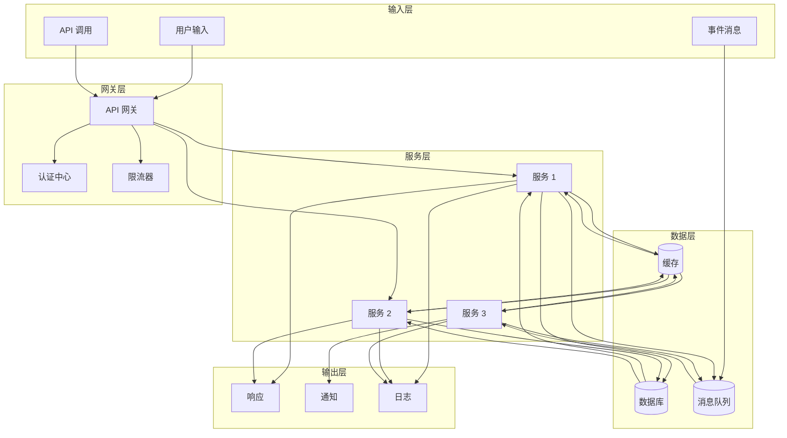
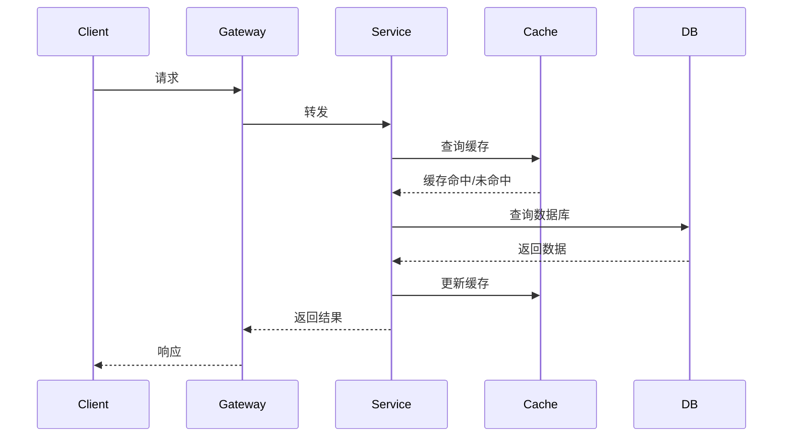
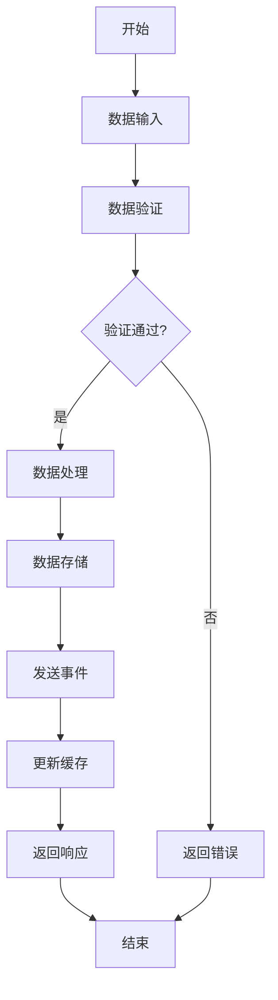
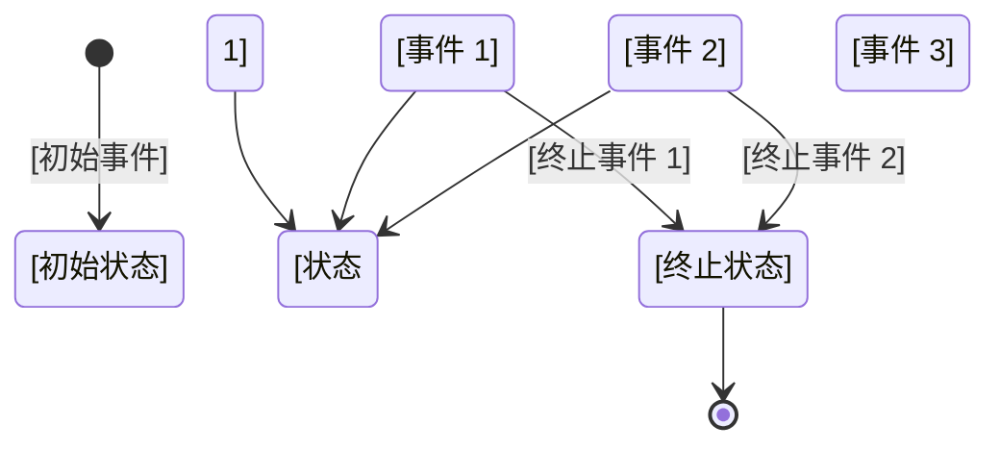
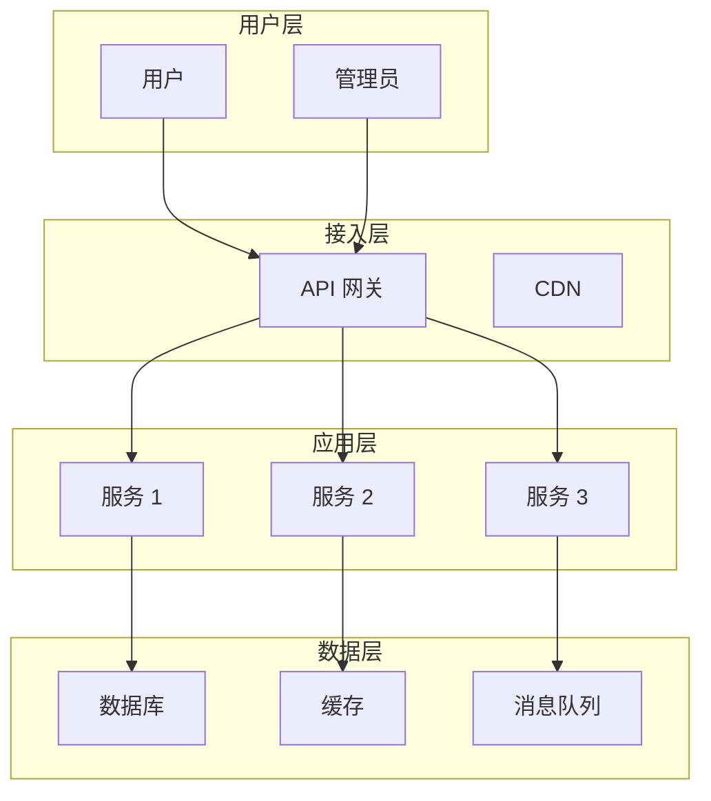
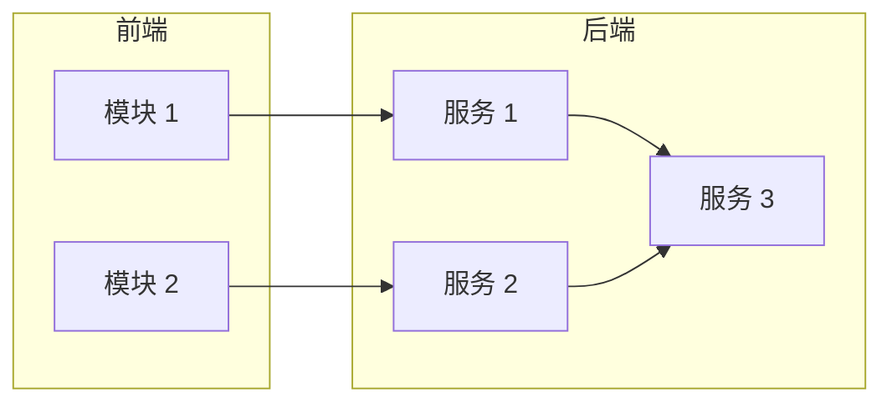
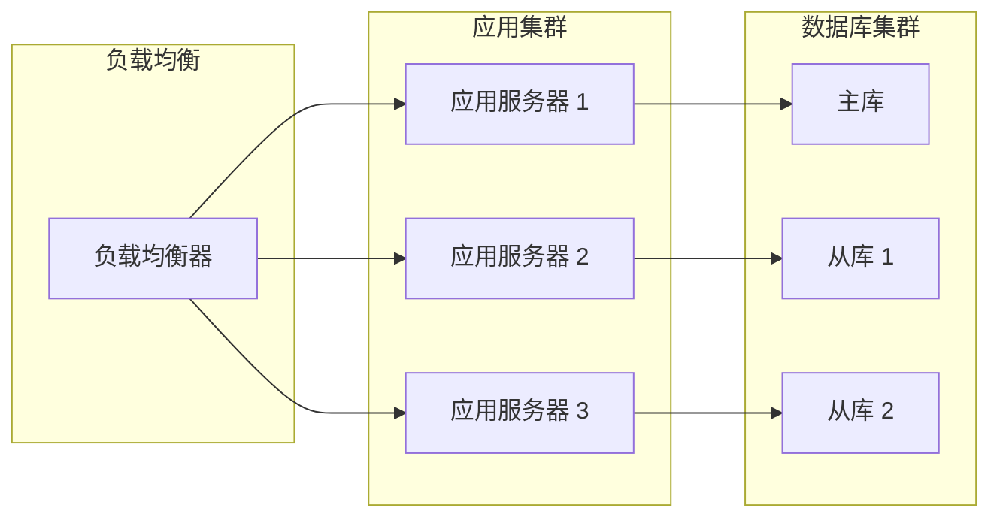
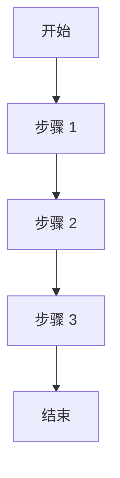
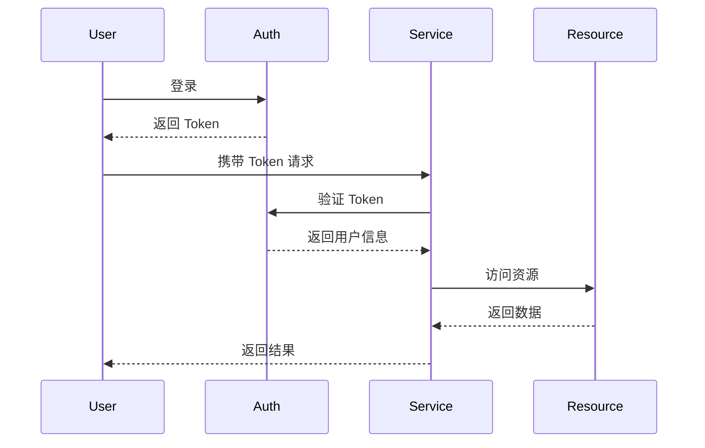

# 架构文档模板

## 使用说明

这是一个架构文档模板，基于需求文档进行架构设计。

**填写指南**：
1. 使用此模板创建架构文档
2. 引用对应的需求文档
3. 为 5 个角色分别填写对应的视图
4. **重点关注数据流动设计和状态管理实现**
5. 使用 Mermaid 图表可视化架构
6. 保存到 `architecture-docs/` 目录

---

# [架构名称]

## 需求来源
- **需求文档**：[需求文档路径]
- **创建日期**：[YYYY-MM-DD]
- **负责人**：[姓名]

---

## 架构概述

### 系统目标
[系统的总体目标和愿景]

### 核心能力
1. [能力 1]
2. [能力 2]
3. [能力 3]

### 关键指标
| 指标 | 目标值 | 当前值 |
|------|--------|--------|
| [指标 1] | [目标] | [当前] |
| [指标 2] | [目标] | [当前] |

---

## 数据流动架构

### 数据流概述

**数据流原则**：
1. **单向流动**：数据应该单向流动，避免循环依赖
2. **明确源头**：每个数据变更都应该有明确的源头
3. **可追踪性**：数据流动路径应该清晰可追踪
4. **幂等性**：相同操作应该产生相同结果
5. **一致性**：确保数据在整个流动过程中保持一致

### 系统数据流图



### 关键数据流

#### 数据流 1：[数据流名称]
**描述**：[详细描述]

**时序图**：


**数据流转路径**：
| 步骤 | 节点 | 操作 | 数据内容 | 耗时 |
|------|------|------|---------|------|
| 1 | Client | 发送请求 | [内容] | [时间] |
| 2 | Gateway | 验证和转发 | [内容] | [时间] |
| 3 | Service | 业务处理 | [内容] | [时间] |
| 4 | Cache | 缓存查询 | [内容] | [时间] |
| 5 | DB | 数据查询 | [内容] | [时间] |

**缓存策略**：
- **策略类型**：[Cache Aside / Write Through / Write Behind / Refresh Ahead]
- **缓存粒度**：[粒度说明]
- **缓存失效**：[失效策略]

**实现代码**：
```python
# 数据流实现示例
def process_request(request):
    # 1. 查询缓存
    cached_data = cache.get(request.key)
    if cached_data:
        return cached_data
    
    # 2. 查询数据库
    data = db.query(request.params)
    
    # 3. 更新缓存
    cache.set(request.key, data, ttl=3600)
    
    return data
```

#### 数据流 2：[数据流名称]
**描述**：[详细描述]

**流程图**：


**数据一致性保证**：
- **强一致性场景**：[场景说明]
- **最终一致性场景**：[场景说明]
- **冲突处理策略**：[策略说明]

---

## 状态管理架构

### 状态机设计

#### 状态机 1：[状态机名称]

**状态定义**：
| 状态 | 说明 | 入口条件 | 出口条件 |
|------|------|---------|---------|
| [状态 1] | [说明] | [条件] | [条件] |
| [状态 2] | [说明] | [条件] | [条件] |
| [状态 3] | [说明] | [条件] | [条件] |

**状态转换图**：


**状态转换表**：
| 当前状态 | 事件 | 目标状态 | 动作 | 条件 |
|---------|------|---------|------|------|
| [状态 1] | [事件 1] | [状态 2] | [动作] | [条件] |
| [状态 2] | [事件 2] | [状态 3] | [动作] | [条件] |
| [状态 3] | [终止事件] | [终止状态] | [动作] | [条件] |

**状态持久化方案**：

**存储方式**：
- **存储介质**：[数据库/缓存/文件]
- **存储结构**：
```json
{
  "entity_id": "实体ID",
  "current_state": "当前状态",
  "state_history": [
    {
      "state": "状态",
      "timestamp": "时间",
      "event": "事件",
      "user": "操作人"
    }
  ],
  "state_data": {
    "字段1": "值1",
    "字段2": "值2"
  }
}
```

**快照策略**：
- **快照频率**：[频率说明]
- **快照保留**：[保留策略]

**状态一致性保证**：
- **乐观锁**：[实现方式]
- **事件溯源**：[实现方式]
- **CQRS**：[实现方式]

**实现代码**：
```python
# 状态机实现示例
from enum import Enum, auto
from dataclasses import dataclass

class State(Enum):
    STATE_1 = auto()
    STATE_2 = auto()
    STATE_3 = auto()

class Event(Enum):
    EVENT_1 = auto()
    EVENT_2 = auto()

class StateMachine:
    def __init__(self):
        self.current_state = State.STATE_1
        self.transitions = {
            State.STATE_1: {
                Event.EVENT_1: State.STATE_2,
            },
            State.STATE_2: {
                Event.EVENT_2: State.STATE_3,
            },
        }
    
    def transition(self, event, context=None):
        if event in self.transitions.get(self.current_state, {}):
            old_state = self.current_state
            self.current_state = self.transitions[self.current_state][event]
            self._save_state(old_state, event, context)
            return self.current_state
        raise InvalidTransitionError("Invalid transition")
    
    def _save_state(self, old_state, event, context):
        # 持久化状态变更
        state_record = {
            "entity_id": context.get("entity_id"),
            "from_state": old_state.name,
            "to_state": self.current_state.name,
            "event": event.name,
            "timestamp": datetime.now().isoformat(),
            "context": context
        }
        db.save_state_record(state_record)
```

---

## 架构视图

### 系统架构图



---

## 多角色视图

### 1. 架构师视图

#### 整体架构
[架构师关注的整体架构说明]

**架构原则**：
- [原则 1]
- [原则 2]

**架构模式**：
- [模式 1]
- [模式 2]

#### 技术选型

| 组件 | 备选方案 | 选型方案 | 选型理由 | 权衡点 |
|------|---------|---------|----------|--------|
| [组件 1] | [方案 A, B] | [选型] | [理由] | [权衡] |
| [组件 2] | [方案 A, B] | [选型] | [理由] | [权衡] |

#### 设计决策

**ADR 1：[决策标题]**
- **状态**：已采纳/已拒绝
- **日期**：[YYYY-MM-DD]
- **决策者**：[姓名]
- **背景**：[背景说明]
- **决策**：[决策内容]
- **后果**：[积极后果、消极后果]

#### 潜在风险
| 风险 | 影响 | 概率 | 应对措施 | 责任人 |
|------|------|------|----------|--------|
| [风险 1] | 高/中/低 | 高/中/低 | [措施] | [姓名] |

---

### 2. 开发视图

#### 模块划分


#### 接口定义

| 接口名称 | 方法 | 路径 | 说明 | 数据流 |
|---------|------|------|------|--------|
| [接口 1] | POST | /api/xxx | [说明] | [流] |
| [接口 2] | GET | /api/xxx | [说明] | [流] |

---

### 3. 测试视图

#### 测试策略

**测试类型**：
- [单元测试]：[说明]
- [集成测试]：[说明]
- [状态转换测试]：[说明]

**测试重点**：
- [数据流一致性]
- [状态转换正确性]

---

### 4. 运维视图

#### 部署架构


#### 监控指标

| 指标类别 | 指标名称 | 阈值 | 告警级别 |
|---------|---------|------|---------|
| 数据流 | [指标] | [阈值] | [级别] |
| 状态 | [指标] | [阈值] | [级别] |

---

### 5. 产品视图

#### 业务流程


#### 业务指标
| 指标 | 目标 | 监控方式 |
|------|------|----------|
| [指标 1] | [目标] | [方式] |

---

## 技术架构

### 技术栈

| 层次 | 技术选型 | 版本 | 说明 |
|------|---------|------|------|
| [层次 1] | [技术] | [版本] | [说明] |
| [层次 2] | [技术] | [版本] | [说明] |

---

## 安全架构

### 安全策略

- [策略 1]
- [策略 2]

### 认证授权


---

## 性能架构

### 性能指标

| 指标 | 目标值 | 当前值 | 优化方向 |
|------|--------|--------|----------|
| [指标 1] | [目标] | [当前] | [方向] |
| [指标 2] | [目标] | [当前] | [方向] |

---

## 扩展性设计

### 水平扩展
[水平扩展设计]

### 垂直扩展
[垂直扩展设计]

---

## 文档元数据

- **文档类型**：架构文档
- **创建日期**：[YYYY-MM-DD]
- **最后更新**：[YYYY-MM-DD]
- **状态**：[草稿/审核/已批准]
- **负责人**：[姓名]

---

## 变更记录

| 版本 | 日期 | 变更内容 | 变更人 |
|------|------|----------|--------|
| 1.0 | [YYYY-MM-DD] | 初始版本 | [姓名] |

---

## 相关文档

- [需求文档](../requirement-docs/[需求名称].md)
- [功能文档](../functional-docs/[功能名称].md)
- [数据流动设计指南](../document-guides/data-flow-guide.md)
- [状态管理指南](../document-guides/state-management-guide.md)
- [状态机模板](../templates/state-machine-template.md)
