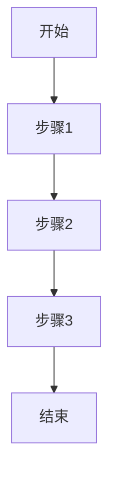
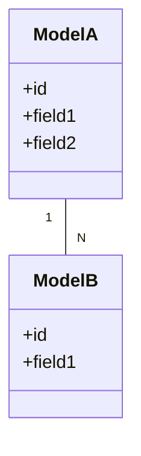

# [模块名称]

## 概述

[简要描述模块的功能和职责]

**版本**: v[版本号]
**维护人**: [负责人]
**最后更新**: [日期]

---

## 模块定位

### 职责
- {{responsibility_1}}
- {{responsibility_2}}
- {{responsibility_3}}

### 依赖关系
- **上游依赖**: [模块A, 模块B]
- **下游依赖**: [模块X, 模块Y]
- **外部依赖**: [外部服务1, 外部服务2]

---

## 架构设计

### 目录结构

```
[模块路径]/
├── __init__.py
├── models/          # 数据模型
├── services/        # 业务逻辑
├── controllers/     # 接口层
├── utils/           # 工具函数
└── tests/           # 测试用例
```

### 组件说明

| 组件 | 职责 | 依赖 |
|------|------|------|
| {{component}} | {{description}} | {{dependencies}} |

---

## 核心功能

### 功能 1: [功能名称]

**描述**: {{description}}

**接口**:
- `{{function_name}}()`: {{function_description}}

**流程**:


**参数**:
| 参数名 | 类型 | 必填 | 说明 |
|--------|------|------|------|
| {{param}} | {{type}} | {{required}} | {{description}} |

**返回值**:
| 字段名 | 类型 | 说明 |
|--------|------|------|
| {{field}} | {{type}} | {{description}} |

---

### 功能 2: [功能名称]

**描述**: {{description}}

**接口**:
- `{{function_name}}()`: {{function_description}}

---

## 数据模型

### [模型名称]

| 字段名 | 类型 | 必填 | 默认值 | 说明 |
|--------|------|------|--------|------|
| {{field_name}} | {{type}} | {{required}} | {{default}} | {{description}} |

### 关系图



---

## 配置说明

### 环境变量

| 变量名 | 类型 | 必填 | 默认值 | 说明 |
|--------|------|------|--------|------|
| {{env_var}} | {{type}} | {{required}} | {{default}} | {{description}} |

### 配置文件

```yaml
# config.yaml
module:
  setting1: {{value1}}
  setting2: {{value2}}
```

---

## 使用示例

### 基本使用

```python
from [module_name] import [class_name]

# 初始化
instance = [class_name]()

# 调用方法
result = instance.method_name(param1, param2)
```

### 高级用法

```python
# 高级配置
config = {
    "option1": "value1",
    "option2": "value2"
}
instance = [class_name](config)

# 链式调用
result = instance.method1().method2()
```

---

## 异常处理

| 异常类型 | 触发条件 | 处理方式 |
|----------|----------|----------|
| {{exception}} | {{condition}} | {{handler}} |

---

## 性能优化

### 缓存策略
- {{cache_strategy}}

### 批处理
- {{batch_processing}}

### 异步处理
- {{async_processing}}

---

## 测试

### 单元测试

```python
def test_function_name():
    # Given
    input_data = {...}
    
    # When
    result = function_name(input_data)
    
    # Then
    assert result == expected
```

### 集成测试

```python
def test_integration():
    # 测试模块间交互
    ...
```

---

## 最佳实践

1. ✅ {{best_practice_1}}
2. ✅ {{best_practice_2}}
3. ✅ {{best_practice_3}}

---

## 常见问题

### Q1: {{question_1}}

**A**: {{answer_1}}

### Q2: {{question_2}}

**A**: {{answer_2}}

---

## 变更历史

| 版本 | 日期 | 变更内容 | 维护人 |
|------|------|----------|--------|
| v1.0.0 | 2024-02-19 | 初始版本 | [负责人] |

---

## 相关文档

- [项目架构](../01-概览/架构设计.md)
- [API 文档](../03-API文档/{{module_name}}-API.md)
- [开发指南](../02-开发指南/开发环境.md)
