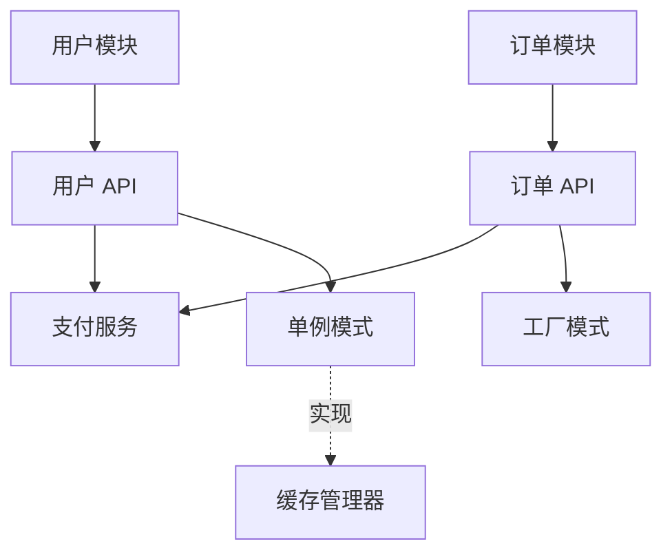

# 知识结构组织方法

## 目录

1. [多维度组织框架](#多维度组织框架)
2. [技术层次维度](#技术层次维度)
3. [业务领域维度](#业务领域维度)
4. [生命周期维度](#生命周期维度)
5. [知识关联网络](#知识关联网络)
6. [检索索引构建](#检索索引构建)

---

## 多维度组织框架

知识库支持从多个维度组织知识，不同维度适用于不同的使用场景

### 三大维度

| 维度 | 适用场景 | 目标读者 | 侧重点 |
|------|---------|---------|--------|
| **技术层次** | 理解系统架构、技术选型 | 架构师、高级开发者 | 技术实现、模块关系 |
| **业务领域** | 理解业务逻辑、产品功能 | 产品经理、开发者 | 业务流程、领域概念 |
| **生命周期** | 入门学习、日常开发维护 | 新人、开发者 | 使用指南、最佳实践 |

### 多维度交叉映射

每个知识节点可以在多个维度中存在，形成交叉索引

**示例**：
- "用户认证 API"
  - 技术层次：`api/user-api.md`
  - 业务领域：`domain/user-management.md`
  - 生命周期：`development/api-guide.md`

---

## 技术层次维度

### 1. 架构层

描述系统的整体架构和技术选型

**包含内容**：
- 系统分层（前端、后端、数据层）
- 技术栈（框架、数据库、中间件）
- 部署架构（容器化、微服务、单体）
- 数据流设计（服务间调用、数据流转）
- 安全架构（认证授权、数据加密）

**知识节点示例**：
```json
{
  "id": "arch:system-design",
  "title": "系统整体设计",
  "type": "architecture",
  "content": {
    "layers": ["前端", "后端", "数据层"],
    "tech_stack": {
      "frontend": "React + TypeScript",
      "backend": "FastAPI + Python",
      "database": "PostgreSQL + Redis"
    },
    "diagram": "system-architecture.mmd"
  }
}
```

### 2. 模块层

描述各模块的功能和职责

**包含内容**：
- 模块功能描述
- 模块边界和职责
- 模块间的依赖关系
- 模块的对外接口

**知识节点示例**：
```json
{
  "id": "module:user-service",
  "title": "用户服务模块",
  "type": "module",
  "content": {
    "description": "负责用户注册、登录、信息管理",
    "responsibilities": [
      "用户注册与登录",
      "用户信息 CRUD",
      "用户权限管理"
    ],
    "dependencies": ["module:auth-service", "module:database"],
    "apis": ["api:user:register", "api:user:login"]
  }
}
```

### 3. API 层

描述所有 API 接口的详细信息

**包含内容**：
- API 端点定义（路径、方法）
- 请求参数（参数名、类型、必填、说明）
- 响应格式（状态码、响应体）
- 错误码定义
- 使用示例

**知识节点示例**：
```json
{
  "id": "api:user:get-user",
  "title": "获取用户信息",
  "type": "api",
  "content": {
    "method": "GET",
    "path": "/api/users/{user_id}",
    "parameters": [
      {
        "name": "user_id",
        "type": "int",
        "required": true,
        "description": "用户 ID"
      }
    ],
    "response": {
      "200": {
        "code": 200,
        "data": {
          "id": 1,
          "name": "张三",
          "email": "zhangsan@example.com"
        }
      }
    }
  }
}
```

---

## 业务领域维度

### 1. 领域概念

描述业务领域的核心概念和术语

**包含内容**：
- 领域术语定义
- 领域模型（实体、值对象、聚合）
- 业务规则
- 领域事件

**知识节点示例**：
```json
{
  "id": "domain:concept:user-lifecycle",
  "title": "用户生命周期",
  "type": "concept",
  "content": {
    "states": ["未注册", "已注册", "已激活", "已冻结", "已注销"],
    "transitions": [
      {"from": "未注册", "to": "已注册", "event": "用户注册"},
      {"from": "已注册", "to": "已激活", "event": "邮箱验证"},
      {"from": "已激活", "to": "已冻结", "event": "违规"}
    ]
  }
}
```

### 2. 业务流程

描述关键业务流程的实现逻辑

**包含内容**：
- 流程图（Mermaid）
- 流程步骤说明
- 参与的角色和服务
- 异常处理

**知识节点示例**：
```json
{
  "id": "domain:process:order-payment",
  "title": "订单支付流程",
  "type": "process",
  "content": {
    "steps": [
      "用户提交订单",
      "订单服务创建订单",
      "调用支付网关",
      "支付网关处理支付",
      "订单服务更新订单状态"
    ],
    "services": ["order-service", "payment-gateway"],
    "diagram": "order-payment-flow.mmd"
  }
}
```

### 3. 业务规则

描述业务中的约束和规则

**包含内容**：
- 规则描述
- 规则的触发条件
- 规则的执行逻辑
- 规则的例外情况

**知识节点示例**：
```json
{
  "id": "domain:rule:order-discount",
  "title": "订单折扣规则",
  "type": "rule",
  "content": {
    "description": "订单金额满 100 元享受 9 折优惠",
    "condition": "order_amount >= 100",
    "action": "discount = order_amount * 0.1",
    "exceptions": ["VIP 用户无门槛享受 8 折"]
  }
}
```

---

## 生命周期维度

### 1. 入门指南

帮助新人快速上手项目

**包含内容**：
- 环境准备（开发工具、依赖安装）
- 项目克隆和启动
- 第一个任务示例
- 常见问题

**知识节点示例**：
```json
{
  "id": "lifecycle:getting-started:installation",
  "title": "环境安装",
  "type": "guide",
  "content": {
    "prerequisites": [
      "Python 3.8+",
      "Node.js 16+",
      "PostgreSQL 13+"
    ],
    "steps": [
      "克隆代码仓库",
      "安装 Python 依赖：pip install -r requirements.txt",
      "初始化数据库：python init_db.py",
      "启动服务：python run.py"
    ]
  }
}
```

### 2. 开发指南

指导日常开发工作

**包含内容**：
- 代码结构说明
- 编码规范
- 测试指南
- Git 工作流

**知识节点示例**：
```json
{
  "id": "lifecycle:development:code-structure",
  "title": "代码结构",
  "type": "guide",
  "content": {
    "directories": {
      "src/": "源代码",
      "tests/": "测试代码",
      "docs/": "文档",
      "scripts/": "脚本工具"
    },
    "modules": {
      "src/user/": "用户模块",
      "src/order/": "订单模块",
      "src/payment/": "支付模块"
    }
  }
}
```

### 3. 运维指南

指导部署和运维工作

**包含内容**：
- 部署流程
- 配置管理
- 监控告警
- 故障排查

**知识节点示例**：
```json
{
  "id": "lifecycle:operations:deployment",
  "title": "部署指南",
  "type": "guide",
  "content": {
    "environments": ["dev", "staging", "production"],
    "steps": [
      "构建 Docker 镜像",
      "推送到镜像仓库",
      "更新 Kubernetes 配置",
      "执行滚动更新"
    ],
    "rollback": "使用 kubectl rollout undo"
  }
}
```

---

## 知识关联网络

### 关系类型

定义知识节点之间的关系类型

| 关系类型 | 说明 | 示例 |
|---------|------|------|
| **包含** | 模块包含 API | `user-module` → `user-api` |
| **依赖** | API 依赖另一个 API | `order-api` → `user-api` |
| **调用** | 服务调用另一个服务 | `order-service` → `payment-service` |
| **引用** | 文档引用另一个文档 | `guide.md` → `api-doc.md` |
| **实现** | 代码实现设计模式 | `cache-manager` → `singleton-pattern` |
| **相关** | 知识相关但无强依赖 | `user-api` ↔ `admin-api` |

### 关系图示例



### 关联索引

为每个知识节点维护关联索引，支持快速查找

**索引结构**：
```json
{
  "node_id": "api:user:get-user",
  "relations": {
    "contains": [],
    "depends_on": ["module:user-service"],
    "called_by": ["api:order:create-order"],
    "implements": ["pattern:rest-api"],
    "related_to": ["api:admin:get-user"]
  }
}
```

---

## 检索索引构建

### 标签索引

为知识节点打标签，支持标签检索

**标签体系**：
- 技术标签：`python`, `fastapi`, `redis`
- 领域标签：`user`, `order`, `payment`
- 类型标签：`api`, `module`, `service`
- 状态标签：`stable`, `deprecated`, `experimental`

**示例**：
```json
{
  "node_id": "api:user:get-user",
  "tags": ["api", "user", "python", "fastapi", "stable"]
}
```

### 全文索引

为知识内容建立全文索引

**索引字段**：
- 标题
- 描述
- 内容
- 代码片段

### 路径索引

维护知识节点的路径，支持目录导航

**路径示例**：
```
api/user/get-user.md
module/user-service.md
domain/user-management.md
```

---

## 注意事项

1. **维度平衡**：不同维度的组织应互斥且完备
2. **交叉映射**：一个知识节点可以在多个维度中存在
3. **关联完整**：确保知识节点之间的关系完整准确
4. **索引优化**：定期更新检索索引，提高检索效率
5. **可扩展性**：支持新增维度和自定义关系类型
