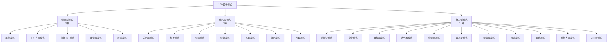

# 23种设计模式总览

## 设计模式简介

设计模式（Design pattern）是一套被反复使用、多数人知晓的、经过分类编目的、代码设计经验的总结。使用设计模式是为了可重用代码、让代码更容易被他人理解、保证代码可靠性。

**模式：在某些场景下，针对某类问题的某种通用的解决方案。**

- **场景**：项目所在的环境
- **问题**：约束条件，项目目标等
- **解决方案**：通用、可复用的设计，解决约束达到目标。

---

## 设计模式的三个分类

### 1. 创建型模式 (Creational Patterns)

对象实例化的模式，创建型模式用于解耦对象的实例化过程。

| 序号 | 模式名称 | 关键点 | 文档链接 |
|:----:|---------|--------|---------|
| 1 | **单例模式** | 某个类只能有一个实例，提供一个全局的访问点 | [查看](./creational/singleton.md) |
| 2 | **工厂方法模式** | 定义一个创建对象的接口，让子类决定实例化哪个类 | [查看](./creational/factory-method.md) |
| 3 | **抽象工厂模式** | 创建相关或依赖对象的家族，而无需明确指定具体类 | [查看](./creational/abstract-factory.md) |
| 4 | **建造者模式** | 封装一个复杂对象的构建过程，并可以按步骤构造 | [查看](./creational/builder.md) |
| 5 | **原型模式** | 通过复制现有的实例来创建新的实例 | [查看](./creational/prototype.md) |

### 2. 结构型模式 (Structural Patterns)

把类或对象结合在一起形成一个更大的结构。

| 序号 | 模式名称 | 关键点 | 文档链接 |
|:----:|---------|--------|---------|
| 6 | **适配器模式** | 将一个类的方法接口转换成客户希望的另外一个接口 | [查看](./structural/adapter.md) |
| 7 | **桥接模式** | 将抽象部分和它的实现部分分离，使它们都可以独立的变化 | [查看](./structural/bridge.md) |
| 8 | **组合模式** | 将对象组合成树形结构以表示"部分-整体"的层次结构 | [查看](./structural/composite.md) |
| 9 | **装饰模式** | 动态的给对象添加新的功能 | [查看](./structural/decorator.md) |
| 10 | **外观模式** | 对外提供一个统一的方法，来访问子系统中的一群接口 | [查看](./structural/facade.md) |
| 11 | **享元模式** | 通过共享技术来有效的支持大量细粒度的对象 | [查看](./structural/flyweight.md) |
| 12 | **代理模式** | 为其他对象提供一个代理以便控制这个对象的访问 | [查看](./structural/proxy.md) |

### 3. 行为型模式 (Behavioral Patterns)

类和对象如何交互，及划分责任和算法。

| 序号 | 模式名称 | 关键点 | 文档链接 |
|:----:|---------|--------|---------|
| 13 | **访问者模式** | 在不改变数据结构的前提下，增加作用于一组对象元素的新功能 | [查看](./behavioral/visitor.md) |
| 14 | **模板方法模式** | 定义一个算法结构，而将一些步骤延迟到子类实现 | [查看](./behavioral/template-method.md) |
| 15 | **策略模式** | 定义一系列算法，把他们封装起来，并且使它们可以相互替换 | [查看](./behavioral/strategy.md) |
| 16 | **状态模式** | 允许一个对象在其对象内部状态改变时改变它的行为 | [查看](./behavioral/state.md) |
| 17 | **观察者模式** | 对象间的一对多的依赖关系 | [查看](./behavioral/observer.md) |
| 18 | **备忘录模式** | 在不破坏封装的前提下，保持对象的内部状态 | [查看](./behavioral/memento.md) |
| 19 | **中介者模式** | 用一个中介对象来封装一系列的对象交互 | [查看](./behavioral/mediator.md) |
| 20 | **迭代器模式** | 一种遍历访问聚合对象中各个元素的方法，不暴露该对象的内部结构 | [查看](./behavioral/iterator.md) |
| 21 | **解释器模式** | 给定一个语言，定义它的文法的一种表示，并定义一个解释器 | [查看](./behavioral/interpreter.md) |
| 22 | **命令模式** | 将命令请求封装为一个对象，使得可以用不同的请求来进行参数化 | [查看](./behavioral/command.md) |
| 23 | **责任链模式** | 将请求的发送者和接收者解耦，使的多个对象都有处理这个请求的机会 | [查看](./behavioral/chain-of-responsibility.md) |

---

## 设计模式之间的关系

---

## 设计模式的六大原则

1. **开闭原则**（Open Close Principle）
   - 对扩展开放，对修改关闭
   - 使用接口和抽象类实现

2. **里氏代换原则**（Liskov Substitution Principle）
   - 任何基类可以出现的地方，子类一定可以出现
   - 继承复用的基石

3. **依赖倒转原则**（Dependence Inversion Principle）
   - 针对接口编程，依赖于抽象而不依赖于具体

4. **接口隔离原则**（Interface Segregation Principle）
   - 使用多个隔离的接口，比使用单个接口要好
   - 降低类之间的耦合度

5. **迪米特法则**（Demeter Principle）
   - 又称最少知道原则
   - 一个实体应当尽量少地与其他实体之间发生相互作用

6. **合成复用原则**（Composite Reuse Principle）
   - 尽量使用合成/聚合的方式，而不是使用继承

---

## 如何学习设计模式

### 学习技巧

1. **使用面向对象的语言**如Java、C#来理解设计模式
2. **动手实践**：自己敲代码并运行，多修改源代码
3. **日常生活隐喻**：用生活中的例子帮助理解
4. **怀疑精神**：敢于质疑，提出自己的观点

### 学习境界

- **第一层**：学习了一两个设计模式，就一直想用到代码中去
- **第二层**：学完全部设计模式，觉得很多模式都很相似，分不清楚区别
- **第三层**：灵活运用设计模式，无剑胜有剑

---

## 参考资料

- 《Design Patterns - Elements of Reusable Object-Oriented Software》（GoF）
- 菜鸟教程设计模式
- 设计模式之禅
