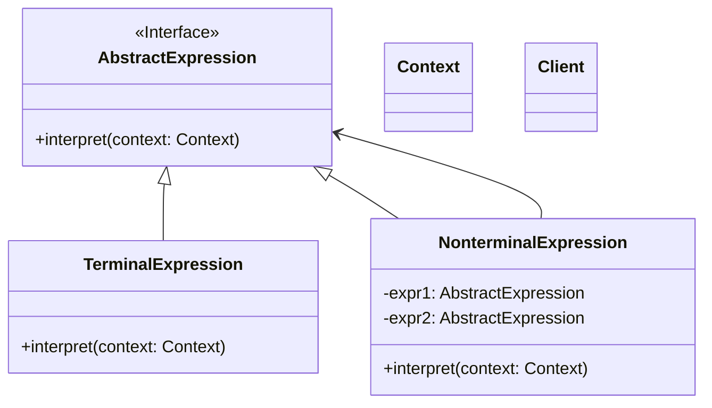

# 解释器模式 (Interpreter Pattern)

## 定义

给定一个语言，定义它的文法的一种表示，并定义一个解释器，这个解释器使用该表示来解释语言中的句子。

## 特点

- 定义语言的文法
- 建立解释器解释语言
- 适用于简单的语法

## 适用场景

- 当有一个语言需要解释执行，并且可将该语言中的句子表示为一个抽象语法树时
- 文法简单的情况
- 效率不是关键问题

## 优点

- 易于改变和扩展文法
- 实现文法较为容易
- 增加新的解释表达式较为方便

## 缺点

- 对于复杂的文法比较难以维护
- 执行效率较低
- 每条规则至少对应一个类

## 生活隐喻

> 俺有一个《泡MM真经》，上面有各种泡MM的攻略，比如说去吃西餐的步骤、去看电影的方法等等，跟MM约会时，只要做一个Interpreter，照着上面的脚本执行就可以了。

## UML图

## 实现要点

1. 定义抽象表达式接口
2. 终结符表达式实现基本解释
3. 非终结符表达式组合子表达式
4. 上下文存储解释所需信息

## 相关设计原则

- 单一职责原则
- 开闭原则

## 与其他模式的关系

- **组合模式**：抽象语法树通常用组合模式实现
- **访问者模式**：可以用访问者模式维护抽象语法树
