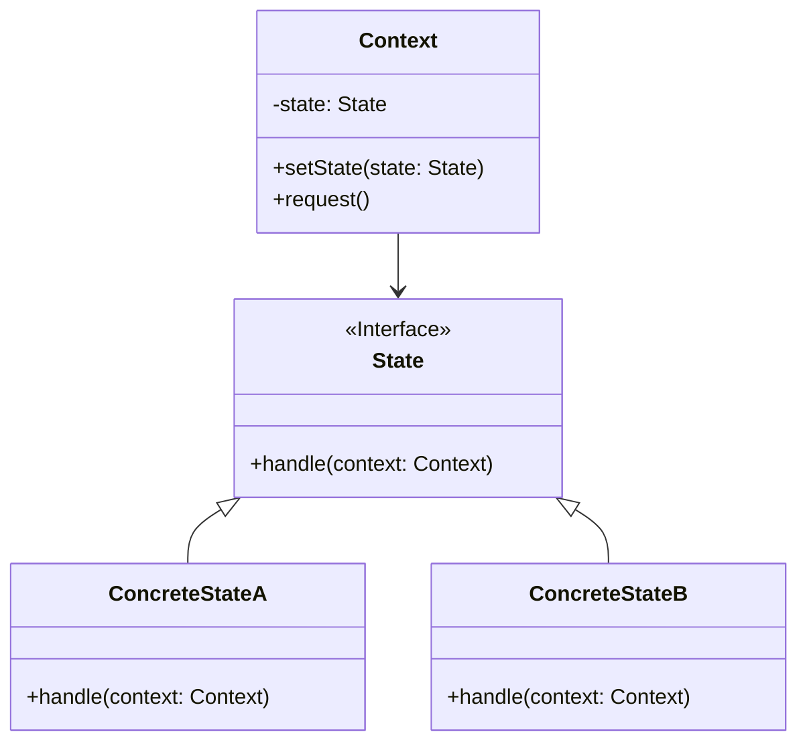

# 状态模式 (State Pattern)

## 定义

允许对象在其内部状态改变时改变它的行为。对象看起来似乎修改了它的类。

## 特点

- 状态决定行为
- 封装状态转换逻辑
- 消除庞大的条件分支语句

## 适用场景

- 一个对象的行为取决于它的状态，并且它必须在运行时刻根据状态改变它的行为
- 一个操作中含有庞大的多分支结构，并且这些分支决定于对象的状态

## 优点

- 封装了转换规则
- 枚举可能的状态，在枚举状态之前需要确定状态种类
- 将所有与某个状态有关的行为放到一个类中，可以方便地增加新的状态
- 允许状态转换逻辑与状态对象合成一体
- 可以让多个环境对象共享一个状态对象

## 缺点

- 状态模式的使用必然会增加系统类和对象的个数
- 状态模式的结构与实现都较为复杂
- 状态模式对"开闭原则"的支持并不太好

## 生活隐喻

> 跟MM交往时，一定要注意她的状态哦，在不同的状态时她的行为会有不同。状态模式允许一个对象在其内部状态改变的时候改变行为，这个对象看上去象是改变了它的类一样。

## UML图

## 实现要点

1. 定义状态接口
2. 每个具体状态实现特定行为
3. 上下文维护当前状态并委托行为

## 相关设计原则

- 单一职责原则
- 开闭原则

## 与其他模式的关系

- **策略模式**：状态模式是策略模式的孪生兄弟
- **单例模式**：状态对象通常实现为单例
