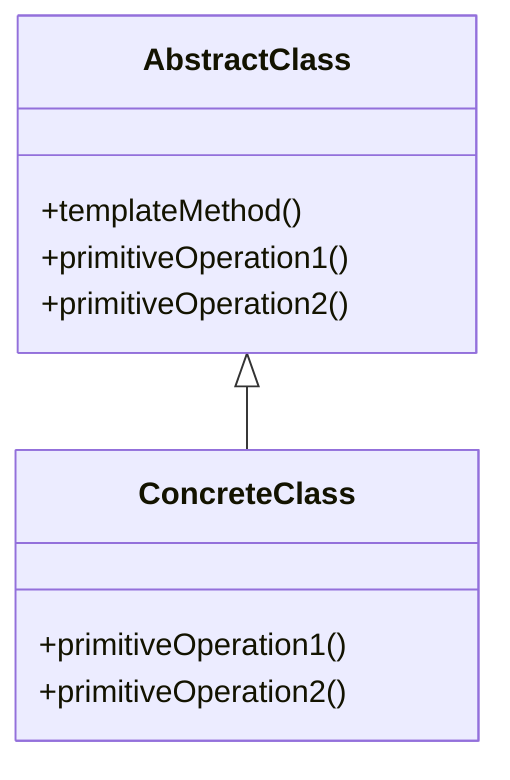

# 模板方法模式 (Template Method Pattern)

## 定义

定义一个操作中的算法的骨架，而将一些步骤延迟到子类中。模板方法使得子类可以不改变一个算法的结构即可重定义该算法的某些特定步骤。

## 特点

- 定义算法骨架
- 延迟实现到子类
- 代码复用

## 适用场景

- 一次性实现一个算法的不变的部分，并将可变的行为留给子类来实现
- 各子类中公共的行为应被提取出来并集中到一个公共父类中以避免代码重复
- 控制子类扩展

## 优点

- 封装不变部分，扩展可变部分
- 提取公共代码，便于维护
- 行为由父类控制，子类实现

## 缺点

- 每一个不同的实现都需要一个子类来实现，导致类的个数增加
- 父类中的抽象方法由子类实现，子类执行的结果会影响父类的结果

## 生活隐喻

> 女生从认识到上床的不变的步骤分为巧遇、打破僵局、展开追求、接吻、前戏、动手、爱抚、进去八大步骤(Template method)，但每个步骤针对不同的情况，都有不一样的做法。

## UML图

## 实现要点

1. 抽象类定义模板方法和基本方法
2. 模板方法定义算法骨架
3. 具体子类实现基本方法

## 相关设计原则

- 好莱坞原则（别调用我们，我们会调用你）
- 开闭原则

## 与其他模式的关系

- **工厂方法模式**：工厂方法经常被模板方法调用
- **策略模式**：模板方法使用继承改变算法，策略模式使用委托改变算法
