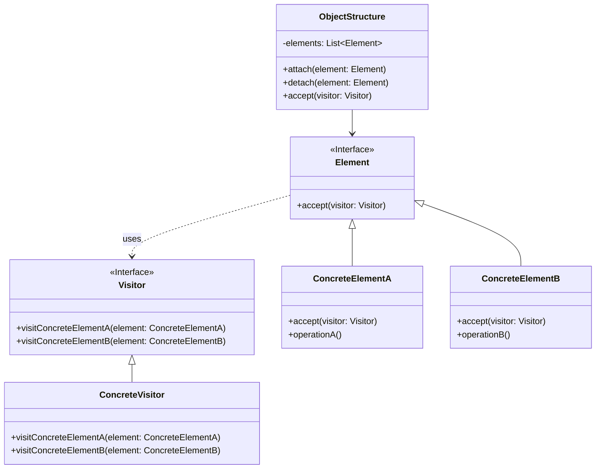

# 访问者模式 (Visitor Pattern)

## 定义

表示一个作用于某对象结构中的各元素的操作。它使你可以在不改变各元素的类的前提下定义作用于这些元素的新操作。

## 特点

- 将操作从对象结构中分离
- 可以在不改变元素类的前提下定义新操作
- 双分派技术

## 适用场景

- 对象结构中对象对应的类很少改变，但经常需要在此对象结构上定义新的操作
- 需要对一个对象结构中的对象进行很多不同的并且不相关的操作
- 对象结构中的对象所属的类很少改变

## 优点

- 符合单一职责原则
- 优秀的扩展性
- 灵活性

## 缺点

- 具体元素对访问者公布细节，违反了迪米特原则
- 具体元素变更比较困难
- 违反了依赖倒置原则，依赖了具体类

## 生活隐喻

> 情人节到了，要给每个MM送一束鲜花和一张卡片，可是每个MM送的花都要针对她个人的特点，每张卡片也要根据个人的特点来挑，我一个人哪搞得清楚，还是找花店老板和礼品店老板做一下Visitor，让花店老板根据MM的特点选一束花，让礼品店老板也根据每个人特点选一张卡。

## UML图

## 实现要点

1. 定义访问者接口，为每个元素类定义visit方法
2. 元素类提供accept方法接受访问者
3. 对象结构维护元素集合

## 相关设计原则

- 单一职责原则
- 开闭原则

## 与其他模式的关系

- **组合模式**：访问者模式常与组合模式一起使用
- **迭代器模式**：可以同时使用遍历对象结构
