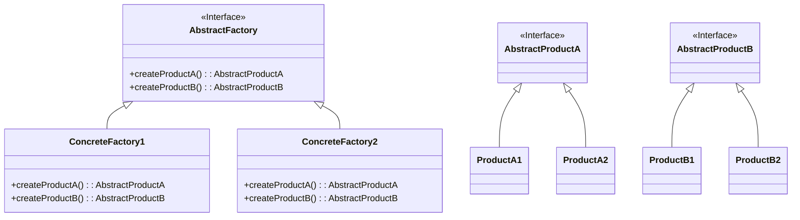

# 抽象工厂模式 (Abstract Factory Pattern)

## 定义

提供一个接口，用于创建相关或者依赖对象的家族，而不需要明确指定具体类。允许客户端使用抽象的接口来创建一组相关的产品，而不需要关心实际产出的具体产品是什么。

## 特点

- 创建产品家族（一系列相关的产品）
- 客户端与具体产品类解耦
- 确保同一产品族的对象一起使用

## 适用场景

- 系统要独立于产品的创建、组合和表示时
- 系统要由多个产品系列中的一个来配置时
- 需要强调一系列相关的产品对象的设计以便进行联合使用时

## 优点

- 分离了具体的类
- 使得更换产品系列变得容易
- 有利于产品的一致性

## 缺点

- 难以支持新种类的产品
- 产品族扩展困难

## 生活隐喻

> 追MM少不了请吃饭了，麦当劳的鸡翅和肯德基的鸡翅都是MM爱吃的东西，虽然口味有所不同，但不管你带MM去麦当劳或肯德基，只管向服务员说「来四个鸡翅」就行了。麦当劳和肯德基就是生产鸡翅的Factory。

## UML图

## 实现要点

1. 定义抽象产品接口（每种产品类型一个）
2. 定义抽象工厂接口
3. 具体工厂实现所有产品的创建方法

## 相关设计原则

- 开闭原则
- 依赖倒转原则

## 与其他模式的关系

- **工厂方法模式**：抽象工厂使用工厂方法实现
- **单例模式**：工厂通常实现为单例
