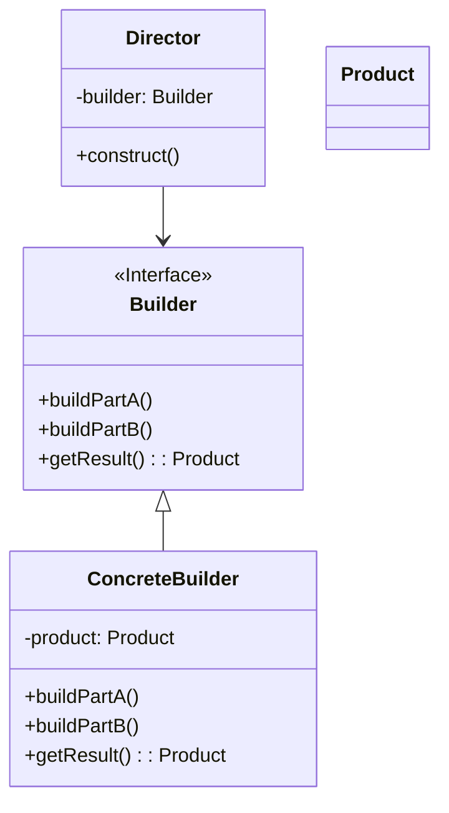

# 建造者模式 (Builder Pattern)

## 定义

将一个复杂对象的构建与表示分离，使得同样的构建过程可以创建不同的表示。

## 特点

- 封装复杂对象的构建过程
- 可以按步骤构造对象
- 分离构建和表示

## 适用场景

- 当创建复杂对象的算法应该独立于该对象的组成部分以及它们的装配方式时
- 当构造过程必须允许被构造的对象有不同的表示时
- 产品对象的内部结构比较复杂

## 优点

- 使产品的内部表象可以独立的变化
- 客户不必知道产品内部组成的细节
- 可以强制实行一种分步骤进行的建造过程
- 更好的复用性

## 缺点

- 如果产品的内部变化复杂，可能会导致需要定义很多具体建造者类

## 生活隐喻

> MM最爱听的就是「我爱你」这句话了，见到不同地方的MM，要能够用她们的方言跟她说这句话哦，我有一个多种语言翻译机，上面每种语言都有一个按键，见到MM我只要按对应的键，它就能够用相应的语言说出「我爱你」这句话了。

## UML图

## 实现要点

1. 定义建造者接口，包含构建各部件的方法
2. 具体建造者实现构建逻辑
3. 导演者负责控制构建过程

## 相关设计原则

- 单一职责原则
- 开闭原则

## 与其他模式的关系

- **工厂模式**：建造者模式关注复杂对象的逐步构建，工厂模式关注整体创建
- **组合模式**：常与建造者模式结合使用
