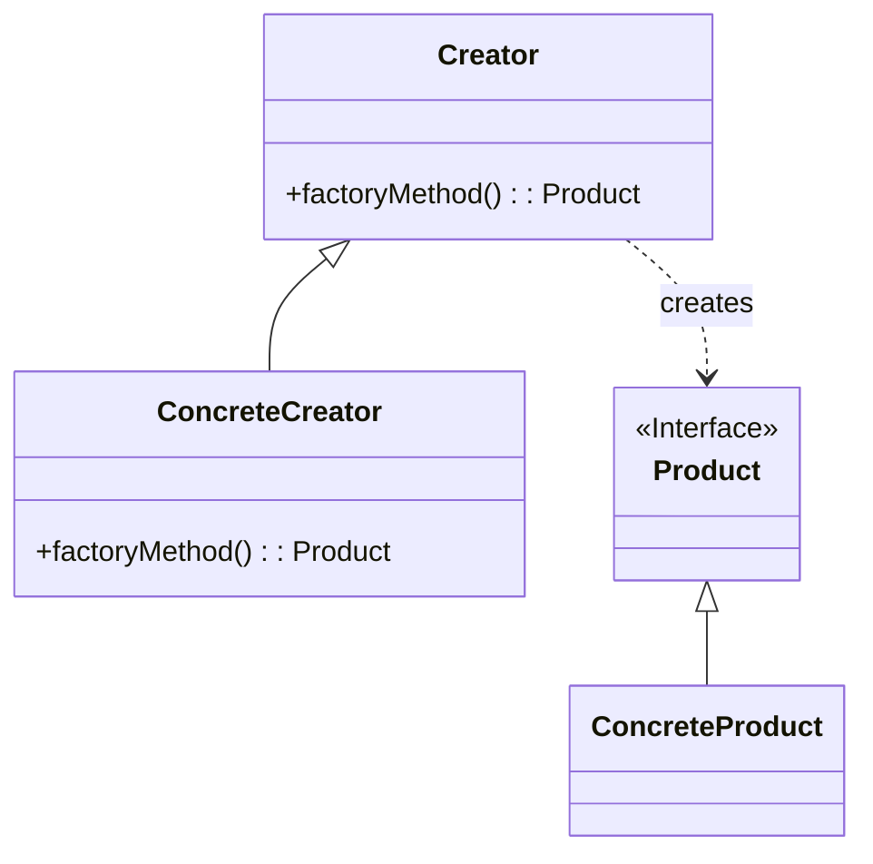

# 工厂方法模式 (Factory Method Pattern)

## 定义

定义一个创建对象的接口，但由子类决定要实例化的类是哪一个。工厂方法模式让实例化推迟到子类。

## 特点

- 将对象的创建和使用分离
- 客户端不需要知道具体产品类的类名
- 符合"开闭原则"

## 适用场景

- 当一个类不知道它所必须创建的对象的类的时候
- 当一个类希望由它的子类来指定它所创建的对象的时候
- 当类将创建对象的职责委托给多个帮助子类中的某一个

## 优点

- 符合"开闭原则"，增加新产品时无需修改原有系统
- 将创建逻辑集中管理
- 客户端只依赖抽象，不依赖具体实现

## 缺点

- 每增加一个产品类，就需要增加一个具体工厂类，增加了系统的复杂度

## 生活隐喻

> 请MM去麦当劳吃汉堡，不同的MM有不同的口味，要每个都记住是一件烦人的事情，我一般采用Factory Method模式，带着MM到服务员那儿，说「要一个汉堡」，具体要什么样的汉堡呢，让MM直接跟服务员说就行了。

## UML图

## 实现要点

1. 定义产品接口/抽象类
2. 定义工厂接口/抽象类
3. 具体工厂实现创建具体产品的方法

## 相关设计原则

- 开闭原则
- 依赖倒转原则

## 与其他模式的关系

- **抽象工厂模式**：工厂方法是抽象工厂的一个特例
- **模板方法模式**：工厂方法经常被模板方法调用
