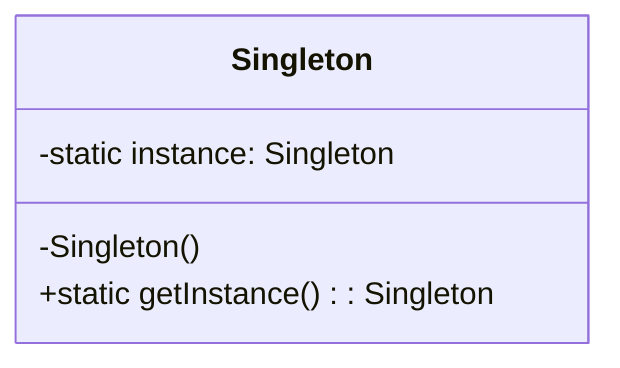

# 单例模式 (Singleton Pattern)

## 定义

单例模式确保某一个类只有一个实例，并且提供一个全局访问点。

## 特点

单例模式具备典型的3个特点：
1. **只有一个实例**：系统全局只有一个实例对象
2. **自我实例化**：类自行创建自己的实例
3. **提供全局访问点**：通过静态方法获取唯一实例

## 适用场景

- 系统中只需要一个实例对象
- 系统中只允许一个公共访问点
- 除了这个公共访问点外，不能通过其他访问点访问该实例

## 优点

- 节约系统资源
- 提高了系统效率
- 能够严格控制客户对它的访问

## 缺点

- 单例类的职责过重，违背了"单一职责原则"
- 没有抽象类，扩展起来有一定的困难

## 生活隐喻

> 俺有6个漂亮的老婆，她们的老公都是我，我就是我们家里的老公Singleton，她们只要说道「老公」，都是指的同一个人，那就是我。

## UML图

## 实现要点

1. 构造函数私有化，防止外部实例化
2. 提供一个静态的私有实例变量
3. 提供一个公共的静态方法获取实例

## 相关设计原则

- 单一职责原则（需注意避免违反）
- 开闭原则

## 与其他模式的关系

- **工厂模式**：工厂类经常使用单例模式
- **外观模式**：外观对象通常是单例
