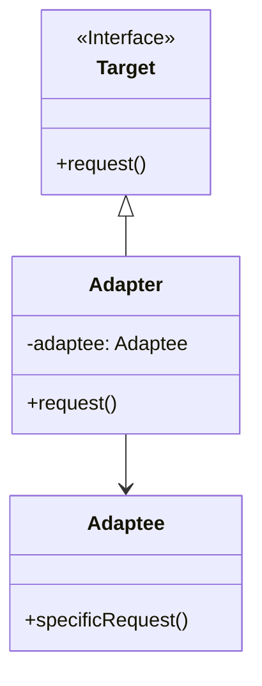

# 适配器模式 (Adapter Pattern)

## 定义

将一个类的方法接口转换成客户希望的另外一个接口。适配器模式使得原本由于接口不兼容而不能一起工作的那些类可以一起工作。

## 特点

- 转换接口以适应不同的客户端
- 复用已有的类
- 不需要修改原有的类

## 适用场景

- 系统需要使用现有的类，而此类的接口不符合系统的需要
- 想要建立一个可以重复使用的类，用于与一些彼此之间没有太大关联的类一起工作
- 需要一个统一的输出接口，而输入端的类型不可预知

## 优点

- 可以让任何两个没有关联的类一起运行
- 提高了类的复用
- 增加了类的透明度
- 灵活性好

## 缺点

- 过多地使用适配器，会让系统非常零乱
- 由于Java至多继承一个类，所以至多只能适配一个适配者类

## 生活隐喻

> 在朋友聚会上碰到了一个美女Sarah，从香港来的，可我不会说粤语，她不会说普通话，只好求助于我的朋友kent了，他作为我和Sarah之间的Adapter，让我和Sarah可以相互交谈了。

## UML图

## 实现方式

1. **对象适配器**：通过组合方式实现（推荐）
2. **类适配器**：通过继承方式实现

## 相关设计原则

- 开闭原则
- 依赖倒转原则

## 与其他模式的关系

- **桥接模式**：桥接模式的目的是将接口部分和实现部分分离
- **装饰模式**：装饰模式增强对象功能，适配器模式改变接口
- **代理模式**：代理模式不改变接口，适配器模式改变接口
