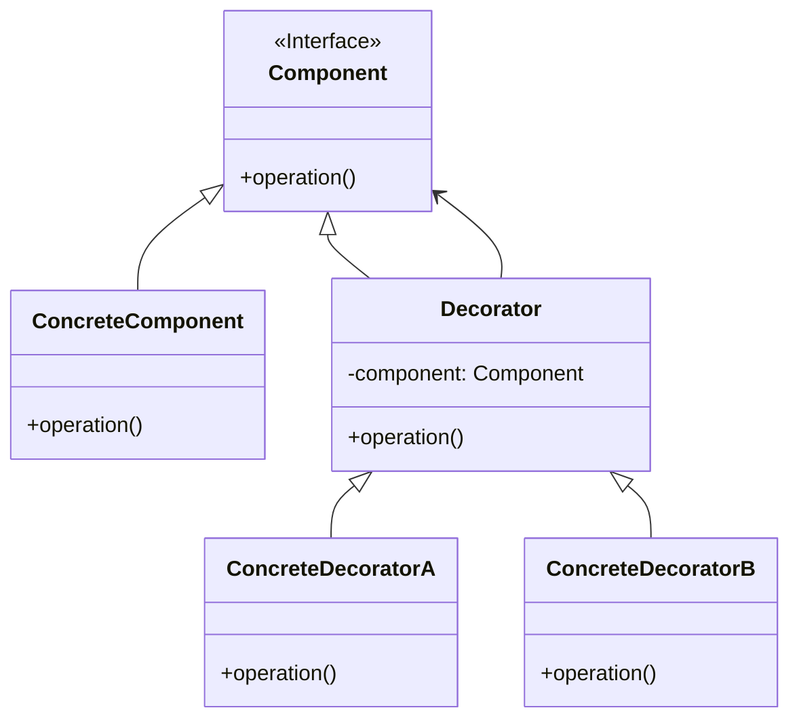

# 装饰模式 (Decorator Pattern)

## 定义

动态地给一个对象添加一些额外的职责。就增加功能来说，装饰模式比生成子类更为灵活。

## 特点

- 动态添加功能
- 透明的方式包装对象
- 可以层层叠加

## 适用场景

- 在不影响其他对象的情况下，以动态、透明的方式给单个对象添加职责
- 处理那些可以撤消的职责
- 当不能采用生成子类的方法进行扩充时

## 优点

- 比继承更灵活
- 符合开闭原则
- 可以动态添加和撤销功能
- 通过使用不同的装饰类及这些装饰类的排列组合，可以创造出很多不同行为的组合

## 缺点

- 会产生很多小对象
- 比继承更容易出错
- 排错困难

## 生活隐喻

> Mary过完轮到Sarly过生日，还是不要叫她自己挑了，不然这个月伙食费肯定玩完，拿出我去年在华山顶上照的照片，在背面写上「最好的的礼物，就是爱你的Fita」，再到街上礼品店买了个像框，再找隔壁搞美术设计的Mike设计了一个漂亮的盒子装起来……，我们都是Decorator，最终都在修饰我这个人呀。

## UML图

## 实现要点

1. 定义组件接口
2. 具体组件实现基本功能
3. 装饰器持有组件引用，并添加额外功能

## 相关设计原则

- 开闭原则
- 合成复用原则

## 与其他模式的关系

- **代理模式**：装饰器模式增强功能，代理模式控制访问
- **适配器模式**：装饰器改变职责，适配器改变接口
