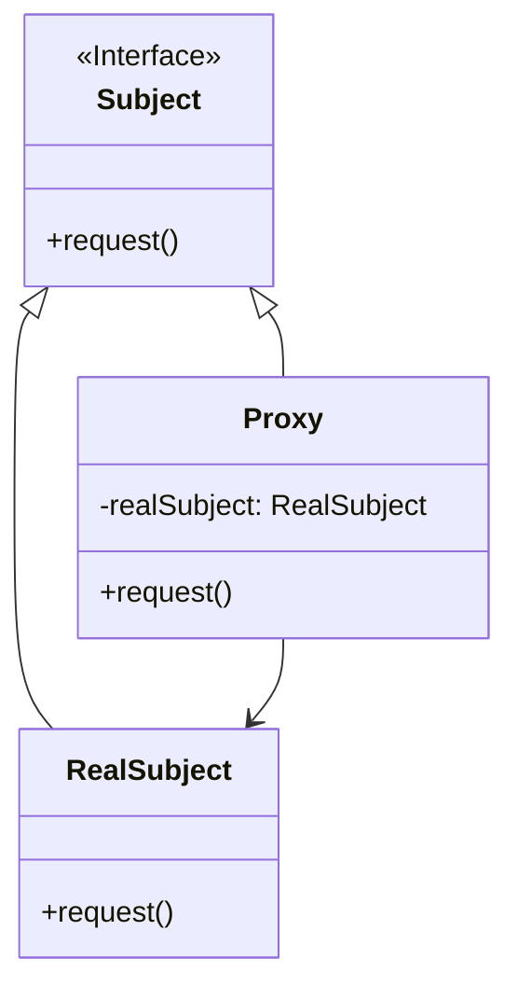

# 代理模式 (Proxy Pattern)

## 定义

为其他对象提供一种代理以控制对这个对象的访问。

## 特点

- 控制对真实对象的访问
- 代理和真实对象实现相同接口
- 客户端透明访问

## 适用场景

- 远程代理：为不同地址空间的对象提供本地代表
- 虚拟代理：根据需要创建开销很大的对象
- 保护代理：控制对原始对象的访问
- 智能指引：在访问对象时执行一些附加操作

## 优点

- 职责清晰
- 高扩展性
- 智能化

## 缺点

- 增加一层代理会增加请求的处理时间
- 实现代理模式需要额外的工作

## 生活隐喻

> 跟MM在网上聊天，一开头总是「hi,你好」「你从哪儿来呀？」「你多大了？」「身高多少呀？」这些话，真烦人，写个程序做为我的Proxy吧，凡是接收到这些话都设置好了自己的回答，接收到其他的话时再通知我回答。

## UML图

## 代理类型

1. **远程代理**：为远程对象提供本地代表
2. **虚拟代理**：延迟创建开销大的对象
3. **保护代理**：控制访问权限
4. **智能代理**：在访问时添加额外功能

## 相关设计原则

- 依赖倒转原则
- 迪米特法则

## 与其他模式的关系

- **装饰器模式**：代理控制访问，装饰器增强功能
- **适配器模式**：代理实现相同接口，适配器改变接口
