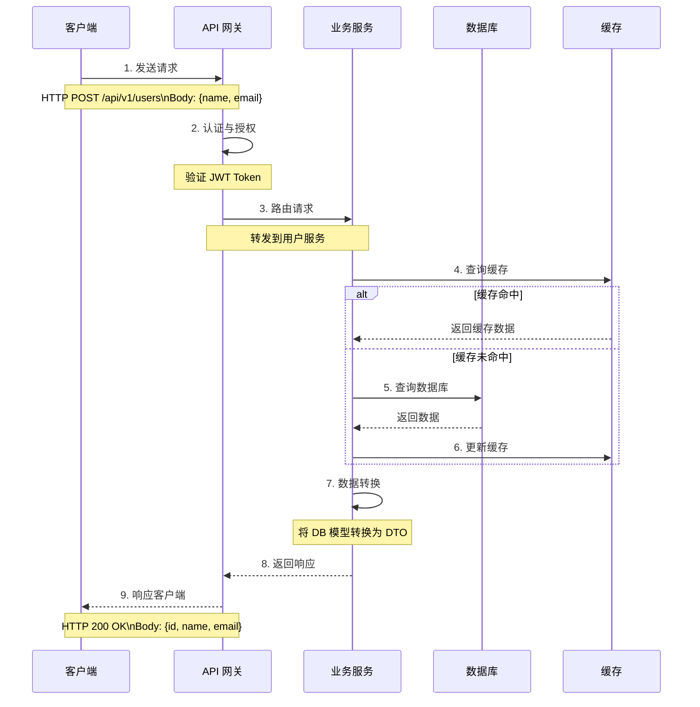
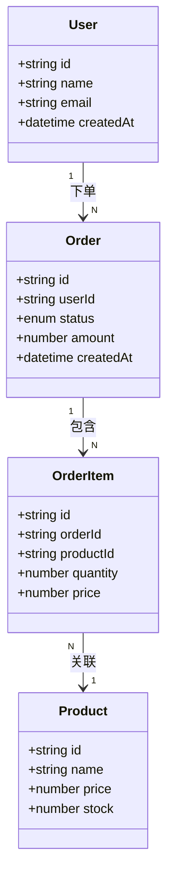

# API 文档生成指南

## 目录

1. [文档结构](#文档结构)
2. [数据流动](#数据流动)
3. [数据模型](#数据模型)
4. [类型系统](#类型系统)
5. [完整示例](#完整示例)

---

## 文档结构

### 1. API 概览

简要描述 API 的整体架构、设计原则和使用场景。

### 2. 认证与授权

说明 API 的认证方式（如 Bearer Token、API Key、OAuth 等）。

示例：
```markdown
## 认证

所有 API 请求需要在 Header 中包含认证令牌：

\`\`\`http
Authorization: Bearer <your-token>
\`\`\`

获取令牌请参考 [认证文档](#获取访问令牌)
```

---

## 数据流动

### 核心概念

**数据流动**（Data Flow）描述数据在 API 请求-响应过程中的完整路径，包括：
- 数据从客户端到服务器的传递
- 数据在服务器内部的转换和处理
- 数据从服务器返回到客户端的过程

### 数据流动图

使用 Mermaid 时序图展示数据流动：



### 数据流动章节模板

```markdown
## 数据流动

### 创建用户流程

```
客户端 → API 网关 → 用户服务 → 数据库 → 缓存 → 用户服务 → API 网关 → 客户端
```

**详细步骤**：

1. **客户端发送请求**
   - 请求方法：POST
   - 请求路径：/api/v1/users
   - 请求体：包含用户名、邮箱等字段

2. **API 网关处理**
   - 验证 JWT Token
   - 检查请求限流
   - 路由到用户服务

3. **用户服务处理**
   - 验证请求数据
   - 检查邮箱是否已存在
   - 创建用户记录

4. **数据持久化**
   - 写入数据库（主表 + 关联表）
   - 更新缓存（Redis）

5. **响应构建**
   - 转换数据库模型为 DTO
   - 隐藏敏感字段（如密码）
   - 返回创建结果

### 数据转换

| 阶段 | 数据类型 | 说明 |
|------|----------|------|
| 输入 | JSON Request Body | 客户端发送的数据 |
| 验证 | Validation DTO | 经过验证的数据 |
| 存储 | Database Model | 数据库中的数据 |
| 缓存 | Cache Object | 缓存中的数据 |
| 输出 | Response DTO | 返回给客户端的数据 |

**示例转换**：

```javascript
// 输入：客户端请求
{
  "name": "张三",
  "email": "zhangsan@example.com",
  "password": "plain_password"
}

// 存储：数据库模型（密码已加密）
{
  "id": "user_123",
  "name": "张三",
  "email": "zhangsan@example.com",
  "password_hash": "$2a$10$...",
  "created_at": "2024-02-19T12:00:00Z"
}

// 输出：客户端响应（不包含密码）
{
  "id": "user_123",
  "name": "张三",
  "email": "zhangsan@example.com",
  "created_at": "2024-02-19T12:00:00Z"
}
```
```

---

## 数据模型

### 核心模型定义

数据模型（Data Model）定义了 API 中使用的数据结构，包括：
- 字段名称
- 数据类型
- 必填/可选
- 约束条件
- 默认值
- 示例值

### 模型表示方式

#### 方式 1：表格形式（推荐用于简单模型）

```markdown
### User（用户模型）

| 字段名 | 类型 | 必填 | 默认值 | 说明 | 示例 |
|--------|------|------|--------|------|------|
| id | string | 是 | - | 用户ID（UUID） | "550e8400-e29b-41d4-a716-446655440000" |
| name | string | 是 | - | 用户名 | "张三" |
| email | string | 是 | - | 邮箱地址（唯一） | "user@example.com" |
| password | string | 是 | - | 密码（至少8位） | "********" |
| avatar | string | 否 | null | 头像URL | "https://example.com/avatar.jpg" |
| status | enum | 是 | "active" | 用户状态 | "active" |
| roles | array[string] | 否 | ["user"] | 用户角色 | ["user", "admin"] |
| createdAt | datetime | 是 | - | 创建时间（ISO 8601） | "2024-02-19T12:00:00Z" |
| updatedAt | datetime | 是 | - | 更新时间（ISO 8601） | "2024-02-19T12:00:00Z" |

**枚举值说明**：

| 字段 | 枚举值 | 说明 |
|------|--------|------|
| status | active | 活跃 |
| status | inactive | 非活跃 |
| status | suspended | 已暂停 |
```

#### 方式 2：类图形式（推荐用于复杂模型）

```markdown
### 订单相关模型



**模型关系说明**：

| 关系 | 类型 | 说明 |
|------|------|------|
| User → Order | 1:N | 一个用户可以有多个订单 |
| Order → OrderItem | 1:N | 一个订单可以包含多个商品 |
| OrderItem → Product | N:1 | 多个订单项可以关联同一个商品 |
```

#### 方式 3：Schema 形式（推荐用于技术文档）

```markdown
### 用户创建请求 Schema

```typescript
interface CreateUserRequest {
  // 基本信息
  name: string;              // 用户名，2-50 字符
  email: string;             // 邮箱地址，符合 RFC 5322
  password: string;          // 密码，至少 8 位，包含字母和数字

  // 可选信息
  avatar?: string;           // 头像 URL，最大 2MB
  phone?: string;            // 手机号，符合 E.164 格式
  bio?: string;              // 个人简介，最多 500 字符

  // 权限信息
  roles?: string[];          // 用户角色，默认 ["user"]
  permissions?: string[];    // 权限列表
}

### 约束说明

| 字段 | 约束 | 说明 |
|------|------|------|
| name | 2-50 字符 | 仅允许字母、数字、下划线 |
| email | 唯一 | 必须唯一，区分大小写 |
| password | 最少 8 位 | 必须包含至少一个字母和一个数字 |
| avatar | URL 验证 | 必须是有效的 HTTP/HTTPS URL |
| phone | E.164 格式 | 如 "+8613800138000" |
| bio | 最多 500 字符 | 可以为空 |
```
```

### 数据模型验证

```markdown
### 数据验证规则

**输入验证**：

```javascript
// 验证规则
const rules = {
  name: {
    type: 'string',
    minLength: 2,
    maxLength: 50,
    pattern: /^[a-zA-Z0-9_\u4e00-\u9fa5]+$/,
    required: true
  },
  email: {
    type: 'string',
    format: 'email',
    unique: true,
    required: true
  },
  password: {
    type: 'string',
    minLength: 8,
    pattern: /^(?=.*[A-Za-z])(?=.*\d)/,
    required: true
  }
};
```

**验证错误响应**：

```json
{
  "code": 400,
  "message": "Validation failed",
  "errors": [
    {
      "field": "name",
      "message": "Name must be 2-50 characters",
      "constraint": "minLength: 2, maxLength: 50"
    },
    {
      "field": "email",
      "message": "Email already exists",
      "constraint": "unique"
    }
  ]
}
```
```

---

## 类型系统

### 基础类型

| 类型 | 说明 | 示例 | 约束 |
|------|------|------|------|
| string | 字符串 | "Hello World" | minLength, maxLength, pattern |
| number | 数字（整数/浮点数） | 123, 45.67 | minimum, maximum, multipleOf |
| integer | 整数 | 123 | minimum, maximum |
| boolean | 布尔值 | true, false | - |
| null | 空值 | null | - |

### 复杂类型

| 类型 | 说明 | 示例 |
|------|------|------|
| array | 数组 | [1, 2, 3] |
| object | 对象 | {"key": "value"} |
| enum | 枚举 | "active", "inactive", "suspended" |
| datetime | 日期时间（ISO 8601） | "2024-02-19T12:00:00Z" |
| date | 日期（ISO 8601） | "2024-02-19" |
| time | 时间（ISO 8601） | "12:00:00Z" |
| uuid | UUID 格式 | "550e8400-e29b-41d4-a716-446655440000" |
| email | 邮箱格式 | "user@example.com" |
| url | URL 格式 | "https://example.com" |
| uri | URI 格式 | "/api/v1/users" |

### 类型组合

```markdown
### 可选字段

使用 `?` 表示可选：
- `name?: string` - 可选字符串
- `age?: number` - 可选数字

### 联合类型

使用 `|` 表示多种类型之一：
- `id: string \| number` - ID 可以是字符串或数字
- `status: "active" \| "inactive"` - 状态枚举

### 数组类型

- `tags: string[]` - 字符串数组
- `items: Array<{id: string, name: string}>` - 对象数组

### 嵌套对象

```typescript
interface Address {
  street: string;
  city: string;
  country: string;
  postalCode: string;
}

interface User {
  id: string;
  name: string;
  address: Address;  // 嵌套对象
}
```
```

### 类型定义示例

```markdown
### 类型定义

```typescript
// 基础类型
type UUID = string;                        // UUID 格式
type ISO8601DateTime = string;             // ISO 8601 日期时间
type Email = string;                       // 邮箱格式
type URL = string;                         // URL 格式

// 枚举类型
enum UserStatus {
  ACTIVE = "active",
  INACTIVE = "inactive",
  SUSPENDED = "suspended"
}

enum UserRole {
  USER = "user",
  ADMIN = "admin",
  SUPER_ADMIN = "super_admin"
}

// 用户模型
interface User {
  id: UUID;                              // 用户ID
  name: string;                          // 用户名
  email: Email;                          // 邮箱
  avatar?: URL;                          // 头像（可选）
  status: UserStatus;                    // 用户状态
  roles: UserRole[];                     // 用户角色
  createdAt: ISO8601DateTime;            // 创建时间
  updatedAt: ISO8601DateTime;            // 更新时间
}

// 创建用户请求
interface CreateUserRequest {
  name: string;
  email: Email;
  password: string;
  avatar?: URL;
  roles?: UserRole[];
}

// 用户响应
interface UserResponse {
  id: UUID;
  name: string;
  email: Email;
  avatar?: URL;
  status: UserStatus;
  roles: UserRole[];
  createdAt: ISO8601DateTime;
}
```
```

---

## API 端点

### 端点格式

每个 API 端点应包含以下信息：

```markdown
### [方法] [路径]

[简要描述]

**请求参数**

| 参数名 | 类型 | 必填 | 说明 | 示例 |
|--------|------|------|------|------|
| param1 | string | 是 | 参数说明 | "value1" |
| param2 | number | 否 | 参数说明，默认值: 0 | 123 |

**请求示例**

\`\`\`http
[METHOD] /api/path
Content-Type: application/json

{
  "param1": "value1",
  "param2": 123
}
\`\`\`

**响应示例**

\`\`\`json
{
  "code": 200,
  "message": "success",
  "data": {
    "result": "..."
  }
}
\`\`\`

**响应字段**

| 字段名 | 类型 | 说明 |
|--------|------|------|
| code | number | 状态码 |
| message | string | 响应消息 |
| data | object | 响应数据 |

**错误码**

| 错误码 | 说明 | 解决方案 |
|--------|------|----------|
| 400 | 请求参数错误 | 检查参数格式 |
| 401 | 未授权 | 检查认证令牌 |
| 404 | 资源不存在 | 检查资源ID |
| 500 | 服务器错误 | 联系管理员 |
```

---

## 完整示例

### 用户管理 API

```markdown
# 用户管理 API

## 概览

用户管理 API 提供用户的创建、查询、更新、删除等功能。

## 认证

所有请求需要在 Header 中包含 JWT Token：

\`\`\`http
Authorization: Bearer <your-token>
\`\`\`

---

## 数据模型

### User（用户模型）

| 字段名 | 类型 | 必填 | 默认值 | 说明 | 示例 |
|--------|------|------|--------|------|------|
| id | string | 是 | - | 用户ID（UUID） | "550e8400-e29b-41d4-a716-446655440000" |
| name | string | 是 | - | 用户名（2-50字符） | "张三" |
| email | string | 是 | - | 邮箱（唯一） | "user@example.com" |
| avatar | string | 否 | null | 头像URL | "https://example.com/avatar.jpg" |
| status | enum | 是 | "active" | 状态 | "active" |
| createdAt | datetime | 是 | - | 创建时间 | "2024-02-19T12:00:00Z" |
| updatedAt | datetime | 是 | - | 更新时间 | "2024-02-19T12:00:00Z" |

**枚举值**：
- `active` - 活跃
- `inactive` - 非活跃
- `suspended` - 已暂停

---

## 数据流动

### 创建用户流程

\`\`\`mermaid
sequenceDiagram
    participant Client as 客户端
    participant Gateway as API网关
    participant Service as 用户服务
    participant DB as 数据库
    participant Cache as 缓存

    Client->>Gateway: POST /api/v1/users\nBody: {name, email, password}
    Gateway->>Gateway: 验证 JWT Token
    Gateway->>Service: 路由请求
    Service->>Service: 验证请求参数
    Service->>DB: 查询邮箱是否存在
    DB-->>Service: 返回结果
    alt 邮箱已存在
        Service-->>Gateway: 409 Conflict
        Gateway-->>Client: 409 邮箱已存在
    else 邮箱不存在
        Service->>DB: 创建用户记录
        Service->>Cache: 更新缓存
        Service-->>Gateway: 201 Created
        Gateway-->>Client: 201 用户创建成功
    end
\`\`\`

**数据转换**：

| 阶段 | 数据 | 说明 |
|------|------|------|
| 输入 | `{name, email, password}` | 客户端请求 |
| 验证 | `{name, email, password}` | 经过验证 |
| 存储 | `{id, name, email, password_hash, status, ...}` | 数据库模型 |
| 输出 | `{id, name, email, status, ...}` | 响应数据（不含密码） |

---

## API 端点

### 创建用户

**POST** `/api/v1/users`

创建新用户。

**请求体**

\`\`\`json
{
  "name": "张三",
  "email": "zhangsan@example.com",
  "password": "SecurePass123",
  "avatar": "https://example.com/avatar.jpg"
}
\`\`\`

**请求体字段**

| 字段名 | 类型 | 必填 | 说明 | 约束 |
|--------|------|------|------|------|
| name | string | 是 | 用户名 | 2-50字符，允许中文 |
| email | string | 是 | 邮箱 | 符合 RFC 5322 |
| password | string | 是 | 密码 | 至少8位，包含字母和数字 |
| avatar | string | 否 | 头像URL | 有效的HTTP/HTTPS URL |

**成功响应** (201)

\`\`\`json
{
  "code": 201,
  "message": "用户创建成功",
  "data": {
    "id": "550e8400-e29b-41d4-a716-446655440000",
    "name": "张三",
    "email": "zhangsan@example.com",
    "avatar": "https://example.com/avatar.jpg",
    "status": "active",
    "createdAt": "2024-02-19T12:00:00Z"
  }
}
\`\`\`

**错误响应**

| 状态码 | 说明 | 解决方案 |
|--------|------|----------|
| 400 | 参数验证失败 | 检查参数格式 |
| 401 | 未授权 | 检查 Token |
| 409 | 邮箱已存在 | 使用其他邮箱 |
| 500 | 服务器错误 | 联系管理员 |

---

### 获取用户列表

**GET** `/api/v1/users`

获取用户列表，支持分页和筛选。

**查询参数**

| 参数名 | 类型 | 必填 | 默认值 | 说明 |
|--------|------|------|--------|------|
| page | number | 否 | 1 | 页码 |
| pageSize | number | 否 | 20 | 每页数量（最大100） |
| status | enum | 否 | - | 状态筛选 |
| keyword | string | 否 | - | 关键词搜索（名称或邮箱） |

**请求示例**

\`\`\`http
GET /api/v1/users?page=1&pageSize=20&status=active
\`\`\`

**成功响应** (200)

\`\`\`json
{
  "code": 200,
  "message": "success",
  "data": {
    "users": [
      {
        "id": "550e8400-e29b-41d4-a716-446655440000",
        "name": "张三",
        "email": "zhangsan@example.com",
        "status": "active"
      }
    ],
    "pagination": {
      "page": 1,
      "pageSize": 20,
      "total": 100,
      "totalPages": 5
    }
  }
}
\`\`\`

---

### 获取用户详情

**GET** `/api/v1/users/{id}`

根据用户ID获取用户详情。

**路径参数**

| 参数名 | 类型 | 必填 | 说明 |
|--------|------|------|------|
| id | string | 是 | 用户ID（UUID） |

**成功响应** (200)

\`\`\`json
{
  "code": 200,
  "message": "success",
  "data": {
    "id": "550e8400-e29b-41d4-a716-446655440000",
    "name": "张三",
    "email": "zhangsan@example.com",
    "avatar": "https://example.com/avatar.jpg",
    "status": "active",
    "roles": ["user"],
    "createdAt": "2024-02-19T12:00:00Z",
    "updatedAt": "2024-02-19T12:00:00Z"
  }
}
\`\`\`

**错误响应**

| 状态码 | 说明 |
|--------|------|
| 404 | 用户不存在 |

---

### 更新用户

**PUT** `/api/v1/users/{id}`

更新用户信息。

**路径参数**

| 参数名 | 类型 | 必填 | 说明 |
|--------|------|------|------|
| id | string | 是 | 用户ID（UUID） |

**请求体**

\`\`\`json
{
  "name": "李四",
  "avatar": "https://example.com/new-avatar.jpg"
}
\`\`\`

**请求体字段**

| 字段名 | 类型 | 必填 | 说明 |
|--------|------|------|------|
| name | string | 否 | 用户名 |
| avatar | string | 否 | 头像URL |
| status | enum | 否 | 状态 |

**成功响应** (200)

\`\`\`json
{
  "code": 200,
  "message": "用户更新成功",
  "data": {
    "id": "550e8400-e29b-41d4-a716-446655440000",
    "name": "李四",
    "email": "zhangsan@example.com",
    "avatar": "https://example.com/new-avatar.jpg",
    "status": "active",
    "updatedAt": "2024-02-19T12:05:00Z"
  }
}
\`\`\`

---

### 删除用户

**DELETE** `/api/v1/users/{id}`

删除用户（软删除）。

**路径参数**

| 参数名 | 类型 | 必填 | 说明 |
|--------|------|------|------|
| id | string | 是 | 用户ID（UUID） |

**成功响应** (200)

\`\`\`json
{
  "code": 200,
  "message": "用户删除成功"
}
\`\`\`

---

## 最佳实践

### ✅ 推荐做法

1. **完整的数据模型**：明确所有字段的类型、约束、示例
2. **清晰的数据流动**：使用时序图展示数据流转过程
3. **类型安全**：使用明确的类型定义
4. **验证规则**：说明输入验证规则和错误响应
5. **示例代码**：提供请求/响应示例

### ❌ 避免做法

1. **不要省略类型**：避免使用 `any` 或 `object` 类型
2. **不要缺少示例**：每个模型和字段都应提供示例
3. **不要忽略约束**：必须说明必填、长度、格式等约束
4. **不要混淆模型**：清楚区分请求模型、响应模型、数据库模型
```

---

**最后更新**：2024-02-19
