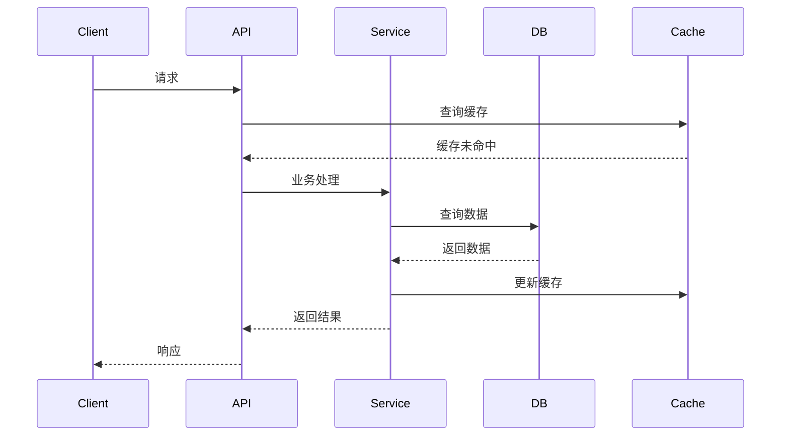
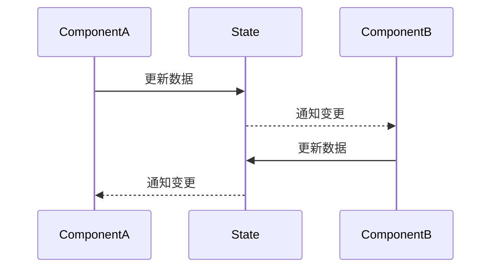
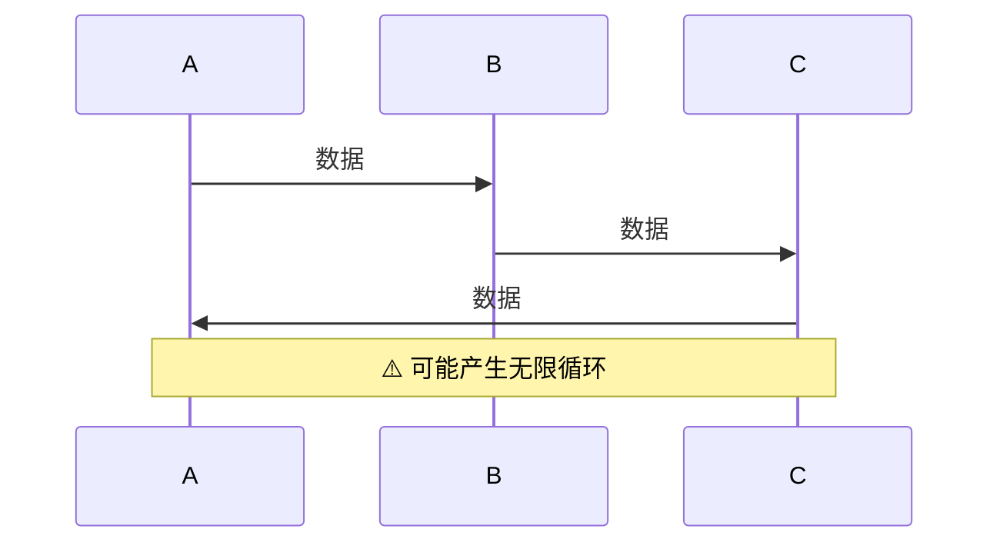
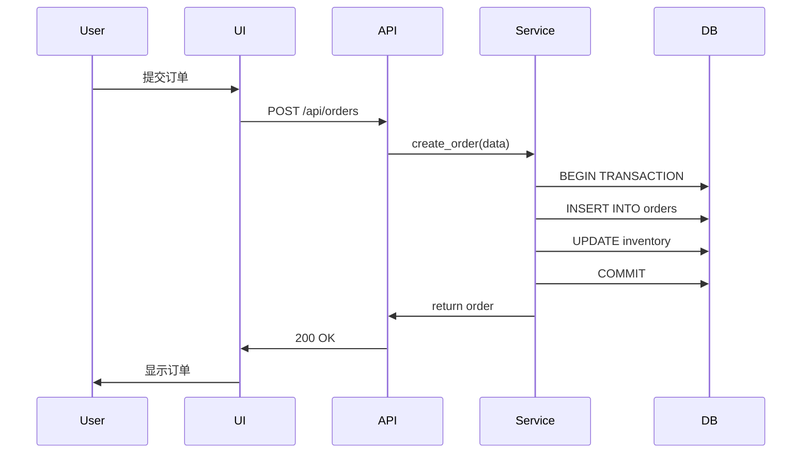
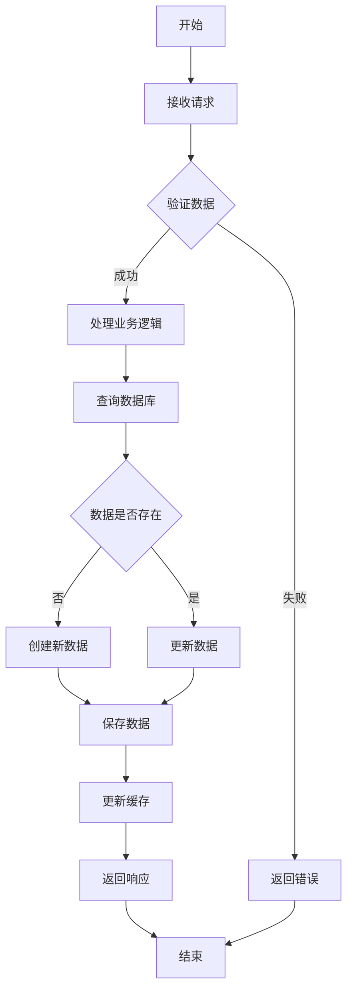
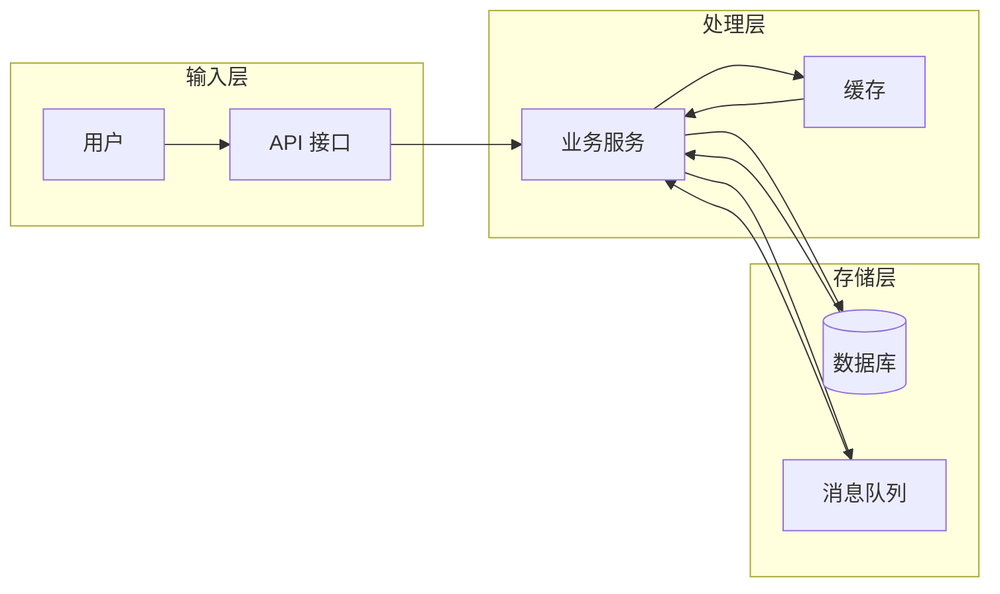

# 数据流动设计指南

## 目录

- [概述](#概述)
- [数据流类型](#数据流类型)
- [数据流模式](#数据流模式)
- [数据流可视化](#数据流可视化)
- [数据流最佳实践](#数据流最佳实践)
- [常见问题](#常见问题)

---

## 概述

数据流动设计是系统架构的核心，决定了系统的性能、可靠性和可维护性。

### 核心原则

1. **单向流动**：数据应该单向流动，避免循环依赖
2. **明确源头**：每个数据变更都应该有明确的源头
3. **可追踪性**：数据流动路径应该清晰可追踪
4. **幂等性**：相同操作应该产生相同结果
5. **一致性**：确保数据在整个流动过程中保持一致

### 为什么重要

- **性能优化**：合理的数据流动可以减少不必要的计算
- **问题排查**：清晰的数据流便于定位问题
- **系统扩展**：良好的数据流设计便于系统扩展
- **数据一致性**：明确的数据流保证数据一致性

---

## 数据流类型

### 1. 单向数据流（推荐）

**描述**：数据从源头向下游单向流动

**特点**：
- 数据流向清晰
- 易于追踪
- 避免循环依赖

**适用场景**：
- RESTful API
- 事件驱动架构
- CQRS

**示例**：


**优点**：
- 数据流向清晰
- 易于理解和维护
- 便于测试和调试

**缺点**：
- 可能需要多次往返
- 某些场景下效率较低

---

### 2. 双向数据流（谨慎使用）

**描述**：数据在组件之间双向流动

**特点**：
- 数据可以相互更新
- 实时性高
- 容易产生循环依赖

**适用场景**：
- 实时协作编辑
- WebSocket 通信
- 表单绑定

**示例**：


**优点**：
- 实时性高
- 用户体验好

**缺点**：
- 容易产生循环依赖
- 数据流难以追踪
- 状态同步复杂

---

### 3. 环状数据流（避免）

**描述**：数据形成环形流动

**特点**：
- 容易产生无限循环
- 难以追踪
- 性能问题

**适用场景**：
- 无（应该避免）

**示例**：


**风险**：
- 无限循环
- 级联失败
- 性能问题

**解决方案**：
- 重构为单向数据流
- 引入消息队列
- 使用事件溯源

---

## 数据流模式

### 1. Cache Aside（推荐）

**描述**：先操作数据库，再操作缓存

**读操作流程**：
1. 先查缓存
2. 缓存命中，直接返回
3. 缓存未命中，查数据库
4. 将数据写入缓存
5. 返回数据

**写操作流程**：
1. 更新数据库
2. 删除缓存（而非更新）

**代码示例**：
```python
# Cache Aside - 读操作
def get_user(user_id):
    # 1. 查询缓存
    user = cache.get(f"user:{user_id}")
    if user:
        return user
    
    # 2. 查询数据库
    user = db.query_user(user_id)
    
    # 3. 写入缓存
    cache.set(f"user:{user_id}", user, ttl=3600)
    
    return user

# Cache Aside - 写操作
def update_user(user_id, data):
    # 1. 更新数据库
    db.update_user(user_id, data)
    
    # 2. 删除缓存（而非更新）
    cache.delete(f"user:{user_id}")
```

**优点**：
- 实现简单
- 缓存失效策略清晰

**缺点**：
- 缓存穿透
- 缓存击穿
- 缓存雪崩

---

### 2. Read Through

**描述**：缓存代理负责读取和加载

**流程**：
1. 应用程序请求缓存
2. 缓存未命中时，缓存代理从数据库加载
3. 缓存代理将数据写入缓存
4. 返回数据

**代码示例**：
```python
# Read Through
class CacheProxy:
    def get(self, key):
        # 1. 查询缓存
        value = self.cache.get(key)
        if value:
            return value
        
        # 2. 缓存代理加载数据
        value = self.db.load(key)
        
        # 3. 写入缓存
        self.cache.set(key, value)
        
        return value
```

**优点**：
- 应用程序代码简洁
- 缓存逻辑集中管理

**缺点**：
- 缓存代理成为性能瓶颈
- 实现复杂度高

---

### 3. Write Through

**描述**：同步写入缓存和数据库

**流程**：
1. 应用程序更新数据
2. 同步写入缓存
3. 同步写入数据库
4. 返回成功

**代码示例**：
```python
# Write Through
def update_user(user_id, data):
    # 1. 同步写入缓存
    cache.set(f"user:{user_id}", data)
    
    # 2. 同步写入数据库
    db.update_user(user_id, data)
    
    # 3. 返回成功
    return True
```

**优点**：
- 数据一致性好
- 缓存实时更新

**缺点**：
- 写入延迟高
- 性能受影响

---

### 4. Write Behind

**描述**：异步写入缓存和数据库

**流程**：
1. 应用程序更新数据
2. 异步写入缓存
3. 异步写入数据库
4. 立即返回成功

**代码示例**：
```python
# Write Behind
def update_user(user_id, data):
    # 1. 异步写入缓存
    cache.set_async(f"user:{user_id}", data)
    
    # 2. 异步写入数据库
    db.update_async(user_id, data)
    
    # 3. 立即返回
    return True
```

**优点**：
- 写入性能高
- 响应速度快

**缺点**：
- 数据一致性差
- 有数据丢失风险

---

### 5. Refresh Ahead

**描述**：主动刷新缓存

**流程**：
1. 缓存即将过期
2. 异步刷新缓存
3. 缓存保持有效
4. 应用程序读取时总是命中

**代码示例**：
```python
# Refresh Ahead
def get_user(user_id):
    # 1. 查询缓存
    user = cache.get(f"user:{user_id}")
    
    # 2. 检查是否即将过期
    if user and cache.ttl(f"user:{user_id}") < 60:
        # 3. 异步刷新
        asyncio.create_task(refresh_cache(user_id))
    
    return user

async def refresh_cache(user_id):
    user = db.query_user(user_id)
    cache.set(f"user:{user_id}", user, ttl=3600)
```

**优点**：
- 缓存命中率高
- 用户体验好

**缺点**：
- 实现复杂
- 可能加载不需要的数据

---

## 数据流可视化

### 1. 时序图（Sequence Diagram）

**用途**：展示对象之间的交互顺序

**示例**：


---

### 2. 流程图（Flowchart）

**用途**：展示业务流程

**示例**：


---

### 3. 数据流图（DFD）

**用途**：展示数据在系统中的流动

**示例**：


---

## 数据流最佳实践

### 1. 明确数据源头

**原则**：每个数据变更都应该有明确的源头

**实现**：
- 数据库为主数据源
- 缓存为副本
- 事件为数据变更记录

**示例**：
```python
# ✅ 好的做法：数据更新从源头开始
def update_user(user_id, data):
    # 1. 更新数据库（主数据源）
    db.update_user(user_id, data)
    
    # 2. 发送事件
    event_bus.publish(UserUpdatedEvent(user_id, data))
    
    # 3. 删除缓存
    cache.delete(f"user:{user_id}")

# ❌ 不好的做法：从缓存更新
def update_user(user_id, data):
    # 直接更新缓存（错误）
    cache.set(f"user:{user_id}", data)
    
    # 异步更新数据库（可能导致不一致）
    db.update_async(user_id, data)
```

---

### 2. 使用事件溯源

**原则**：记录数据变更事件，而非仅记录最终状态

**实现**：
- 记录所有数据变更事件
- 通过重放事件重建状态
- 支持时间旅行

**示例**：
```python
# 事件存储
event_store = EventStore()

# 保存事件
event_store.append(UserCreatedEvent(user_id, data))
event_store.append(UserUpdatedEvent(user_id, new_data))

# 重建状态
events = event_store.get_events(user_id)
user = rebuild_user(events)
```

---

### 3. 幂等性设计

**原则**：相同操作应该产生相同结果

**实现**：
- 使用唯一 ID 标识操作
- 去重处理
- 使用幂等性接口

**示例**：
```python
# 幂等性订单创建
def create_order(request_id, order_data):
    # 1. 检查是否已处理
    if db.exists_order_by_request(request_id):
        return db.get_order_by_request(request_id)
    
    # 2. 创建订单
    order = db.create_order(order_data)
    
    # 3. 记录请求 ID
    db.save_request_id(request_id, order.id)
    
    return order
```

---

### 4. 数据版本控制

**原则**：对数据进行版本控制，便于回滚和审计

**实现**：
- 使用乐观锁
- 记录数据版本
- 支持数据回滚

**示例**：
```python
# 乐观锁更新
def update_user(user_id, data, version):
    # 1. 读取当前数据
    current = db.get_user(user_id)
    
    # 2. 检查版本
    if current.version != version:
        raise OptimisticLockError("数据已被修改")
    
    # 3. 更新数据
    data['version'] = version + 1
    db.update_user(user_id, data)
```

---

### 5. 监控数据流

**原则**：监控数据流动，及时发现问题

**实现**：
- 记录数据变更日志
- 监控数据一致性
- 告警异常情况

**示例**：
```python
# 数据流监控
def update_user(user_id, data):
    # 记录开始时间
    start_time = time.time()
    
    try:
        # 更新数据
        db.update_user(user_id, data)
        
        # 记录成功
        logger.info(f"User {user_id} updated successfully", 
                   duration=time.time() - start_time)
    except Exception as e:
        # 记录失败
        logger.error(f"User {user_id} update failed", error=str(e))
        raise
```

---

## 常见问题

### Q1: 如何处理数据不一致？

**解决方案**：
1. 使用事务保证 ACID
2. 采用最终一致性策略
3. 定期数据校验
4. 使用事件溯源

### Q2: 如何优化数据流性能？

**优化策略**：
1. 使用缓存减少数据库访问
2. 异步处理非关键路径
3. 批量操作减少网络开销
4. 数据分片提升并发

### Q3: 如何保证数据流可追踪？

**追踪方法**：
1. 为每个操作分配唯一 ID
2. 记录完整的操作链路
3. 使用分布式追踪系统
4. 保留操作日志

### Q4: 如何处理数据流异常？

**处理策略**：
1. 实现重试机制
2. 使用熔断器防止级联失败
3. 实现降级策略
4. 记录异常日志

---

## 参考资料

- [State Management Guide](state-management-guide.md)
- [Requirement Doc Guide](requirement-doc-guide.md)
- [Architecture Doc Guide](architecture-doc-guide.md)
