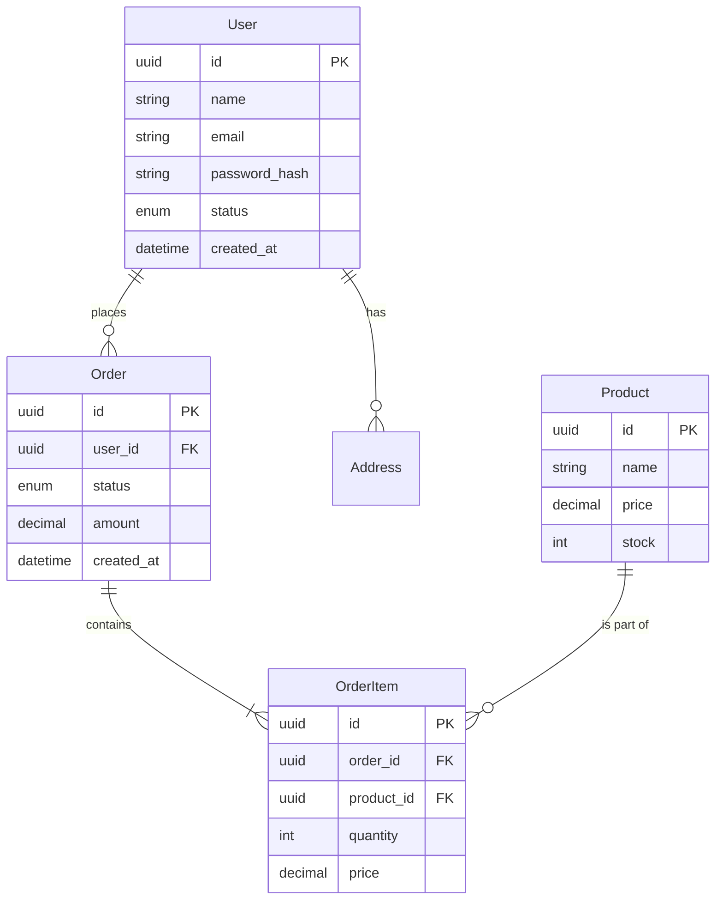
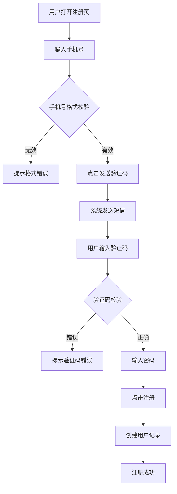
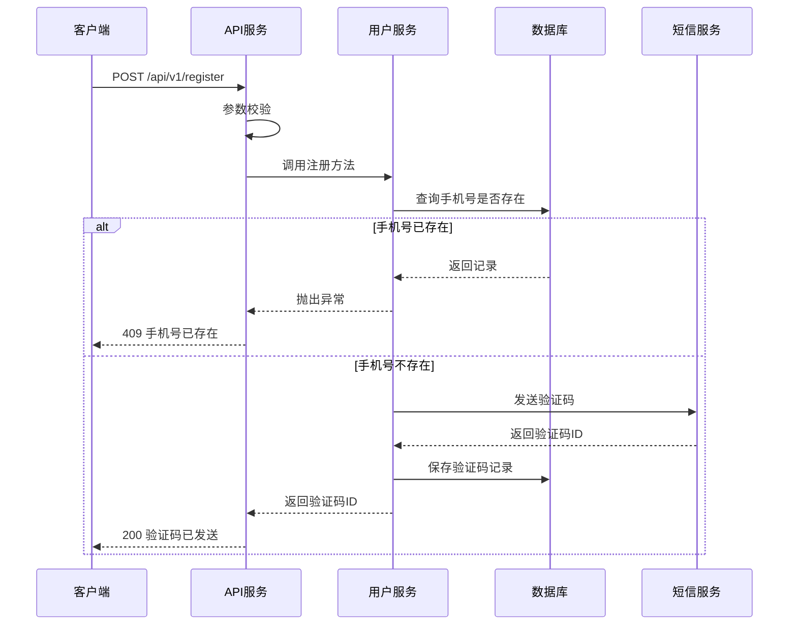
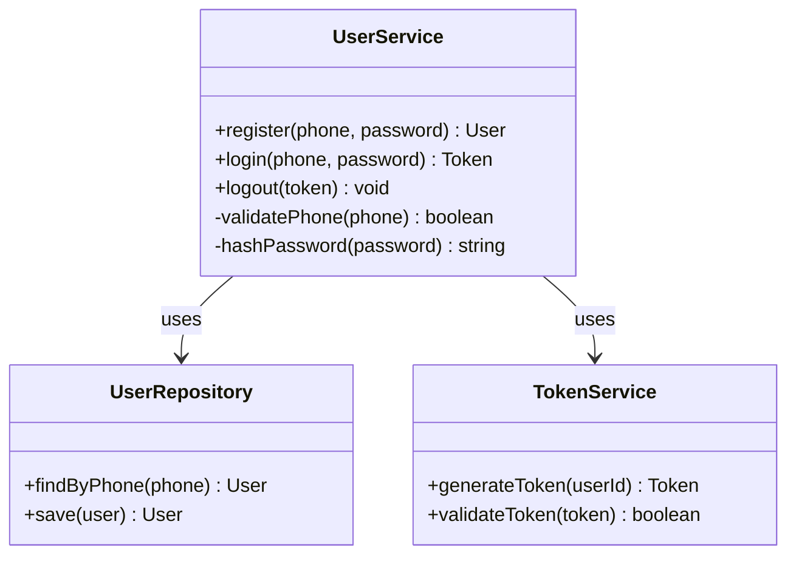
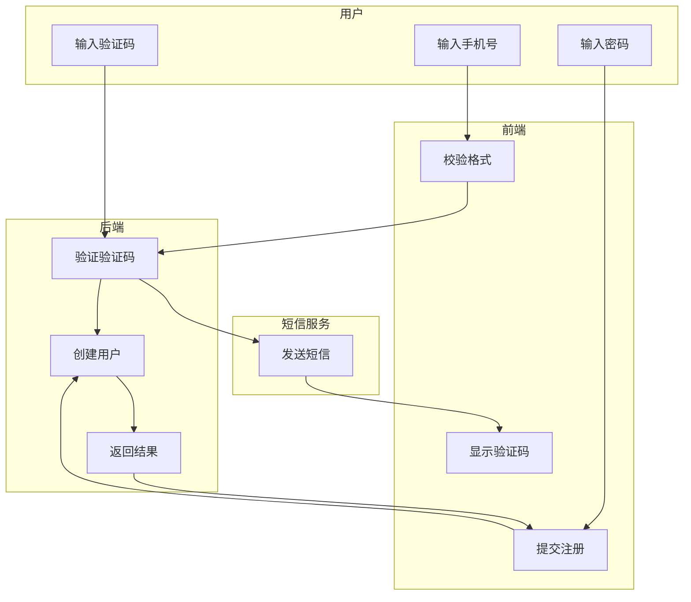

# 软件开发设计文档指南

## 目录

1. [什么是设计文档](#什么是设计文档)
2. [为什么需要设计文档](#为什么需要设计文档)
3. [设计文档生命周期](#设计文档生命周期)
4. [设计文档组成部分](#设计文档组成部分)
5. [常见问题与最佳实践](#常见问题与最佳实践)
6. [设计文档模板](#设计文档模板)

---

## 什么是设计文档

### 定义

**设计文档**（Design Document），也称为技术规范或实现手册，是描述如何解决特定问题的技术文档。

### 核心价值

设计文档是确保正确完成工作最有用的工具，其核心价值在于：
- **缜密思考**：强迫你对设计展开深入的思考
- **收集反馈**：通过评审收集他人的意见和建议
- **知识传承**：让后来者理解设计目的和思路
- **避免返工**：提前发现问题，减少编码时的返工

### 设计文档 ≠ 需求文档

| 维度 | 需求文档 | 设计文档 |
|------|----------|----------|
| 侧重点 | 做什么 | 怎么做 |
| 读者 | 产品、业务、开发 | 开发、测试、运维 |
| 内容 | 功能描述、用户故事 | 技术方案、架构设计 |
| 输出 | PRD、用户故事 | 技术方案、架构图、数据库设计 |

---

## 为什么需要设计文档

### 核心目的

1. **缜密思考**
   - 迫使你在编码前深入思考设计方案
   - 发现潜在的边界情况和问题
   - 考虑多种方案并选择最优解

2. **收集反馈**
   - 通过评审让他人理解你的设计
   - 收集不同的意见和建议
   - 优化和完善设计方案

3. **知识传承**
   - 让后来者快速理解设计思路
   - 降低交接成本
   - 避免知识流失

4. **提高效率**
   - 提前发现问题，避免返工
   - 统一团队对设计的理解
   - 减少沟通成本

### 常见误区

❌ **错误观念**：
- "设计文档没有用，是用来糊弄客户和管理层的"
- "用来写设计文档的时间，我的任务早就做完了"
- "项目紧张，没有时间做设计"

✅ **正确理解**：
- 小功能可能不需要，但复杂任务必须要有
- 设计文档能避免后期出现大量 BUG 和返工
- 每个团队应该根据任务周期合理约定文档内容

---

## 设计文档生命周期

### 1. 创建并快速迭代

**目标**：完善出第一版稳定的文档

**流程**：
1. 初始思考：梳理需求，初步构思方案
2. 快速迭代：通过反复思考完善设计
3. 内部评审：自我检查和初步完善

**产出**：设计文档 v0.1（初稿）

---

### 2. 评审（可能有多轮）

**目标**：收集反馈，完善文档

**流程**：
1. 第一轮评审：与同事讨论设计思路
2. 收集反馈：记录问题和建议
3. 修改完善：根据反馈调整设计
4. 多轮评审：重复直到达成共识

**产出**：设计文档 v1.0（评审通过）

---

### 3. 实现和迭代

**目标**：在编码过程中完善设计

**流程**：
1. 编码实现：按照设计文档开发
2. 发现问题：识别设计与实现的冲突
3. 调整设计：及时更新文档
4. 持续迭代：根据实际情况调整

**产出**：设计文档 v1.1、v1.2...（迭代更新）

---

### 4. 维护和学习

**目标**：保持文档与实际一致

**流程**：
1. 定期检查：验证文档与代码的一致性
2. 及时更新：业务变化时同步更新文档
3. 持续学习：从文档中学习设计思路

**产出**：持续维护的设计文档

---

## 设计文档组成部分

### 1. 概要

**目的**：提供任务的上下文信息

**内容**：
- **时间**：设计时间、预计上线时间
- **地点**：涉及的系统、服务、模块
- **人物**：作者、评审人、相关团队
- **背景**：为什么要做这个功能
- **方案**：采用的技术方案概述
- **备选方案**：考虑过的其他方案及选择原因

**示例**：
```markdown
## 概要

### 背景
当前用户注册流程需要支持手机号注册，以降低用户注册门槛。

### 方案
采用短信验证码 + 密码的方式实现手机号注册。

### 备选方案
1. OAuth 第三方登录（需要接入第三方服务）
2. 邮箱 + 手机号双重注册（开发周期较长）

选择方案 1 的原因：实现简单、用户体验好。
```

---

### 2. 表结构及其关系（E-R 图）

**目的**：描述数据存储方案

**内容**：
- 数据库表结构
- 表之间的关系（1:1、1:N、N:M）
- 字段说明（名称、类型、约束、索引）
- E-R 图（实体关系图）

**可视化方式**：

使用 Mermaid ER 图：



**表格形式**：

| 表名 | 字段名 | 类型 | 约束 | 说明 | 索引 |
|------|--------|------|------|------|------|
| users | id | uuid | PK | 用户ID | 主键 |
| users | email | string(255) | UNIQUE | 邮箱 | 索引 |
| users | password_hash | string(255) | NOT NULL | 密码哈希 | - |

---

### 3. 业务流程图、时序图

**目的**：描述业务操作的流程

**内容**：
- 按照人操作的维度
- 用户交互流程
- 系统间的交互

**示例**：用户注册流程



---

### 4. 程序流程图、时序图

**目的**：描述代码执行的流程

**内容**：
- 按照代码执行的维度
- 方法调用关系
- 数据流转

**示例**：用户注册代码执行流程



---

### 5. 接口约定

**目的**：定义对外公开的方法和 API

**内容**：
- API 端点
- 请求参数
- 响应格式
- 错误码

**示例**：

```markdown
### POST /api/v1/auth/send-sms

发送短信验证码。

**请求参数**：

| 参数名 | 类型 | 必填 | 说明 |
|--------|------|------|------|
| phone | string | 是 | 手机号（11位） |

**响应示例**：

```json
{
  "code": 200,
  "message": "验证码已发送",
  "data": {
    "code_id": "sms_code_123"
  }
}
```

**错误码**：

| 错误码 | 说明 |
|--------|------|
| 400 | 参数错误 |
| 429 | 发送过于频繁 |
| 500 | 短信服务异常 |
```

---

### 6. 其他

#### 伪代码

描述核心算法的逻辑：

```
算法：密码强度校验

输入：密码字符串
输出：布尔值（true/false）

1. 检查密码长度是否 >= 8
   如果否，返回 false

2. 检查是否包含至少一个大写字母
   如果否，返回 false

3. 检查是否包含至少一个数字
   如果否，返回 false

4. 检查是否包含至少一个特殊字符
   如果否，返回 false

5. 返回 true
```

#### 类图

描述类之间的关系：



#### 泳道流程图

描述不同角色的职责：



#### 性能分析

| 指标 | 目标值 | 优化方案 |
|------|--------|----------|
| 响应时间 | < 200ms | 使用缓存 |
| 并发数 | 1000 QPS | 数据库连接池 |
| 数据库查询 | < 50ms | 添加索引 |

#### 安全考虑

- **密码加密**：使用 bcrypt，成本因子 12
- **验证码有效期**：5 分钟
- **限流策略**：同一 IP 每分钟最多 3 次
- **SQL 注入防护**：使用参数化查询

#### 边界情况

| 场景 | 处理方式 |
|------|----------|
| 手机号格式错误 | 提示格式错误 |
| 验证码过期 | 提示验证码已过期 |
| 网络超时 | 重试 3 次 |
| 短信服务不可用 | 返回系统繁忙 |

---

### 7. 附注

**目的**：提供附加解释和引用资料

**内容**：
- 附加的解释和说明
- 参考文档链接
- 相关的技术资料

**示例**：
```markdown
## 附注

### 参考资料
- [bcrypt 算法说明](https://en.wikipedia.org/wiki/Bcrypt)
- [短信服务 API 文档](https://sms-provider.com/docs)

### 相关文档
- [用户认证系统设计](./user-auth-design.md)
- [数据库设计规范](./database-design-guidelines.md)
```

---

### 8. 评审情况

**目的**：记录评审过程和结论

**内容**：
- 评审时间
- 评审人员
- 评审意见
- 修改记录

**示例**：
```markdown
## 评审情况

### 第一轮评审
- **时间**：2024-02-19
- **评审人员**：张三、李四、王五
- **意见**：
  1. 建议增加验证码有效期说明
  2. 建议考虑短信服务降级方案
- **修改**：已全部采纳

### 第二轮评审
- **时间**：2024-02-20
- **评审人员**：张三、李四
- **意见**：无
- **结论**：评审通过，可以开始开发
```

---

## 常见问题与最佳实践

### 常见问题

| 问题 | 原因 | 解决方案 |
|------|------|----------|
| 文档工具不统一 | 缺乏规范 | 统一使用 Markdown |
| 过度拷贝需求文档 | 不理解设计文档目的 | 区分需求文档和设计文档 |
| 排版混乱 | 缺少模板 | 使用统一模板 |
| 图片质量差 | 缺少原始文件 | 使用支持导出的工具 |
| 缺少版本管理 | 没有使用版本控制 | 使用 Git 管理文档 |
| 表结构不统一 | 缺少规范 | 统一字段命名和类型 |
| 流程图太简单 | 缺少细节 | 补充核心算法和关键点 |
| 缺少安全考虑 | 评审不严 | 增加 security 评审 |

---

### 最佳实践

#### ✅ 文档撰写

1. **明确读者**
   - 内部开发者？伙伴实施人员？外部开发者？
   - 根据读者调整内容深度和术语

2. **设计先行**
   - 设计文档应在编码之前撰写
   - 避免先编码后补充文档

3. **一图胜千言**
   - 尽可能使用图表表达设计思路
   - 流程图、时序图、ER 图

4. **统一工具**
   - 绘图工具：推荐 Mermaid、Draw.io
   - 文档工具：推荐 Markdown
   - 版本管理：Git

5. **统一模板**
   - 使用统一的文档模板
   - 确保排版一致

#### ✅ 文档维护

1. **版本迭代**
   - 功能变化时及时更新文档
   - 记录版本变更历史

2. **定期检查**
   - 验证文档与代码的一致性
   - 移除过时的内容

3. **知识传承**
   - 设计文档应成为学习的资料
   - 鼓励新人阅读设计文档

#### ✅ 评审流程

1. **多轮评审**
   - 初稿评审：收集初步意见
   - 详细评审：深入讨论设计
   - 最终评审：确认方案

2. **记录意见**
   - 详细记录评审意见
   - 说明是否采纳及原因

3. **严格把关**
   - 安全、性能、边界情况
   - 避免评审流于形式

---

## 设计文档模板

### 完整模板

```markdown
# [功能名称] 设计文档

## 版本信息
- **版本**：v1.0
- **作者**：[姓名]
- **创建时间**：2024-02-19
- **最后更新**：2024-02-19
- **状态**：[草稿/评审中/已评审/已废弃]

---

## 目录
- [概要](#概要)
- [表结构设计](#表结构设计)
- [业务流程](#业务流程)
- [程序流程](#程序流程)
- [接口约定](#接口约定)
- [其他](#其他)
- [附注](#附注)
- [评审情况](#评审情况)

---

## 概要

### 背景
[为什么要做这个功能]

### 目标
[希望达到的目标]

### 方案概述
[采用的技术方案概述]

### 备选方案
1. [方案 1]：[说明]
2. [方案 2]：[说明]

**选择原因**：[为什么选择当前方案]

---

## 表结构设计

### ER 图

```mermaid
erDiagram
    [ER 图]
```

### 表结构

| 表名 | 字段名 | 类型 | 约束 | 说明 | 索引 |
|------|--------|------|------|------|------|
| | | | | | |

---

## 业务流程

### 流程图

```mermaid
flowchart TD
    [业务流程]
```

### 流程说明
1. [步骤 1]
2. [步骤 2]

---

## 程序流程

### 时序图

```mermaid
sequenceDiagram
    [程序流程]
```

### 核心算法
[伪代码或算法说明]

---

## 接口约定

### API 列表

| 接口名称 | 方法 | 路径 | 说明 |
|----------|------|------|------|
| | | | |

### 详细接口文档

#### POST /api/v1/xxx

[接口详细说明]

---

## 其他

### 类图

```mermaid
classDiagram
    [类图]
```

### 性能分析

| 指标 | 目标值 | 优化方案 |
|------|--------|----------|
| | | |

### 安全考虑

[安全措施说明]

### 边界情况

| 场景 | 处理方式 |
|------|----------|
| | |

---

## 附注

### 参考资料
- [参考资料 1](链接)
- [参考资料 2](链接)

### 相关文档
- [相关文档 1](链接)
- [相关文档 2](链接)

---

## 评审情况

### 评审记录

| 轮次 | 时间 | 评审人员 | 意见 | 修改 |
|------|------|----------|------|------|
| | | | | |

### 评审结论
[评审结论]
```

---

**最后更新**：2024-02-19
