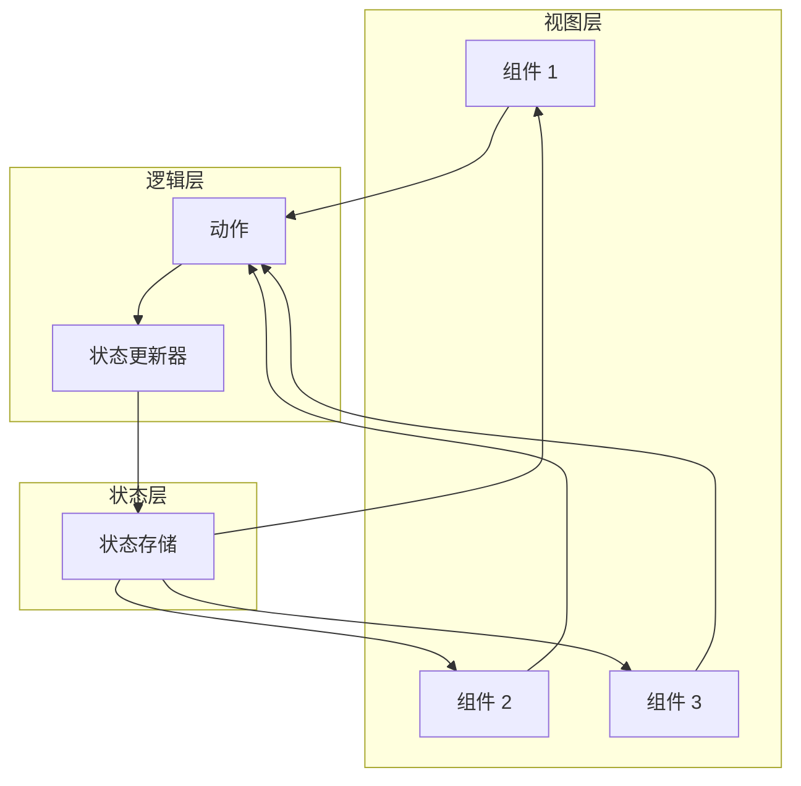
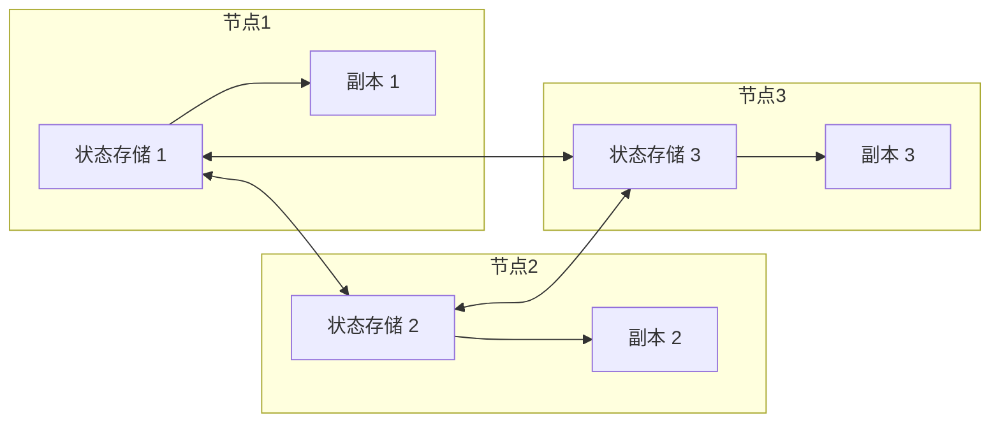
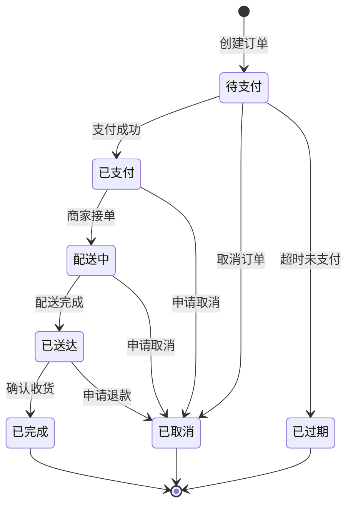

# 状态管理指南

## 目录

- [概述](#概述)
- [状态管理模式](#状态管理模式)
- [状态机设计](#状态机设计)
- [状态一致性](#状态一致性)
- [状态持久化](#状态持久化)
- [最佳实践](#最佳实践)

---

## 概述

状态管理是系统设计的核心，决定了系统的可靠性和可维护性。

### 核心原则

1. **单一数据源**：每个状态应该有唯一的数据源
2. **不可变性**：状态更新应该是不可变的
3. **可预测性**：状态变更应该是可预测的
4. **可追溯性**：状态变更应该可追溯
5. **可回滚性**：状态变更应该可回滚

### 为什么重要

- **数据一致性**：良好的状态管理保证数据一致性
- **问题排查**：清晰的状态管理便于排查问题
- **系统扩展**：良好的状态管理便于系统扩展
- **用户体验**：合理的状态管理提升用户体验

---

## 状态管理模式

### 1. 集中式状态管理（推荐）

**描述**：所有状态集中管理，通过统一接口更新

**特点**：
- 状态统一管理
- 更新路径清晰
- 易于追踪和调试

**适用场景**：
- 中小型应用
- 需要状态共享的场景
- React/Vue 应用

**示例架构**：


**代码示例（Redux 风格）**：
```python
# 状态定义
class State:
    def __init__(self):
        self.user = None
        self.orders = []
        self.loading = False
        self.error = None

# 状态存储
class Store:
    def __init__(self):
        self.state = State()
        self.subscribers = []
    
    def dispatch(self, action):
        # 更新状态
        new_state = reducer(self.state, action)
        self.state = new_state
        
        # 通知订阅者
        for subscriber in self.subscribers:
            subscriber(self.state)

# 订阅状态变化
def subscriber(state):
    print(f"State updated: {state}")

store.subscribers.append(subscriber)

# 更新状态
store.dispatch({"type": "SET_USER", "payload": {"id": 1, "name": "张三"}})
```

**优点**：
- 状态管理集中
- 更新路径清晰
- 易于调试和测试

**缺点**：
- 大型应用可能性能问题
- 学习曲线较高

---

### 2. 分布式状态管理

**描述**：状态分散在多个节点，通过网络同步

**特点**：
- 状态分散存储
- 网络通信开销
- 一致性挑战

**适用场景**：
- 微服务架构
- 分布式系统
- 高并发场景

**示例架构**：


**实现方式**：
- Raft 协议
- Paxos 协议
- Gossip 协议

**优点**：
- 可扩展性强
- 高可用性
- 容错性好

**缺点**：
- 实现复杂
- 一致性挑战
- 网络开销大

---

### 3. 本地状态管理

**描述**：状态存储在本地，不共享

**特点**：
- 无共享状态
- 简单直接
- 难以同步

**适用场景**：
- 无状态应用
- 简单工具
- 离线应用

**示例**：
```python
# 本地状态
class LocalState:
    def __init__(self):
        self.user = None
        self.preferences = {}
    
    def set_user(self, user):
        self.user = user
    
    def set_preference(self, key, value):
        self.preferences[key] = value
```

**优点**：
- 实现简单
- 无同步开销
- 性能好

**缺点**：
- 不支持状态共享
- 难以追踪
- 一致性差

---

## 状态机设计

### 状态机定义

**核心概念**：
- **状态（State）**：系统在特定时间点的条件
- **事件（Event）**：触发状态转换的条件
- **转换（Transition）**：从一个状态到另一个状态
- **动作（Action）**：状态转换时执行的操作

### 状态机设计步骤

1. **识别状态**：列出系统所有可能的状态
2. **定义事件**：列出触发状态转换的事件
3. **设计转换**：定义状态之间的转换规则
4. **定义动作**：定义状态转换时执行的操作
5. **验证设计**：验证状态机的完整性和正确性

### 状态机示例：订单状态



**代码实现**：
```python
from enum import Enum, auto
from dataclasses import dataclass

# 状态定义
class OrderState(Enum):
    PENDING = auto()      # 待支付
    PAID = auto()         # 已支付
    SHIPPING = auto()     # 配送中
    DELIVERED = auto()    # 已送达
    COMPLETED = auto()    # 已完成
    CANCELLED = auto()    # 已取消
    EXPIRED = auto()      # 已过期

# 事件定义
class OrderEvent(Enum):
    CREATE = auto()       # 创建订单
    PAY = auto()          # 支付
    ACCEPT = auto()       # 商家接单
    DELIVER = auto()      # 配送完成
    CONFIRM = auto()      # 确认收货
    CANCEL = auto()       # 取消订单
    TIMEOUT = auto()      # 超时

# 状态机
class OrderStateMachine:
    def __init__(self):
        self.state = OrderState.PENDING
        self.transitions = {
            OrderState.PENDING: {
                OrderEvent.PAY: OrderState.PAID,
                OrderEvent.CANCEL: OrderState.CANCELLED,
                OrderEvent.TIMEOUT: OrderState.EXPIRED,
            },
            OrderState.PAID: {
                OrderEvent.ACCEPT: OrderState.SHIPPING,
                OrderEvent.CANCEL: OrderState.CANCELLED,
            },
            OrderState.SHIPPING: {
                OrderEvent.DELIVER: OrderState.DELIVERED,
                OrderEvent.CANCEL: OrderState.CANCELLED,
            },
            OrderState.DELIVERED: {
                OrderEvent.CONFIRM: OrderState.COMPLETED,
                OrderEvent.CANCEL: OrderState.CANCELLED,
            },
        }
    
    def transition(self, event):
        if self.state in self.transitions:
            if event in self.transitions[self.state]:
                old_state = self.state
                self.state = self.transitions[self.state][event]
                print(f"状态转换: {old_state.name} -> {self.state.name}")
                return True
        raise InvalidTransitionError(f"无效的转换: {self.state.name} -> {event.name}")

# 使用示例
sm = OrderStateMachine()
sm.transition(OrderEvent.PAY)      # 待支付 -> 已支付
sm.transition(OrderEvent.ACCEPT)   # 已支付 -> 配送中
sm.transition(OrderEvent.DELIVER)  # 配送中 -> 已送达
sm.transition(OrderEvent.CONFIRM)  # 已送达 -> 已完成
```

---

## 状态一致性

### 1. 强一致性

**描述**：所有节点同时看到相同的状态

**实现方式**：
- 两阶段提交（2PC）
- 三阶段提交（3PC）
- Paxos 算法

**示例**：
```python
# 两阶段提交
def two_phase_commit(transaction):
    participants = transaction.participants
    
    # 阶段 1：准备
    for participant in participants:
        if not participant.prepare(transaction):
            # 阶段 2：回滚
            for p in participants:
                p.rollback(transaction)
            return False
    
    # 阶段 2：提交
    for participant in participants:
        participant.commit(transaction)
    
    return True
```

**优点**：
- 数据一致性保证
- 实现相对简单

**缺点**：
- 性能开销大
- 可能阻塞
- 容易产生死锁

---

### 2. 最终一致性

**描述**：系统最终会达到一致状态，但中间可能不一致

**实现方式**：
- 事件溯源
- CQRS
- 消息队列

**示例**：
```python
# 事件溯源
class EventSourcingStore:
    def __init__(self):
        self.events = []
    
    def append(self, event):
        self.events.append(event)
    
    def rebuild_state(self):
        state = {}
        for event in self.events:
            state = apply_event(state, event)
        return state
```

**优点**：
- 性能好
- 可扩展性强
- 支持审计和回滚

**缺点**：
- 最终一致可能延迟
- 实现复杂
- 需要处理事件顺序

---

### 3. 乐观锁

**描述**：假设不会发生冲突，提交时检查冲突

**实现方式**：
- 版本号
- 时间戳
- CAS（Compare And Swap）

**示例**：
```python
# 乐观锁
def update_with_optimistic_lock(record_id, new_data, expected_version):
    # 读取当前记录
    record = db.get_record(record_id)
    
    # 检查版本
    if record.version != expected_version:
        raise ConcurrentModificationError("记录已被修改")
    
    # 更新记录
    new_version = expected_version + 1
    db.update_record(record_id, new_data, new_version)
```

**优点**：
- 性能好
- 无死锁
- 适合读多写少

**缺点**：
- 冲突时需要重试
- 不适合写多场景

---

### 4. 悲观锁

**描述**：假设会发生冲突，操作时加锁

**实现方式**：
- 行锁
- 表锁
- 分布式锁

**示例**：
```python
# 悲观锁
def update_with_pessimistic_lock(record_id, new_data):
    # 获取锁
    lock = distributed_lock.acquire(f"record:{record_id}")
    
    try:
        # 读取记录
        record = db.get_record(record_id)
        
        # 更新记录
        db.update_record(record_id, new_data)
    finally:
        # 释放锁
        lock.release()
```

**优点**：
- 保证一致性
- 实现简单
- 适合写多场景

**缺点**：
- 性能差
- 可能死锁
- 不适合高并发

---

## 状态持久化

### 1. 数据库持久化

**描述**：将状态保存到数据库

**实现方式**：
- 关系型数据库
- NoSQL 数据库
- 时序数据库

**示例**：
```python
# 数据库持久化
def save_state(state_id, state):
    db.execute(
        "INSERT INTO states (id, data, version, created_at) VALUES (?, ?, ?, ?)",
        state_id, json.dumps(state), state.version, datetime.now()
    )

def load_state(state_id):
    row = db.execute("SELECT data, version FROM states WHERE id = ?", state_id)
    return json.loads(row['data']), row['version']
```

---

### 2. 缓存持久化

**描述**：将状态保存到缓存

**实现方式**：
- Redis
- Memcached
- 本地缓存

**示例**：
```python
# Redis 持久化
def save_state_to_redis(state_id, state, ttl=3600):
    redis.setex(f"state:{state_id}", ttl, json.dumps(state))

def load_state_from_redis(state_id):
    data = redis.get(f"state:{state_id}")
    if data:
        return json.loads(data)
    return None
```

---

### 3. 事件溯源（Event Sourcing）

**描述**：保存状态变更事件，而非最终状态

**实现方式**：
- 事件存储
- 事件重放
- 快照

**示例**：
```python
# 事件溯源
class EventSourcingStore:
    def __init__(self):
        self.events = []
    
    def append_event(self, event):
        self.events.append(event)
    
    def get_events(self, aggregate_id):
        return [e for e in self.events if e.aggregate_id == aggregate_id]
    
    def replay_events(self, aggregate_id):
        events = self.get_events(aggregate_id)
        state = {}
        for event in events:
            state = apply_event(state, event)
        return state

# 使用示例
store = EventSourcingStore()
store.append_event(UserCreatedEvent(user_id=1, name="张三"))
store.append_event(UserUpdatedEvent(user_id=1, age=25))

# 重放事件重建状态
state = store.replay_events(user_id=1)
```

---

### 4. CQRS（Command Query Responsibility Segregation）

**描述**：命令和查询分离

**实现方式**：
- 写模型（Command Model）
- 读模型（Query Model）
- 事件同步

**示例**：
```python
# CQRS
class CommandModel:
    def __init__(self):
        self.events = []
    
    def handle_command(self, command):
        # 执行命令
        event = execute_command(command)
        
        # 保存事件
        self.events.append(event)
        
        return event

class QueryModel:
    def __init__(self):
        self.projections = {}
    
    def handle_event(self, event):
        # 更新读模型
        projection = update_projection(event)
        self.projections[event.aggregate_id] = projection
    
    def query(self, query):
        return execute_query(query, self.projections)
```

---

## 最佳实践

### 1. 单一数据源

**原则**：每个状态应该有唯一的数据源

**示例**：
```python
# ✅ 好的做法：单一数据源
class OrderService:
    def __init__(self):
        self.order_db = OrderDatabase()  # 唯一数据源
    
    def update_order(self, order_id, data):
        # 只从数据库读取和更新
        order = self.order_db.get_order(order_id)
        order.update(data)
        self.order_db.save_order(order)

# ❌ 不好的做法：多个数据源
class OrderService:
    def __init__(self):
        self.order_db = OrderDatabase()
        self.order_cache = OrderCache()  # 缓存不是数据源
    
    def update_order(self, order_id, data):
        # 可能从缓存读取（错误）
        order = self.order_cache.get_order(order_id) or self.order_db.get_order(order_id)
        order.update(data)
        # 更新缓存和数据库（可能导致不一致）
        self.order_cache.save_order(order)
        self.order_db.save_order(order)
```

---

### 2. 不可变状态

**原则**：状态更新应该是不可变的

**示例**：
```python
# ✅ 好的做法：不可变更新
def update_state(state, new_data):
    # 创建新状态对象
    new_state = state.copy()
    new_state.update(new_data)
    return new_state

# ❌ 不好的做法：可变更新
def update_state(state, new_data):
    # 直接修改原状态
    state.update(new_data)
    return state
```

---

### 3. 事件驱动

**原则**：通过事件驱动状态变更

**示例**：
```python
# 事件驱动
class EventBus:
    def __init__(self):
        self.handlers = {}
    
    def subscribe(self, event_type, handler):
        if event_type not in self.handlers:
            self.handlers[event_type] = []
        self.handlers[event_type].append(handler)
    
    def publish(self, event):
        if event.type in self.handlers:
            for handler in self.handlers[event.type]:
                handler(event)

# 使用
event_bus = EventBus()

def handle_user_updated(event):
    print(f"用户已更新: {event.user_id}")

event_bus.subscribe(UserUpdatedEvent, handle_user_updated)
event_bus.publish(UserUpdatedEvent(user_id=1))
```

---

### 4. 快照机制

**原则**：定期保存状态快照，减少重放开销

**示例**：
```python
# 快照机制
class SnapshotManager:
    def __init__(self):
        self.snapshots = {}
    
    def save_snapshot(self, aggregate_id, state):
        self.snapshots[aggregate_id] = {
            'state': state,
            'version': state.version,
            'timestamp': datetime.now()
        }
    
    def get_snapshot(self, aggregate_id):
        return self.snapshots.get(aggregate_id)

# 使用
manager = SnapshotManager()
manager.save_snapshot(user_id, current_state)

# 从快照和事件重建状态
snapshot = manager.get_snapshot(user_id)
events = get_events_after_version(user_id, snapshot['version'])
state = replay_from_snapshot(snapshot['state'], events)
```

---

### 5. 状态监控

**原则**：监控状态变化，及时发现问题

**示例**：
```python
# 状态监控
class StateMonitor:
    def __init__(self):
        self.metrics = {}
    
    def record_state_change(self, entity_id, old_state, new_state):
        key = f"{entity_id}:{old_state}->{new_state}"
        if key not in self.metrics:
            self.metrics[key] = 0
        self.metrics[key] += 1
    
    def get_metrics(self):
        return self.metrics

# 使用
monitor = StateMonitor()
monitor.record_state_change("order:1", "pending", "paid")
monitor.record_state_change("order:1", "paid", "shipping")
```

---

## 参考资料

- [Data Flow Guide](data-flow-guide.md)
- [Requirement Doc Guide](requirement-doc-guide.md)
- [Architecture Doc Guide](architecture-doc-guide.md)
- [State Machine Template](../templates/state-machine-template.md)
