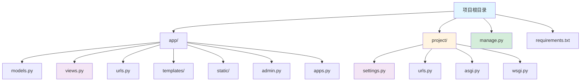

# Django 框架指南

[🔙 返回框架索引](./index.md)

## 框架概述

Django 是一个高级 Python Web 框架，遵循"约定优于配置"的原则，提供了一套完整的开发工具。Django 内置 ORM、认证、管理后台等功能，适合快速开发企业级应用。它是目前最成熟的 Python Web 框架之一。

## 项目结构识别

### 关键文件/目录

| 文件/目录 | 说明 | 识别标记 |
|-----------|------|----------|
| `manage.py` | Django 命令行工具 | 框架识别 |
| `requirements.txt` | 包含 `Django` 依赖 | 框架识别 |
| `settings.py` / `asgi.py` | 项目配置文件 | 配置识别 |
| `urls.py` | URL 路由配置 | 路由识别 |
| `models.py` | 数据模型定义 | 模型识别 |
| `views.py` | 视图函数 | 视图识别 |
| `templates/` | 模板目录 | 模板识别 |

### 典型项目结构

**目录说明**：
- `manage.py` - Django 命令行工具
- `project/` - 项目配置目录
- `app/` - 应用目录
- `models.py` - 数据模型（ORM）
- `views.py` - 视图函数（控制器）
- `urls.py` - URL 路由配置
- `templates/` - HTML 模板
- `static/` - 静态资源
- `admin.py` - 管理后台配置
- `settings.py` - 项目设置
- `asgi.py` / `wsgi.py` - 应用服务器入口

## 版本兼容性说明

### 推荐版本
- Django 版本：≥ 4.2
- Python 版本：≥ 3.8
- 推荐数据库：PostgreSQL ≥ 12

### 已知不兼容场景
- Django 4.x 不支持 Python 3.7 及以下
- 某些第三方插件在 Django 4.x 中需要升级
- 模板语法在 Django 3.x 和 4.x 有小幅变化

### 迁移注意事项
- Django 版本升级需要运行迁移脚本
- 中间件配置在 Django 3.2+ 有 breaking changes
- 模板引擎配置需要更新为 TEMPLATES 设置

## 文档生成要点

### README 生成

**必选内容**：
- 项目名称和简介
- 快速开始指南
  - 安装依赖：`pip install -r requirements.txt`
  - 数据库迁移：`python manage.py migrate`
  - 创建超级用户：`python manage.py createsuperuser`
  - 启动服务：`python manage.py runserver`
- Django 版本要求
- 主要依赖列表
- 环境变量配置说明

**可选内容**：
- 项目结构说明
- 应用列表说明
- 开发脚本说明
- 部署说明（uWSGI/Gunicorn + Nginx）

### API 文档生成

**必选内容**：
- URL 路由列表（从 urls.py 提取）
- 视图函数说明
- 请求参数说明
- 响应格式说明
- 认证方式说明

**可选内容**：
- 数据模型（Models）说明
- API 序列化器（Serializers）说明
- 权限控制说明
- 错误码说明

### 架构文档生成

**必选内容**：
- 应用列表和职责
- 数据模型关系图
- URL 路由设计
- 视图函数职责

**可选内容**：
- 中间件（Middleware）说明
- 上下文处理器（Context Processors）说明
- 模板继承关系
- 静态文件组织
