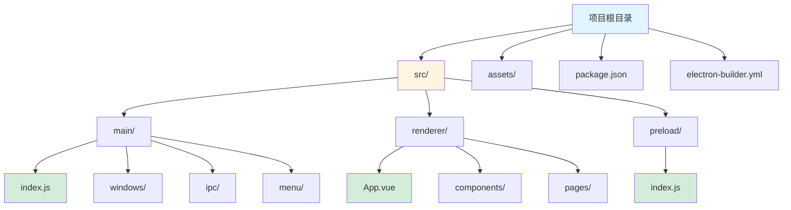
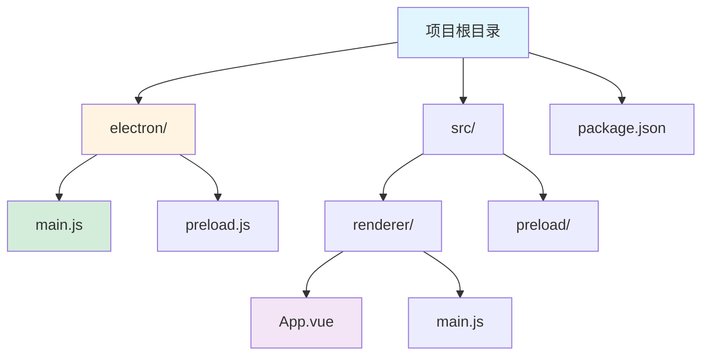

# Electron 框架指南

[🔙 返回框架索引](./index.md)

## 框架概述

Electron 是由 GitHub 开发的跨平台桌面应用框架，使用 HTML、CSS 和 JavaScript 构建桌面应用。Electron 将 Chromium 和 Node.js 集成在同一个运行时环境中，支持 Windows、macOS 和 Linux 平台。它是目前最流行的跨平台桌面应用开发框架之一。

## 项目结构识别

### 关键文件/目录

| 文件/目录 | 说明 | 识别标记 |
|-----------|------|----------|
| `package.json` | 包含 `electron` 依赖 | 框架识别 |
| `main.js` / `main.ts` | 主进程入口 | 主进程识别 |
| `preload.js` / `preload.ts` | 预加载脚本 | 预加载识别 |
| `src/` | 源代码目录 | 源码目录 |
| `renderer/` | 渲染进程代码 | 渲染进程识别 |
| `assets/` | 静态资源 | 资源识别 |
| `electron-builder.yml` | 打包配置 | 打包配置识别 |

### 典型项目结构

**标准 Electron 项目**：

**Electron + Vue 项目**：

**目录说明**：
- `src/main/` / `electron/` - 主进程代码
- `src/renderer/` - 渲染进程代码（前端应用）
- `src/preload/` - 预加载脚本
- `main.js` / `index.js` - 主进程入口
- `preload.js` - 预加载脚本入口
- `App.vue` - 根组件（渲染进程）
- `package.json` - 项目配置
- `electron-builder.yml` - 打包配置
- `assets/` - 静态资源（图标、图片等）

## 版本兼容性说明

### 推荐版本
- Electron 版本：≥ 22.0
- Node.js 版本：与 Electron 内置版本一致（通过 `electron -v` 查看）
- npm 版本：≥ 8.0
- 推荐打包工具：electron-builder

### 已知不兼容场景
- Electron 版本与 Node.js 版本必须匹配
- 某些原生模块（Native Module）在不同 Electron 版本需要重新编译
- Context Isolation（上下文隔离）在 Electron 12+ 默认启用
- Node.js 集成在 Electron 5+ 默认禁用

### 迁移注意事项
- 升级 Electron 版本需要重新编译原生模块
- Context Isolation 和 Node.js 集成配置需要检查
- 渲染进程中的 `remote` 模块在 Electron 14+ 已废弃
- 安全配置（`webPreferences`）需要更新

## 文档生成要点

### README 生成

**必选内容**：
- 项目名称和简介
- 快速开始指南
  - 安装依赖：`npm install`
  - 启动开发模式：`npm run dev` / `npm run electron:dev`
- Electron 版本要求
- Node.js 版本要求
- 主要依赖列表
- 打包命令（`npm run build` / `npm run package`）
- 支持的平台

**可选内容**：
- 项目结构说明
- 主进程和渲染进程说明
- 预加载脚本说明
- 开发工具配置（DevTools）
- 环境变量配置说明
- 调试说明

### API 文档生成

**必选内容**：
- 主进程 API 说明
- 渲染进程 API 说明
- IPC（进程间通信）消息列表
  - 主进程 → 渲染进程
  - 渲染进程 → 主进程
- 预加载 API 说明

**可选内容**：
- 窗口管理 API 说明
- 系统托盘（Tray）API 说明
- 原生菜单（Menu）API 说明
- 文件系统操作说明

### 架构文档生成

**必选内容**：
- 进程架构说明
  - 主进程职责
  - 渲染进程职责
  - 预加载脚本职责
- IPC 通信设计
- 窗口管理设计

**可选内容**：
- 安全配置说明
- 自动更新方案
- 打包配置说明
- 多窗口架构说明
