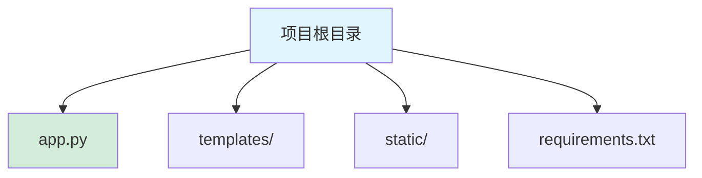
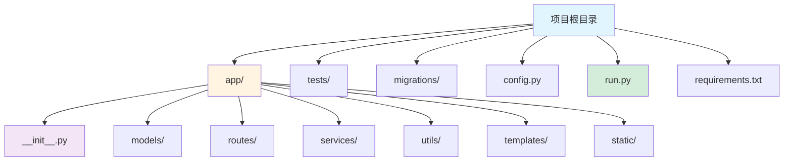

# Flask 框架指南

[🔙 返回框架索引](./index.md)

## 框架概述

Flask 是一个轻量级 Python Web 框架，以其简洁性和灵活性著称。Flask 只提供核心功能（路由、模板引擎、WSGI），其他功能通过扩展插件实现。Flask 适合快速构建 RESTful API 和小型 Web 应用。

## 项目结构识别

### 关键文件/目录

| 文件/目录 | 说明 | 识别标记 |
|-----------|------|----------|
| `app.py` / `run.py` | 应用主文件 | 框架识别 |
| `requirements.txt` | 包含 `Flask` 依赖 | 框架识别 |
| `templates/` | 模板目录 | 模板识别 |
| `static/` | 静态资源目录 | 资源识别 |
| `routes.py` / `views.py` | 路由定义 | 路由识别 |

### 典型项目结构

**简单项目结构**：

**标准项目结构**：

**目录说明**：
- `app/` - 应用核心目录
- `app/__init__.py` - Flask 应用工厂
- `app/models/` - 数据模型（如 SQLAlchemy）
- `app/routes/` - 路由定义
- `app/services/` - 业务逻辑
- `app/utils/` - 工具函数
- `templates/` - HTML 模板
- `static/` - 静态资源
- `tests/` - 测试代码
- `config.py` - 配置文件
- `run.py` - 启动脚本

## 版本兼容性说明

### 推荐版本
- Flask 版本：≥ 3.0
- Python 版本：≥ 3.8
- 推荐扩展：
  - Flask-SQLAlchemy ≥ 3.0
  - Flask-Migrate ≥ 4.0
  - Flask-RESTful / Flask-RESTX

### 已知不兼容场景
- Flask 3.0 不支持 Python 3.7 及以下
- 某些扩展在 Flask 3.0 中需要升级
- 上下文处理器行为在 Flask 3.0 中有变化

### 迁移注意事项
- Flask 版本升级需要更新相关扩展
- 应用工厂模式需要确保全局对象正确初始化
- 蓝图（Blueprint）配置需要检查

## 文档生成要点

### README 生成

**必选内容**：
- 项目名称和简介
- 快速开始指南
  - 安装依赖：`pip install -r requirements.txt`
  - 启动服务：`python run.py` / `flask run`
- Flask 版本要求
- 主要依赖列表
- 环境变量配置说明

**可选内容**：
- 项目结构说明
- 蓝图（Blueprint）说明
- 开发脚本说明
- 部署说明（Gunicorn + Nginx）

### API 文档生成

**必选内容**：
- URL 路由列表（从 routes.py 提取）
- 请求参数说明
- 响应格式说明
- 认证方式说明

**可选内容**：
- 数据模型说明
- 请求验证规则
- 错误码说明
- 示例请求和响应

### 架构文档生成

**必选内容**：
- 蓝图列表和职责
- 路由设计
- 请求/响应流程

**可选内容**：
- 中间件说明
- 上下文处理器说明
- 数据库迁移说明
- 测试策略说明
