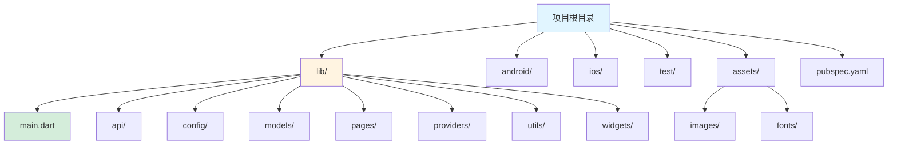
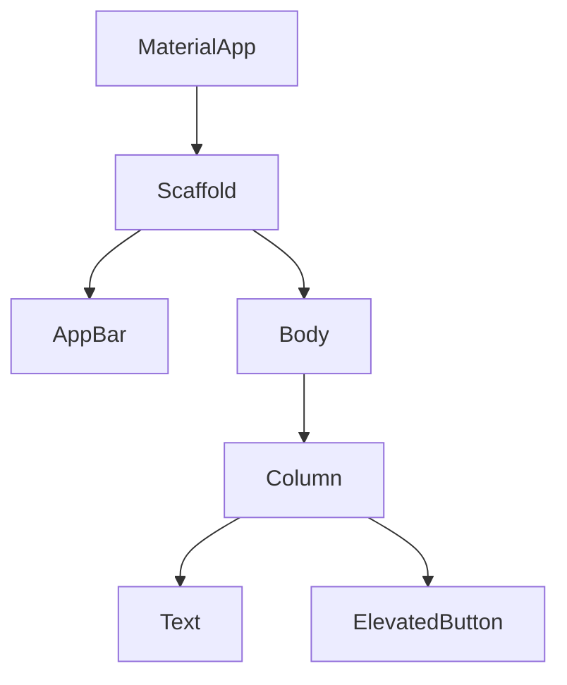
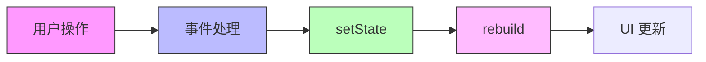

# Flutter 框架指南

[🔙 返回框架索引](./index.md)

## 框架概述

Flutter 是 Google 的跨平台 UI 工具包，使用 Dart 语言编写，可以从单一代码库编译为移动应用、Web 和桌面应用。

## 项目结构识别

### 关键文件/目录

| 文件/目录 | 说明 | 识别标记 |
|-----------|------|----------|
| `pubspec.yaml` | Flutter 项目配置文件 | 框架识别 |
| `lib/` | Dart 源代码目录 | 源代码目录 |
| `lib/main.dart` | 应用入口文件 | 入口文件 |
| `android/` | Android 平台代码 | 平台目录 |
| `ios/` | iOS 平台代码 | 平台目录 |
| `web/` | Web 平台代码 | 平台目录 |
| `assets/` | 资源文件目录 | 资源目录 |
| `test/` | 测试文件目录 | 测试目录 |

### 典型项目结构

```
my-flutter-app/
├── lib/                     # Dart 源代码
│   ├── main.dart            # 应用入口
│   ├── api/                # 网络请求
│   ├── config/             # 配置
│   ├── models/             # 数据模型
│   ├── pages/              # 页面
│   ├── providers/          # 状态管理
│   ├── utils/              # 工具类
│   └── widgets/            # 自定义组件
├── android/                  # Android 平台配置
├── ios/                     # iOS 平台配置
├── test/                     # 测试文件
├── assets/                   # 资源文件
│   ├── images/
│   └── fonts/
├── pubspec.yaml              # 项目配置
└── README.md
```



## 版本兼容性说明

### 推荐版本
- Flutter SDK：≥ 3.10
- Dart 版本：≥ 3.0
- Android Gradle Plugin：≥ 8.0
- Xcode（iOS）：≥ 15.0

### 已知不兼容场景
- Flutter 3.7 及以下版本不支持 Dart 3.0
- 某些插件可能不支持最新的 Flutter 版本
- iOS 构建需要 macOS 和 Xcode

### 迁移注意事项
- 从 Flutter 2.x 迁移到 3.x 需要更新项目配置
- 空安全（null safety）是 Flutter 2.12+ 的强制要求
- 升级 Flutter SDK 后需要运行 `flutter pub get` 更新依赖

## 文档生成要点

### 1. README 生成

**必选内容**：
- Flutter SDK 环境要求
- Dart SDK 要求
- 安装步骤：
  - 安装 Flutter SDK
  - 配置环境变量
  - 运行 `flutter doctor` 检查环境
  - 运行 `flutter create my_app` 创建项目
  - 运行 `flutter run` 启动应用
- 开发命令说明（`flutter run`, `flutter run -d chrome`）
- 构建命令说明（`flutter build apk`, `flutter build ios`）
- 热重载说明（按 `r` 热重载，`R` 热重启）

**框架特性说明**：
- 跨平台（Android/iOS/Web/Windows/Linux/macOS）
- Widget 系统
- 热重载和热重启
- 响应式编程
- 原生性能

### 2. Widget 文档生成

Flutter 应用由 Widget 树构建。

**Widget 类型**：

```dart
import 'package:flutter/material.dart';

// StatelessWidget（无状态 Widget）
class MyTextWidget extends StatelessWidget {
  final String text;
  
  const MyTextWidget({Key? key, required this.text}) : super(key: key);
  
  @override
  Widget build(BuildContext context) {
    return Text(text);
  }
}

// StatefulWidget（有状态 Widget）
class CounterWidget extends StatefulWidget {
  @override
  _CounterWidgetState createState() => _CounterWidgetState();
}

class _CounterWidgetState extends State<CounterWidget> {
  int _counter = 0;
  
  void _increment() {
    setState(() {
      _counter++;
    });
  }
  
  @override
  Widget build(BuildContext context) {
    return Column(
      children: [
        Text('Count: $_counter'),
        ElevatedButton(
          onPressed: _increment,
          child: Text('Increment'),
        ),
      ],
    );
  }
}
```

**Widget 文档应包含**：
- Widget 名称和功能
- 是 StatelessWidget 还是 StatefulWidget
- Props/构造函数参数说明
- State 说明（如果有）
- 使用的子 Widget
- 事件处理器（onPressed, onTap 等）

### 3. 路由文档生成

Flutter 使用命名路由或路由器库。

**路由定义示例**：

```dart
import 'package:flutter/material.dart';

void main() {
  runApp(MaterialApp(
    title: 'Flutter Demo',
    initialRoute: '/',
    routes: {
      '/': (context) => HomeScreen(),
      '/details': (context) => DetailsScreen(),
      '/settings': (context) => SettingsScreen(),
    },
  ));
}

class HomeScreen extends StatelessWidget {
  @override
  Widget build(BuildContext context) {
    return Scaffold(
      appBar: AppBar(title: Text('Home')),
      body: Center(
        child: ElevatedButton(
          onPressed: () {
            Navigator.pushNamed(context, '/details');
          },
          child: Text('Go to Details'),
        ),
      ),
    );
  }
}
```

**路由文档应包含**：
- 路由名称和路径
- 目标 Widget
- 导航方法（`Navigator.pushNamed`, `Navigator.push`）
- 路由参数传递

## 特殊注意事项

1. **Widget 树**：Flutter 应用是一个 Widget 树，理解父子关系很重要
2. **Build 方法**：Widget 的 `build()` 方法应该是纯函数，避免副作用
3. **setState**：只在 StatefulWidget 中使用，触发 rebuild
4. **pubspec.yaml**：所有依赖和资源配置都在这里
5. **平台特定代码**：使用条件导入 `import 'dart:io' show Platform`

## Mermaid 图表示例

### Widget 树结构



### 状态管理流程



---

**参考资源**：
- [Flutter 官方文档](https://flutter.dev/docs)
- [Dart 官方文档](https://dart.dev/guides)
