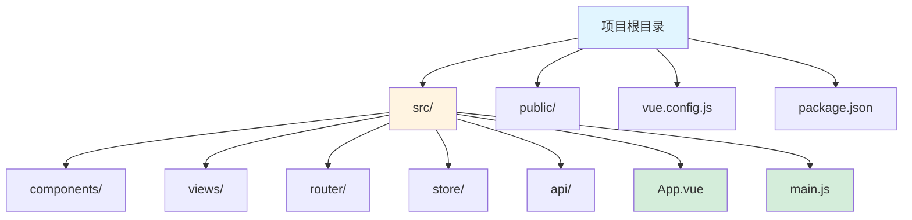
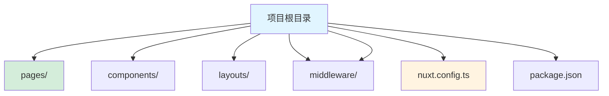

# Vue 框架指南

[🔙 返回框架索引](./index.md)

## 框架概述

Vue 是由尤雨溪创建的渐进式 JavaScript 框架，用于构建用户界面。Vue 采用模板语法和双向数据绑定，学习曲线平缓，适合初学者和快速开发。Vue 3 版本引入了 Composition API，提供了更灵活的代码组织方式。

## 项目结构识别

### 关键文件/目录

| 文件/目录 | 说明 | 识别标记 |
|-----------|------|----------|
| `package.json` | 包含 `vue` 依赖 | 框架识别 |
| `*.vue` | Vue 单文件组件 | 组件识别 |
| `vue.config.js` / `vue.config.ts` | Vue 配置文件 | 框架识别 |
| `src/` | 源代码目录 | 源码目录 |
| `public/` | 静态资源目录 | 资源目录 |
| `src/App.vue` | 根组件 | 根组件 |
| `src/main.js` / `src/main.ts` | 应用入口 | 入口文件 |

### 典型项目结构

**纯 Vue 项目**：

**Nuxt 项目**：

**目录说明**：
- `src/` - 源代码目录
- `public/` - 静态资源
- `components/` - 可复用组件
- `views/` / `pages/` - 页面组件
- `router/` - 路由配置
- `store/` - Vuex/Pinia 状态管理
- `api/` - API 服务
- `App.vue` - 根组件
- `main.js` / `main.ts` - 应用入口

## 版本兼容性说明

### 推荐版本
- Vue 版本：≥ 3.0
- Nuxt 版本：≥ 3.0（如果使用）
- Node.js 版本：≥ 16
- 推荐使用 TypeScript：≥ 4.0

### 已知不兼容场景
- Vue 2.x 与 Vue 3.x 有重大 breaking changes
- Options API 与 Composition API 混用需要注意
- Vue 3 需要兼容的 UI 库（如 Element Plus）

### 迁移注意事项
- 从 Vue 2 迁移到 3 需要使用迁移构建工具
- Options API 仍然支持，但推荐使用 Composition API
- 插件生态需要迁移到 Vue 3 版本

## 文档生成要点

### README 生成

**必选内容**：
- 项目名称和简介
- 快速开始指南
- Vue 版本要求
- 主要依赖列表
- 开发脚本（`npm run serve` / `npm run dev`）

**可选内容**：
- 项目结构说明
- 组件示例代码
- 状态管理方案（Vuex、Pinia）
- 路由方案（Vue Router）
- 部署说明

### API 文档生成

**必选内容**：
- 组件属性（Props）说明
- 组件事件（Events）说明
- 组件插槽（Slots）说明
- 响应式数据说明

**可选内容**：
- TypeScript 类型定义
- 组件使用示例
- 指令使用说明

### 架构文档生成

**必选内容**：
- 组件层级关系
- 状态管理方案（Vuex/Pinia）
- 路由设计（Vue Router）
- 数据流方向

**可选内容**：
- 组件通信方案
- 性能优化策略
- 组合式函数（Composables）设计
