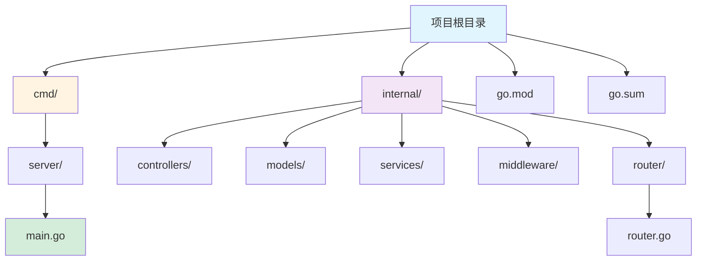
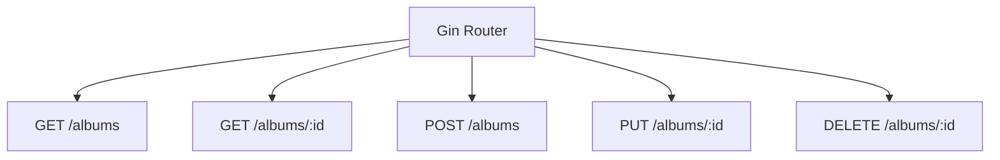
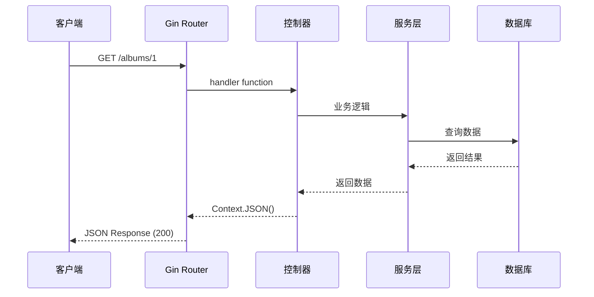

# Gin 框架指南

[🔙 返回框架索引](./index.md)

## 框架概述

Gin 是一个用 Go 编写的高性能 Web 框架，类似 Martini 但性能更好。它提供简单的 API 设计、中间件支持和 JSON 验证。

## 项目结构识别

### 关键文件/目录

| 文件/目录 | 说明 | 识别标记 |
|-----------|------|----------|
| `go.mod` | Go 模块依赖 | 语言识别 |
| `main.go` | 主应用文件 | 入口文件 |
| `router/` | 路由定义目录 | 路由目录 |
| `controllers/` | 控制器目录 | 控制器目录 |
| `models/` | 数据模型目录 | 模型目录 |
| `services/` | 业务逻辑目录 | 服务目录 |
| `middleware/` | 中间件目录 | 中间件目录 |

### 典型项目结构

```
my-gin-app/
├── cmd/
│   └── server/
│       └── main.go              # 应用入口
├── internal/
│   ├── controllers/           # 控制器
│   │   └── user.go
│   ├── models/               # 数据模型
│   │   └── user.go
│   ├── services/             # 业务逻辑
│   │   └── user.go
│   ├── middleware/           # 中间件
│   │   └── auth.go
│   └── router/              # 路由定义
│       └── router.go
├── go.mod
├── go.sum
└── README.md
```



## 版本兼容性说明

### 推荐版本
- Gin 版本：≥ 1.9
- Go 版本：≥ 1.18

### 已知不兼容场景
- Gin 早期版本（< 1.0） API 有重大变化
- Go 1.18 以下版本不支持泛型特性（Gin 1.20+ 开始使用泛型）

### 迁移注意事项
- 从 Gin 1.x 升级到最新版本通常无需代码修改
- 建议使用 Go modules 管理依赖版本

## 文档生成要点

### 1. README 生成

**必选内容**：
- Go 环境要求（推荐 1.18+）
- 依赖安装：`go get -u github.com/gin-gonic/gin`
- 运行开发服务器：`go run main.go`
- 构建命令：`go build -o app main.go`

**框架特性说明**：
- 高性能（比 Martini 快 40 倍）
- 中间件支持
- 路由组（Router Group）
- JSON 验证
- 错误管理

### 2. API 文档生成

Gin 使用路由函数定义端点，文档应重点说明每个端点的功能。

**路由定义示例**：

```go
package main

import (
    "net/http"
    "github.com/gin-gonic/gin"
)

type Album struct {
    ID     string  `json:"id"`
    Title  string  `json:"title"`
    Artist string  `json:"artist"`
    Price  float64 `json:"price"`
}

func main() {
    router := gin.Default()
    
    // GET 所有专辑
    router.GET("/albums", func(c *gin.Context) {
        c.JSON(http.StatusOK, albums)
    })
    
    // GET 单个专辑
    router.GET("/albums/:id", func(c *gin.Context) {
        id := c.Param("id")
        // 查询逻辑
        c.JSON(http.StatusOK, album)
    })
    
    // POST 创建专辑
    router.POST("/albums", func(c *gin.Context) {
        var newAlbum Album
        if err := c.BindJSON(&newAlbum); err != nil {
            return
        }
        // 保存逻辑
        c.JSON(http.StatusCreated, newAlbum)
    })
    
    router.Run(":8080")
}
```

**API 文档应包含**：
- HTTP 方法（GET/POST/PUT/DELETE）
- 路由路径
- 路径参数（`:id` 格式）
- 查询参数（`?name=value`）
- 请求体（JSON 结构）
- 响应格式
- 状态码说明（200, 201, 404）
- 错误处理

### 3. Context 方法文档

Gin 使用 `gin.Context` 处理请求和响应。

**常用方法**：

```go
// 获取路径参数
id := c.Param("id")

// 获取查询参数
name := c.Query("name")
name := c.DefaultQuery("name", "default")

// 获取 JSON 请求体
var user User
if err := c.BindJSON(&user); err != nil {
    // 处理错误
}

// 返回 JSON
c.JSON(http.StatusOK, data)

// 返回 Indented JSON（格式化）
c.IndentedJSON(http.StatusOK, data)

// 返回字符串
c.String(http.StatusOK, "Hello")

// 返回 HTML
c.HTML(http.StatusOK, "index.html", data)
```

## 特殊注意事项

1. **路由优先级**：路由定义的顺序可能影响匹配
2. **路径参数**：使用 `:param_name` 格式
3. **中间件**：在路由前使用 `router.Use()` 注册
4. **路由组**：使用 `router.Group()` 创建路由组
5. **JSON 标签**：Struct 的 json tag 定义响应字段名

## Mermaid 图表示例

### API 路由结构



### 请求处理流程



---

**参考资源**：
- [Gin 官方文档](https://gin-gonic.com/docs/)
- [Gin GitHub](https://github.com/gin-gonic/gin)
