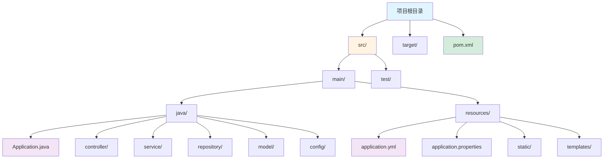

# Spring Boot 框架指南

[🔙 返回框架索引](./index.md)

## 框架概述

Spring Boot 是基于 Spring 框架的快速开发框架，通过约定优于配置和自动配置简化了 Spring 应用的开发。Spring Boot 内置嵌入式服务器（Tomcat、Jetty），支持快速构建生产级的 Java 应用。它是目前最流行的 Java Web 框架之一。

## 项目结构识别

### 关键文件/目录

| 文件/目录 | 说明 | 识别标记 |
|-----------|------|----------|
| `pom.xml` / `build.gradle` | 包含 `spring-boot-starter` 依赖 | 框架识别 |
| `src/main/java/` | Java 源代码目录 | 源码目录 |
| `src/main/resources/` | 资源文件目录 | 资源目录 |
| `Application.java` | 主启动类 | 应用入口 |
| `@SpringBootApplication` | Spring Boot 注解 | 框架识别 |
| `application.properties` / `application.yml` | 配置文件 | 配置识别 |

### 典型项目结构

**Maven 项目结构**：

**目录说明**：
- `src/main/java/` - Java 源代码
- `src/main/resources/` - 资源文件（配置、静态文件、模板）
- `src/test/java/` - 测试代码
- `controller/` - 控制器（处理 HTTP 请求）
- `service/` - 业务逻辑
- `repository/` - 数据访问层（Spring Data JPA）
- `model/` / `entity/` - 数据模型
- `config/` - 配置类
- `Application.java` - 主启动类
- `application.yml` / `application.properties` - 应用配置

## 版本兼容性说明

### 推荐版本
- Spring Boot 版本：≥ 3.0
- Java 版本：≥ 17
- Spring Framework：与 Spring Boot 匹配版本
- 推荐构建工具：Maven 3.6+ / Gradle 7+

### 已知不兼容场景
- Spring Boot 3.0 不支持 Java 8 和 11
- Spring Boot 3.x 将 Jakarta EE 命名空间（`javax.*` → `jakarta.*`）
- 某些第三方库在 Spring Boot 3.x 中需要升级

### 迁移注意事项
- 从 Spring Boot 2.x 升级到 3.x 需要升级到 Java 17+
- 需要将 `javax.*` 包替换为 `jakarta.*`
- 数据源配置和自动配置可能有变化

## 文档生成要点

### README 生成

**必选内容**：
- 项目名称和简介
- 快速开始指南
  - 构建项目：`mvn clean install` / `gradle build`
  - 启动服务：`mvn spring-boot:run` / `gradle bootRun`
- Spring Boot 版本要求
- Java 版本要求
- 主要依赖列表
- 配置文件说明（`application.yml` / `application.properties`）
- 环境变量配置说明

**可选内容**：
- 项目结构说明
- Spring Boot Actuator 端点说明
- 数据库配置说明
- 部署说明（JAR 部署、Docker）

### API 文档生成

**必选内容**：
- 控制器（Controller）列表
- 端点列表（从 `@RequestMapping` 提取）
- 请求参数说明
- 响应格式说明
- 认证方式说明（Spring Security）

**可选内容**：
- 数据模型（Entity）说明
- DTO（Data Transfer Object）说明
- 异常处理说明
- Swagger/OpenAPI 文档链接

### 架构文档生成

**必选内容**：
- 分层架构说明（Controller → Service → Repository）
- Bean 依赖关系
- 配置类说明（`@Configuration`）
- 数据访问设计（Spring Data JPA）

**可选内容**：
- AOP（面向切面编程）说明
- 事务管理说明
- 事件监听器说明
- 定时任务说明（`@Scheduled`）
