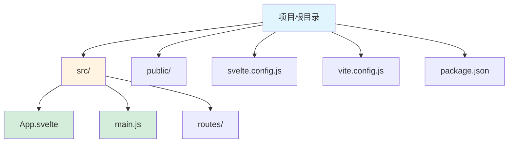
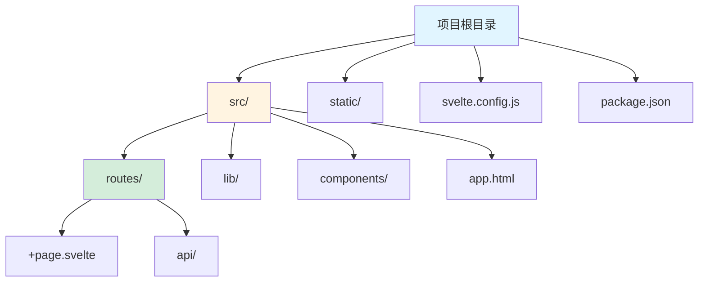
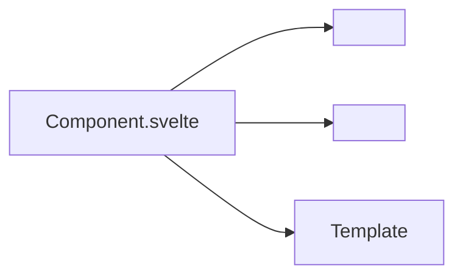
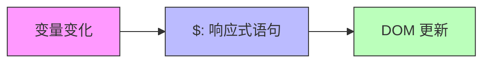

# Svelte 框架指南

[🔙 返回框架索引](./index.md)

## 框架概述

Svelte 是一个编译型前端框架，它在构建时将组件转换为高效的 JavaScript。相比 React/Vue，它具有更小的包体积和更好的性能。

## 项目结构识别

### 关键文件/目录

| 文件/目录 | 说明 | 识别标记 |
|-----------|------|----------|
| `svelte.config.js` | Svelte 配置文件 | 框架识别 |
| `svelte.config.ts` | TypeScript 配置文件 | 框架识别 |
| `package.json` | 包含 `svelte` 依赖 | 框架识别 |
| `src/routes/` | 路由目录（SvelteKit） | 路由目录 |
| `src/pages/` | 页面目录（SvelteKit） | 页面目录 |
| `*.svelte` | Svelte 组件文件 | 组件识别 |
| `vite.config.js` | Vite 构建配置 | 构建工具 |
| `static/` | 静态资源目录 | 资源目录 |

### 典型项目结构

**纯 Svelte 项目**：



**SvelteKit 项目**：



## 版本兼容性说明

### 推荐版本
- Svelte 版本：≥ 4.0
- SvelteKit 版本：≥ 1.0（如果使用）
- Node.js 版本：≥ 16

### 已知不兼容场景
- Svelte 3.x 与 Svelte 4.x 有一些 breaking changes
- SvelteKit 某些功能需要 Node.js ≥ 18
- 旧版浏览器（IE 11）不支持 Svelte

### 迁移注意事项
- 从 Svelte 3 迁移到 4 需要更新依赖并运行迁移脚本
- Svelte 4 使用 Vite 4+，需要更新构建配置

## 文档生成要点

### 1. README 生成

**必选内容**：
- Node.js 环境要求
- 项目类型说明（纯 Svelte 或 SvelteKit）
- 安装步骤：
  - `npm create svelte@latest my-app`
  - 或使用 SvelteKit：`npm create svelte@latest my-app`
  - 运行 `npm install` 和 `npm run dev`
- 开发命令说明
- 构建命令说明

**组件说明**：
- Svelte 组件文件结构（`.svelte`）
- script、style、template 三部分说明
- 响应式变量使用（`$:` 前缀）

### 2. 组件文档生成

Svelte 组件通常包含三个部分：`<script>`、`<style>` 和 HTML 模板。

**组件格式示例**：

```svelte
<script>
  export let name = 'World'
  
  function greet() {
    alert(`Hello, ${name}!`)
  }
</script>

<h1>Hello {name}!</h1>

<button on:click={greet}>Greet</button>

<style>
  h1 {
    color: blue;
  }
</style>
```

**组件文档应包含**：
- Props 说明（`export let` 声明的变量）
- 事件说明（`on:click` 等事件处理器）
- 插槽说明（`<slot>`）
- 生命周期函数（`onMount`, `onDestroy`）

### 3. API 路由文档（SvelteKit）

SvelteKit 使用 `src/routes/api/` 目录定义 API 端点。

**API 格式示例**：

```javascript
// src/routes/api/data.json.js
export async function GET() {
  return new Response(JSON.stringify({ message: 'Hello' }), {
    headers: {
      'Content-Type': 'application/json'
    }
  })
}
```

**API 文档应包含**：
- 路由路径（`+page.svelte`, `+server.js` 等）
- HTTP 方法（GET/POST/PUT/DELETE）
- 请求参数
- 响应格式
- 示例请求和响应

## 特殊注意事项

1. **编译型框架**：Svelte 在构建时编译，不是运行时框架
2. **SvelteKit 路由**：基于文件系统的路由，目录结构直接影响 URL
3. **响应式**：使用 `$:` 前缀创建响应式语句
4. **Store**：推荐使用 Svelte stores 进行状态管理

## Mermaid 图表示例

### 组件结构



### 数据流向（响应式）



---

**参考资源**：
- [Svelte 官方文档](https://svelte.dev/)
- [SvelteKit 文档](https://kit.svelte.dev/)
