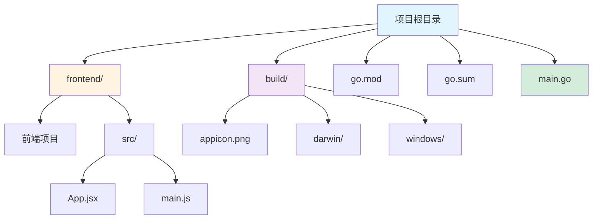
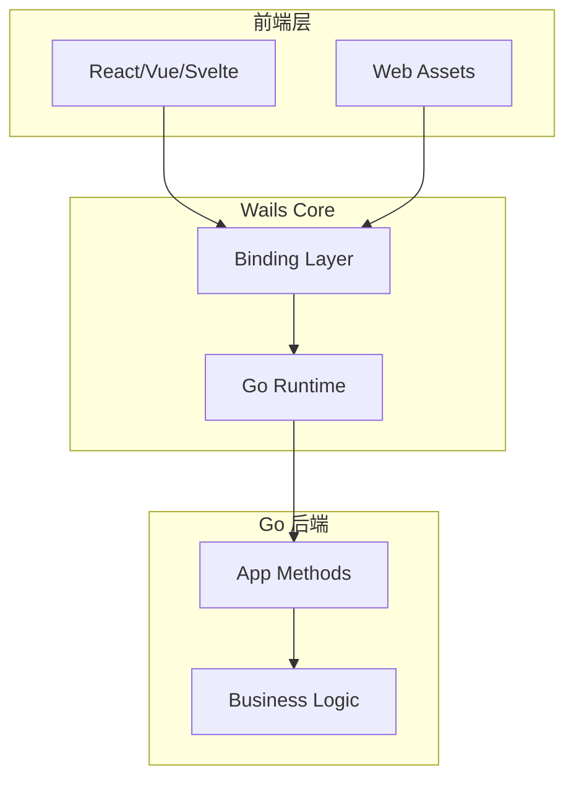
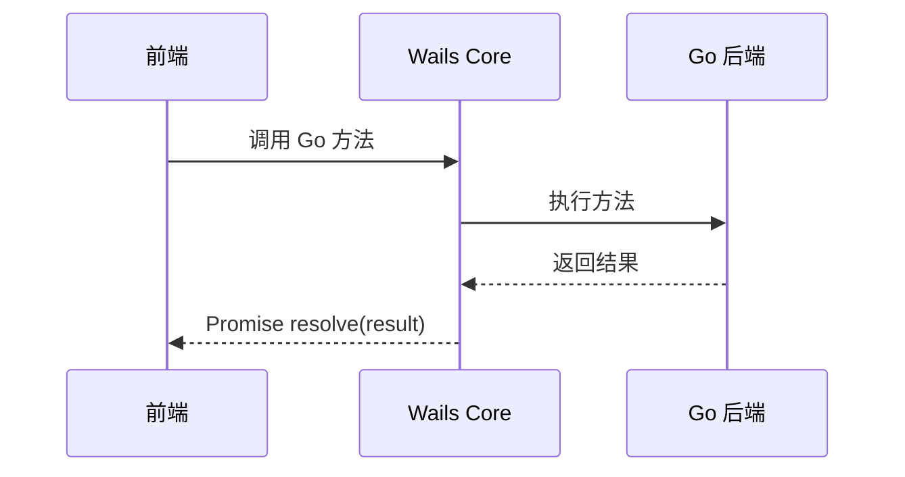

# Wails 框架指南

[🔙 返回框架索引](./index.md)

## 框架概述

Wails 是一个使用 Go 作为后端、Web 技术作为前端构建跨平台桌面应用的框架。相比 Tauri，它对开发者更友好，配置更简单。

## 项目结构识别

### 关键文件/目录

| 文件/目录 | 说明 | 识别标记 |
|-----------|------|----------|
| `wails.json` | Wails 配置文件 | 框架识别 |
| `go.mod` | Go 模块依赖 | 语言识别 |
| `go.sum` | Go 依赖校验 | 依赖锁定 |
| `frontend/` | 前端代码目录 | 前端目录 |
| `main.go` | Go 主入口 | 后端入口 |
| `build/` | 构建输出目录 | 构建产物 |
| `build/appicon.png` | 应用图标 | 资源文件 |
| `build/darwin/` | macOS 特定文件 | 平台配置 |
| `build/windows/` | Windows 特定文件 | 平台配置 |

### 典型项目结构



**目录说明**：
- `frontend/` - 前端项目（React/Vue/Svelte 等）
- `build/` - 构建输出和资源文件
- `go.mod` / `go.sum` - Go 模块依赖
- `main.go` - Go 主入口文件

## 版本兼容性说明

### 推荐版本
- Wails 版本：≥ 2.0
- Go 版本：≥ 1.18
- Node.js 版本：≥ 16

### 已知不兼容场景
- Wails v2 不支持 Windows 7（需要 Windows 10+）
- Go 1.18 以下版本不支持泛型特性
- 某些前端框架（如 Angular 18+）可能与 Wails 配置有冲突

### 迁移注意事项
- 从 Wails v1 迁移到 v2 需要重新初始化项目
- v2 使用不同的构建系统，需要调整 `build/` 目录结构

## 文档生成要点

### 1. README 生成

**必选内容**：
- Go 和 Node.js 环境要求
- 前端框架选择（React/Vue/Svelte 等）
- 安装步骤：
  - 安装 Go 和 Node.js
  - 安装 Wails CLI：`go install github.com/wailsapp/wails/v2/cmd/wails@latest`
  - 运行 `wails dev` 启动开发模式
- 开发命令说明
- 构建命令说明

**项目布局说明**：
- frontend/ 目录：标准前端项目，可以使用任意框架
- Go 代码：后端逻辑，通过绑定机制暴露给前端
- 前后端通信：通过 Wails runtime 调用 Go 函数

### 2. API 文档生成

Wails 使用 Go 的公开方法作为前端可调用的 API。

**方法绑定示例**：

```go
// app.go
package main

import (
    "context"
)

func (a *App) Greet(name string) string {
    return fmt.Sprintf("Hello, %s!", name)
}
```

**前端调用示例**：

```javascript
// main.js
import { Greet } from '../wailsjs/go/main/App.js'

async function sayHello() {
    const result = await Greet('World')
    console.log(result)
}
```

**API 文档应包含**：
- 方法名称和功能说明
- 参数类型和说明
- 返回值类型和说明
- 前端调用示例（使用 Wails runtime）

### 3. 依赖关系图

**前端 → 后端通信**：
```
Frontend (React/Vue) --binding--> Go Methods
```

**后端内部依赖**：
- 识别 Go 依赖（来自 go.mod）
- 生成模块依赖图

## 特殊注意事项

1. **绑定机制**：Wails 自动将 Go 公开方法绑定到前端，无需额外配置
2. **前端自由度**：frontend/ 目录可以是任意前端项目
3. **跨平台**：需要分别说明 Windows/macOS/Linux 的差异
4. **实时编译**：`wails dev` 命令会自动编译 Go 和前端，提供热重载

## Mermaid 图表示例

### 系统架构



### 数据流向



---

**参考资源**：
- [Wails 官方文档](https://wails.io/)
- [Wails 快速开始](https://wails.io/zh-Hans/docs/gettingstarted/firstproject/)
