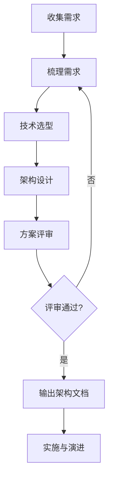
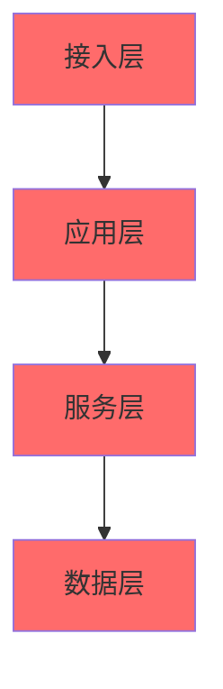
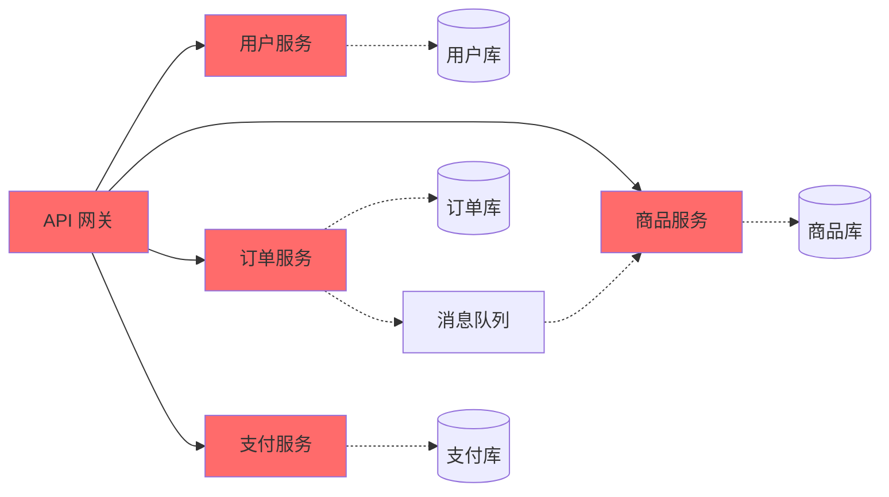
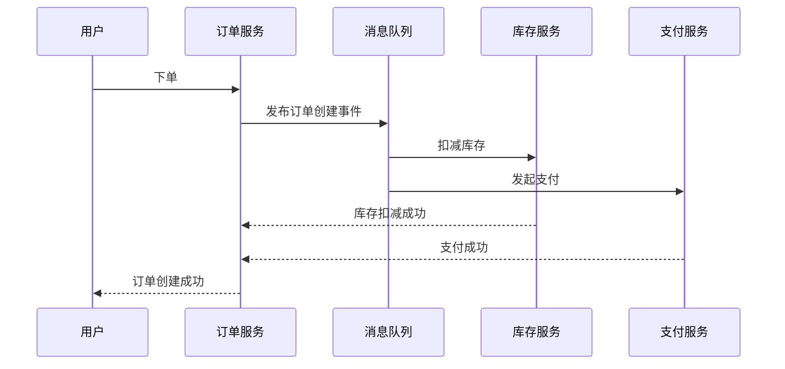
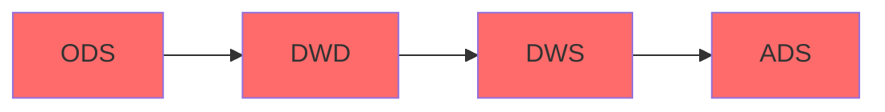
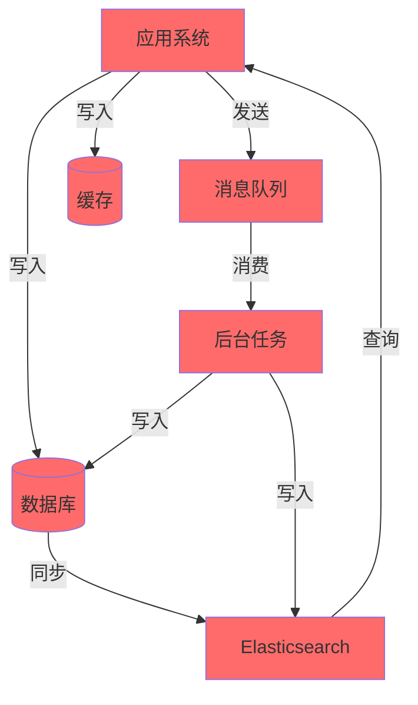
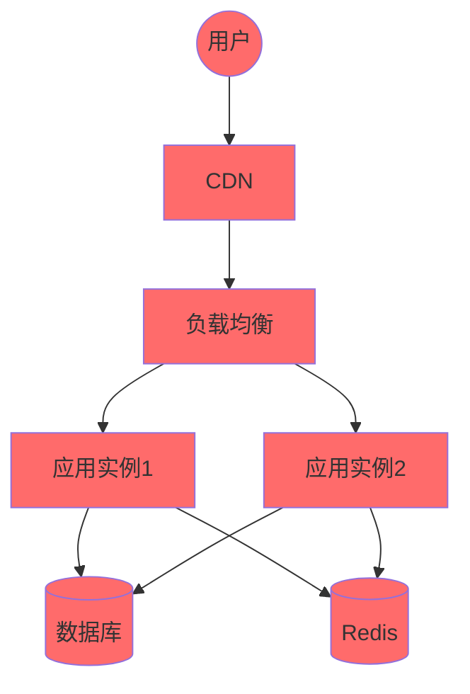
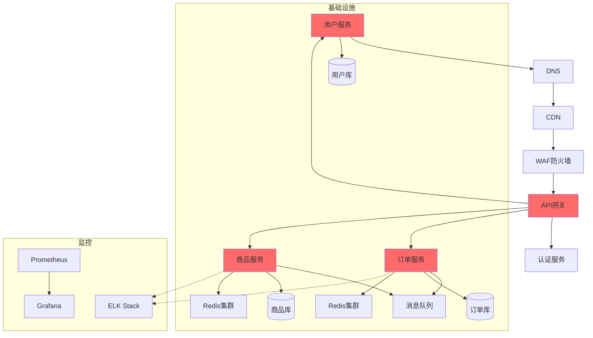
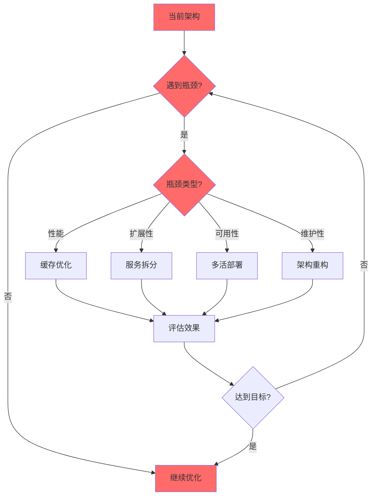

# 架构设计指南

## 目录
- [架构设计概述](#架构设计概述)
- [架构设计流程](#架构设计流程)
- [需求分析](#需求分析)
- [技术选型](#技术选型)
- [架构设计模式](#架构设计模式)
- [数据架构](#数据架构)
- [部署架构](#部署架构)
- [演进策略](#演进策略)

---

## 架构设计概述

### 什么是架构设计

架构设计是对系统整体结构的规划和设计，包括技术选型、模块划分、数据流动、部署方案等。

### 架构设计的目标

- **可扩展性**：支持业务增长和功能扩展
- **可维护性**：降低开发和维护成本
- **可靠性**：保证系统稳定运行
- **性能**：满足性能要求
- **安全性**：保护系统和数据安全
- **成本**：控制开发和运维成本

---

## 架构设计流程



### 1. 收集需求

**业务需求**：
- 核心功能
- 用户规模
- 业务场景

**非功能需求**：
- 性能要求（QPS、响应时间）
- 可用性要求（99.9%、99.99%）
- 安全性要求
- 扩展性要求

### 2. 梳理需求

**需求分类**：
- 核心功能（必须实现）
- 重要功能（应该实现）
- 辅助功能（可以实现）

**优先级排序**：
- P0：核心功能
- P1：重要功能
- P2：辅助功能

### 3. 技术选型

**选型原则**：
- 团队技术栈匹配
- 社区活跃度和生态
- 性能和稳定性
- 成本考虑

**选型维度**：
- 前端框架
- 后端框架
- 数据库
- 缓存
- 消息队列
- 部署方案

### 4. 架构设计

**设计内容**：
- 系统分层设计
- 模块划分
- 数据架构
- 接口设计
- 部署架构

### 5. 方案评审

**评审要点**：
- 技术可行性
- 成本评估
- 风险识别
- 替代方案

---

## 需求分析

### 功能需求

**核心功能**：
```markdown
| 功能模块 | 功能描述 | 优先级 | 复杂度 |
|----------|----------|--------|--------|
| 用户模块 | 用户注册、登录、权限管理 | P0 | 中 |
| 商品模块 | 商品浏览、搜索、详情 | P0 | 高 |
| 订单模块 | 下单、支付、发货 | P0 | 高 |
| 支付模块 | 第三方支付接入 | P0 | 高 |
```

### 非功能需求

**性能指标**：
```markdown
| 指标 | 要求 | 说明 |
|------|------|------|
| 并发用户 | 10000 | 峰值在线用户 |
| QPS | 5000 | 每秒请求数 |
| 响应时间 | P99 < 200ms | 99% 请求响应时间 |
| 可用性 | 99.99% | 年度停机时间 < 53 分钟 |
```

**数据规模**：
```markdown
| 数据类型 | 数据量 | 增长预期 |
|----------|--------|----------|
| 用户数据 | 1000 万 | 月增长 5% |
| 商品数据 | 100 万 | 月增长 2% |
| 订单数据 | 5000 万 | 月增长 10% |
| 日志数据 | 10TB/天 | 日增长 |
```

---

## 技术选型

### 选型决策表

| 需求场景 | 推荐技术 | 备选技术 | 选型理由 |
|----------|----------|----------|----------|
| 高并发写入 | Kafka | RabbitMQ | 高吞吐量 |
| 强事务场景 | MySQL | PostgreSQL | 成熟稳定 |
| 文档存储 | MongoDB | PostgreSQL | Schema 灵活 |
| 缓存场景 | Redis | Memcached | 数据结构丰富 |
| 全文检索 | Elasticsearch | Solr | 实时搜索 |
| 容器化部署 | Kubernetes | Docker Swarm | 生态成熟 |
| 微服务网关 | Kong | Nginx | 插件丰富 |
| 监控告警 | Prometheus + Grafana | Zabbix | 云原生友好 |

### 选型评估框架

**技术评估维度**：
1. **功能满足度**：是否能满足业务需求
2. **性能表现**：是否满足性能指标
3. **稳定性**：生产环境稳定性
4. **社区活跃度**：文档、版本更新
5. **学习成本**：团队学习曲线
6. **运维成本**：部署、维护复杂度
7. **成本**：license、云服务费用

**评估示例**：
```
数据库选型评估：

| 维度 | MySQL | PostgreSQL | MongoDB | 得分 |
|------|-------|------------|---------|------|
| 功能满足度 | 90 | 95 | 85 | |
| 性能表现 | 85 | 80 | 90 | |
| 稳定性 | 95 | 90 | 85 | |
| 社区活跃度 | 90 | 85 | 80 | |
| 学习成本 | 80 | 75 | 90 | |
| 运维成本 | 85 | 80 | 90 | |
| 综合得分 | 87.5 | 84.2 | 86.7 | |

结论：选择 MySQL（综合得分最高，团队最熟悉）
```

---

## 架构设计模式

### 分层架构



**分层说明**：
- **接入层**：API 网关、负载均衡、CDN
- **应用层**：业务编排、请求路由
- **服务层**：业务逻辑、数据处理
- **数据层**：数据库、缓存、消息队列

### 微服务架构



**微服务划分原则**：
- 单一职责
- 高内聚低耦合
- 业务边界清晰
- 数据独立

### 事件驱动架构



---

## 数据架构

### 数据分层



**数据层次**：
- **ODS**（操作数据层）：原始数据
- **DWD**（明细数据层）：清洗后的明细数据
- **DWS**（汇总数据层）：轻度汇总
- **ADS**（应用数据层）：面向业务的数据

### 数据流转



---

## 部署架构

### 中小型项目部署



### 大型项目部署



---

## 演进策略

### 架构演进阶段

**第一阶段：MVP**
- 单体架构
- 快速上线
- 最小功能集

**第二阶段：服务化**
- 业务拆分
- 服务治理
- 引入缓存

**第三阶段：微服务**
- 领域划分
- 容器化部署
- 自动化运维

**第四阶段：中台化**
- 能力复用
- 平台化建设
- 智能化运维

### 演进决策



---

## 常见问题

### Q1: 如何选择单体还是微服务？

**选择单体**：
- 项目初期
- 小团队（< 10 人）
- 业务简单
- 快速迭代

**选择微服务**：
- 大团队（> 20 人）
- 业务复杂
- 需要高扩展性
- 有运维能力

### Q2: 如何评估技术风险？

**风险评估矩阵**：
```
| 技术方案 | 风险等级 | 影响范围 | 缓解措施 |
|----------|----------|----------|----------|
| 新框架引入 | 高 | 全局 | 充分调研、POC 验证 |
| 第三方服务 | 中 | 局部 | 熔断、降级 |
| 开源组件 | 低 | 局部 | 版本管理、监控 |
```

### Q3: 如何保证架构可演进？

**实践建议**：
1. 渐进式演进，避免一次性大重构
2. 保持模块边界清晰
3. 预留扩展点
4. 建立架构评审机制

---

## 参考资料

- [技术选型参考手册](../templates/architecture/tech-selection-reference.md)
- [架构文档模板](../templates/core/ARCHITECTURE.md)
