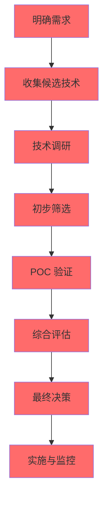
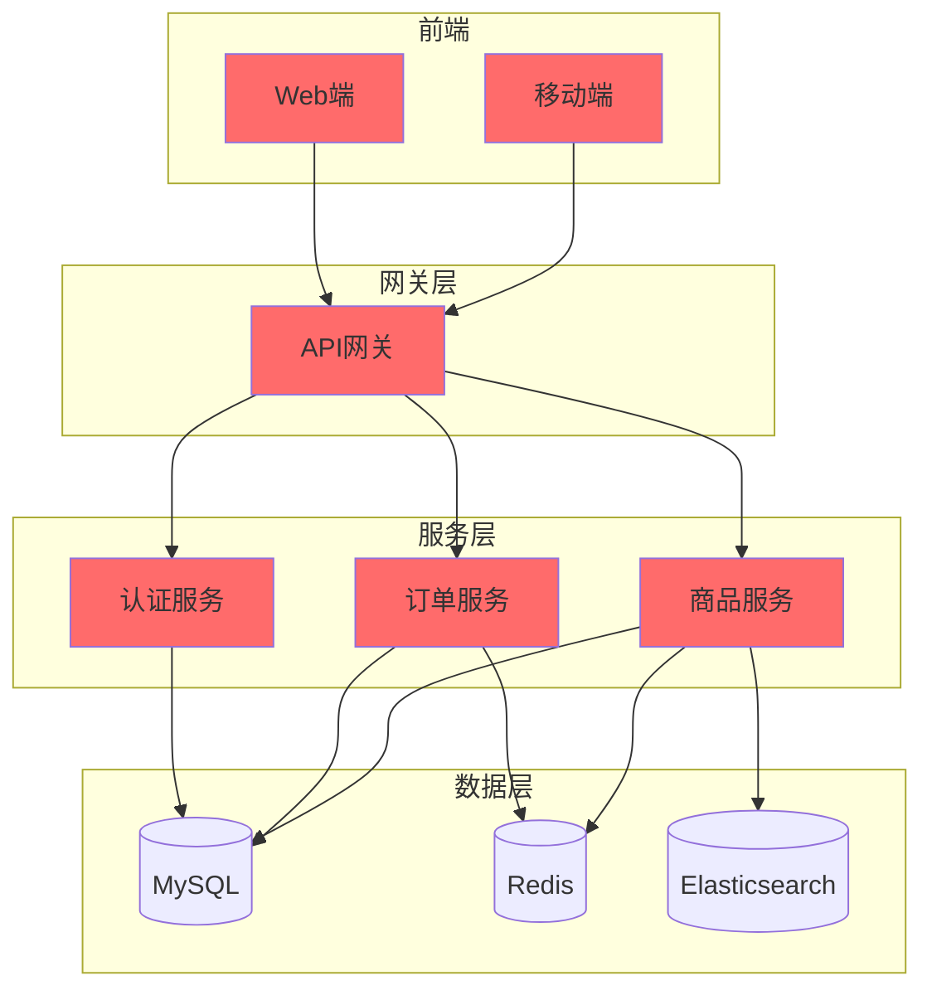

# 技术选型决策指南

## 目录
- [技术选型概述](#技术选型概述)
- [选型流程](#选型流程)
- [需求分析](#需求分析)
- [技术调研](#技术调研)
- [选型评估](#选型评估)
- [决策输出](#决策输出)
- [案例实践](#案例实践)

---

## 技术选型概述

### 什么是技术选型

技术选型是根据业务需求，选择合适的技术栈、框架、工具的过程。

### 选型目标

- 满足业务需求
- 降低开发和维护成本
- 保证系统稳定性和性能
- 适应团队技术能力
- 考虑长期发展

---

## 选型流程



---

## 需求分析

### 业务需求

**核心问题**：
1. 业务场景是什么？
2. 需要实现哪些功能？
3. 用户规模有多大？

**分析模板**：
```markdown
## 业务需求分析

### 场景类型
- [ ] 电商系统
- [ ] 社交应用
- [ ] 金融系统
- [ ] 物联网
- [ ] 其他：_______

### 用户规模
- 日活用户：_______
- 峰值并发：_______
- 年增长预期：_______

### 核心功能
| 功能 | 优先级 | 复杂度 |
|------|--------|--------|
| 功能1 | P0 | 高 |
| 功能2 | P1 | 中 |
```

### 非功能需求

**性能指标**：
```markdown
## 性能指标

| 指标 | 要求值 | 说明 |
|------|--------|------|
| QPS | 1000 | 每秒请求数 |
| 响应时间 | < 200ms | P99 |
| 并发数 | 5000 | 最大并发用户 |
| 可用性 | 99.9% | 年度停机时间 < 8.7h |
```

**数据需求**：
```markdown
## 数据需求

| 数据类型 | 数据量 | 增长预期 | 存储要求 |
|----------|--------|----------|----------|
| 用户 | 100万 | 月增5% | 关系型 |
| 订单 | 1000万 | 月增10% | 关系型 |
| 日志 | 1TB/天 | 日增 | 日志系统 |
```

---

## 技术调研

### 调研维度

**1. 功能特性**
- 是否满足业务需求
- 核心功能是否完善
- 扩展性如何

**2. 性能表现**
- 基准测试结果
- 高并发场景表现
- 资源消耗

**3. 稳定性**
- 生产环境使用案例
- 故障率
- 恢复能力

**4. 社区生态**
- 社区活跃度
- 文档完善程度
- 第三方库支持

**5. 学习成本**
- 团队现有技能
- 学习曲线
- 培训资源

**6. 运维成本**
- 部署复杂度
- 监控告警
- 故障排查方法

**1. 官方文档**
- 官方文档和

### 调研教程
- API 参考
- 最佳实践

**2. 社区资源**
- GitHub Star 和 Fork 数
- Issue 解决速度
- 博客和技术文章

**3. 实际案例**
- 大厂使用案例
- 开源项目参考
- 踩坑经验

**4. POC 验证**
- 小规模测试
- 性能基准测试
- 集成测试

---

## 选型评估

### 评估模型

**加权评分模型**：
```
总分 = Σ(维度得分 × 权重)
```

**评估维度权重建议**：
| 维度 | 权重 | 说明 |
|------|------|------|
| 功能满足度 | 25% | 是否满足业务需求 |
| 性能表现 | 20% | 是否满足性能指标 |
| 稳定性 | 20% | 生产环境稳定性 |
| 社区活跃度 | 15% | 长期维护保障 |
| 学习成本 | 10% | 团队快速上手 |
| 运维成本 | 10% | 部署维护难度 |

### 评估表示例

**数据库选型评估**：
```markdown
## 数据库选型评估

| 维度 | 权重 | MySQL | PostgreSQL | MongoDB | Redis |
|------|------|-------|------------|---------|-------|
| 功能满足度 | 25% | 90 | 95 | 85 | 70 |
| 性能表现 | 20% | 85 | 80 | 90 | 95 |
| 稳定性 | 20% | 95 | 90 | 85 | 90 |
| 社区活跃度 | 15% | 90 | 85 | 80 | 90 |
| 学习成本 | 10% | 80 | 75 | 90 | 85 |
| 运维成本 | 10% | 85 | 80 | 90 | 85 |
| **加权得分** | 100% | **88.25** | **85.75** | **86** | **84** |

**结论**：选择 MySQL（得分最高）
```

### 风险评估

**风险识别矩阵**：
```markdown
## 风险评估

| 技术方案 | 风险类型 | 风险等级 | 影响范围 | 缓解措施 | 责任人 |
|----------|----------|----------|----------|----------|--------|
| 新框架引入 | 技术 | 高 | 全局 | 充分调研、POC验证 | 技术负责人 |
| 第三方服务 | 依赖 | 中 | 局部 | 熔断降级、服务隔离 | 架构师 |
| 开源组件 | 安全 | 低 | 局部 | 版本管理、安全扫描 | 运维负责人 |
```

---

## 决策输出

### 选型决策表

```markdown
## 技术选型决策

### 后端框架
| 场景 | 选择 | 备选 | 理由 |
|------|------|------|------|
| Web API | Spring Boot | NestJS | 团队熟悉、生态完善 |
| 高并发服务 | Go | Java | 性能优势 |
| 快速开发 | Django | FastAPI | 开发效率 |

### 数据库
| 场景 | 选择 | 备选 | 理由 |
|------|------|------|------|
| 事务数据 | MySQL | PostgreSQL | 团队熟悉 |
| 文档数据 | MongoDB | PostgreSQL | Schema灵活 |
| 缓存数据 | Redis | Memcached | 数据结构丰富 |

### 部署
| 场景 | 选择 | 备选 | 理由 |
|------|------|------|------|
| 容器编排 | Kubernetes | Docker Swarm | 生态成熟 |
| 服务网格 | Istio | Linkerd | 功能完善 |
```

### 架构图



---

## 案例实践

### 案例一：电商系统技术选型

**需求**：
- 日活用户 100 万
- 峰值 QPS 10000
- 核心功能：商品展示、购物车、订单、支付
- 预算：有限

**选型过程**：

```markdown
## 选型分析

### 后端框架
| 候选 | 功能 | 性能 | 生态 | 学习成本 | 综合得分 |
|------|------|------|------|----------|----------|
| Spring Boot | 95 | 80 | 95 | 70 | 85.5 |
| Go | 85 | 95 | 80 | 75 | 84 |
| Node.js | 80 | 85 | 90 | 85 | 84.5 |

结论：选择 Spring Boot（团队熟悉、生态完善）

### 数据库
| 候选 | 事务 | 性能 | 扩展 | 成本 | 综合得分 |
|------|------|------|------|------|----------|
| MySQL | 95 | 85 | 80 | 免费 | 86 |
| PostgreSQL | 95 | 80 | 85 | 免费 | 85 |

结论：选择 MySQL

### 缓存
| 候选 | 性能 | 丰富度 | 持久化 | 综合得分 |
|------|------|--------|--------|----------|
| Redis | 95 | 95 | 支持 | 95 |
| Memcached | 90 | 60 | 不支持 | 75 |

结论：选择 Redis
```

**最终方案**：
```
前端：Vue.js + Vant
后端：Spring Boot + MyBatis
数据库：MySQL + Redis
搜索：Elasticsearch
消息队列：RabbitMQ
部署：Docker + Kubernetes
监控：Prometheus + Grafana
```

### 案例二：即时通讯系统技术选型

**需求**：
- 实时消息推送
- 百万级并发
- 低延迟

**选型分析**：

```markdown
## 关键需求分析

### 核心挑战
1. 实时性：消息延迟 < 100ms
2. 高并发：百万级长连接
3. 可靠性：消息不丢失

### 技术选型

#### WebSocket vs MQTT
| 维度 | WebSocket | MQTT |
|------|-----------|------|
| 实时性 | 优 | 优 |
| 资源占用 | 中 | 低 |
| 推送效率 | 高 | 高 |
| 移动端适配 | 一般 | 优 |

结论：选择 WebSocket（团队熟悉）
```

---

## 常见问题

### Q1: 如何平衡技术新颖性和稳定性？

**建议**：
- 核心系统使用成熟技术
- 新技术可在边缘系统试点
- 保持技术更新意识

### Q2: 团队技术栈不匹配怎么办？

**方案**：
1. 培训提升团队能力
2. 引入有经验的技术专家
3. 逐步迁移而非一次性替换

### Q3: 如何应对技术选型失误？

**缓解措施**：
1. 预留抽象层
2. 渐进式引入
3. 建立回滚机制

---

## 参考资料

- [技术选型参考手册](../templates/architecture/tech-selection-reference.md)
- [架构设计指南](architecture-design-guide.md)
