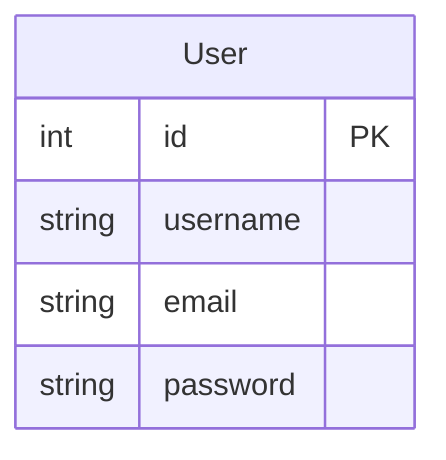
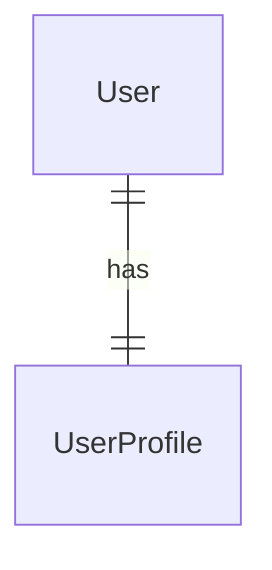
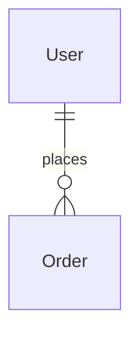
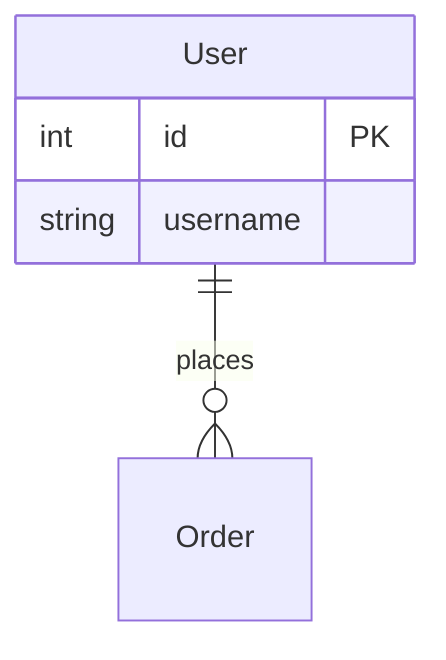
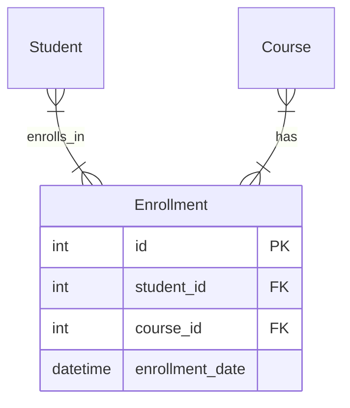
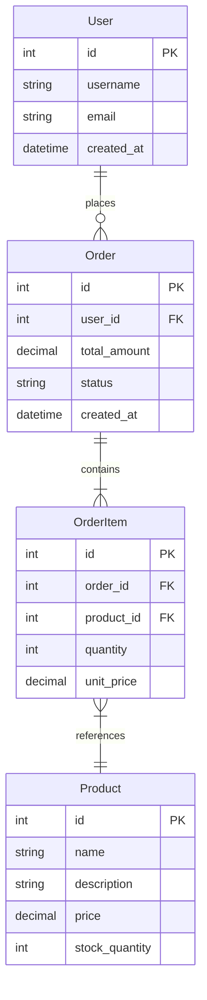

# ER 图设计指南

## 目录
- [ER 图概述](#er-图概述)
- [设计原则](#设计原则)
- [实体设计](#实体设计)
- [关系设计](#关系设计)
- [Mermaid 语法](#mermaid-语法)
- [最佳实践](#最佳实践)
- [常见问题](#常见问题)

---

## ER 图概述

### 什么是 ER 图

ER 图（Entity-Relationship Diagram）是实体关系图，用于描述系统中实体之间的关系。它是数据库设计的重要工具，帮助开发者理解数据结构。

### ER 图的作用

- **可视化数据结构**：直观展示表之间的关系
- **指导数据库设计**：帮助设计表结构和约束
- **团队沟通工具**：方便团队讨论数据模型
- **文档化知识**：记录数据库设计决策

---

## 设计原则

### 1. 规范化原则

**第一范式（1NF）**：
- 表中的每个字段都是不可再分的原子值
- 不允许重复字段
- 不允许多值字段

**第二范式（2NF）**：
- 满足 1NF
- 非主键字段完全依赖于主键
- 不允许部分依赖

**第三范式（3NF）**：
- 满足 2NF
- 非主键字段不依赖于其他非主键字段
- 不允许传递依赖

### 2. 性能优化原则

**索引策略**：
- 为外键字段创建索引
- 为查询频繁的字段创建索引
- 避免过度索引

**分区策略**：
- 大表按时间分区
- 历史数据归档
- 提高查询性能

### 3. 扩展性原则

**预留字段**：为未来的扩展预留字段

**灵活设计**：
- 使用枚举类型存储状态
- 使用 JSON 字段存储动态属性

---

## 实体设计

### 实体定义



### 字段类型选择

| 类型 | 适用场景 | 说明 |
|------|----------|------|
| int | 整数 ID、数量 | 默认使用 INT |
| bigint | 大整数 ID | 需要大范围时使用 |
| varchar | 字符串 | 指定最大长度 |
| text | 长文本 | 用于描述、评论等 |
| decimal | 金额 | 指定精度（10,2） |
| datetime | 时间戳 | 存储日期和时间 |
| enum | 枚举值 | 有限选项的状态字段 |
| boolean | 布尔值 | true/false |
| json | 动态数据 | 存储灵活的 JSON 数据 |

### 约束设计

**主键（PK）**：
- 使用自增整数
- 确保唯一性

**外键（FK）**：
- 确保引用完整性
- 选择合适的级联策略

**唯一约束（UNIQUE）**：
- 用于需要唯一的字段
- 如用户名、邮箱

**非空约束（NOT NULL）**：
- 关键字段不允许为空
- 如用户名、密码

**检查约束（CHECK）**：
- 限制字段取值范围
- 如评分 1-5

---

## 关系设计

### 关系类型

**一对一（1:1）**：


- 使用场景：一个用户对应一个用户档案
- 实现：在其中一个表中添加外键

**一对多（1:N）**：


- 使用场景：一个用户可以下多个订单
- 实现：在"多"的一端添加外键

**多对多（M:N）**：


- 使用场景：一个学生可以选多门课，一门课可以被多个学生选
- 实现：创建中间表

### 外键策略

**级联删除（CASCADE）**：
- 删除主表记录时自动删除子表记录
- 使用场景：强关联关系

**限制删除（RESTRICT）**：
- 删除主表记录时，如果存在子表记录则限制删除
- 使用场景：需要保留历史数据

**设置为 NULL（SET NULL）**：
- 删除主表记录时，子表的外键设置为 NULL
- 使用场景：弱关联关系

---

## Mermaid 语法

### 基本语法



### 关系符号

| 符号 | 关系类型 | 说明 |
|------|----------|------|
| `||--||` | 一对一 | 强制关联 |
| `||--o{` | 一对多 | 一端强制，多端可选 |
| `}o--||` | 多对一 | 多端可选，一端强制 |
| `}o--o{` | 多对多 | 两端都可选 |

### 实体属性

```mermaid
erDiagram
    User {
        int id PK        %% 主键
        string username  %% 普通字段
        int user_id FK   %% 外键
    }
```

**标记说明**：
- `PK`：主键
- `FK`：外键
- `UNIQUE`：唯一约束

---

## 最佳实践

### 1. 命名规范

**表名**：
- 使用复数形式
- 使用小写字母和下划线
- 如：users、orders

**字段名**：
- 使用小写字母和下划线
- 使用描述性名称
- 如：user_id、created_at

**索引名**：
- 使用表名_字段名
- 如：idx_user_email

### 2. 字段设计

**主键**：
- 使用自增整数
- 统一命名为 id

**时间戳**：
- 必备字段：created_at、updated_at
- 类型：datetime
- 默认值：CURRENT_TIMESTAMP

**软删除**：
- 添加 deleted_at 字段
- 类型：datetime
- NULL 表示未删除

### 3. 关系设计

**外键命名**：
- 使用关联表名_id
- 如：user_id、order_id

**级联策略**：
- 根据业务需求选择
- 优先使用 RESTRICT

---

## 常见问题

### 1. 何时使用外键

**推荐使用外键**：
- 需要保证数据完整性
- 表之间有强关联关系
- 数据量不大

**不推荐使用外键**：
- 数据量很大（影响性能）
- 表之间是弱关联关系
- 需要频繁导入导出

### 2. 如何处理多对多关系

**创建中间表**：


### 3. 如何优化查询性能

**索引优化**：
- 为外键创建索引
- 为查询字段创建索引
- 避免过度索引

**查询优化**：
- 使用 JOIN 优化
- 使用覆盖索引
- 避免 SELECT *

### 4. 如何处理历史数据

**分区策略**：
- 按时间分区
- 定期归档历史数据

**归档策略**：
- 创建归档表
- 定期迁移历史数据

---

## 模板示例

### 完整 ER 图模板



---

## 参考资料

- [ER 图模板](../templates/database/er-diagram.md)
- [Mermaid ER 图文档](https://mermaid.js.org/syntax/entityRelationshipDiagram.html)
- [数据库设计最佳实践](https://www.postgresql.org/docs/current/ddl-constraints.html)
