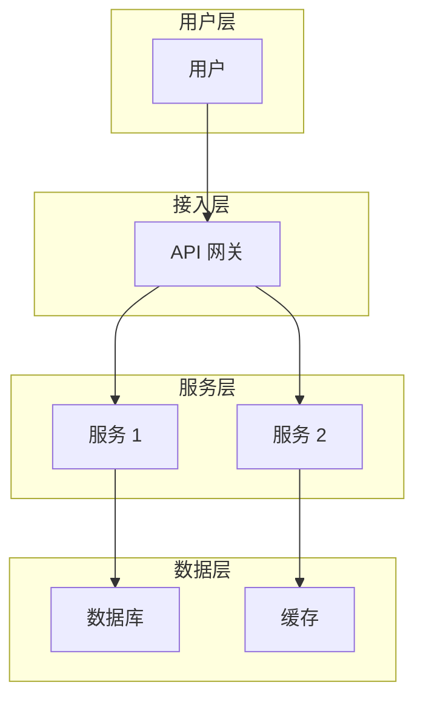
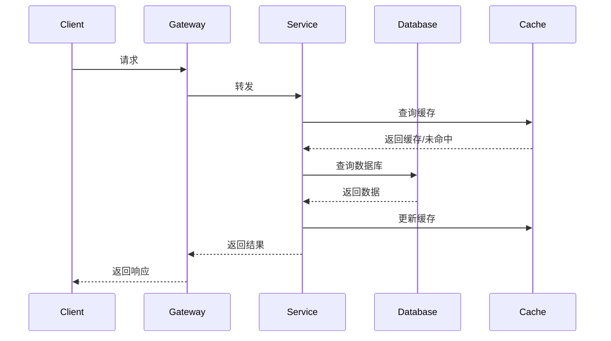
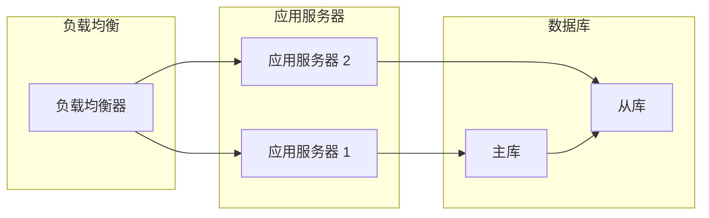

# 架构文档指南

## 目录

- [文档概述](#文档概述)
- [标准命名](#标准命名)
- [编写目的](#编写目的)
- [文档结构](#文档结构)
- [多角色视图](#多角色视图)
- [多维度设计](#多维度设计)
- [编写规范](#编写规范)
- [示例](#示例)

---

## 文档概述

架构文档是渐进式文档体系的**第三层**，基于需求文档进行架构设计，采用多维度、多角色的方式，为不同角色提供针对性的架构说明。

### 核心特点

- **多角色视图**：为架构师、开发、测试、运维、产品提供不同视角的架构说明
- **多维度设计**：涵盖功能、数据、部署、安全等多个维度
- **可视化设计**：使用 Mermaid 图表清晰展示架构
- **技术选型**：提供明确的技术选型说明

### 适用场景

- 系统架构设计
- 技术方案评审
- 技术选型决策
- 架构优化

### 标准命名

⚠️ **重要**：架构文档文件必须命名为 `ARCHITECTURE.md`（全大写），位于项目根目录。

**标准路径**：`/ARCHITECTURE.md`

**错误示例**：
- `architecture.md`（小写）
- `architecture.markdown`（扩展名错误）
- `docs/architecture.md`（位置错误）
- `ARCHITECTURE.txt`（格式错误）

**正确示例**：
- `ARCHITECTURE.md`（标准）

---

## 编写目的

架构文档的主要目的是：

1. **架构指导**：为开发团队提供清晰的架构指导
2. **角色协同**：为不同角色提供针对性的架构说明
3. **技术决策**：明确技术选型和决策理由
4. **设计演进**：记录架构演进过程

---

## 文档结构

### 标准结构

```markdown
# [架构名称]

## 需求来源
- 需求文档：[需求文档路径]
- 创建日期：[创建日期]
- 负责人：[负责人]

---

## 架构概述

### 系统目标
[系统的总体目标]

### 核心能力
- [能力 1]
- [能力 2]

### 关键指标
- [指标 1]
- [指标 2]

---

## 架构视图

### 架构图



### 分层说明
- [分层说明]

---

## 多角色视图

### 架构师视图

#### 整体架构
[架构师关注的整体架构]

#### 技术选型
| 组件 | 技术选型 | 选型理由 |
|------|---------|----------|
| [组件 1] | [技术] | [理由] |

#### 设计决策
- [决策 1]：[说明]
- [决策 2]：[说明]

#### 潜在风险
- [风险 1]：[说明]
- [风险 2]：[说明]

---

### 开发视图

#### 模块划分
[模块划分说明]

#### 接口定义
| 接口 | 路径 | 说明 |
|------|------|------|
| [接口 1] | [路径] | [说明] |

#### 数据模型
[数据模型说明]

#### 关键代码
```python
# 关键代码示例
```

---

### 测试视图

#### 测试策略
[测试策略说明]

#### 测试用例
| 用例 | 场景 | 预期结果 |
|------|------|----------|
| [用例 1] | [场景] | [结果] |

#### 测试数据
[测试数据说明]

---

### 运维视图

#### 部署架构
[部署架构说明]

#### 监控指标
| 指标 | 说明 | 阈值 |
|------|------|------|
| [指标 1] | [说明] | [阈值] |

#### 告警规则
[告警规则说明]

#### 运维手册
[运维操作说明]

---

### 产品视图

#### 用户体验
[用户体验说明]

#### 业务流程
[业务流程说明]

#### 功能依赖
[功能依赖关系]

---

## 数据架构

### 数据流图



### 数据模型
[数据模型设计]

### 数据一致性
[数据一致性保证机制]

---

## 技术架构

### 技术栈
| 层次 | 技术选型 |
|------|---------|
| [层次 1] | [技术] |
| [层次 2] | [技术] |

### 关键技术
- [技术 1]：[说明]
- [技术 2]：[说明]

### 第三方依赖
| 依赖 | 版本 | 用途 |
|------|------|------|
| [依赖 1] | [版本] | [用途] |

---

## 安全架构

### 安全策略
- [策略 1]
- [策略 2]

### 认证授权
[认证授权机制]

### 数据安全
[数据安全措施]

---

## 性能架构

### 性能指标
| 指标 | 目标值 |
|------|--------|
| [指标 1] | [目标] |
| [指标 2] | [目标] |

### 优化策略
- [策略 1]
- [策略 2]

### 缓存策略
[缓存设计]

---

## 部署架构

### 部署拓扑



### 部署流程
[部署流程说明]

### 环境配置
| 环境 | 配置 |
|------|------|
| [环境 1] | [配置] |
| [环境 2] | [配置] |

---

## 监控与运维

### 监控指标
[监控指标说明]

### 日志规范
[日志规范说明]

### 告警策略
[告警策略说明]

---

## 扩展性设计

### 水平扩展
[水平扩展设计]

### 垂直扩展
[垂直扩展设计]

### 服务拆分
[服务拆分计划]

---

## 演进计划

### 近期计划
- [计划 1]
- [计划 2]

### 中期规划
- [规划 1]
- [规划 2]

### 长期愿景
[长期愿景说明]

---

## 参考文档
- [需求文档](../requirement-docs/xxx.md)
- [功能文档](../functional-docs/xxx.md)
- [ADR](../architectural-decision-records/xxx.md)
```

---

## 多角色视图

### 1. 架构师视图

**关注点**：
- 整体架构设计
- 技术选型
- 设计决策
- 架构演进

**输出内容**：
- 系统架构图
- 技术选型表
- ADR（架构决策记录）
- 架构风险分析

### 2. 开发视图

**关注点**：
- 模块划分
- 接口定义
- 数据模型
- 关键代码

**输出内容**：
- 模块架构图
- API 文档
- 数据模型（ER 图）
- 核心代码示例

### 3. 测试视图

**关注点**：
- 测试策略
- 测试用例
- 测试数据
- 测试环境

**输出内容**：
- 测试策略文档
- 测试用例清单
- 测试数据准备
- 测试环境配置

### 4. 运维视图

**关注点**：
- 部署架构
- 监控指标
- 告警规则
- 运维手册

**输出内容**：
- 部署架构图
- 监控大盘
- 告警规则配置
- 运维操作手册

### 5. 产品视图

**关注点**：
- 用户体验
- 业务流程
- 功能依赖
- 数据指标

**输出内容**：
- 用户体验地图
- 业务流程图
- 功能依赖矩阵
- 产品指标仪表盘

---

## 多维度设计

### 1. 功能维度

**内容**：
- 系统功能架构
- 功能模块划分
- 功能依赖关系

**可视化**：
- 功能架构图
- 功能流程图
- 用例图

### 2. 数据维度

**内容**：
- 数据模型设计
- 数据流动过程
- 数据一致性保证

**可视化**：
- ER 图
- 数据流图
- 时序图

### 3. 部署维度

**内容**：
- 部署拓扑
- 环境配置
- 发布流程

**可视化**：
- 部署架构图
- 环境关系图
- 发布流程图

### 4. 安全维度

**内容**：
- 安全策略
- 认证授权
- 数据安全

**可视化**：
- 安全架构图
- 认证流程图
- 权限模型图

### 5. 性能维度

**内容**：
- 性能目标
- 优化策略
- 缓存设计

**可视化**：
- 性能模型图
- 缓存架构图
- 优化方案图

---

## 编写规范

### 1. 架构图

**原则**：清晰、准确、易懂

**要求**：
- 使用 Mermaid 语法
- 层次分明
- 关系清晰
- 标注完整

### 2. 技术选型

**原则**：有理有据，权衡取舍

**要求**：
- 列出备选方案
- 对比优缺点
- 说明选型理由
- 记录决策过程

### 3. 接口定义

**原则**：清晰、完整、一致

**要求**：
- 接口路径清晰
- 请求响应示例
- 错误码说明
- 版本管理

### 4. 数据模型

**原则**：准确、完整、一致

**要求**：
- 实体关系清晰
- 字段类型准确
- 约束条件完整
- 一致性保证

---

## 示例

由于篇幅限制，完整示例请参见 [架构文档模板](../templates/architecture-doc-template.md)。

---

## 最佳实践

1. **多角色协同**：为不同角色提供针对性的架构说明
2. **可视化优先**：使用图表清晰展示架构
3. **技术选型有据**：详细说明技术选型的理由
4. **持续演进**：记录架构演进过程
5. **文档同步**：保持架构文档与代码同步

---

## 相关文档

- [功能文档指南](functional-doc-guide.md)
- [需求文档指南](requirement-doc-guide.md)
- [架构文档模板](../templates/architecture-doc-template.md)
- [渐进式文档生成器](../../scripts/generate_progressive_doc.py)
- [ADR 模板](../roles/architect/adr-template.md)
