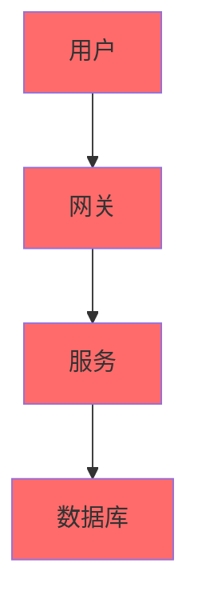

# 基础文档清单

## 概述

本文档定义项目的基础文档清单，每个项目必须包含这些基础文档。其他文档根据项目类型和复杂度按需生成。

---

## 基础文档列表

### P0 - 必须创建

| 文档 | 文件名 | 说明 | 模板位置 |
|------|--------|------|----------|
| 项目概述 | `README.md` | 项目介绍、快速开始、功能说明 | [core/README.md](../templates/core/README.md) |
| 路线图 | `ROADMAP.md` | 未来规划、里程碑、功能计划 | [core/ROADMAP.md](../templates/core/ROADMAP.md) |
| 变更日志 | `CHANGELOG.md` | 版本变更记录 | [core/CHANGELOG.md](../templates/core/CHANGELOG.md) |

### P1 - 强烈推荐

| 文档 | 文件名 | 说明 | 模板位置 |
|------|--------|------|----------|
| 架构文档 | `ARCHITECTURE.md` | 系统架构和技术选型 | [core/ARCHITECTURE.md](../templates/core/ARCHITECTURE.md) |

---

## 基础文档说明

### README.md

**位置**：项目根目录

**内容要求**：
- 项目名称和 Logo
- 一句话项目描述
- 功能特性列表
- 快速开始指南
- 技术栈说明
- 目录结构
- 贡献指南
- 许可证

**示例结构**：
```markdown
# 项目名称

> 一句话项目描述

## 功能特性

- 特性1
- 特性2
- 特性3

## 快速开始

```bash
# 安装
npm install

# 运行
npm run dev
```

## 技术栈

- 前端：Vue.js
- 后端：Spring Boot
- 数据库：MySQL

## 目录结构

```
project/
├── src/
├── docs/
└── README.md
```

## 参考

- [API 文档](docs/api/)
- [架构文档](ARCHITECTURE.md)
```

---

### CHANGELOG.md

**位置**：项目根目录

**内容要求**：
- 版本号
- 发布日期
- 变更类型（新增/修改/删除/修复）
- 变更描述

**格式**：
```markdown
# CHANGELOG

## [1.0.0] - 2025-01-01

### 新增
- 用户注册功能
- 用户登录功能

### 修改
- 优化数据库查询性能

### 修复
- 修复登录超时问题

### 删除
- 移除废弃的 API 接口
```

**版本格式**：`[版本号] - 日期`

---

### ROADMAP.md

**位置**：项目根目录

**内容要求**：
- 当前版本
- 未来版本规划
- 里程碑

**示例结构**：
```markdown
# ROADMAP

## 当前版本
v1.0.0

## 未来规划

### v1.1.0 - Q2 2025
- 订单管理
- 支付集成

### v1.2.0 - Q3 2025
- 用户数据分析
- 推荐系统

### v2.0.0 - Q4 2025
- 微服务重构
- 多语言支持
```

---

### ARCHITECTURE.md

**位置**：项目根目录

**内容要求**：
- 系统架构图
- 技术选型
- 模块划分
- 数据流程
- 部署架构

**示例结构**：
```markdown
# ARCHITECTURE

## 系统架构



## 技术选型

| 组件 | 技术 | 理由 |
|------|------|------|
| 前端 | Vue.js | 团队熟悉 |
| 后端 | Spring Boot | 生态完善 |
| 数据库 | MySQL | 事务支持 |

## 模块划分

- 用户模块
- 商品模块
- 订单模块

## 部署架构

详见 [部署文档](wiki/deployment/)
```

---

## 按需扩展文档

根据项目类型和复杂度，按需生成以下文档：

### Web 应用

| 文档 | 文件名 | 说明 |
|------|--------|------|
| API 文档 | `wiki/api/README.md` | 接口定义 |
| 部署文档 | `wiki/deployment.md` | 部署指南 |
| 环境配置 | `wiki/env.md` | 环境变量说明 |

### API 服务

| 文档 | 文件名 | 说明 |
|------|--------|------|
| API 文档 | `wiki/api.md` | 接口详细说明 |
| 鉴权文档 | `wiki/auth.md` | 认证授权说明 |

### 移动应用

| 文档 | 文件名 | 说明 |
|------|--------|------|
| 设计稿 | `wiki/design.md` | UI/UX 设计 |
| 集成指南 | `wiki/integration.md` | 第三方集成 |

### 复杂项目

| 文档 | 文件名 | 说明 |
|------|--------|------|
| 数据库 ER 图 | `wiki/database/er-diagram.md` | 数据库设计 |
| 用例图 | `wiki/usecase/usecase.md` | 功能用例 |
| 软件生命周期 | `wiki/lifecycle/software-lifecycle.md` | 开发流程 |

---

## 文档目录结构建议

### 简单项目
```
project/
├── README.md
├── ROADMAP.md
├── CHANGELOG.md
├── ARCHITECTURE.md
└── src/
```

### 中等项目
```
project/
├── README.md
├── ROADMAP.md
├── CHANGELOG.md
├── ARCHITECTURE.md
├── wiki/
│   ├── api/
│   ├── deployment.md
│   └── env.md
└── src/
```

### 复杂项目
```
project/
├── README.md
├── ROADMAP.md
├── CHANGELOG.md
├── ARCHITECTURE.md
├── wiki/
│   ├── api/
│   ├── database/
│   │   └── er-diagram.md
│   ├── usecase/
│   │   └── usecase.md
│   ├── deployment/
│   └── lifecycle/
└── src/
```

---

## 参考资料

- [文档生成流程指南](generation-flow-guide.md)
- [文档模板目录](../templates/)
- [文档命名规范](naming-conventions.md)
