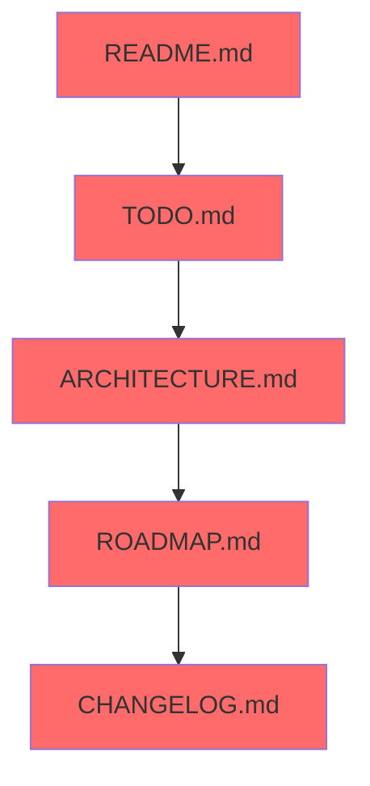
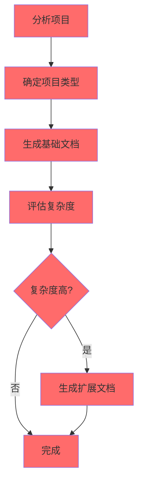
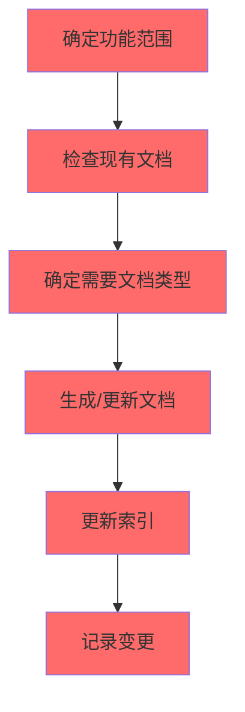
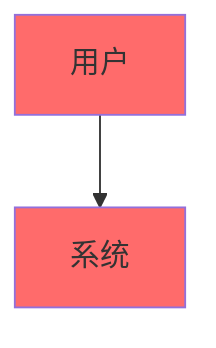

# 文档生成流程指南

## 目录
- [概述](#概述)
- [基础文档清单](#基础文档清单)
- [生成场景与流程](#生成场景与流程)
- [操作情景](#操作情景)
- [注意事项](#注意事项)
- [流程检查清单](#流程检查清单)

---

## 概述

本文档定义项目文档生成的标准流程，帮助 Agent 正确生成、更新、修改和完善项目文档。

### 核心原则

1. **基础文档优先**：每个项目必须包含基础文档
2. **按需扩展**：根据项目类型和复杂度按需生成其他文档
3. **一致性保障**：确保文档间的数据、术语、功能名称一致
4. **版本控制**：所有文档变更必须记录在 CHANGELOG.md 中

---

## 基础文档清单

基础文档是每个项目必备的核心文档，位于项目根目录。

### 基础文档列表

| 文档 | 文件名 | 说明 | 优先级 |
|------|--------|------|--------|
| 项目概述 | `README.md` | 项目介绍、快速开始、功能说明 | P0 |
| 待办事项 | `TODO.md` | 待完成的功能和任务 | P0 |
| 变更日志 | `CHANGELOG.md` | 版本变更记录 | P0 |
| 路线图 | `ROADMAP.md` | 未来规划和里程碑 | P0 |
| 架构文档 | `ARCHITECTURE.md` | 系统架构和技术选型 | P1 |

### 基础文档生成顺序



---

## 生成场景与流程

### 场景一：整体新项目 Wiki

#### 适用场景
- 从零开始的新项目
- 首次为项目建立文档体系

#### 生成流程



#### 步骤详解

**步骤 1：分析项目**
- 项目名称和用途
- 技术栈（语言、框架、数据库）
- 项目规模（代码行数、模块数）
- 团队规模

**步骤 2：确定项目类型**
- Web 应用
- API 服务
- 移动应用
- 工具库
- 数据处理系统

**步骤 3：生成基础文档**
- README.md（项目概述）
- TODO.md（待办事项）
- CHANGELOG.md（变更日志）
- ROADMAP.md（路线图）
- ARCHITECTURE.md（架构文档）

**步骤 4：评估复杂度**
- 代码行数 > 10000
- 模块数 > 5
- 参与人员 > 3
- 有外部依赖

**步骤 5：生成扩展文档（如需要）**
- API 文档
- 数据库 ER 图
- 部署文档
- 测试文档

---

### 场景二：部分功能的文档

#### 适用场景
- 为现有项目添加新功能文档
- 补充缺失的文档
- 更新现有文档

#### 生成流程



#### 步骤详解

**步骤 1：确定功能范围**
- 新增功能模块
- 功能修改范围
- 影响到的模块

**步骤 2：检查现有文档**
- 是否存在相关文档
- 文档是否需要更新
- 文档结构是否合理

**步骤 3：确定需要文档类型**
- 功能文档（功能说明）
- API 文档（接口定义）
- 数据库文档（数据模型）
- 测试文档（测试用例）

**步骤 4：生成/更新文档**
- 创建新文档
- 或更新现有文档

**步骤 5：更新索引**
- 更新 README.md 的目录
- 更新相关链接

**步骤 6：记录变更**
- 更新 CHANGELOG.md

---

## 操作情景

### 情景一：生成（Create）

#### 触发条件
- 新项目初始化
- 新功能开发完成
- 新模块创建

#### 操作步骤

1. **确认文档类型**
   - 基础文档：直接生成
   - 扩展文档：按需生成

2. **选择模板**
   - 参考 `references/templates/` 下的模板
   - 根据项目类型选择对应模板

3. **填充内容**
   - 替换占位符
   - 补充项目信息
   - 添加 Mermaid 图表

4. **校验一致性**
   - 检查术语一致性
   - 检查功能名称一致性
   - 检查版本号一致性

5. **更新索引**
   - 更新 README.md 目录
   - 更新相关引用

---

### 情景二：更新（Update）

#### 触发条件
- 项目信息变更
- 版本升级
- 重大功能更新

#### 操作步骤

1. **确定更新范围**
   - 哪些文档需要更新
   - 更新的具体内容

2. **备份现有文档**
   - 记录当前版本
   - 保存历史版本

3. **执行更新**
   - 修改文档内容
   - 保持格式一致

4. **校验一致性**
   - 确保与其他文档一致
   - 确保数据准确

5. **记录变更**
   - 在 CHANGELOG.md 中记录
   - 说明变更原因

---

### 情景三：修改（Modify）

#### 触发条件
- 修复文档错误
- 优化文档结构
- 响应反馈意见

#### 操作步骤

1. **识别修改点**
   - 错误内容
   - 冗余内容
   - 结构问题

2. **评估影响**
   - 修改是否影响其他文档
   - 是否需要同步修改

3. **执行修改**
   - 最小化修改原则
   - 保持格式一致

4. **验证完整性**
   - 检查链接是否有效
   - 检查格式是否正确

5. **记录变更**
   - 更新 CHANGELOG.md

---

### 情景四：完善（Enhance）

#### 触发条件
- 补充细节
- 添加图表
- 优化表达

#### 操作步骤

1. **识别完善点**
   - 缺少示例
   - 缺少图表
   - 表达不清

2. **制定完善计划**
   - 补充内容清单
   - 优先级排序

3. **执行完善**
   - 添加示例代码
   - 添加 Mermaid 图表
   - 优化文档结构

4. **验证质量**
   - 检查内容准确性
   - 检查表达清晰度

5. **记录变更**
   - 更新 CHANGELOG.md

---

## 注意事项

### 1. 流程完整性

- [ ] 每个文档生成/更新都有明确流程
- [ ] 流程包含校验步骤
- [ ] 流程包含变更记录

### 2. 文档一致性

#### 数据一致性
- [ ] 版本号统一
- [ ] 日期格式统一
- [ ] 数字格式统一

#### 术语一致性
- [ ] 专业术语统一
- [ ] 缩写统一
- [ ] 命名风格统一

#### 功能函数名一致性
- [ ] 代码中的名称与文档一致
- [ ] API 名称与实现一致
- [ ] 数据库表名与文档一致

#### 版本一致性
- [ ] CHANGELOG.md 版本与实际一致
- [ ] README.md 版本与实际一致
- [ ] 所有文档版本同步

### 3. 版本控制

- [ ] 每次变更记录到 CHANGELOG.md
- [ ] 变更记录包含日期
- [ ] 变更记录包含变更类型
- [ ] 变更记录包含变更描述

### 4. 图文结合

#### 架构图

- [ ] 系统架构使用架构图
- [ ] 包含分层架构图

#### 流程图
- [ ] 业务流程使用流程图
- [ ] 清晰展示步骤和决策点

#### 数据流动图
- [ ] 数据流动使用时序图或流程图
- [ ] 标注数据方向

#### ER 图
- [ ] 数据库设计使用 ER 图
- [ ] 包含实体和关系

#### 用例图
- [ ] 功能需求使用用例图
- [ ] 包含角色和用例

### 5. 文档结构与长度控制

#### 结构控制
- [ ] 文档有清晰的目录
- [ ] 目录层级不超过 3 层
- [ ] 相关文档放在同一目录

#### 长度控制
- [ ] 单个文档不超过 500 行
- [ ] 超过则拆分为多个文档
- [ ] 拆分的文档有索引说明

#### 索引说明
```markdown
## 文档索引

| 文档 | 说明 |
|------|------|
| [README.md](./README.md) | 项目概述 |
| [API/](api/) | API 文档目录 |
| [数据库/](database/) | 数据库文档目录 |
```
- [ ] README.md 包含文档索引
- [ ] 目录有 README.md 说明内容

---

## 流程检查清单

### 生成前检查

- [ ] 确认项目类型和规模
- [ ] 确认需要生成的文档列表
- [ ] 确认使用哪个模板

### 生成中检查

- [ ] 替换所有占位符
- [ ] 添加 Mermaid 图表
- [ ] 检查格式一致性

### 生成后检查

- [ ] 检查所有链接有效
- [ ] 检查术语一致性
- [ ] 检查版本号一致
- [ ] 更新 CHANGELOG.md
- [ ] 更新 README.md 索引

### 质量检查

- [ ] 文档内容完整
- [ ] 表达清晰准确
- [ ] 图表正确易懂
- [ ] 结构合理清晰

---

## 参考资料

- [文档命名规范](naming-conventions.md)
- [文档模板目录](../templates/)
- [CHANGELOG 指南](changelog-guide.md)
- [架构设计指南](../architecture/architecture-design-guide.md)
