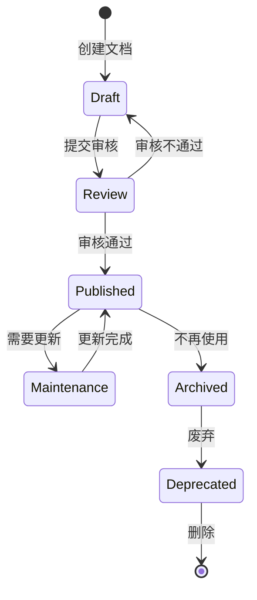
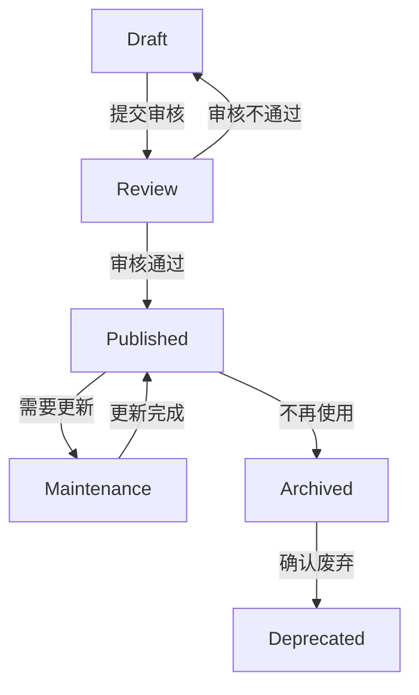
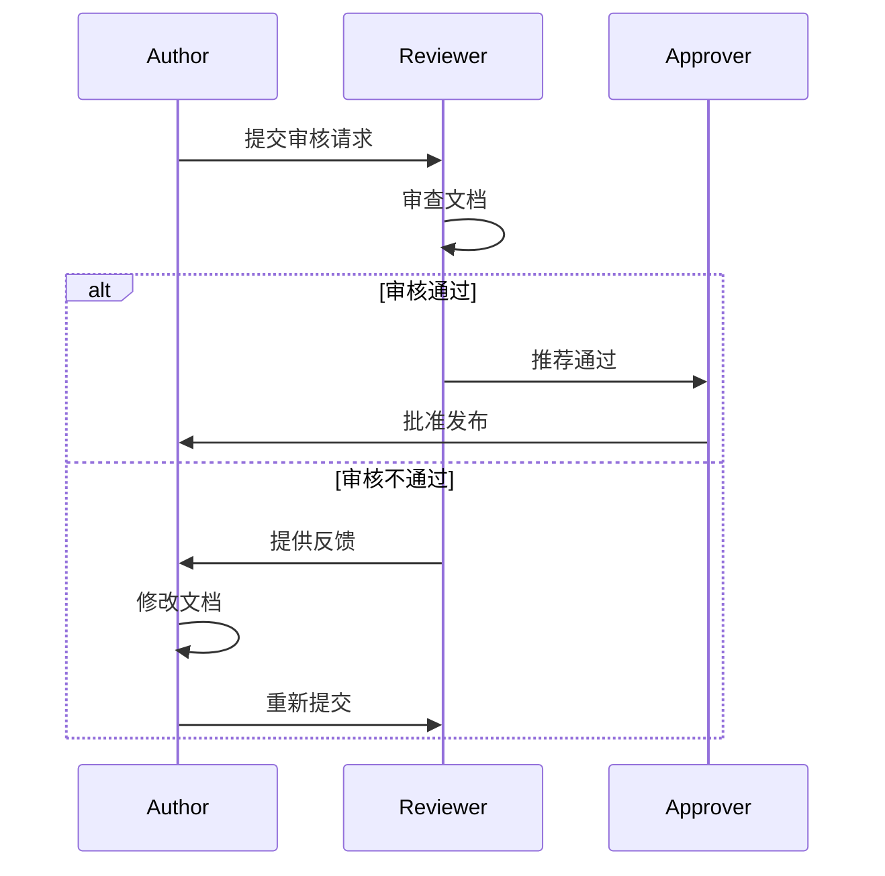

# 文档生命周期管理指南

## 目录

1. [概述](#概述)
2. [生命周期阶段](#生命周期阶段)
3. [状态定义](#状态定义)
4. [状态转换](#状态转换)
5. [审查流程](#审查流程)
6. [版本管理](#版本管理)
7. [归档策略](#归档策略)
8. [最佳实践](#最佳实践)
9. [工具支持](#工具支持)

---

## 概述

文档生命周期管理是指对文档从创建到废弃的整个过程进行系统化管理。通过定义清晰的阶段、状态和转换规则，确保文档的质量、一致性和可维护性。

### 为什么需要文档生命周期管理

✅ **质量控制**：确保文档经过审查才能发布
✅ **可追溯性**：记录文档的所有变更历史
✅ **一致性**：统一文档的创建和更新流程
✅ **可维护性**：定期更新和归档过时文档
✅ **合规性**：满足行业和组织的文档管理要求

---

## 生命周期阶段

文档生命周期包含以下 6 个阶段：



### 1. 创建（Draft）

**定义**：文档的初始创建阶段

**特点**：
- 文档内容不完整
- 可能存在错误或遗漏
- 可以自由修改和调整

**操作**：
- 创建新文档
- 编写文档内容
- 自我审查和修改

**负责人**：文档作者

### 2. 审核（Review）

**定义**：文档的审查和验证阶段

**特点**：
- 文档内容完整
- 需要他人审查
- 根据反馈修改

**操作**：
- 提交审核请求
- 同行审查
- 根据反馈修改

**负责人**：审查者（可以是技术负责人、架构师等）

### 3. 发布（Published）

**定义**：文档正式发布阶段

**特点**：
- 文档内容完整且经过验证
- 对外可见
- 需要维护

**操作**：
- 正式发布
- 通知相关人员
- 建立索引

**负责人**：文档所有者

### 4. 维护（Maintenance）

**定义**：文档的维护和更新阶段

**特点**：
- 文档需要定期更新
- 可能需要补充新内容
- 修正错误

**操作**：
- 定期检查
- 更新内容
- 记录变更

**负责人**：文档所有者

### 5. 归档（Archived）

**定义**：文档的归档阶段

**特点**：
- 文档不再活跃使用
- 但仍有参考价值
- 需要保留历史记录

**操作**：
- 标记为归档
- 移动到归档目录
- 更新索引

**负责人**：文档管理员

### 6. 废弃（Deprecated）

**定义**：文档的废弃阶段

**特点**：
- 文档不再有参考价值
- 可以安全删除
- 需要记录废弃原因

**操作**：
- 标记为废弃
- 记录废弃原因
- 删除文档

**负责人**：文档管理员

---

## 状态定义

### 状态列表

| 状态 | 英文 | 颜色标识 | 说明 |
|------|------|----------|------|
| 草稿 | Draft | 🟡 灰色 | 文档初始创建阶段 |
| 审核 | Review | 🟠 橙色 | 文档审查阶段 |
| 发布 | Published | 🟢 绿色 | 文档已发布 |
| 维护 | Maintenance | 🔵 蓝色 | 文档维护阶段 |
| 归档 | Archived | 🟣 紫色 | 文档已归档 |
| 废弃 | Deprecated | 🔴 红色 | 文档已废弃 |

### 状态标签

在文档中添加状态标签：

```markdown
> **状态**: 🟢 Published
> **版本**: v1.0.0
> **最后更新**: 2024-02-21
> **负责人**: 张三
```

---

## 状态转换

### 转换规则

| 当前状态 | 可转换状态 | 触发条件 | 负责人 |
|----------|------------|----------|--------|
| Draft | Review | 文档内容完整 | 作者 |
| Review | Draft | 审核不通过，需要修改 | 审查者 |
| Review | Published | 审核通过 | 审查者 |
| Published | Maintenance | 需要更新内容 | 作者/负责人 |
| Maintenance | Published | 更新完成 | 作者/负责人 |
| Published | Archived | 不再使用 | 文档管理员 |
| Archived | Deprecated | 确认无参考价值 | 文档管理员 |

### 转换流程



### 转换记录

每次状态转换都需要记录：

```markdown
## 状态历史

| 日期 | 从状态 | 到状态 | 操作人 | 原因 |
|------|--------|--------|--------|------|
| 2024-02-20 | - | Draft | 张三 | 创建文档 |
| 2024-02-21 | Draft | Review | 张三 | 提交审核 |
| 2024-02-22 | Review | Published | 李四 | 审核通过 |
```

---

## 审查流程

### 审查类型

| 审查类型 | 审查者 | 审查内容 |
|----------|--------|----------|
| 同行审查 | 同事 | 内容准确性、完整性 |
| 技术审查 | 技术专家 | 技术准确性、可行性 |
| 架构审查 | 架构师 | 架构一致性、设计合理性 |
| 产品审查 | 产品经理 | 需求符合性、用户体验 |
| 法务审查 | 法务人员 | 法律合规性 |

### 审查流程



### 审查清单

**内容审查**：
- [ ] 内容完整，无遗漏
- [ ] 内容准确，无错误
- [ ] 逻辑清晰，易于理解
- [ ] 格式规范，符合标准

**技术审查**：
- [ ] 技术方案可行
- [ ] 架构设计合理
- [ ] 代码示例正确
- [ ] 最佳实践遵循

**产品审查**：
- [ ] 需求完整
- [ ] 用户体验良好
- [ ] 功能描述准确
- [ ] 场景覆盖全面

---

## 版本管理

### 版本号规范

使用语义化版本号（Semantic Versioning）：

```
主版本号.次版本号.修订号

例如：1.0.0、1.1.0、2.0.0
```

**版本号规则**：
- **主版本号**：不兼容的 API 修改
- **次版本号**：向下兼容的功能新增
- **修订号**：向下兼容的问题修正

### 版本历史

在文档中记录版本历史：

```markdown
## 版本历史

| 版本 | 日期 | 变更说明 | 负责人 |
|------|------|----------|--------|
| v1.0.0 | 2024-02-21 | 初始版本 | 张三 |
| v1.1.0 | 2024-03-01 | 新增章节：数据流动 | 李四 |
| v2.0.0 | 2024-04-01 | 重构架构部分 | 王五 |
```

### 版本标签

在文档中使用标签标记版本：

```markdown
> **当前版本**: v2.0.0
> **最后更新**: 2024-04-01
```

---

## 归档策略

### 归档条件

文档满足以下条件之一时应该归档：

- [ ] 不再被频繁访问（3 个月以上无访问记录）
- [ ] 内容已被新文档替代
- [ ] 相关功能已被废弃或重构
- [ ] 项目已结束或暂停

### 归档流程

1. **评估归档必要性**
   - 检查访问记录
   - 评估参考价值
   - 确认替代文档

2. **标记归档**
   - 更新文档状态
   - 添加归档标签
   - 记录归档原因

3. **移动归档**
   - 移动到归档目录
   - 更新索引
   - 通知相关人员

4. **定期清理**
   - 定期检查归档文档
   - 确认是否可以删除
   - 执行删除操作

### 归档目录结构

```
docs/
├── active/                 # 活跃文档
├── archived/               # 归档文档
│   ├── 2023/              # 按年份归档
│   └── 2024/
└── deprecated/            # 废弃文档
```

---

## 最佳实践

### 1. 明确责任分工

- **作者**：负责文档创建和更新
- **审查者**：负责文档审查和验证
- **管理员**：负责文档归档和维护

### 2. 定期审查

- 每季度审查一次文档状态
- 检查文档是否需要更新
- 清理过期文档

### 3. 自动化管理

- 使用自动化工具跟踪状态
- 自动生成状态报告
- 自动发送审查提醒

### 4. 记录完整历史

- 记录所有状态转换
- 记录版本历史
- 记录审查意见

### 5. 保持简洁

- 不要过度复杂化流程
- 根据项目规模调整
- 避免不必要的审批环节

---

## 工具支持

### 生命周期管理脚本

使用 `lifecycle_manager.py` 管理文档生命周期：

```bash
# 初始化文档生命周期
python3 scripts/utils/lifecycle_manager.py init docs/api-doc.md

# 更新文档状态
python3 scripts/utils/lifecycle_manager.py update docs/api-doc.md --status Published

# 生成生命周期报告
python3 scripts/utils/lifecycle_manager.py report

# 检查过期文档
python3 scripts/utils/lifecycle_manager.py check-expired
```

### 文档模板

使用文档生命周期模板：

```bash
# 复制模板
cp references/templates/lifecycle/doc-lifecycle.md docs/api-doc.md

# 填写生命周期信息
vim docs/api-doc.md
```

---

## 参考资料

- [文档命名规范](naming-conventions.md)
- [SKILL.md](../../../SKILL.md)
- [生命周期管理脚本](../../../scripts/utils/lifecycle_manager.py)
