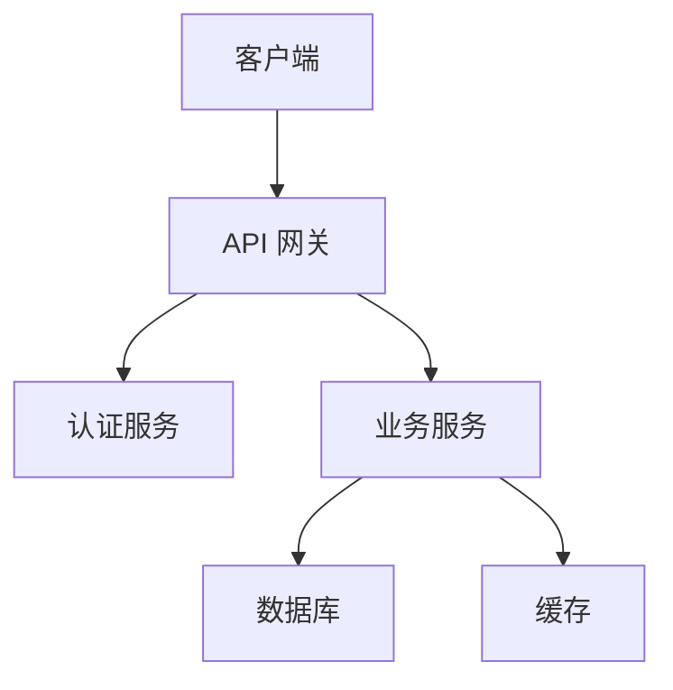
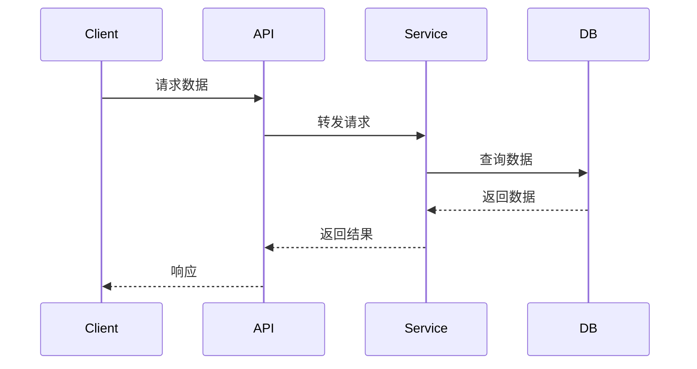

# 文档命名规范

## 目录

1. [概述](#概述)
2. [标准文档命名](#标准文档命名)
3. [目录结构规范](#目录结构规范)
4. [文件命名规则](#文件命名规则)
5. [最佳实践](#最佳实践)

---

## 概述

统一的文档命名规范有助于提高项目的可维护性和可读性。本文档定义了 ProjectWiki 项目中所有标准文档的命名规范。

### 为什么要使用命名规范

✅ **一致性**：整个项目使用统一的命名规则
✅ **可预测性**：开发者能快速找到需要的文档
✅ **自动化**：支持自动化工具识别和处理
✅ **专业性**：提升项目整体质量

---

## 标准文档命名

### 核心文档（项目根目录）

| 文档名 | 用途 | 说明 | 优先级 |
|--------|------|------|--------|
| `README.md` | 项目介绍 | 项目概述、快速开始、基本用法 | ⭐⭐⭐ |
| `ROADMAP.md` | 路线图 | 项目发展规划、里程碑、功能计划 | ⭐⭐⭐ |
| `CHANGELOG.md` | 变更日志 | 记录所有版本的重要变更 | ⭐⭐⭐ |
| `ARCHITECTURE.md` | 架构文档 | 系统架构、技术选型、设计决策 | ⭐⭐⭐ |
| `CONTRIBUTING.md` | 贡献指南 | 如何参与贡献、开发规范 | ⭐⭐ |
| `LICENSE` | 许可证 | 开源许可证 | ⭐⭐⭐ |
| `.gitignore` | Git 忽略 | Git 忽略规则配置 | ⭐⭐⭐ |

### 详细说明

#### 1. ROADMAP.md - 路线图

**用途**：项目发展规划、里程碑、功能计划

**格式**：
```markdown
# 路线图

## 当前版本
v1.0.0

## 未来规划

### v1.1.0 - Q2 2025
- 订单管理模块
- 支付集成

### v1.2.0 - Q3 2025
- 用户数据分析
- 推荐系统

### v2.0.0 - Q4 2025
- 微服务重构
- 多语言支持
```

**最佳实践**：
- 按版本规划功能
- 标注大致时间点
- 保持可实现的计划
- 定期更新路线图

**用途**：记录所有版本的重要变更

**格式**：
```markdown
# Changelog

All notable changes to this project will be documented in this file.

The format is based on [Keep a Changelog](https://keepachangelog.com/),
and this project adheres to [Semantic Versioning](https://semver.org/spec/v2.0.0.html).

## [Unreleased]

### Added
- 新功能描述

### Changed
- 功能变更描述

### Deprecated
- 即将废弃的功能

### Removed
- 已移除的功能

### Fixed
- 问题描述和修复说明

### Security
- 安全相关变更

## [1.0.0] - 2024-01-15

### Added
- 初始版本发布
- 实现核心功能
```

**最佳实践**：
- 遵循 [Keep a Changelog](https://keepachangelog.com/) 规范
- 使用语义化版本号
- 每次发布更新 CHANGELOG
- 保持格式一致

#### 3. ROADMAP.md - 路线图

**用途**：项目发展规划、里程碑、时间线

**格式**：
```markdown
# 路线图

## 当前阶段：v1.0.0（预计 2024 Q2）

### 核心功能
- [x] 基础框架搭建
- [x] 用户认证系统
- [ ] 数据可视化
- [ ] 报告生成

### 里程碑
- [ ] Alpha 测试（2024-03-01）
- [ ] Beta 测试（2024-04-01）
- [ ] 正式发布（2024-06-01）

## 计划阶段：v2.0.0（预计 2024 Q4）

### 新功能
- [ ] 多租户支持
- [ ] 高级分析功能
- [ ] API 网关集成

### 技术升级
- [ ] 迁移到新框架
- [ ] 优化数据库性能
- [ ] 增强安全性

## 未来规划

### 可能的功能
- 移动端应用
- 实时协作
- AI 辅助分析

### 长期目标
- 成为行业标准工具
- 支持多种部署方式
- 建立生态系统
```

**最佳实践**：
- 按版本或阶段组织
- 使用复选框标记进度
- 提供时间预估
- 定期更新

#### 4. ARCHITECTURE.md - 架构文档

**用途**：系统架构、技术选型、设计决策

**格式**：
```markdown
# 系统架构

## 概述

简要描述系统架构和设计理念。

## 技术栈

### 后端
- 框架：Django 4.2
- 数据库：PostgreSQL 15
- 缓存：Redis 7
- 消息队列：Celery

### 前端
- 框架：React 18
- 状态管理：Redux Toolkit
- UI 库：Ant Design 5
- 构建工具：Vite

## 架构设计

### 系统架构图



### 模块划分

| 模块 | 职责 | 技术栈 |
|------|------|--------|
| 认证模块 | 用户认证和授权 | JWT + Redis |
| 业务模块 | 核心业务逻辑 | Django + Celery |
| 数据模块 | 数据存储和查询 | PostgreSQL + Redis |

## 数据流动



## 设计决策

### 为什么选择 Django？

**理由**：
- 成熟稳定，社区活跃
- 内置管理后台
- 完善的 ORM 系统
- 丰富的第三方库

**替代方案**：FastAPI（性能更好，但生态系统较小）

### 为什么使用 PostgreSQL？

**理由**：
- 支持复杂查询
- 优秀的并发性能
- 丰富的数据类型（JSONB、数组）
- ACID 事务支持

**替代方案**：MySQL（更广泛使用，但功能较少）

## 部署架构

### 开发环境
- 本地开发，使用 Docker Compose

### 测试环境
- 单机部署，使用 Kubernetes

### 生产环境
- 高可用集群，使用 Kubernetes + CDN

## 扩展性设计

### 水平扩展
- 无状态服务设计
- 数据库读写分离
- 缓存集群

### 垂直扩展
- 数据库优化
- 代码优化
- 硬件升级

## 安全性

### 认证和授权
- JWT Token 认证
- RBAC 权限模型
- API 限流

### 数据安全
- 数据库加密
- 传输加密（HTTPS）
- 敏感数据脱敏

### 安全审计
- 操作日志记录
- 异常监控
- 定期安全扫描

## 性能优化

### 数据库优化
- 索引优化
- 查询优化
- 连接池管理

### 缓存策略
- Redis 缓存热点数据
- CDN 缓存静态资源
- 浏览器缓存

### 代码优化
- 异步处理
- 批量操作
- 算法优化

## 监控和日志

### 监控
- Prometheus + Grafana
- 应用性能监控
- 系统资源监控

### 日志
- ELK Stack（Elasticsearch + Logstash + Kibana）
- 结构化日志
- 日志分级

## 参考资料

- [Django 官方文档](https://docs.djangoproject.com/)
- [React 官方文档](https://react.dev/)
- [PostgreSQL 官方文档](https://www.postgresql.org/docs/)
```

**最佳实践**：
- 使用 Mermaid 图表可视化
- 说明技术选型理由
- 记录设计决策
- 包含部署架构
- 考虑扩展性和安全性

---

## 目录结构规范

### 推荐的项目结构

```
project/
├── README.md              # 项目介绍
├── ROADMAP.md             # 路线图
├── CHANGELOG.md           # 变更日志
├── ARCHITECTURE.md        # 架构文档
├── CONTRIBUTING.md        # 贡献指南
├── LICENSE                # 许可证
├── .gitignore             # Git 忽略
├── wiki/                  # 文档目录（除基础文档外的所有文档）
│   ├── api/              # API 文档
│   ├── database/         # 数据库文档
│   ├── usecase/          # 用例文档
│   ├── deployment/       # 部署文档
│   ├── guides/           # 指南文档
│   └── examples/         # 示例代码
├── src/                  # 源代码
├── tests/                # 测试代码
└── scripts/              # 脚本工具
```

---

## 文件命名规则

### 通用规则

1. **使用小写字母**：文件名全部使用小写字母
2. **使用连字符分隔**：多个单词使用连字符（`-`）分隔
3. **使用有意义的名称**：文件名应该描述文件内容
4. **避免空格**：文件名中不要包含空格
5. **避免特殊字符**：只使用字母、数字、连字符和下划线

### 示例

| 推荐 | 不推荐 | 原因 |
|------|--------|------|
| `user-auth.md` | `UserAuth.md` | 使用小写字母 |
| `api-doc.md` | `api doc.md` | 避免空格 |
| `data-flow.md` | `dataflow.md` | 使用连字符分隔 |
| `quick-start.md` | `quick_start.md` | 使用连字符而非下划线 |

### 特殊文件

| 文件名 | 用途 | 是否可修改 |
|--------|------|------------|
| `README.md` | 项目介绍 | ✅ |
| `ROADMAP.md` | 路线图 | ✅ |
| `CHANGELOG.md` | 变更日志 | ✅ |
| `ARCHITECTURE.md` | 架构文档 | ✅ |
| `CONTRIBUTING.md` | 贡献指南 | ✅ |
| `LICENSE` | 许可证 | ❌ |
| `.gitignore` | Git 忽略 | ✅ |

---

## 最佳实践

### 1. 保持一致性

在整个项目中使用相同的命名规范，避免不一致。

### 2. 使用描述性名称

文件名应该清楚地描述文件的内容，而不是使用缩写或不明确的名称。

**推荐**：
- `user-authentication-guide.md`
- `database-schema-design.md`

**不推荐**：
- `ua-guide.md`
- `db-schema.md`

### 3. 定期维护

- 定期更新 ROADMAP.md，规划功能和里程碑
- 每次发布更新 CHANGELOG.md
- 架构变更时更新 ARCHITECTURE.md

### 4. 使用工具

使用自动化工具来检查和维护文档命名规范。

**推荐工具**：
- `markdownlint`：Markdown 文件检查
- `lychee`：链接检查
- `markdown-link-check`：Markdown 链接检查

### 5. 文档审查

在代码审查中包含文档审查，确保文档命名和内容符合规范。

---

## 参考资料

- [Keep a Changelog](https://keepachangelog.com/)
- [Semantic Versioning](https://semver.org/spec/v2.0.0.html)
- [GitHub README Guide](https://docs.github.com/en/github/creating-cloning-and-archiving-repositories/creating-a-repository-on-github/about-readmes)
- [Writing Documentation](https://www.writethedocs.org/guide/writing/beginners-guide-to-docs/)
