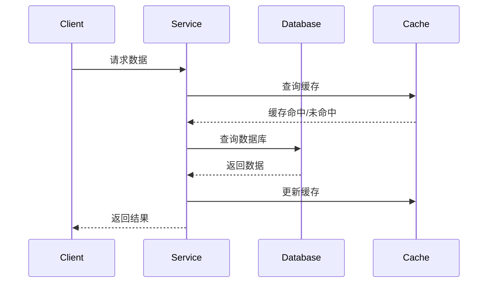
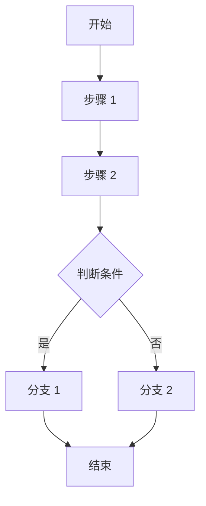
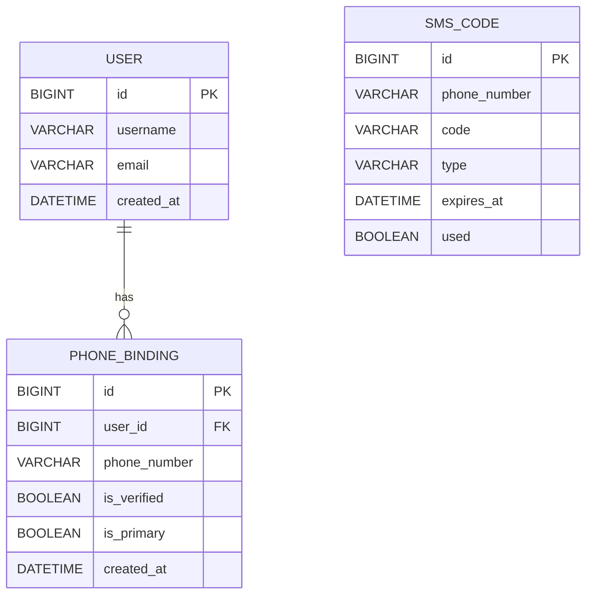
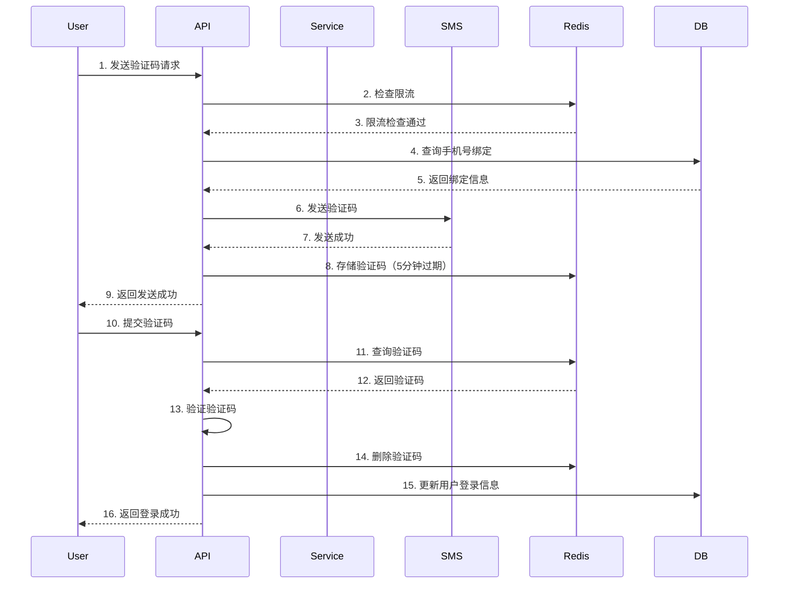
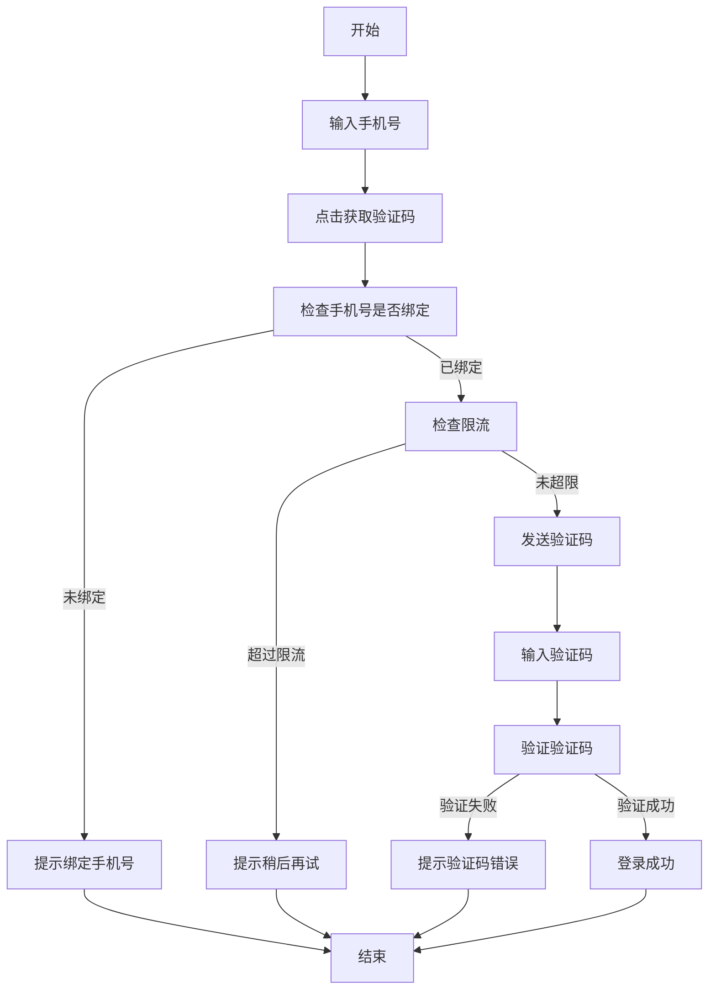

# 需求文档指南

## 目录

- [文档概述](#文档概述)
- [编写目的](#编写目的)
- [文档结构](#文档结构)
- [编写规范](#编写规范)
- [数据一致性设计](#数据一致性设计)
- [示例](#示例)

---

## 文档概述

需求文档是渐进式文档体系的**第二层**，基于功能文档进行深度分析，将用户需求转化为可执行的技术需求。

### 核心特点

- **深度分析**：对功能文档进行详细分析，提取技术细节
- **数据驱动**：重点设计数据模型和数据流程
- **接口定义**：定义清晰的接口规范
- **验收标准**：提供明确的验收标准

### 适用场景

- 功能需求详细分析
- 技术需求确定
- 数据模型设计
- 接口设计

---

## 编写目的

需求文档的主要目的是：

1. **需求细化**：将模糊的功能需求转化为清晰的技术需求
2. **数据设计**：设计数据模型，确保数据一致性
3. **接口定义**：定义接口规范，便于开发实现
4. **验收标准**：提供明确的验收标准

---

## 文档结构

### 标准结构

```markdown
# [需求名称]

## 功能来源
- 功能文档：[功能文档路径]
- 创建日期：[创建日期]
- 负责人：[负责人]

---

## 意图分析

### 用户意图
[基于功能文档的用户意图分析]

### 核心问题
[要解决的核心问题]

### 解决方向
[技术解决方向]

---

## 业务需求

### 功能需求
- [需求 1]
- [需求 2]

### 非功能性需求
- [非功能性需求 1]
- [非功能性需求 2]

### 约束条件
- [约束条件 1]
- [约束条件 2]

---

## 数据模型设计

### 核心实体

#### 实体 1：[实体名称]
- [字段 1]：[类型] - [说明]
- [字段 2]：[类型] - [说明]

**数据一致性规则**：
- [一致性规则 1]
- [一致性规则 2]

#### 实体 2：[实体名称]
...

### 实体关系

```mermaid
erDiagram
    ENTITY1 ||--o{ ENTITY2 : "关系描述"
    ENTITY2 {
        id PK
        name
        ...
    }
    ENTITY1 {
        id PK
        ...
    }
```

### 数据流动



### 数据一致性保证

#### 事务一致性
- [事务规则描述]

#### 缓存一致性
- [缓存策略描述]

#### 分布式一致性
- [分布式策略描述]

---

## 接口设计

### 接口列表
| 接口名称 | 方法 | 路径 | 说明 |
|---------|------|------|------|
| [接口 1] | POST | /api/xxx | [说明] |
| [接口 2] | GET | /api/xxx | [说明] |

### 详细接口设计

#### 接口 1：[接口名称]

**请求**
```json
{
  "field1": "value1",
  "field2": "value2"
}
```

**响应**
```json
{
  "code": 0,
  "message": "success",
  "data": {
    "field1": "value1"
  }
}
```

**错误码**
| 错误码 | 说明 | 解决方案 |
|--------|------|----------|
| 1001 | [错误说明] | [解决方案] |

---

## 业务流程

### 流程图



### 流程说明
- [步骤 1 说明]
- [步骤 2 说明]

---

## 验收标准

### 功能验收
- [ ] [验收项 1]
- [ ] [验收项 2]

### 性能验收
- [ ] [性能指标 1]
- [ ] [性能指标 2]

### 数据一致性验收
- [ ] [一致性检查项 1]
- [ ] [一致性检查项 2]

### 安全验收
- [ ] [安全检查项 1]
- [ ] [安全检查项 2]

---

## 风险评估

### 技术风险
| 风险项 | 影响 | 概率 | 应对措施 |
|--------|------|------|----------|
| [风险 1] | 高/中/低 | 高/中/低 | [措施] |

### 业务风险
| 风险项 | 影响 | 概率 | 应对措施 |
|--------|------|------|----------|
| [风险 1] | 高/中/低 | 高/中/低 | [措施] |

---

## 参考文档
- [功能文档](../functional-docs/xxx.md)
- [架构文档](../architecture-docs/xxx.md)
```

---

## 编写规范

### 1. 意图分析

**原则**：深入理解用户意图，明确核心问题

**包含内容**：
- 用户意图：用户真正想要什么
- 核心问题：要解决什么问题
- 解决方向：技术解决思路

### 2. 业务需求

**功能需求**：明确的功能点

**非功能性需求**：
- 性能要求
- 可用性要求
- 安全性要求
- 可扩展性要求

**约束条件**：
- 技术约束
- 时间约束
- 资源约束

### 3. 数据模型设计（重点）

**原则**：确保数据一致性

**包含内容**：
- 核心实体定义
- 字段类型和约束
- 实体关系
- 数据流程
- 一致性保证机制

---

## 数据一致性设计

### 1. 事务一致性

**使用场景**：需要原子性操作的场景

**实现方式**：
- 使用数据库事务
- 定义事务边界
- 异常回滚策略

**示例**：
```python
# 转账事务
with transaction.atomic():
    # 扣款
    account_from.balance -= amount
    account_from.save()

    # 入账
    account_to.balance += amount
    account_to.save()
```

### 2. 缓存一致性

**使用场景**：读多写少的场景

**实现策略**：
- **Cache Aside**：先更新数据库，再删除缓存
- **Write Through**：同时更新数据库和缓存
- **Write Behind**：异步更新数据库

**示例**：
```python
# Cache Aside 模式
def update_user(user_id, data):
    # 1. 更新数据库
    db.update_user(user_id, data)

    # 2. 删除缓存
    cache.delete(f"user:{user_id}")

# 读取时
def get_user(user_id):
    # 1. 查询缓存
    user = cache.get(f"user:{user_id}")
    if user:
        return user

    # 2. 查询数据库
    user = db.get_user(user_id)

    # 3. 写入缓存
    cache.set(f"user:{user_id}", user, ttl=3600)

    return user
```

### 3. 分布式一致性

**使用场景**：微服务架构

**实现策略**：
- **强一致性**：两阶段提交（2PC）、TCC
- **最终一致性**：事件驱动、消息队列
- **本地消息表**：确保消息可靠投递

**示例**：
```python
# 事件驱动最终一致性
def create_order(order_data):
    # 1. 创建订单
    order = db.create_order(order_data)

    # 2. 发送事件
    event_bus.publish(OrderCreatedEvent(
        order_id=order.id,
        user_id=order.user_id,
        amount=order.amount
    ))

    return order

# 库存服务订阅事件
@event_bus.subscribe(OrderCreatedEvent)
def handle_order_created(event):
    # 扣减库存
    db.decrease_inventory(event.product_id, event.quantity)
```

### 4. 数据一致性检查

**检查项**：
- 实体完整性：主键不能为空
- 域完整性：字段类型和约束
- 引用完整性：外键关系
- 业务完整性：业务规则约束

**检查工具**：
- 数据库约束
- 应用层验证
- 定期数据一致性检查

---

## 示例

### 示例：手机号快速登录需求

```markdown
# 手机号快速登录需求

## 功能来源
- 功能文档：[手机号快速登录功能](../functional-docs/手机号快速登录功能.md)
- 创建日期：2024-01-15
- 负责人：张三

---

## 意图分析

### 用户意图
用户希望通过手机号快速登录，避免忘记密码的问题，提升登录成功率和用户体验。

### 核心问题
- 当前账号密码登录失败率高
- 用户经常忘记密码
- 登录流程不够便捷

### 解决方向
- 使用短信验证码替代密码
- 支持多个手机号绑定
- 优化登录流程

---

## 业务需求

### 功能需求
- 用户可以通过手机号登录
- 支持绑定多个手机号
- 支持选择任意绑定手机号登录
- 短信验证码登录
- 验证码 60 秒内发送

### 非功能性需求
- 登录成功率 > 95%
- 登录平均时间 < 3 秒
- 短信验证码 60 秒内到达
- 支持高并发（1000 QPS）
- 验证码有效期 5 分钟

### 约束条件
- 手机号必须已验证
- 每个手机号每天最多发送 5 条验证码
- 同一 IP 每小时最多发送 20 条验证码

---

## 数据模型设计

### 核心实体

#### 实体 1：User（用户表）
- `id`：BIGINT - 用户 ID（主键）
- `username`：VARCHAR(50) - 用户名
- `email`：VARCHAR(100) - 邮箱
- `created_at`：DATETIME - 创建时间
- `updated_at`：DATETIME - 更新时间

**数据一致性规则**：
- `username` 唯一
- `email` 唯一

#### 实体 2：PhoneBinding（手机号绑定表）
- `id`：BIGINT - 绑定 ID（主键）
- `user_id`：BIGINT - 用户 ID（外键）
- `phone_number`：VARCHAR(20) - 手机号
- `is_verified`：BOOLEAN - 是否验证
- `is_primary`：BOOLEAN - 是否主手机号
- `created_at`：DATETIME - 创建时间
- `updated_at`：DATETIME - 更新时间

**数据一致性规则**：
- `phone_number` 唯一
- 每个用户至少有一个主手机号
- 同一用户的主手机号只能有一个

#### 实体 3：SmsCode（短信验证码表）
- `id`：BIGINT - 验证码 ID（主键）
- `phone_number`：VARCHAR(20) - 手机号
- `code`：VARCHAR(6) - 验证码
- `type`：VARCHAR(20) - 类型（login/register/bind）
- `expires_at`：DATETIME - 过期时间
- `used`：BOOLEAN - 是否已使用
- `created_at`：DATETIME - 创建时间

**数据一致性规则**：
- 验证码 5 分钟后自动失效
- 验证码使用后立即失效

### 实体关系



### 数据流动



### 数据一致性保证

#### 事务一致性
- 创建用户和手机号绑定使用事务
- 验证码校验和登录信息更新使用事务

#### 缓存一致性
- 验证码存储在 Redis，设置 5 分钟过期
- 登录成功后立即删除验证码
- 用户信息使用 Cache Aside 策略

#### 分布式一致性
- 短信服务采用异步发送
- 使用消息队列确保短信发送可靠性
- 登录状态使用 JWT，无状态设计

---

## 接口设计

### 接口列表
| 接口名称 | 方法 | 路径 | 说明 |
|---------|------|------|------|
| 发送验证码 | POST | /api/auth/sms/send | 发送登录验证码 |
| 验证码登录 | POST | /api/auth/sms/login | 验证码登录 |
| 绑定手机号 | POST | /api/user/phone/bind | 绑定新手机号 |
| 解绑手机号 | DELETE | /api/user/phone/unbind | 解绑手机号 |
| 查询手机号列表 | GET | /api/user/phones | 查询已绑定手机号 |

### 详细接口设计

#### 接口 1：发送验证码

**请求**
```json
{
  "phone_number": "13800138000",
  "type": "login"
}
```

**响应**
```json
{
  "code": 0,
  "message": "验证码已发送",
  "data": {
    "expires_in": 300
  }
}
```

**错误码**
| 错误码 | 说明 | 解决方案 |
|--------|------|----------|
| 1001 | 手机号未绑定 | 请先绑定手机号 |
| 1002 | 发送频率过高 | 请稍后再试 |
| 1003 | 手机号格式错误 | 请输入正确的手机号 |

---

## 业务流程

### 登录流程



### 流程说明
1. 用户输入手机号
2. 点击获取验证码
3. 检查手机号是否已绑定
4. 检查发送频率限制
5. 发送验证码
6. 用户输入验证码
7. 验证验证码是否正确
8. 登录成功

---

## 验收标准

### 功能验收
- [ ] 用户可以通过已绑定手机号登录
- [ ] 用户可以绑定多个手机号
- [ ] 用户可以选择任意绑定手机号登录
- [ ] 验证码 60 秒内到达
- [ ] 验证码有效期为 5 分钟

### 性能验收
- [ ] 登录成功率 > 95%
- [ ] 登录平均时间 < 3 秒
- [ ] 支持 1000 QPS

### 数据一致性验收
- [ ] 手机号全局唯一
- [ ] 每个用户至少有一个主手机号
- [ ] 同一用户只有一个主手机号
- [ ] 验证码过期后自动失效
- [ ] 验证码使用后立即失效

### 安全验收
- [ ] 验证码加密传输
- [ ] 防止暴力破解验证码
- [ ] 限制发送频率
- [ ] IP 限流

---

## 风险评估

### 技术风险
| 风险项 | 影响 | 概率 | 应对措施 |
|--------|------|------|----------|
| 短信发送失败 | 高 | 中 | 使用备用短信服务商 |
| Redis 宕机 | 中 | 低 | 使用 Redis 集群 |
| 高并发性能 | 高 | 中 | 使用限流和缓存 |

### 业务风险
| 风险项 | 影响 | 概率 | 应对措施 |
|--------|------|------|----------|
| 用户手机号变更 | 中 | 高 | 支持手机号更换 |
| 验证码泄露 | 高 | 低 | 限制验证码有效期 |
| 恶意刷验证码 | 中 | 中 | IP 限流和验证码限流 |

---

## 参考文档
- [功能文档：手机号快速登录功能](../functional-docs/手机号快速登录功能.md)
- [架构文档：手机号登录系统架构](../architecture-docs/手机号登录系统架构.md)
```

---

## 最佳实践

1. **数据一致性优先**：重点设计数据模型和一致性保证机制
2. **接口清晰**：定义清晰的接口规范，便于开发实现
3. **验收标准明确**：提供可衡量的验收标准
4. **风险评估充分**：识别潜在风险并提供应对措施
5. **引用准确**：准确引用功能文档，确保可追溯性

---

## 相关文档

- [功能文档指南](functional-doc-guide.md)
- [架构文档指南](architecture-doc-guide.md)
- [需求文档模板](../templates/requirement-doc-template.md)
- [渐进式文档生成器](../../scripts/generate_progressive_doc.py)
