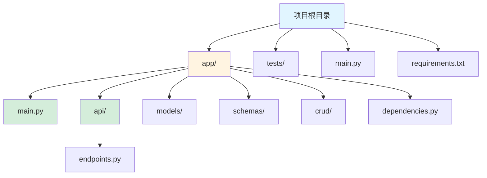
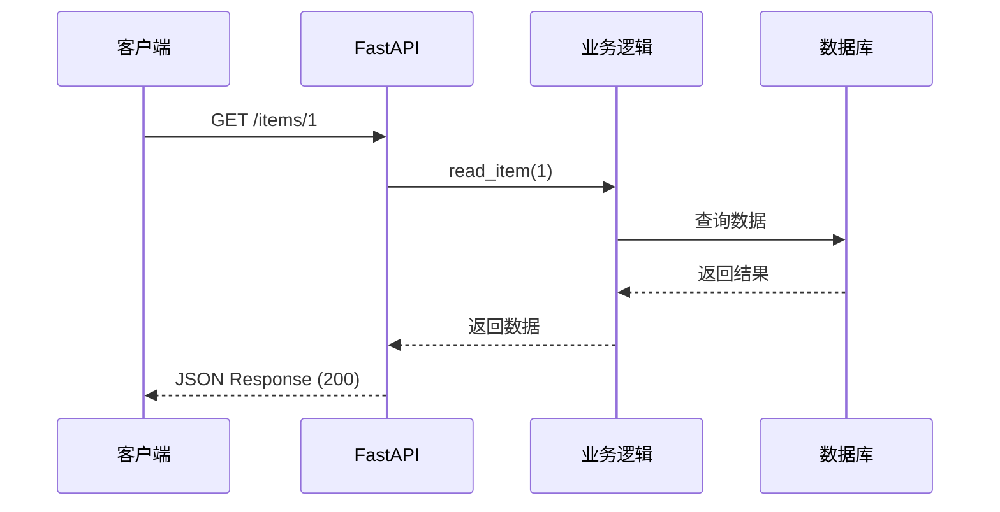

# FastAPI 框架指南

[🔙 返回框架索引](./index.md)

## 框架概述

FastAPI 是一个现代、快速的 Python Web 框架，用于构建 API。它基于标准的 Python 类型提示，使用 Pydantic 进行数据验证，自动生成交互式文档。

## 项目结构识别

### 关键文件/目录

| 文件/目录 | 说明 | 识别标记 |
|-----------|------|----------|
| `main.py` | 主应用文件 | 入口文件 |
| `requirements.txt` | 包含 `fastapi` 依赖 | 框架识别 |
| `app/` | 应用代码目录 | 应用目录 |
| `api/` | API 路由目录 | 路由目录 |
| `models/` | 数据模型目录 | 模型目录 |
| `schemas/` | Pydantic schemas | Schema 目录 |
| `dependencies/` | 依赖注入目录 | 依赖目录 |
| `routers/` | 路由分组 | 路由目录 |

### 典型项目结构

```
my-fastapi-app/
├── app/
│   ├── __init__.py
│   ├── main.py              # FastAPI 实例
│   ├── api/                # API 路由
│   │   ├── __init__.py
│   │   └── endpoints.py
│   ├── models/              # 数据模型
│   │   ├── __init__.py
│   │   └── item.py
│   ├── schemas/             # Pydantic schemas
│   │   └── item.py
│   ├── crud/                # 数据库操作
│   └── dependencies.py       # 依赖
├── tests/                   # 测试文件
├── main.py                  # 应用入口
├── requirements.txt
└── README.md
```



## 版本兼容性说明

### 推荐版本
- FastAPI 版本：≥ 0.100
- Python 版本：≥ 3.8
- Uvicorn 版本：≥ 0.23
- Pydantic 版本：≥ 2.0（FastAPI 0.100+）

### 已知不兼容场景
- FastAPI 0.100+ 与 Pydantic v1 不兼容
- Python 3.7 及以下版本不支持 FastAPI 0.100+
- 某些依赖（如 starlette）版本不匹配可能导致启动失败

### 迁移注意事项
- 从 FastAPI 0.99 迁移到 0.100+ 需要升级 Pydantic v2
- Pydantic v2 有 breaking changes，需要调整数据模型定义

## 文档生成要点

### 1. README 生成

**必选内容**：
- Python 环境要求（推荐 3.8+）
- 依赖安装：`pip install fastapi uvicorn[standard]`
- 运行开发服务器：`uvicorn main:app --reload`
- 自动文档访问：`http://localhost:8000/docs`
- ReDoc 文档访问：`http://localhost:8000/redoc`

**框架特性说明**：
- 自动生成交互式 API 文档（Swagger UI）
- 类型提示支持
- 异步支持（async/await）
- 数据验证（Pydantic）
- 依赖注入

### 2. API 文档生成

FastAPI 使用装饰器定义路由，文档应重点说明每个端点的功能。

**路由定义示例**：

```python
from fastapi import FastAPI, HTTPException
from pydantic import BaseModel

app = FastAPI()

class Item(BaseModel):
    name: str
    description: str | None = None
    price: float
    tax: float | None = None

@app.get("/items/{item_id}")
def read_item(item_id: int):
    """获取单个项目"""
    # 业务逻辑
    return {"item_id": item_id}

@app.post("/items/")
def create_item(item: Item):
    """创建新项目"""
    # 业务逻辑
    return item

@app.put("/items/{item_id}")
def update_item(item_id: int, item: Item):
    """更新项目"""
    # 业务逻辑
    return item
```

**API 文档应包含**：
- HTTP 方法（GET/POST/PUT/DELETE）
- 路由路径
- 路径参数（`{item_id}`）
- 查询参数（`?skip=0&limit=100`）
- 请求体（Pydantic model）
- 响应格式
- 状态码说明（200, 404, 422）
- 错误处理（HTTPException）

### 3. Schema 文档

FastAPI 使用 Pydantic models 进行数据验证。

**Schema 示例**：

```python
from pydantic import BaseModel, Field

class UserCreate(BaseModel):
    username: str = Field(..., min_length=3, max_length=50)
    email: str = Field(..., regex=r'^[^@]+@[^@]+\.[^@]+')
    age: int = Field(..., ge=0, le=120)
```

**Schema 文档应包含**：
- 字段名称和类型
- 验证规则（min_length, max_length, regex 等）
- 默认值
- 可选字段说明（`| None`）

## 特殊注意事项

1. **装饰器优先级**：`@app.get`, `@app.post`, `@app.put`, `@app.delete`
2. **路径参数**：使用 `{parameter_name}` 格式
3. **类型提示**：所有函数参数和返回值都需要类型提示
4. **异步支持**：使用 `async def` 定义异步路由
5. **自动文档**：FastAPI 自动生成 Swagger UI，无需额外配置

## Mermaid 图表示例

### API 路由结构

```mermaid
graph TB
    A[FastAPI App]
    B[GET /items]
    C[GET /items/{id}]
    D[POST /items]
    E[PUT /items/{id}]
    F[DELETE /items/{id}]
    
    A --> B
    A --> C
    A --> D
    A --> E
    A --> F
```

### 请求响应流



---

**参考资源**：
- [FastAPI 官方文档](https://fastapi.tiangolo.com/)
- [FastAPI 用户指南](https://fastapi.tiangolo.com/tutorial/)
