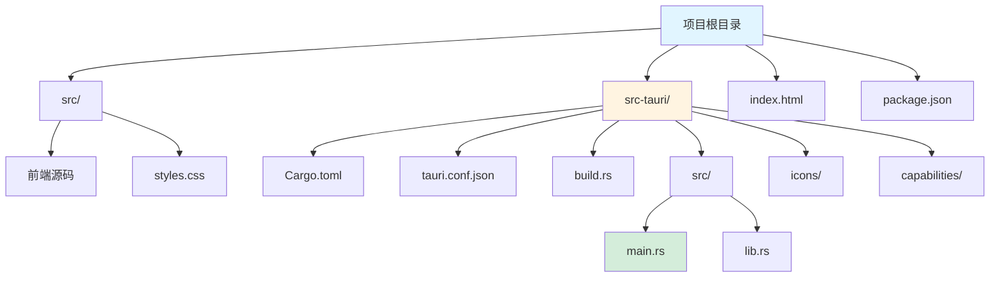
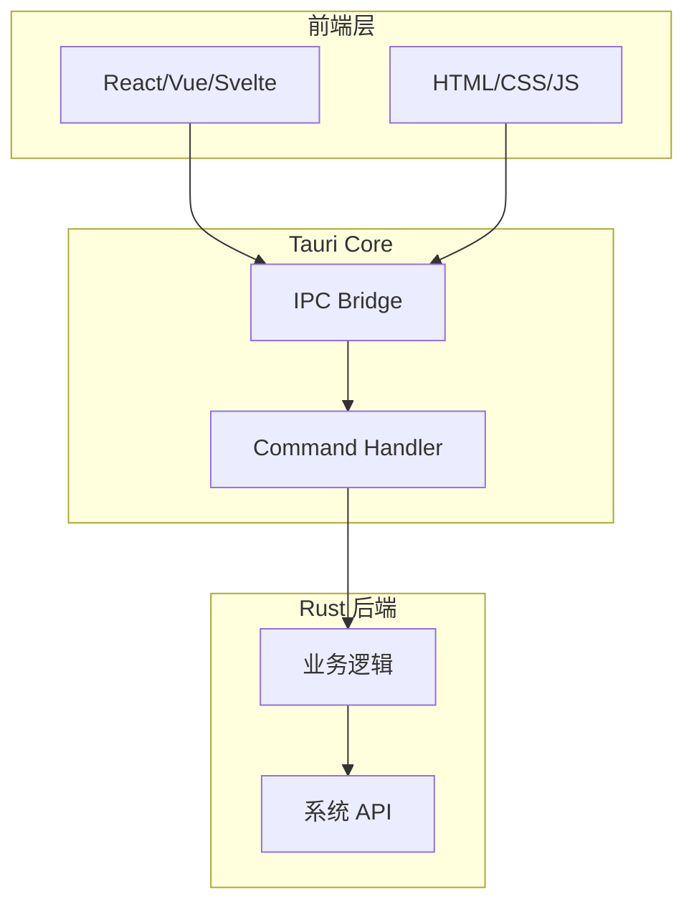
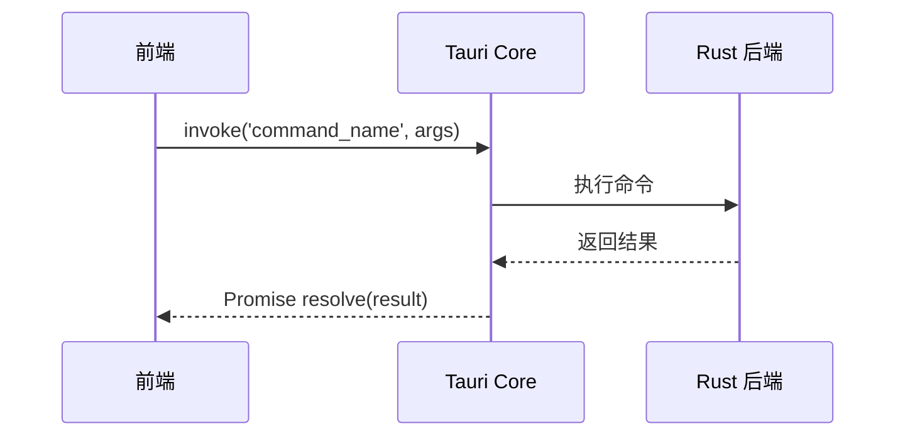

# Tauri 框架指南

[🔙 返回框架索引](./index.md)

## 框架概述

Tauri 是一个使用 Rust 作为后端、Web 技术作为前端构建跨平台桌面应用的框架。相比 Electron，它具有更小的体积、更高的安全性和更低的资源占用。

## 项目结构识别

### 关键文件/目录

| 文件/目录 | 说明 | 识别标记 |
|-----------|------|----------|
| `src-tauri/` | Rust 后端代码目录 | Tauri 标记 |
| `src-tauri/tauri.conf.json` | Tauri 主配置文件 | 框架识别 |
| `src-tauri/Cargo.toml` | Rust 项目依赖配置 | 语言识别 |
| `src-tauri/src/main.rs` | Rust 入口文件 | 代码入口 |
| `src-tauri/src/lib.rs` | Rust 库文件 | 业务逻辑 |
| `src-tauri/build.rs` | 构建脚本 | 构建配置 |
| `src-tauri/icons/` | 应用图标 | 资源目录 |
| `src-tauri/capabilities/` | 权限配置 | 安全配置 |
| `package.json` | 前端依赖配置 | 前端配置 |
| `index.html` | 主页面 | 前端入口 |

### 典型项目结构



**目录说明**：
- `src/` - 前端源码（JavaScript/TypeScript/CSS）
- `src-tauri/` - Rust 后端代码目录
- `index.html` - 主页面入口
- `package.json` - 前端依赖配置

## 版本兼容性说明

### 推荐版本
- Tauri 版本：≥ 1.5
- Rust 版本：≥ 1.70
- 前端框架：React ≥ 18 / Vue ≥ 3 / Svelte ≥ 4

### 已知不兼容场景
- Tauri v1.x 不兼容 macOS 14+（使用 v2）
- Rust 1.68 以下版本不支持某些 Tauri 特性
- Node.js 16 以下版本不支持最新 Tauri CLI

### 迁移注意事项
- 从 Tauri v1 迁移到 v2 需要重新配置 `tauri.conf.json`
- v2 中 `window` API 有 breaking changes，需要调整前端调用代码

## 文档生成要点

### 1. README 生成

**必选内容**：
- Tauri 和 Rust 环境要求
- 前端框架说明（React/Vue/Svelte 等）
- 安装步骤：
  - 安装 Rust 和 Node.js
  - 安装 Tauri CLI
  - 运行 `npm install` 和 `npm run tauri dev`
- 开发命令说明
- 构建命令说明

**架构说明**：
- 前后端通信机制（invoke commands）
- 安全模型（capabilities）
- 构建流程（前端打包 → Rust 编译）

### 2. API 文档生成

Tauri 使用 Rust `#[tauri::command]` 装饰器定义后端命令。

**命令格式示例**：

```rust
#[tauri::command]
fn greet(name: &str) -> String {
    format!("Hello, {}!", name)
}
```

**API 文档应包含**：
- 命令名称和功能说明
- 参数类型和说明
- 返回值类型和说明
- 前端调用示例（使用 `invoke`）

### 3. 依赖关系图

**前端 → 后端通信**：
```
Frontend (JavaScript) --invoke--> Tauri Commands (Rust)
```

**后端内部依赖**：
- 识别 Rust crate 依赖（来自 Cargo.toml）
- 生成模块依赖图

## 特殊注意事项

1. **前后端分离**：Tauri 项目本质上是两个项目（前端 + Rust 后端）的组合
2. **权限管理**：capabilities/ 目录定义了前端可以调用的后端命令
3. **跨平台**：需要分别说明 Windows/macOS/Linux 的差异
4. **构建流程**：先构建前端为静态文件，再由 Rust 打包

## Mermaid 图表示例

### 系统架构



### 数据流向



---

**参考资源**：
- [Tauri 官方文档](https://tauri.app/)
- [Tauri 快速开始](https://tauri.app/start/)
