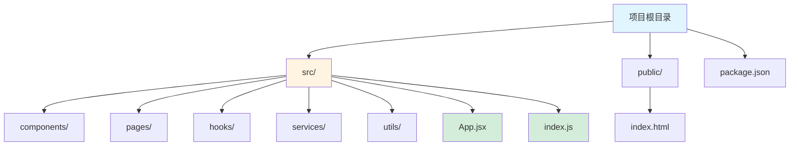

# React 框架指南

[🔙 返回框架索引](./index.md)

## 框架概述

React 是由 Facebook（现 Meta）开发的开源 JavaScript 库，用于构建用户界面。它采用组件化架构和虚拟 DOM 技术，是目前使用最广泛的前端框架之一。React 通过声明式编程让代码更易于理解和维护。

## 项目结构识别

### 关键文件/目录

| 文件/目录 | 说明 | 识别标记 |
|-----------|------|----------|
| `package.json` | 包含 `react` 依赖 | 框架识别 |
| `*.jsx` / `*.tsx` | React 组件文件 | 组件识别 |
| `src/` | 源代码目录 | 源码目录 |
| `public/` | 静态资源目录 | 资源目录 |
| `src/App.jsx` / `src/App.tsx` | 根组件 | 入口组件 |
| `src/index.js` / `src/index.tsx` | 应用入口 | 入口文件 |

### 典型项目结构

**目录说明**：
- `src/` - 源代码目录
- `public/` - 静态资源（HTML、图片等）
- `components/` - 可复用组件
- `pages/` - 页面组件
- `hooks/` - 自定义 Hooks
- `services/` - API 服务
- `utils/` - 工具函数
- `App.jsx` / `App.tsx` - 根组件
- `index.js` / `index.tsx` - 应用入口

## 版本兼容性说明

### 推荐版本
- React 版本：≥ 18
- Node.js 版本：≥ 16
- 推荐使用 TypeScript：≥ 5.0

### 已知不兼容场景
- React 18 与某些旧版本 UI 库不兼容
- Class 组件与 Hooks 混用可能导致问题
- React 17 及以下版本不支持并发特性

### 迁移注意事项
- 从 React 17 升级到 18 需要更新并发特性
- 从 Class 组件迁移到 Hooks 需要重构状态管理
- 注意 useEffect 的依赖数组正确性

## 文档生成要点

### README 生成

**必选内容**：
- 项目名称和简介
- 快速开始指南（安装依赖、启动项目）
- React 版本要求
- 主要依赖列表
- 开发脚本（`npm start` / `npm run dev`）

**可选内容**：
- 项目结构说明
- 组件示例代码
- 状态管理方案（Redux、Context、Zustand 等）
- 路由方案（React Router）
- 部署说明

### API 文档生成

**必选内容**：
- 组件属性（Props）说明
- 组件状态（State）说明
- 组件方法说明
- 事件处理器说明

**可选内容**：
- TypeScript 类型定义
- 组件使用示例
- 依赖的外部服务说明

### 架构文档生成

**必选内容**：
- 组件层级关系
- 状态管理方案
- 路由设计
- 数据流方向

**可选内容**：
- 性能优化策略
- 代码分割方案
- 错误边界设计
