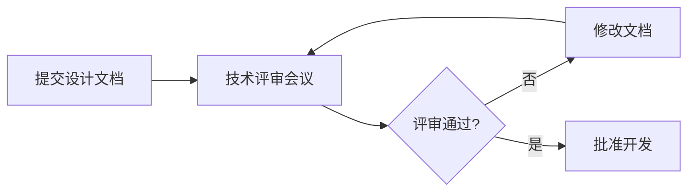

# 架构师指南

## 目录

1. [角色定位](#角色定位)
2. [核心职责](#核心职责)
3. [必备文档](#必备文档)
4. [最佳实践](#最佳实践)
5. [相关模板](#相关模板)

---

## 角色定位

作为系统架构师，你是项目的技术领路人，负责：
- 设计整体架构
- 做出关键技术决策
- 确保系统的可扩展性和可靠性
- 指导开发团队实现

**你的关注点**：
- ✅ 整体架构合理性
- ✅ 技术选型依据
- ✅ 可扩展性/容灾能力
- ✅ 跨团队依赖

---

## 核心职责

### 1. 架构设计

**产出**：架构设计文档

**内容要求**：
- C4 模型架构图
  - System Context（系统上下文图）
  - Container Diagram（容器图）
  - Component Diagram（组件图）
  - Code Diagram（代码图，可选）
- 技术选型说明
  - 为什么选择这个技术栈
  - 替代方案对比
  - 权衡取舍
- 非功能性需求
  - 性能要求（QPS、延迟、吞吐量）
  - 可用性要求（99.9%、99.99%）
  - 安全要求（加密、认证、授权）
  - 扩展性要求（水平扩展、垂直扩展）
- 演进路线
  - 短期目标（3 个月）
  - 中期目标（6-12 个月）
  - 长期目标（1-3 年）

**模板**：[architecture-template.md](architecture-template.md)

---

### 2. 技术决策记录（ADR）

**产出**：ADR（Architecture Decision Record）

**内容要求**：
- 决策背景
- 决策内容
- 决策后果（正面和负面）
- 替代方案
- 决策时间
- 决策人

**ADR 格式示例**：

```markdown
# ADR-001: 选择 PostgreSQL 作为主数据库

## Status
Accepted

## Context
我们需要一个可靠的关系型数据库来存储核心业务数据。

## Decision
选择 PostgreSQL 作为主数据库。

## Consequences

### Positive
- 开源免费
- 支持复杂查询
- 事务支持完善
- 社区活跃

### Negative
- 学习曲线较 MySQL 陡峭
- 性能调优较复杂

## Alternatives Considered
1. MySQL：关系型数据库
2. MongoDB：文档型数据库
3. TiDB：分布式数据库

## Date
2024-02-19

## Deciders
架构师：张三
技术负责人：李四
```

**模板**：[adr-template.md](adr-template.md)

---

### 3. 技术评审

**评审内容**：
- 架构设计合理性
- 技术选型可行性
- 性能瓶颈识别
- 安全风险识别
- 成本评估

**评审流程**：



---

## 必备文档

### 1. 架构设计文档

**路径**：`wiki/01-架构文档/`

**命名规范**：`<系统名>-architecture.md`

**示例**：`user-system-architecture.md`

**使用模板**：[architecture-template.md](architecture-template.md)

---

### 2. ADR 目录

**路径**：`wiki/01-架构文档/adr/`

**命名规范**：`ADR-<编号>-<决策名称>.md`

**示例**：
- `ADR-001-database-selection.md`
- `ADR-002-cache-strategy.md`
- `ADR-003-microservices-decision.md`

**使用模板**：[adr-template.md](adr-template.md)

---

### 3. 技术决策记录

**路径**：`wiki/01-架构文档/decisions/`

**内容**：
- 关键技术决策总结
- 决策影响分析
- 回滚策略

---

## 最佳实践

### ✅ 架构设计

1. **使用 C4 模型**
   - 从高到低逐层细化
   - 每层关注点不同
   - 避免过度设计

2. **非功能性需求优先**
   - 性能、安全、可用性
   - 提前识别瓶颈
   - 设计可测试性

3. **演进式架构**
   - 设计可以演进的架构
   - 避免过度优化
   - 留出扩展空间

---

### ✅ ADR 管理

1. **记录所有重要决策**
   - 不仅仅是最终决策
   - 也要记录替代方案
   - 保留决策历史

2. **ADR 是活的文档**
   - 决策可以撤销
   - 记录撤销原因
   - 保持文档更新

3. **使用编号管理**
   - ADR-001, ADR-002, ...
   - 便于引用和追溯

---

### ✅ 技术选型

1. **多方案对比**
   - 至少考虑 2-3 个方案
   - 列出优缺点
   - 量化对比指标

2. **POC 验证**
   - 关键技术需要 POC
   - 验证可行性
   - 评估性能和成本

3. **团队共识**
   - 技术选型需要团队认同
   - 考虑团队技术栈
   - 考虑学习和维护成本

---

## 相关模板

### 架构设计文档模板

📄 [architecture-template.md](architecture-template.md)

**包含内容**：
- C4 模型架构图
- 技术选型说明
- 非功能性需求
- 演进路线
- 风险识别

---

### ADR 模板

📄 [adr-template.md](adr-template.md)

**包含内容**：
- Status
- Context
- Decision
- Consequences
- Alternatives
- Date
- Deciders

---

## 常见问题

### Q1: 什么时候需要写 ADR？

**A**：任何重要的技术决策都需要写 ADR，例如：
- 选择新的技术栈
- 重构核心模块
- 修改数据库 schema
- 改变架构风格

### Q2: C4 模型的四个层级分别关注什么？

**A**：
- **System Context**：系统与外部交互
- **Container**：应用、数据库、缓存等
- **Component**：模块、服务、组件
- **Code**：类、函数、接口

### Q3: 如何平衡架构设计和开发进度？

**A**：
- 从 MVP 开始，避免过度设计
- 关键决策需要深思熟虑
- 可以演进的架构设计
- 定期回顾和调整

---

## 资源链接

- [C4 模型官方文档](https://c4model.com/)
- [ADR 最佳实践](https://adr.github.io/)
- [架构设计模式](https://martinfowler.com/architecture/)

---

**最后更新**：2024-02-19
