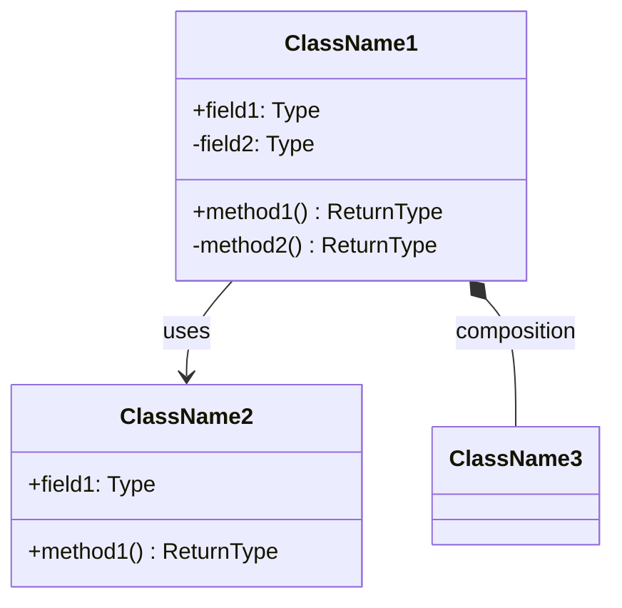
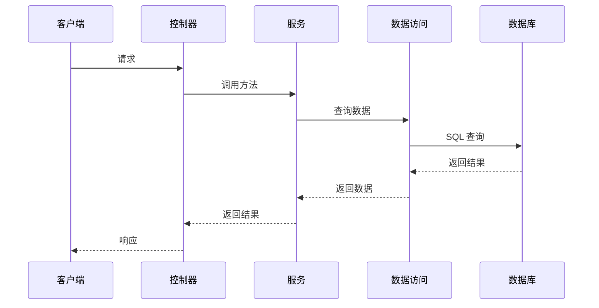
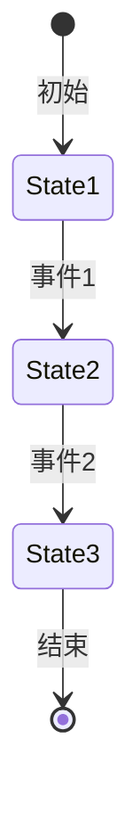
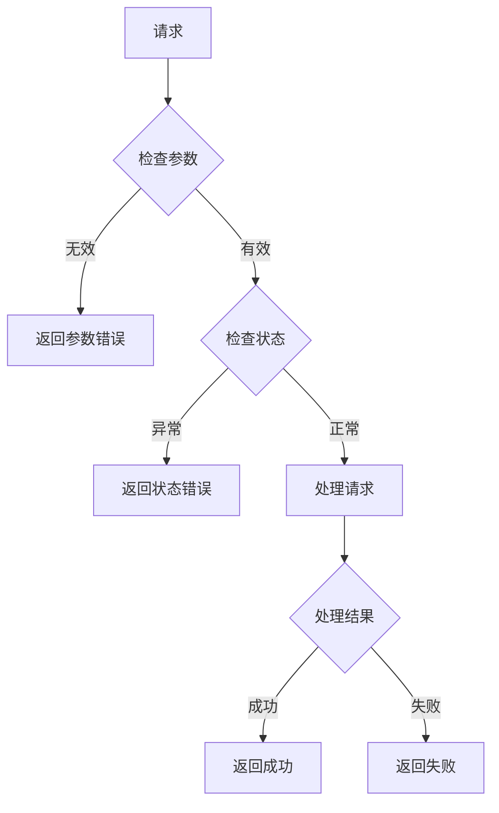

# 模块设计文档模板

## 基本信息

| 字段 | 内容 |
|------|------|
| 文档名称 | <模块名称> 模块设计文档 |
| 版本 | v1.0 |
| 作者 | <姓名> |
| 创建时间 | YYYY-MM-DD |
| 最后更新 | YYYY-MM-DD |
| 状态 | <草稿 / 评审中 / 已评审 / 已废弃> |

---

## 目录

- [1. 模块概述](#1-模块概述)
- [2. 模块结构](#2-模块结构)
- [3. 类图](#3-类图)
- [4. 序列图](#4-序列图)
- [5. 数据结构](#5-数据结构)
- [6. 接口定义](#6-接口定义)
- [7. 状态流转](#7-状态流转)
- [8. 错误处理](#8-错误处理)
- [9. 测试要点](#9-测试要点)
- [10. 本地调试](#10-本地调试)

---

## 1. 模块概述

### 1.1 模块功能

<描述模块的核心功能>

### 1.2 职责边界

- **包含**：
  - 功能 1
  - 功能 2

- **不包含**：
  - 功能 1（属于其他模块）
  - 功能 2（属于其他模块）

### 1.3 依赖关系

| 依赖模块 | 依赖类型 | 用途 |
|----------|----------|------|
| <模块名> | <直接 / 间接> | <用途> |

---

## 2. 模块结构

```
<模块目录结构>
```

### 目录说明

| 目录/文件 | 说明 |
|----------|------|
| <文件名> | <说明> |

---

## 3. 类图

### 3.1 类结构



### 3.2 类说明

| 类名 | 职责 | 关键方法 |
|------|------|----------|
| <类名> | <职责> | <方法1, 方法2> |

---

## 4. 序列图

### 4.1 核心流程



### 4.2 流程说明

<详细说明每个步骤>

---

## 5. 数据结构

### 5.1 核心数据结构

#### 数据结构 1

| 字段名 | 类型 | 说明 | 示例 |
|--------|------|------|------|
| <字段名> | <类型> | <说明> | <示例> |

#### 数据结构 2

| 字段名 | 类型 | 说明 | 示例 |
|--------|------|------|------|
| <字段名> | <类型> | <说明> | <示例> |

---

## 6. 接口定义

### 6.1 公开接口

#### 方法 1

```typescript
interface Interface {
  methodName(param1: Type1, param2: Type2): ReturnType
}
```

**参数说明**：

| 参数名 | 类型 | 必填 | 说明 |
|--------|------|------|------|
| <参数名> | <类型> | <是/否> | <说明> |

**返回值说明**：
<返回值说明>

**异常说明**：
- <异常1>：<说明>
- <异常2>：<说明>

---

## 7. 状态流转

### 7.1 状态定义

| 状态 | 说明 |
|------|------|
| <状态1> | <说明> |
| <状态2> | <说明> |

### 7.2 状态转换



### 7.3 转换规则

| 当前状态 | 事件 | 下一状态 | 条件 |
|----------|------|----------|------|
| <状态1> | <事件> | <状态2> | <条件> |

---

## 8. 错误处理

### 8.1 错误码定义

| 错误码 | 说明 | 处理建议 |
|--------|------|----------|
| <错误码> | <说明> | <处理建议> |

### 8.2 异常处理逻辑

<描述异常处理流程>



---

## 9. 测试要点

> ⚠️ 本章节供测试工程师参考

### 9.1 边界条件

| 测试场景 | 输入 | 预期结果 |
|----------|------|----------|
| <场景1> | <输入> | <预期> |

### 9.2 异常场景

| 异常场景 | 输入 | 预期结果 |
|----------|------|----------|
| <场景1> | <输入> | <预期> |

### 9.3 数据一致性

<描述数据一致性测试要点>

### 9.4 性能测试

| 指标 | 目标值 |
|------|--------|
| <指标1> | <目标值> |

---

## 10. 本地调试

### 10.1 环境要求

- Go 1.21+
- PostgreSQL 15+
- Redis 7+

### 10.2 启动步骤

```bash
# 1. 克隆项目
git clone <repo>

# 2. 安装依赖
go mod download

# 3. 配置环境变量
cp .env.example .env
# 编辑 .env 文件

# 4. 启动依赖服务
docker-compose up -d

# 5. 运行迁移
go run cmd/migrate/main.go

# 6. 启动服务
go run cmd/server/main.go
```

### 10.3 调试技巧

1. **日志输出**
   - 使用结构化日志
   - 设置日志级别
   - 输出关键变量

2. **断点调试**
   - 使用 IDE 断点
   - 查看变量值
   - 单步执行

3. **性能分析**
   - 使用 pprof
   - 分析 CPU 使用
   - 分析内存使用

---

## 附件

### 参考资料

- [链接 1](URL)
- [链接 2](URL)

### 相关文档

- [API 文档](../../03-API文档/<接口>-api.md)
- [架构设计文档](../../01-架构文档/<系统>-architecture.md)

---

**最后更新**：YYYY-MM-DD
