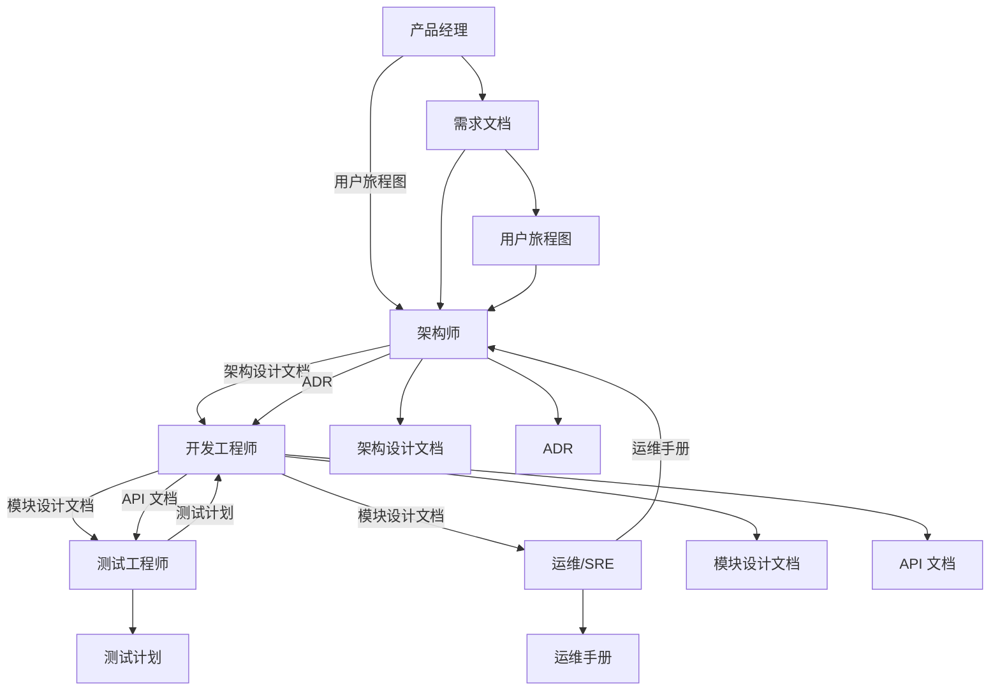

# 角色与文档映射

## 完整映射表

| 角色 | 关注重点 | 文档类型 | 文档路径 | 模板 |
|------|----------|----------|----------|------|
| **架构师** | 整体架构、技术选型 | 架构设计文档 | `wiki/01-架构文档/` | [architecture-template.md](architect/architecture-template.md) |
| | 可扩展性、容灾能力 | ADR | `wiki/01-架构文档/adr/` | [adr-template.md](architect/adr-template.md) |
| | 跨团队依赖 | 技术决策记录 | `wiki/01-架构文档/decisions/` | - |
| **开发工程师** | 模块接口定义 | 模块设计文档 | `wiki/04-模块文档/<模块>/` | [module-design-template.md](developer/module-design-template.md) |
| | 数据结构、状态流转 | 类图、序列图 | 模块设计文档中 | - |
| | API 契约 | API 文档 | `wiki/03-API文档/` | [api-template.md](../templates/api-template.md) |
| | 错误处理规则 | 错误码文档 | `wiki/06-参考文档/error-codes.md` | - |
| | 本地调试方式 | 开发环境搭建 | `wiki/02-开发指南/setup.md` | - |
| **测试工程师** | 边界条件、异常场景 | 测试计划 | `wiki/05-测试文档/` | [test-plan-template.md](tester/test-plan-template.md) |
| | 数据一致性规则 | 测试用例 | 测试计划中 | - |
| | 可观测性埋点 | 日志规范 | `wiki/06-参考文档/logging.md` | - |
| | 错误码列表 | 错误码文档 | `wiki/06-参考文档/error-codes.md` | - |
| **运维/SRE** | 部署拓扑 | 运维手册 | `wiki/06-参考文档/ops-runbook.md` | [ops-runbook-template.md](ops/ops-runbook-template.md) |
| | 资源需求 | 资源清单 | 运维手册中 | - |
| | 扩缩容策略 | 部署架构图 | 运维手册中 | - |
| | 监控告警指标 | 监控文档 | `wiki/06-参考文档/monitoring.md` | - |
| | SLA/SLO 定义 | SLA 文档 | `wiki/06-参考文档/sla.md` | - |
| **产品经理** | 功能覆盖需求 | 用户旅程图 | `wiki/02-开发指南/user-flow.md` | [user-flow-template.md](product/user-flow-template.md) |
| | 用户路径合理性 | 核心流程图 | 用户旅程图中 | - |
| | 体验风险 | 业务规则摘要 | `wiki/02-开发指南/business-rules.md` | - |

---

## 文档类型详细说明

### 架构文档（Architect）

**目标读者**：架构师、技术负责人、开发工程师

**核心内容**：
- C4 模型架构图（Context、Container、Component、Code）
- 技术选型依据
- 非功能性需求（性能、安全、可用性）
- 演进路线图

**模板**：[architecture-template.md](architect/architecture-template.md)

---

### ADR（Architecture Decision Records）

**目标读者**：架构师、开发工程师、新加入团队成员

**核心内容**：
- 技术决策背景
- 决策内容
- 决策后果（正面和负面）
- 替代方案

**模板**：[adr-template.md](architect/adr-template.md)

---

### 模块设计文档（Developer）

**目标读者**：开发工程师、测试工程师

**核心内容**：
- 模块概述
- 类图和序列图
- 数据结构定义
- 接口定义
- 状态流转
- 错误处理
- 测试要点（供测试工程师参考）
- 本地调试方式

**模板**：[module-design-template.md](developer/module-design-template.md)

---

### API 文档（Developer）

**目标读者**：前端开发、后端开发、测试工程师

**核心内容**：
- 接口概述
- 数据模型
- 数据流动
- 请求参数
- 响应格式
- 错误码
- 使用示例

**模板**：[api-template.md](../templates/api-template.md)

---

### 测试计划（Tester）

**目标读者**：测试工程师、开发工程师

**核心内容**：
- 测试范围
- 测试策略
- 边界条件
- 异常场景
- 测试用例
- 数据一致性规则
- 性能测试
- 安全测试

**模板**：[test-plan-template.md](tester/test-plan-template.md)

---

### 运维手册（Ops）

**目标读者**：运维工程师、SRE、开发工程师

**核心内容**：
- 部署架构图
- 环境配置
- 资源需求（CPU、内存、磁盘）
- 部署步骤
- 扩缩容策略
- 监控告警指标
- 故障排查流程
- 回滚流程
- SLA/SLO 定义

**模板**：[ops-runbook-template.md](ops/ops-runbook-template.md)

---

### 用户旅程图（Product）

**目标读者**：产品经理、UI/UX 设计师、开发工程师

**核心内容**：
- 用户角色
- 用户目标
- 用户旅程步骤
- 触发条件
- 用户情绪曲线
- 痛点分析
- 机会点

**模板**：[user-flow-template.md](product/user-flow-template.md)

---

## 角色协作矩阵

| 文档类型 | 主要创建者 | 主要读者 | 协作者 |
|----------|------------|----------|---------|
| 用户旅程图 | 产品经理 | 产品经理、设计师、架构师 | - |
| 架构设计文档 | 架构师 | 架构师、开发工程师、运维/SRE | 产品经理 |
| ADR | 架构师 | 架构师、开发工程师 | - |
| 模块设计文档 | 开发工程师 | 开发工程师、测试工程师 | 架构师 |
| API 文档 | 开发工程师 | 前端开发、后端开发、测试工程师 | - |
| 测试计划 | 测试工程师 | 测试工程师、开发工程师 | - |
| 运维手册 | 运维/SRE | 运维/SRE、开发工程师 | 架构师 |

---

## 文档生成脚本

### 按角色生成文档

```bash
# 架构师：生成架构设计文档
python3 scripts/role_view.py --role architect --generate --type architecture

# 架构师：生成 ADR
python3 scripts/role_view.py --role architect --generate --type adr

# 开发工程师：生成模块设计文档
python3 scripts/role_view.py --role developer --generate --type module

# 开发工程师：生成 API 文档
python3 scripts/role_view.py --role developer --generate --type api

# 测试工程师：生成测试计划
python3 scripts/role_view.py --role tester --generate --type test-plan

# 运维/SRE：生成运维手册
python3 scripts/role_view.py --role ops --generate --type ops-runbook

# 产品经理：生成用户旅程图
python3 scripts/role_view.py --role product --generate --type user-flow
```

---

## 角色与文档关系图



---

**最后更新**：2024-02-19
