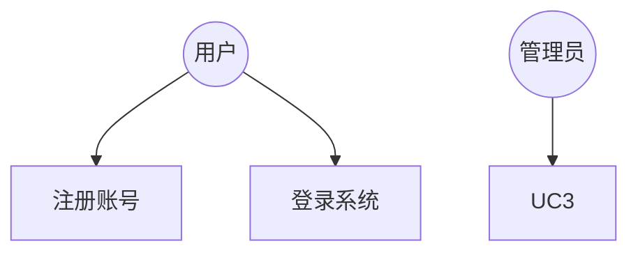
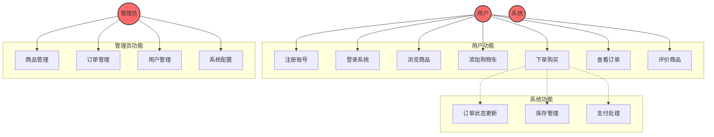

# 用例图设计指南

## 目录
- [用例图概述](#用例图概述)
- [角色定义](#角色定义)
- [用例设计](#用例设计)
- [关系设计](#关系设计)
- [Mermaid 语法](#mermaid-语法)
- [最佳实践](#最佳实践)
- [常见问题](#常见问题)

---

## 用例图概述

### 什么是用例图

用例图（Use Case Diagram）是描述系统功能和用户交互的工具，通过角色和用例来展示系统的功能需求。

### 用例图的作用

- **需求分析**：明确系统功能和用户需求
- **系统设计**：指导系统功能设计
- **测试设计**：指导测试用例编写
- **文档沟通**：方便团队沟通和理解需求

---

## 角色定义

### 什么是角色

角色（Actor）是系统外部与系统交互的实体，可以是用户、其他系统或外部设备。

### 角色类型

**主要角色**：
- 直接使用系统的用户
- 发起用例的角色

**次要角色**：
- 支持系统运行的角色
- 不直接使用系统但受系统影响的角色

**系统角色**：
- 自动执行的系统功能
- 定时任务等

### 角色命名规范

- 使用描述性名称
- 使用大写字母开头
- 如：User、Admin、System

---

## 用例设计

### 什么是用例

用例（Use Case）是系统提供的一项功能，描述了系统与角色的交互过程。

### 用例设计原则

**单一职责**：
- 每个用例只实现一个功能
- 如：注册、登录、下单

**用户视角**：
- 从用户角度描述功能
- 关注用户能做什么

**可测试性**：
- 用例应该可以独立测试
- 有明确的前置条件和后置条件

### 用例命名规范

- 使用动词+名词
- 使用描述性名称
- 如：注册账号、登录系统、下单购买

---

## 关系设计

### 关系类型

**关联关系（Association）**：
```
角色 --> 用例
```
- 角色与用例之间的直接关系
- 表示角色参与该用例

**包含关系（Include）**：
```
用例 -.-> 子用例 : include
```
- 用例包含另一个用例
- 表示被包含用例是必需的

**扩展关系（Extend）**：
```
用例 -.-> 扩展用例 : extend
```
- 用例在特定条件下扩展另一个用例
- 表示可选功能

**泛化关系（Generalization）**：
```
父角色 --> 子角色
```
- 角色之间的继承关系
- 子角色继承父角色的所有用例

---

## Mermaid 语法

### 基本语法



### 角色定义

```
角色名((显示名称))
```

示例：
```
User((用户))
Admin((管理员))
System((系统))
```

### 用例定义

```
用例名[显示名称]
```

示例：
```
UC1[注册账号]
UC2[登录系统]
UC3[下单购买]
```

### 关系定义

```
角色 --> 用例
用例 -.-> 子用例 : include
用例 -.-> 扩展用例 : extend
```

### 子图定义

```
subgraph 子图名称
    用例1
    用例2
end
```

示例：
```
subgraph 用户功能
    UC1[注册账号]
    UC2[登录系统]
end
```

### 样式定义

```
style 角色名 fill:#颜色,stroke:#颜色,stroke-width:2px
```

示例：
```
style User fill:#ff6b6b,stroke:#333,stroke-width:2px
style Admin fill:#ff6b6b,stroke:#333,stroke-width:2px
```

---

## 最佳实践

### 1. 角色设计

**识别所有角色**：
- 主要用户
- 次要用户
- 管理员
- 外部系统

**角色命名**：
- 使用业务术语
- 简洁明了
- 如：用户、管理员、客服

### 2. 用例设计

**颗粒度控制**：
- 不要过于细化
- 不要过于抽象
- 如：下单购买（而不是：选择商品、填写地址、选择支付方式）

**用例分层**：
- 主要用例：核心功能
- 次要用例：辅助功能

### 3. 关系设计

**避免过度关联**：
- 不要为每个用例都创建 include 关系
- 只在必要时使用

**合理使用 extend**：
- 只用于可选功能
- 不改变主要流程

---

## 常见问题

### 1. 用例如何拆分

**拆分原则**：
- 功能独立
- 可以单独测试
- 有明确的前置条件和后置条件

**示例**：
- 错误：下单购买（包含选择商品、填写地址、支付等）
- 正确：下单购买（整体流程）

### 2. 角色如何识别

**识别方法**：
- 谁使用系统？
- 谁影响系统？
- 谁维护系统？

**示例**：
- 用户：浏览商品、下单购买
- 管理员：管理商品、管理订单
- 系统：库存管理、订单状态更新

### 3. 如何处理复杂用例

**拆分策略**：
- 使用 include 拆分子流程
- 使用 extend 处理可选功能

**示例**：
```
主用例：下单购买
  include：验证库存
  include：验证地址
  extend：使用优惠券（可选）
```

---

## 完整示例

### 电商系统用例图



---

## 参考资料

- [用例图模板](../templates/usecase/usecase-diagram.md)
- [Mermaid 图谱文档](https://mermaid.js.org/syntax/flowchart.html)
- [UML 用例图规范](https://www.uml-diagrams.org/use-case-diagrams.html)
