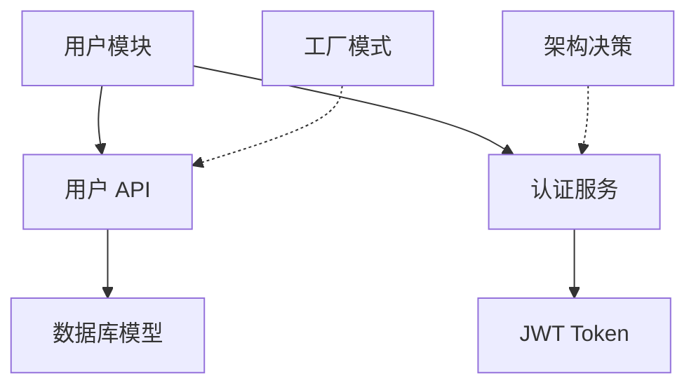

# 知识库构建指南

## 目录

1. [知识库 vs 传统文档](#知识库-vs-传统文档)
2. [知识类型定义](#知识类型定义)
3. [知识组织方法](#知识组织方法)
4. [知识检索策略](#知识检索策略)
5. [知识演化机制](#知识演化机制)
6. [知识元数据规范](#知识元数据规范)

---

## 知识库 vs 传统文档

### 传统文档的特征

- **静态性**：文档一旦生成，内容固定不变
- **线性性**：按章节顺序阅读，难以快速定位
- **孤立性**：知识点之间缺乏关联链接
- **滞后性**：代码变更后文档往往不同步更新
- **单向性**：从作者到读者的单向信息传递

### 知识库 Wiki 的特征

- **动态演化**：随代码变更自动或半自动更新
- **网络化**：知识点通过关系链接形成知识图谱
- **显性化**：将代码中的隐性知识（设计决策、权衡）显性化
- **可检索**：通过标签、分类、关系快速定位
- **交互性**：读者可以通过链接跳转、探索关联内容

### 知识图谱概念

**节点**：知识实体
- 模块、API、服务、配置文件
- 设计模式、架构决策、最佳实践
- 概念、术语、原则

**边**：知识关系
- 包含：模块包含 API
- 依赖：API 依赖另一个 API
- 调用：服务调用另一个服务
- 引用：设计模式在代码中使用

**示例**：



---

## 知识类型定义

### 1. 显性知识

定义：可以从代码结构中直接提取的知识

**子类型**：
- **架构知识**：系统分层、模块划分、技术栈
- **API 知识**：接口定义、请求响应格式、错误码
- **数据知识**：数据库模型、数据流、配置项
- **流程知识**：业务流程、调用链路、处理逻辑

**提取方法**：
- 通过 AST 解析提取函数签名、类定义
- 通过文件结构提取模块组织方式
- 通过依赖分析提取调用关系

**示例**：
```json
{
  "type": "explicit",
  "category": "api",
  "content": {
    "name": "get_user",
    "path": "src/user/api.py",
    "signature": "get_user(user_id: int) -> dict",
    "parameters": [
      {"name": "user_id", "type": "int", "description": "用户 ID"}
    ],
    "return": "dict"
  }
}
```

### 2. 隐性知识

定义：嵌入在代码注释、代码风格、设计模式中的非显性知识

**子类型**：
- **设计模式**：代码中应用的设计模式
- **架构决策**：注释中的架构权衡、选择理由
- **最佳实践**：编码规范、性能优化技巧
- **代码约定**：命名规范、错误处理约定
- **领域概念**：业务术语、领域模型

**提取方法**：
- 通过模式匹配识别设计模式
- 通过关键词提取架构决策（如 "choose", "decided", "tradeoff"）
- 通过代码风格分析最佳实践（如类型提示、文档字符串）
- 通过注释提取领域概念和业务术语

**示例**：
```json
{
  "type": "implicit",
  "category": "design_pattern",
  "content": {
    "pattern": "Singleton",
    "file": "src/cache/cache_manager.py",
    "context": "缓存管理器使用单例模式确保全局唯一实例"
  }
}
```

---

## 知识组织方法

### 按技术层次组织

适用于理解项目技术架构

```
wiki/
├── architecture/
│   ├── system-design.md          # 系统整体设计
│   ├── tech-stack.md             # 技术栈说明
│   ├── data-flow.md              # 数据流设计
│   └── security.md               # 安全架构
├── modules/
│   ├── user-module.md            # 用户模块
│   ├── order-module.md           # 订单模块
│   └── payment-module.md         # 支付模块
└── api/
    ├── user-api.md               # 用户 API
    ├── order-api.md              # 订单 API
    └── payment-api.md            # 支付 API
```

### 按业务领域组织

适用于理解业务逻辑

```
wiki/
├── domain/
│   ├── user-management.md        # 用户管理
│   ├── order-processing.md      # 订单处理
│   ├── payment-gateway.md        # 支付网关
│   └── notification.md           # 消息通知
└── concepts/
    ├── user-lifecycle.md         # 用户生命周期
    ├── order-states.md           # 订单状态流转
    └── payment-flow.md           # 支付流程
```

### 按生命周期组织

适用于项目维护和新人入职

```
wiki/
├── getting-started/
│   ├── installation.md           # 安装部署
│   ├── quick-start.md            # 快速上手
│   └── development.md            # 开发指南
├── development/
│   ├── code-structure.md         # 代码结构
│   ├── coding-conventions.md     # 编码规范
│   ├── testing-guide.md          # 测试指南
│   └── debugging.md              # 调试指南
└── operations/
    ├── deployment.md             # 部署指南
    ├── monitoring.md             # 监控告警
    └── troubleshooting.md        # 故障排查
```

---

## 知识检索策略

### 1. 标签检索

为每个知识节点打标签，支持标签组合查询

**标签体系**：
- 技术标签：`python`, `fastapi`, `redis`
- 领域标签：`user`, `order`, `payment`
- 类型标签：`api`, `module`, `config`
- 状态标签：`stable`, `deprecated`, `experimental`

**示例**：
```json
{
  "title": "用户认证 API",
  "tags": ["api", "auth", "python", "fastapi"],
  "metadata": {
    "version": "1.2.0",
    "status": "stable"
  }
}
```

### 2. 关系检索

通过知识图谱沿关系链查找相关知识

**检索类型**：
- **上游检索**：找到依赖当前节点的所有节点
- **下游检索**：找到当前节点依赖的所有节点
- **关联检索**：找到与当前节点有共同邻居的节点
- **路径检索**：找到两个节点之间的最短路径

**示例**：
- 查找所有调用"用户 API"的模块
- 查找"订单模块"依赖的所有服务
- 查找"支付服务"和"订单服务"之间的关联路径

### 3. 全文检索

基于知识内容的全文搜索

**搜索优化**：
- 为重要术语建立索引
- 支持模糊匹配和同义词扩展
- 按相关性和时间排序

---

## 知识演化机制

### 增量更新

当代码变更时，仅更新受影响的知识节点

**更新策略**：
1. **检测变更文件**：通过 Git diff 检测变更的文件
2. **影响分析**：分析变更对知识图谱的影响
3. **局部更新**：重新提取受影响的知识节点
4. **关联更新**：更新依赖当前节点的其他节点
5. **版本追踪**：记录知识变更历史

**示例**：
```bash
# 检测变更文件
git diff --name-only HEAD~1 HEAD

# 仅更新变更模块的知识
python3 scripts/knowledge_extractor.py --path ./src/user

# 比较新旧知识，生成变更报告
python3 scripts/diff_knowledge.py --old old.json --new new.json
```

### 版本控制

为知识节点维护版本号，支持历史回溯

**版本规则**：
- 主版本号：重大架构变更
- 次版本号：功能新增或重大修改
- 修订号：小修复或文档更新

**示例**：
```json
{
  "id": "api:get-user",
  "version": "2.1.3",
  "changes": [
    {
      "version": "2.1.3",
      "date": "2024-01-15",
      "description": "新增用户角色过滤参数"
    },
    {
      "version": "2.1.2",
      "date": "2024-01-10",
      "description": "修复缓存更新问题"
    }
  ]
}
```

### 变更通知

当知识更新时，通知相关开发者

**通知类型**：
- 破坏性变更：需要开发者关注并调整代码
- 功能变更：新功能或 API 变更
- 文档更新：仅文档内容更新

---

## 知识元数据规范

### 必填字段

所有知识节点必须包含以下元数据：

```json
{
  "id": "knowledge-node-unique-id",
  "title": "知识节点标题",
  "type": "api|module|service|config|pattern|decision",
  "category": "architecture|domain|practice",
  "created_at": "2024-01-01T00:00:00Z",
  "updated_at": "2024-01-15T00:00:00Z",
  "version": "1.0.0",
  "tags": ["tag1", "tag2"]
}
```

### 可选字段

```json
{
  "status": "stable|deprecated|experimental",
  "priority": "high|medium|low",
  "related_to": ["node-id-1", "node-id-2"],
  "author": "developer-name",
  "reviewer": "reviewer-name"
}
```

### 元数据示例

**API 知识节点**：
```json
{
  "id": "api:user:get-user",
  "title": "获取用户信息 API",
  "type": "api",
  "category": "domain",
  "status": "stable",
  "version": "1.2.0",
  "tags": ["api", "user", "python", "fastapi"],
  "related_to": ["module:user-service", "model:user-model"],
  "created_at": "2024-01-01T00:00:00Z",
  "updated_at": "2024-01-15T00:00:00Z"
}
```

**设计模式知识节点**：
```json
{
  "id": "pattern:singleton",
  "title": "单例模式",
  "type": "pattern",
  "category": "practice",
  "status": "stable",
  "version": "1.0.0",
  "tags": ["design-pattern", "architecture"],
  "related_to": ["module:cache-manager", "module:config-loader"],
  "created_at": "2024-01-01T00:00:00Z",
  "updated_at": "2024-01-01T00:00:00Z"
}
```

---

## 注意事项

1. **平衡详略**：知识库应既详细又不过于冗长
2. **及时更新**：代码变更时同步更新知识库
3. **链接完整**：确保所有知识节点都有正确的关联链接
4. **版本追踪**：记录知识变更历史，支持回溯
5. **可访问性**：使用清晰的语言和示例，降低理解门槛
